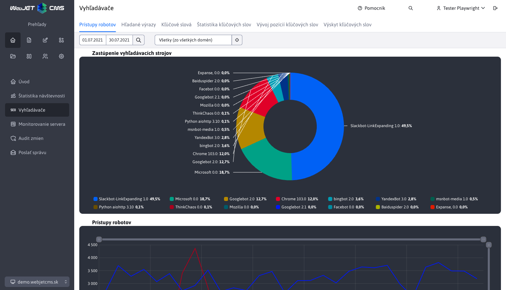
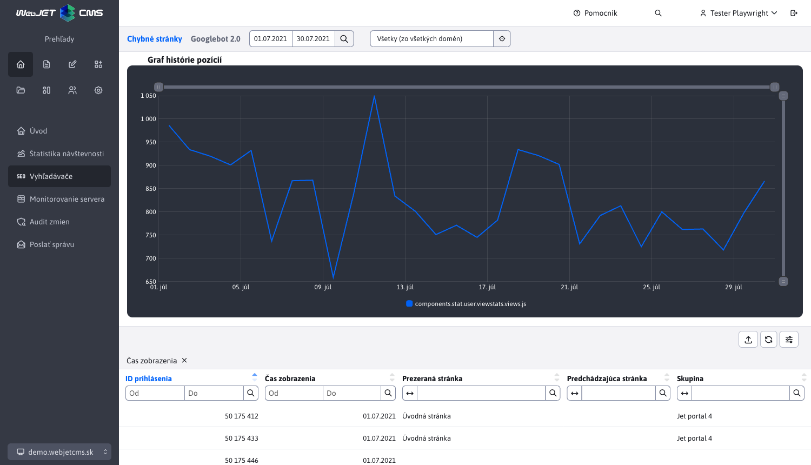
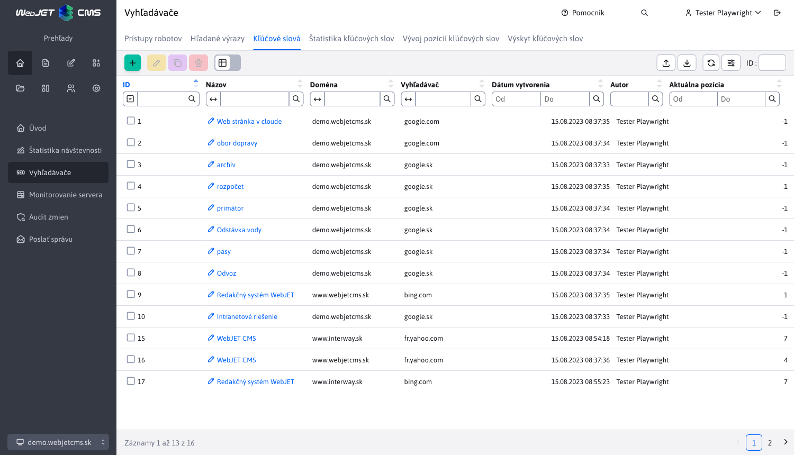
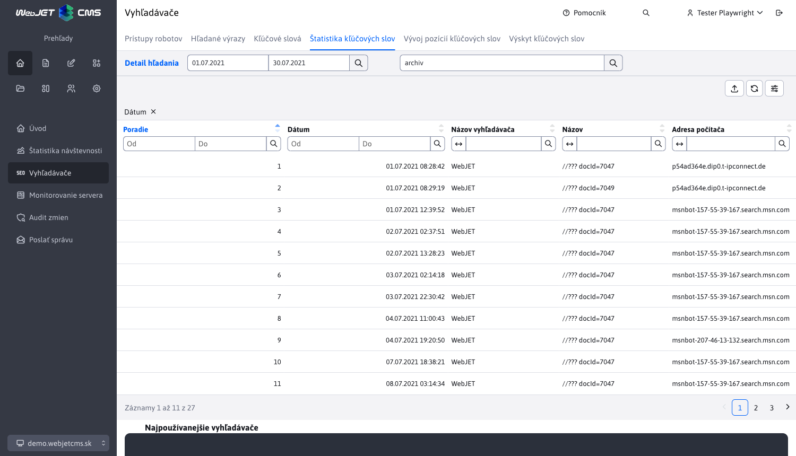
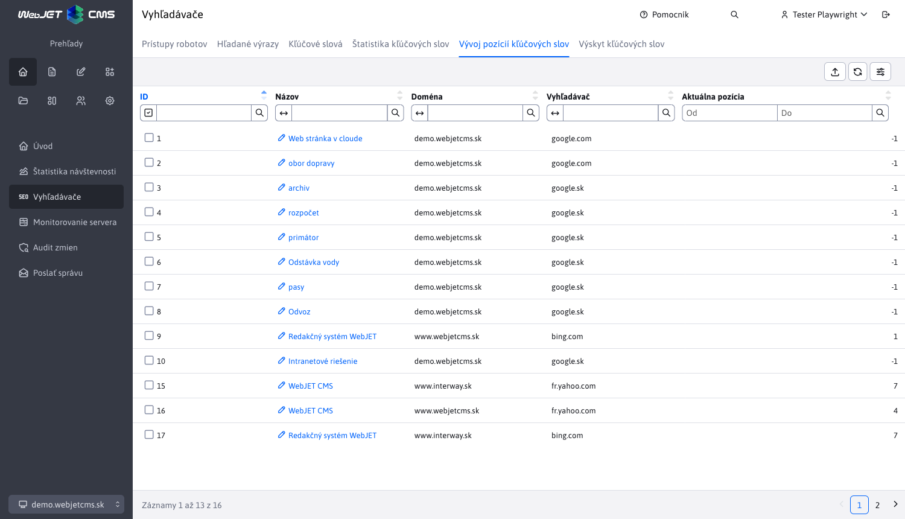
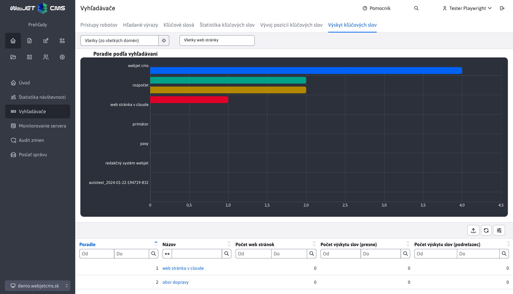
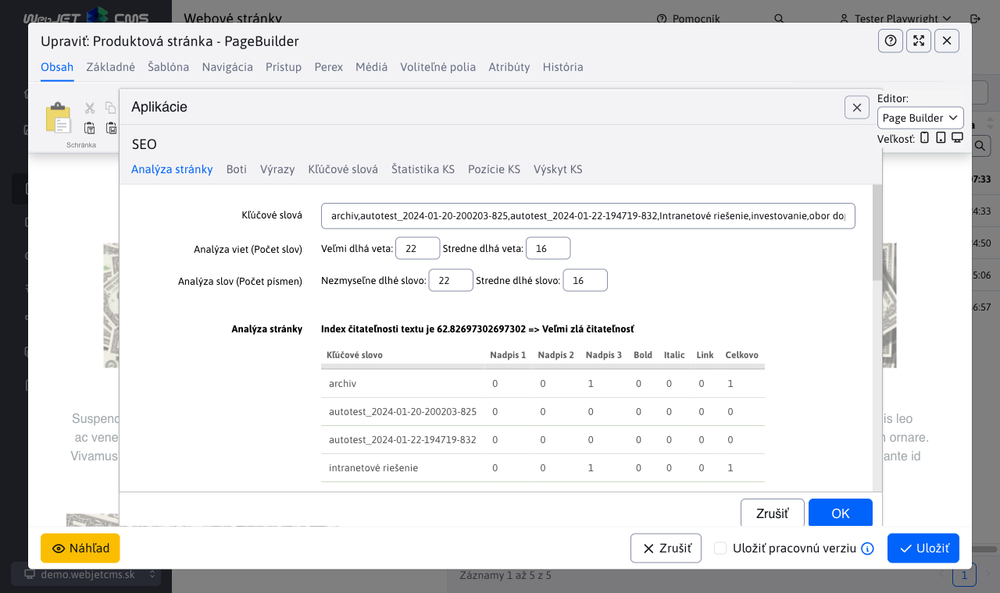

# Vyhľadávače (SEO)

Aplikácia Vyhľadávače (SEO) je podporný nástroj pre optimalizáciu stránok pre vyhľadávače. Je dostupný v sekcii Prehľady v ľavom menu ako položka Vyhľadávače.

Sekcia SEO využíva externý filter, ktorý je podrobnejšie opísaný tu [Externý filter](../stat/external-filter.md)

## Prístupy vyhľadávacích robotov

Táto časť zobrazuje štatistiku prístupov vyhľadávacích robotov na web sídlo. Môžete zistiť ich aktivitu a dátum posledného prístupu.

Obsiahnutá je taktiež tabuľka, ktorej stĺpec **Názov servera** nás po kliknutí presmeruje na detail štatistiky konkrétneho vyhľadávacieho robota.

## Vyhľadávané výrazy

Táto časť zobrazuje štatistiku vyhľadávaných výrazov na vyhľadávačoch pri prechode na vašu stránku. Dáva informáciu aké slová návštevníci hľadajú na vyhľadávačoch a na akú stránku sa k vám na dané slovo dostali.

Bližšie informácie nájdete tu [Vyhľadávače](../stat/README.md#vyhľadávače)

## Správa kľúčových slov

Táto časť umožňuje definovať a spravovať dôležité kľúčové slová, pre ktoré je možné zisťovať pozície vo vyhľadávačoch a zisťovať hustotu kľúčových slov na vašom web sídle.

Poskytnutá je podpora pre vytváranie/editovanie/mazanie/duplikovanie kľúčový slov, ako aj ich importovanie a exportovanie.

Pri vytváraní, editovaní aj duplikovaní je potrebné zadať všetky hodnoty.

## Štatistika kľúčových slov

Táto časť zobrazuje štatistiku vyhľadávania zadefinovaných kľúčových slov, zobrazuje percentuálne a celkové počty a rozdelenie kľúčového slova medzi jednotlivé vyhľadávače.

Obsiahnutá datatabuľka obsahuje stĺpec **Názov výrazu**, ktorý nás po kliknutí presmeruje na detail štatistiky konkrétneho kľúčového slova.

## Vývoj pozícií kľúčových slov

Táto časť zobrazuje štatistiku pozícií a vývoj pozície kľúčových slov v čase. Aktuálna pozícia jednotlivých kľúčových slov na `Google`, `Yahoo` alebo `Bing` sa aktualizuje raz za deň. To na ktorom vyhľadávači sa overuje pozícia slova závisí od nastavenej domény.

Obsiahnutá datatabuľka obsahuje stĺpec **Názov**, ktorý nás po kliknutí presmeruje na detail vývoja pozície konkrétneho kľúčového slova.

Získanie pozícií používa službu [SerpApi](https://serpapi.com) na ktorej je potrebné vykonať registráciu a získať API kľúč. Používajú sa nasledovné konf. premenné:

- `seo.serpApiKey` - API kľúč zo služby `SerpApi`.
- `seo.serpApiGoogleMaxResult` - maximálny počet záznamov na kontrolu výsledkov (predvolene 10).

## Výskyt kľúčových slov

Táto časť zobrazuje počet výskytov definovaných kľúčových slov na web sídle / web stránke. Umožňuje tak určovať hustotu kľúčových slov na web sídle / stránke.

## Analýza stránky

Pri editácii stránky môžete do stránky vložiť aplikáciu SEO. Technicky sa do stránky nevloží, ale zobrazí analýzu kľúčových slov aktuálne zobrazenej web stránky.

Aplikácia analyzuje čitateľnosť textu, používa techniku analýzy `Gunning fog index`. Odhaduje počet rokov vzdelávania potrebný na porozumenie textu. Z praxe:

- 6 znamená vynikajúcu čitateľnosť.
- 8 až 10 sú časopisové a novinové články, poviedky, ľahko čitateľné a pochopiteľné.
- 11 až 14 už dosahujú odbornejšie články. Vedecké práce sa zvyčajne dostávajú na úroveň 15 až 20 a vyžadujú už od čitateľa plnú sústredenosť.
- nad 20 majú len texty, pri ktorých pisateľ celkom ignoruje čitateľa.

V tabuľke sa zobrazuje výskyt definovaných kľúčových slov v texte aktuálnej web stránky. Zoznam kľúčových slov môžete upraviť v poli Kľúčové slová (jednotlivé slová/výrazy oddeľte čiarkou) a kliknutím na OK obnoviť tabuľku.

