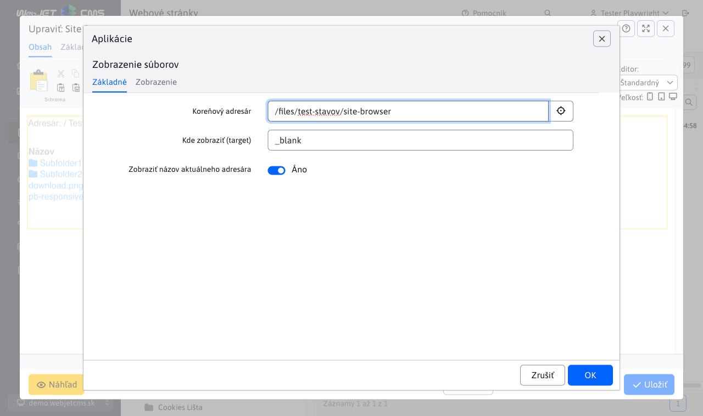

# Zobrazenie súborov

Aplikácia Zobrazenie súborov, umožňuje do stránky vložiť prehliadač priečinkov a súborov na disku servera.

Aplikácia má v editore nasledovné parametre:

- Koreňový adresár - zadajte adresár, ktorý bude možné prehľadávať aj s jeho pod priečinkami. V prípade že nezadáte žiadny priečinok, bude uvažovaný koreňový adresár pre web sídlo.
- Kde zobraziť - môžete uviesť, kde sa otvorí vybraný súbor. Prednastavená hodnota je do nového okna.
- Zobraziť názov aktuálneho adresára - ak toto pole necháte zaškrtnuté, bude sa zobrazovať cesta od koreňového adresára k aktuálnemu.

