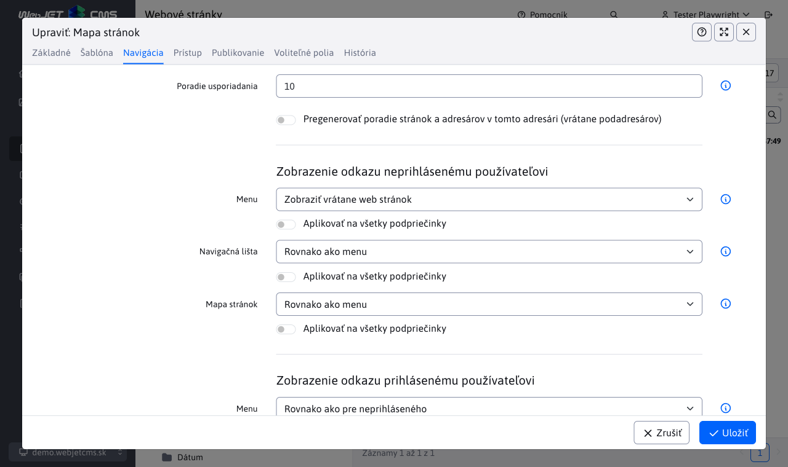
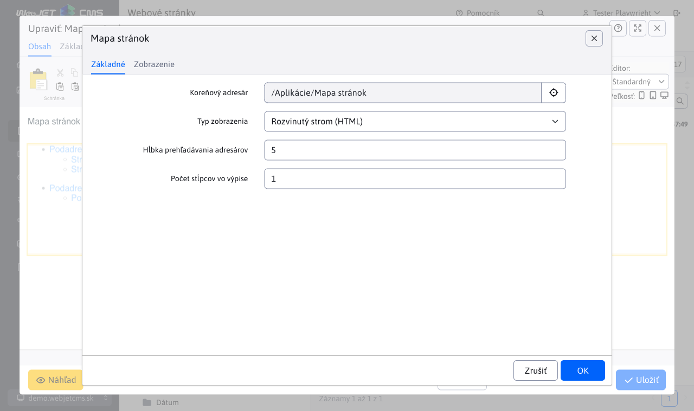

# Mapa stránok

Aplikácia Mapa stránky dokáže automaticky generovať stromovú štruktúru web sídla.

Zobrazenie položky v mape stránok je závislé od nastavenia poľa Navigačná lišta v karte Navigácia adresára web stránok. Má nasledovné možnosti:

- Rovnako ako menu - zobrazenie v mape stránok sa správa rovnako ako je nastavené pole pre zobrazenie v menu.
- Zobraziť - položka sa v mape stránok zobrazí.
- Nezobraziť - položka sa v mape stránok nezobrazí (a to vrátane pod-priečinkov).
- Zobraziť bez podpriečinkov - položka sa v mape stránok zobrazí, ale nebudú zobrazené jej ďalšie pod-priečinky (výhoda je v tom, že pod-priečinkom nie je potrebné nastavovať spôsob zobrazenia).
- Zobraziť vrátane web stránok - v mape stránok sa zobrazí priečinok a zobrazia sa aj všetky web stránky z priečinka ako samostatné položky. Štandardne pri možnosti Zobraziť sa nezobrazujú web stránky z adresára ako samostatné položky v mape stránok.

Pri zobrazení vrátane web stránok môžete ešte samostatne každej web stránke nastaviť možnosť zobrazenia v mape stránok. Možnosť je rovnako v karte Navigácia a obsahuje možnosti:

- Rovnako ako menu - zobrazenie v mape stránok sa správa rovnako ako je nastavené pole pre zobrazenie v menu.
- Zobraziť - web stránka sa v mape stránok zobrazí.
- Nezobraziť - web stránka sa v mape stránok nezobrazí.



## Nastavenia aplikácie

Vo vlastnostiach aplikácie je možné nastaviť:

  - Koreňový adresár - výber koreňového adresára
  - Typ zobrazenia - spôsob zobrazenia mapy stránok, viď. možnosti nižšie

pre niektoré typy zobrazení je ešte možné nastaviť:

  - Hĺbka prehľadávania adresárov - maximálne vnorenie zobrazených položiek
  - Počet stĺpcov vo výpise - zobrazenie je možné rozdeliť do zadaného počtu stĺpcov (pre krajšie zobrazenie na web stránke)



## Rozvinutý strom (HTML)

Stromová štruktúra je zobrazená v HTML kóde ako vnorený UL-LI zoznam. Jedná sa o najlepšie riešenie mapy stránok vzhľadom na vyhľadávače. Nie je vhodné pre rozsiahle web sídla (prípadne je potrebné maximálne vnorenie obmedziť aby stránka nebola príliš rozsiahla).


## Mapa sídla (Windows Explorer)

Stromová štruktúra je podobná ako v Exploreri systému Windows, takže je pre návštevníkov známa a jednoduchá na ovládanie. V ľavom stĺpci je zobrazený zoznam adresárov a v pravom stĺpsi stránky vo vybranom adresári.

Kliknutím na znak + alebo - sa zobrazia / zatvoria web stránky v danom adresári. Kliknutím na názov adresára sa zobrazí hlavný dokument daného adresára, kliknutím na názov web stránky sa zobrazí požadovaná stránka.

## Rozvinutý strom (Javascript)

Stromová štruktúra je rozklikávateľná pomocou JavaScriptu. Neodporúčame pre rozsiahle web sídla.

Kliknutím na znak + alebo - sa zobrazia / zatvoria web stránky / adresár.

## Rozvinutý strom (AJAX)

Stromová štruktúra je rozklikávateľná pomocou JavaScriptu, jednotlivé časti stromu sú nahrávané zo servera pomocou AJAX volania (jQuery).

Kliknutím na znak + alebo - sa zobrazia / zatvoria web stránky / adresár.

## XML súbor pre vyhľadávače

Vyhľadávače stránok (napr. Google) automaticky hľadajú súbor ```/sitemap.xml``` s mapou stránok web sídla. WebJET tento súbor automaticky poskytuje pomocou súboru ```/components/sitemap/google-sitemap.jsp```.

Generované položky sa správajú podobne ako zobrazenie Rozvinutý strom (HTML).