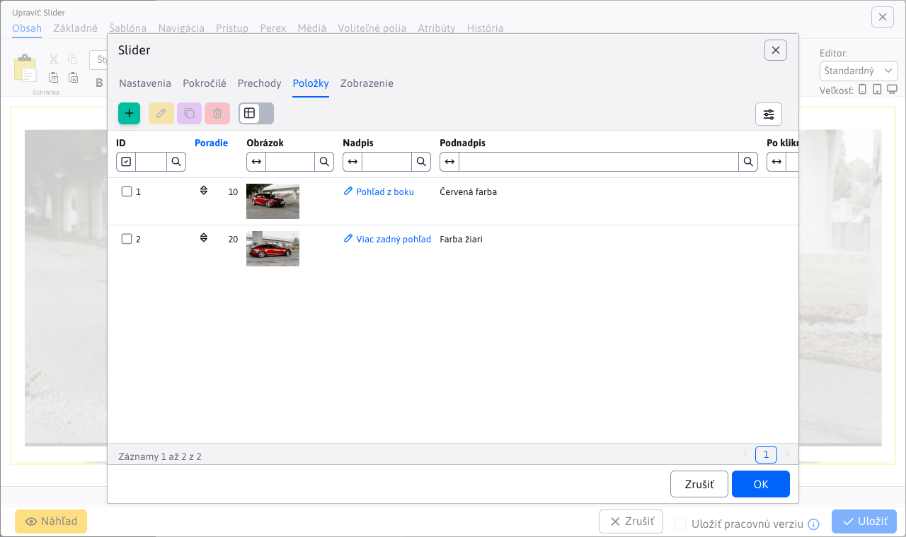

# Slider

Pridajte na svoju stránku pútavý animovaný slider s obrázkami. Vyberte si zo širokej ponuky dizajnových štýlov a animačných efektov, niektoré dizajny obsahujú aj nadpis a doplnkový text.

## Nastavenia aplikácie

### Nastavenia
V tejto časti je možné nastaviť štýl
výberom z dostupných štýlov:

- Classic
- ContentBox
- Cube
- Elegant
- Events
- FeatureList
- FrontPage
- Gallery
- Header
- Lightbox
- TextNavigation

### Pokročilé

V tejto časti je možné nastaviť:

- Rozmery
- Zobrazenie šípok vpravo a vľavo
- Efekt pohyblivej fotky
- Štýl navigácie
- Zobraziť náhľady pri prejdení myšou ponad navigáciu
- Povoliť posúvanie chytením
- Náhodné poradie
- Automaticky spustiť
- Počet slučiek
- Čas zobrazenia obrázku
- Zobraziť odpočítavanie
- Farba odpočítavania
- Pozícia odpočítavania
- Prechod na prvý obrázok
- Pozastaviť pri prejdení myšou
- Číslovanie
- Tieň

### Prechody
V tejto časti je možné vybrať prechody:

- Fade
- Cross fade
- Slide
- Elastic
- Slice
- Blinds
- Blocks
- Shuffle
- Tiles
- Flip
- Flip with zoom
- 3D
- 3D horizontal
- 3D with zoom
- 3D horizontal with zoom
- 3D flip
- 3D flip with zoom
- 3D tiles
- Ken bums

### Položky

V tejto časti je možné pridať alebo odobrať položku:
- Pri pridaní možno vyplniť nadpis, podnadpis, presmerovanie.
- Pri položkách sa dá zmeniť poradie presunutím.
- Odobratie položky možno kliknutím na červený krížik.

## Zobrazenie aplikácie

