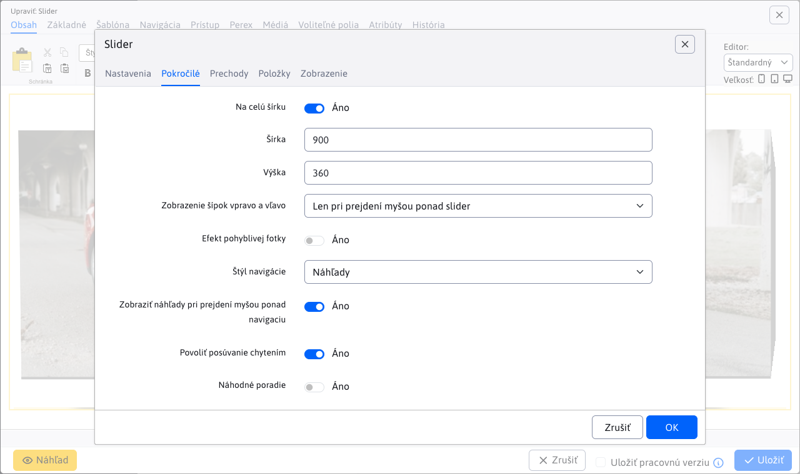
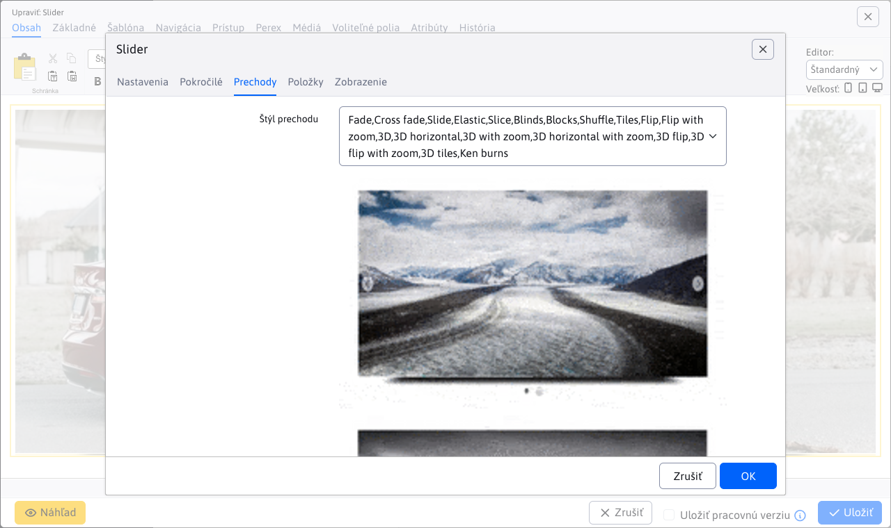
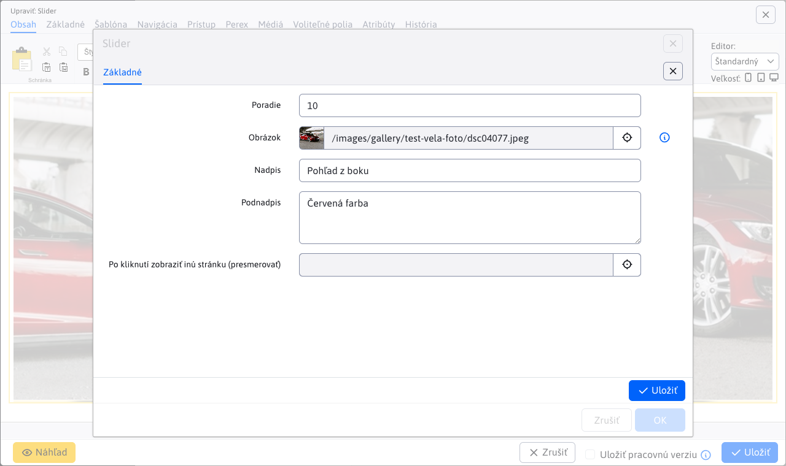

# Slider

Pridajte na svoju stránku pútavý animovaný slider s obrázkami. Vyberte si zo širokej ponuky dizajnových štýlov a animačných efektov, niektoré dizajny obsahujú aj nadpis a doplnkový text.

## Nastavenia aplikácie

Dostupné karty:

- **Generované CSS štýly**
- **Pokročilé**
- **Prechody**
- **Položky**

### Generované CSS štýly

V tejto časti je možné nastaviť štýl pre Slider.

### Pokročilé

V tejto časti je možné nastaviť:

- Na celú šírku
- Šírka
- Výška
- Zobrazenie šípok vpravo a vľavo (Nie je, Vždy, Len pri prejdeni myšou ponad slider)
- Efekt pohyblivej fotky
- Štýl navigácie (Nie je, Guličky, Čísla, Náhľady)
- Zobraziť náhľady pri prejdení myšou ponad navigáciu
- Povoliť posúvanie chytením
- Náhodné poradie
- Automaticky spustiť
- Počet slučiek (Navždy, Skončiť po)
- Čas zobrazenia obrázku
- Zobraziť odpočítavanie
- Farba odpočítavania (hex/ENG)
- Pozícia odpočítavania (Hore, Dolu)
- Prechod na prvý obrázok
- Pozastaviť pri prejdení myšou
- Číslovanie
- Tieň

### Prechody

V tejto časti je možné vybrať prechod (animáciu), ktorá sa bude používať pri zmene obrázkov.

### Položky

V tejto časti je možné vidieť a spravovať položky aplikácie, takže klasické akcie ako pridanie/úprava/mazanie…

Pre jednotlivé položky môžete nastaviť tieto parametre:

- **Obrázok**, podporovaný je výber obrázka pomocou prieskumníka, ako aj priame zadanie cesty obrázka
- **Nadpis**, nadpis obrázka
- **Podnadpis**, podnadpis obrázka
- **Po kliknutí zobraziť inú stránku (presmerovať)**, výber stránky na ktorú budete presmerovaný (podporované je aj priame zadanie cesty)

## Zobrazenie aplikácie

