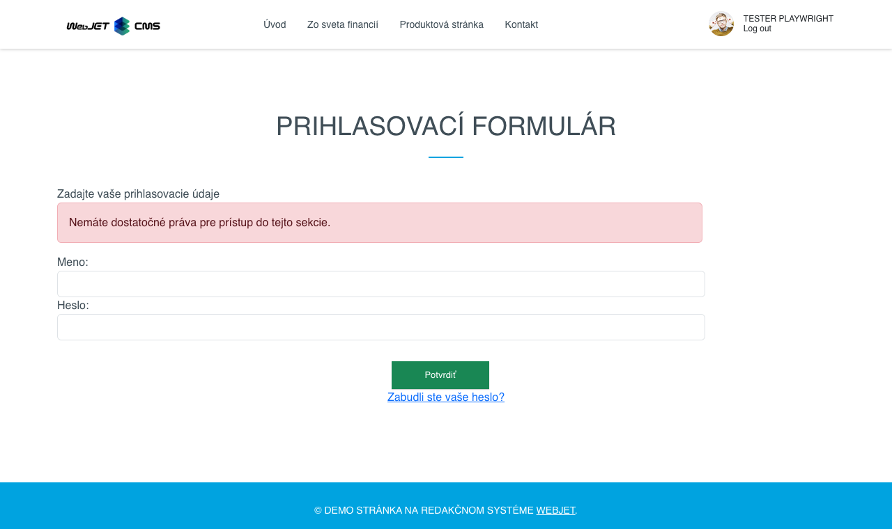
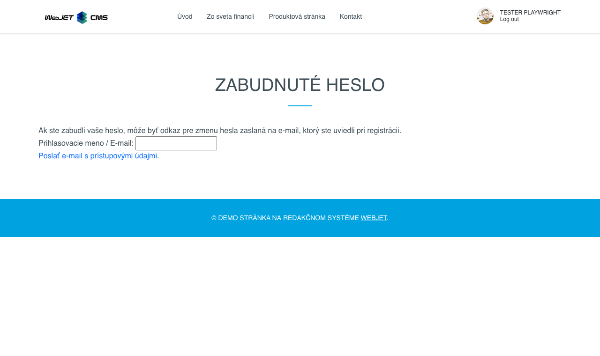
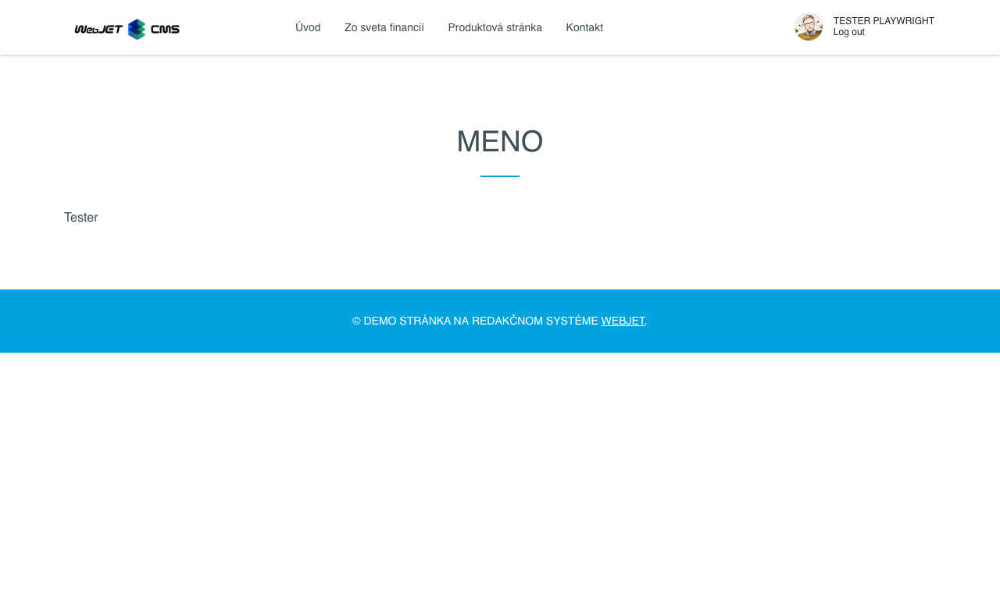

# Používatelia

Aplikácia umožňuje jednoducho vložiť informácie o prihlásenom používateľovi na stránku, vrátane mena, emailu, adresy a voliteľných polí. Okrem toho umožňuje vložiť prihlasovací formulár do zabezpečenej sekcie alebo registračný formulár pre nových používateľov.

## Nastavenia aplikácie

### Nastavenia pre Registračný formulár:

Zadajte údaje pre registráciu používateľa. Pre štandardné nastavenia môžete ponechať hodnoty, ktoré sú prednastavené.
- **Používateľské skupiny**
- **Zobrazené polia**
- **Povinné polia**

#### Ďalšie nastavenia:
- **DocID stránky po registrácii**: Stránka, ktorá sa zobrazí po úspešnej registrácii (ponechajte prázdne, ak chcete používateľa nechať na pôvodnej stránke).
- **Notifikácia o registrácii**: E-mailová adresa, na ktorú bude zaslaná notifikácia o novej registrácii (ponechajte prázdne, ak nechcete zasielať notifikáciu).
- **Vyžadovať potvrdenie e-mailovej adresy**: Používateľovi bude zaslaný potvrdzujúci e-mail s odkazom na overenie adresy. Ak je e-mail potrebné schváliť, potvrdzujúci e-mail sa nezašle.
- **DocID stránky s e-mailom o schválení**: Stránka, z ktorej bude používateľovi zaslaný e-mail v prípade potreby schválenia (ponechajte prázdne pre štandardnú správu).
- **Automatické prihlásenie po registrácii**: Po úspešnej registrácii bude používateľ automaticky prihlásený.
- **Odoslať cez AJAX**: Formulár bude odoslaný na pozadí bez obnovenia stránky (nie je možné odosielať fotografie).
- **Použi vlastné polia**:
  - **Použi pole A**: Popis k poľu A.
  - **Použi pole B**: Popis k poľu B.
  - **Použi pole C**: Popis k poľu C.
  - **Použi pole D**: Popis k poľu D.
  - **Použi pole E**: Popis k poľu E.

### Nastavenia pre Prihlasovací formulár:

#### Používateľské skupiny:
- Skupiny, do ktorých sa môže používateľ prihlásiť alebo z nich odhlásiť počas registrácie.

## Zobrazenie aplikácie

### Registračný formulár

### Prihlasovací formulár

### Linka na autorizáciu e-mailu

### Zabudnuté heslo

### Meno

