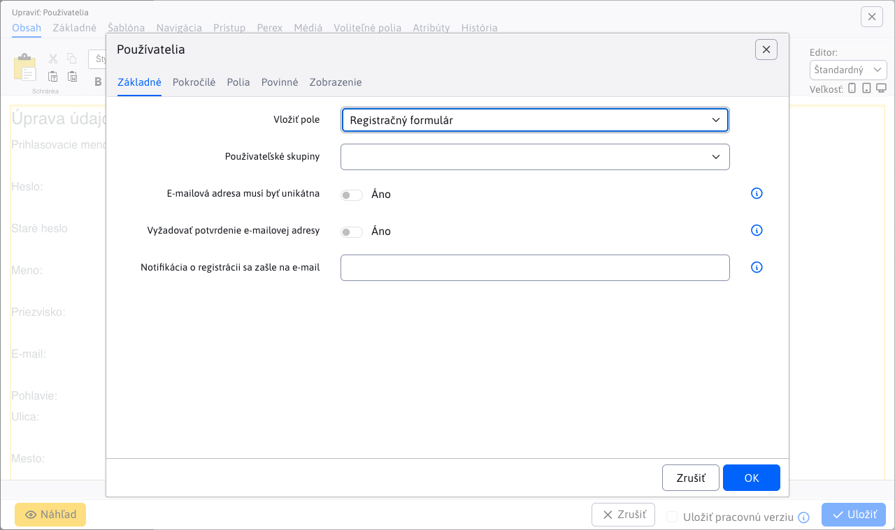

# Používatelia

Aplikácia umožňuje jednoducho vložiť informácie o prihlásenom používateľovi na stránku, vrátane mena, emailu, adresy a voliteľných polí. Okrem toho umožňuje vložiť prihlasovací formulár do zabezpečenej sekcie alebo registračný formulár pre nových používateľov.

## Nastavenia aplikácie

Aké informácie sa vložia na stránku sa udáva výberom **Vložiť pole** z karty **Základné**. Ak zvolíte možnosť **Registračný formulár** alebo **Prihlasovací formulár** zobrazia sa dodatočné nastavenia/karty, ktoré si následne opíšeme.

### Registračný formulár

**Registračný formulár** je prednastavená hodnota pre aplikáciu. Ponúka široké možnosti nastavení údajov pre registráciu používateľa. Pre štandardné nastavenie môžete ponechať hodnoty tak ako sú prednastavené.

Možnosti nastavenia:

- **Používateľské skupiny**
- **Skupiny používateľov**, skupiny, do ktorých sa môže používateľ prihlásiť alebo z nich odhlásiť počas registrácie
- **E-mailová adresa musí byť unikátna**
- **DocID stránky**, stránka, ktorá sa zobrazí po úspešnej registrácii (ponechajte prázdne, ak chcete používateľa nechať na pôvodnej stránke)
- **Notifikácia o registrácii sa zašle na e-mail**, e-mailová adresa, na ktorú bude zaslaná notifikácia o novej registrácii (ponechajte prázdne, ak nechcete zasielať notifikáciu)
- **Vyžadovať potvrdenie e-mailovej adresy**, používateľovi bude zaslaný potvrdzujúci e-mail s odkazom na overenie adresy. Ak je e-mail potrebné schváliť, potvrdzujúci e-mail sa nezašle.
- **DocID stránky s textom e-mailu**, stránka, z ktorej bude používateľovi zaslaný e-mail v prípade potreby schválenia (ponechajte prázdne pre štandardnú správu).
- **Po registrácii používateľa automaticky prihlásiť**, po úspešnej registrácii bude používateľ automaticky prihlásený
- **Odoslať cez AJAX**, formulár bude odoslaný na pozadí bez obnovenia stránky (nie je možné odosielať fotografie)

Pre **Registračný formulár** sa dodatočne ešte zobrazia karty **Zobrazené** a **Povinné**.

#### Karta - Zobrazené

V karte Zobrazené si môžete zvoliť polia, ktoré sa zobrazia v registračnom formulári.

#### Karta - Povinné

V karte Povinné si môžete zvoliť polia, ktoré sa pri odoslaní formuláru budú vyžadovať.

!>**Upozornenie:** ak nejaké pole nastavíte ako povinné, aplikácia nekontroluje, či bolo aj nastavené ako viditeľné. Na toto si musíte dať pozor.

### Prihlasovací formulár

Pre prihlasovací formulár môžete nastaviť iba jediný parameter a to:

- **Používateľské skupiny**, v prípade nezvolenia žiadnej možnosti sa skupiny vygenerujú podľa stránky, na ktorú sa používateľ, pomocou sociálnych sietí, pokúša prihlásiť

## Zobrazenie aplikácie

### Registračný formulár

### Prihlasovací formulár

### Linka na autorizáciu e-mailu

### Zabudnuté heslo

### Meno

