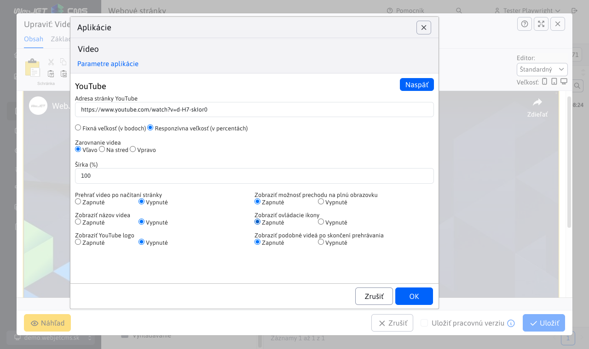

# Video

Pridajte na svoju stránku pútavé video obsahy z YouTube, Vimeo, Facebook alebo nahratých mp4 súborov. S možnosťou nastavenia veľkosti a vlastností prehrávania, môžete zaujať a angažovať svojich návštevníkov.

## Nastavenia aplikácie

### Zdroj videa
V tejto časti je možné vybrať z dostupných zdrojov videa:

- YouTube
- Vimeo
- Facebook
- Video na serveri

### Parametre

V tejto časti možno nastaviť:

- Adresa stránky - pri odkazoch na YouTube/Vimeo/Facebook stačí jednoducho vložiť odkaz na web stránku s videom, aplikácia podľa kódu v URL adrese vloží potrebný prehrávač.
- Fixná/Responzívna veľkosť
- Zarovnanie videa
- Šírka

A ostatné nastavenia v závislosti od vybratého zdroja

## Zobrazenie aplikácie

