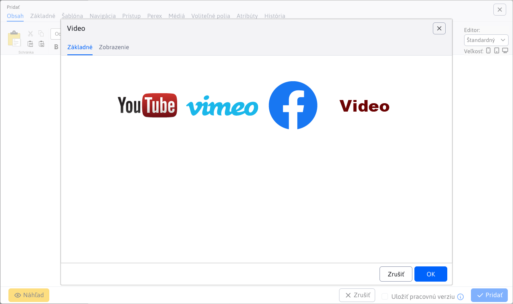
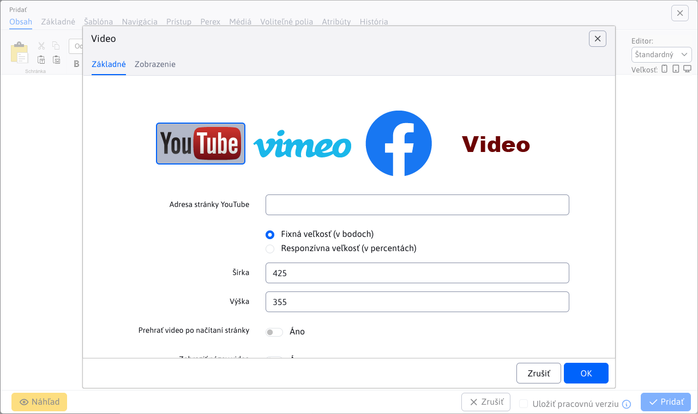
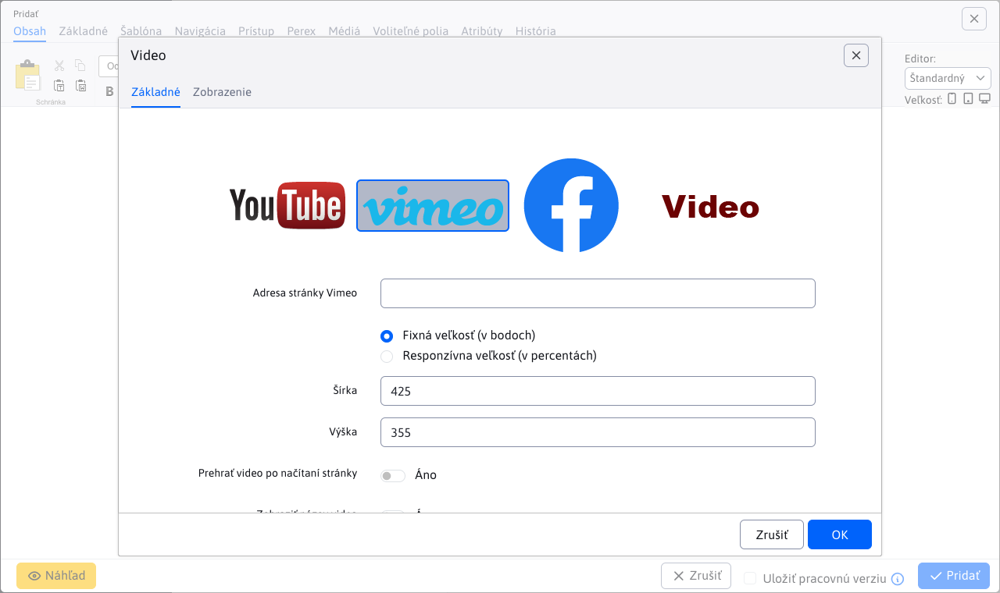
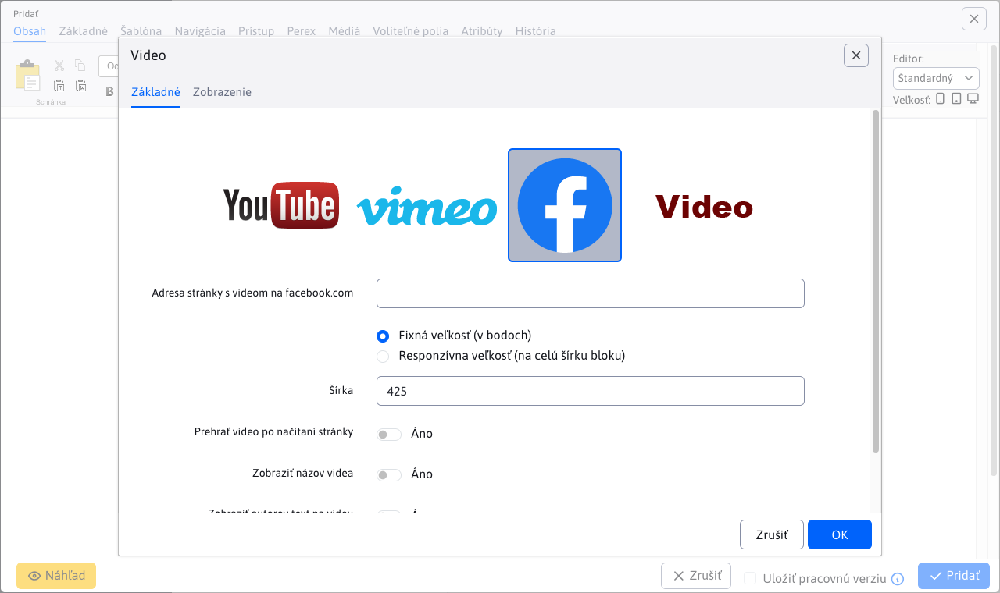
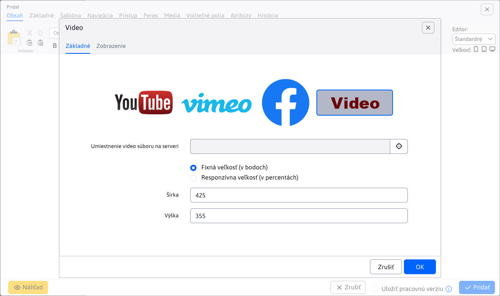
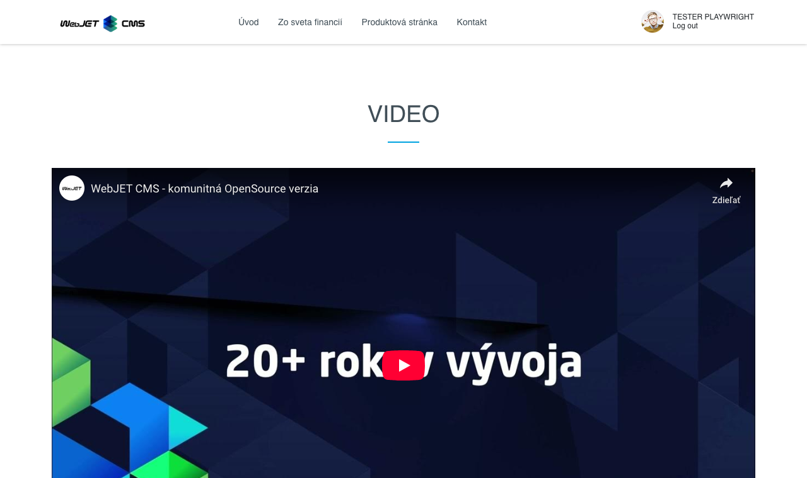

# Video

Pridajte na svoju stránku pútavé video obsahy z YouTube, Vimeo, Facebook alebo nahratých mp4 súborov. S možnosťou nastavenia veľkosti a vlastností prehrávania, môžete zaujať a angažovať svojich návštevníkov.

## Nastavenia aplikácie

### Zdroj videa

V tejto časti je možné vybrať z dostupných zdrojov videa:

- YouTube
- Vimeo
- Facebook
- Video na serveri

### YouTube

YouTube video parametre:

- **Adresa stránky YouTube**, stačí jednoducho vložiť odkaz na web stránku s videom
- Fixná veľkosť (v bodoch)
  - Šírka
  - Výška
- Responzívna veľkosť (v percentách)
  - Šírka (%)
- Prehrať video po načítaní stránky
- Zobraziť názov videa
- Zobraziť YouTube logo
- Zobraziť možnosť prechodu na plnú obrazovku
- Zobraziť ovládacie ikony
- Zobraziť podobné videá po skončení prehrávania

### Vimeo

Vimeo video parametre:

- **Adresa stránky Vimeo**, stačí jednoducho vložiť odkaz na web stránku s videom
- Fixná veľkosť (v bodoch)
  - Šírka
  - Výška
- Responzívna veľkosť (v percentách)
  - Šírka (%)
- Prehrať video po načítaní stránky
- Zobraziť názov videa
- Zobraziť autorov text na videu
- Zobraziť možnosť prechodu na plnú obrazovku
- Zobraziť fotku autora na videu
- Povoliť zobrazenie vodoznaku na videu

### Facebook

Facebook video parametre:

- **Adresa stránky s videom na facebook.com**, stačí jednoducho vložiť odkaz na web stránku s videom
- Fixná veľkosť (v bodoch)
  - Šírka
- Responzívna veľkosť (na celú šírku bloku)
- Prehrať video po načítaní stránky
- Zobraziť názov videa
- Zobraziť autorov text na videu
- Zobraziť možnosť prechodu na plnú obrazovku

### Video

Serverové video parametre:

- **Umiestnenie video súboru na serveri**, výber videa pomocou prieskumníka súborov (podporované je aj priame zadanie cesty k súboru)
- Fixná veľkosť (v bodoch)
  - Šírka
  - Výška
- Responzívna veľkosť (v percentách)
  - Šírka (%)

## Zobrazenie aplikácie

