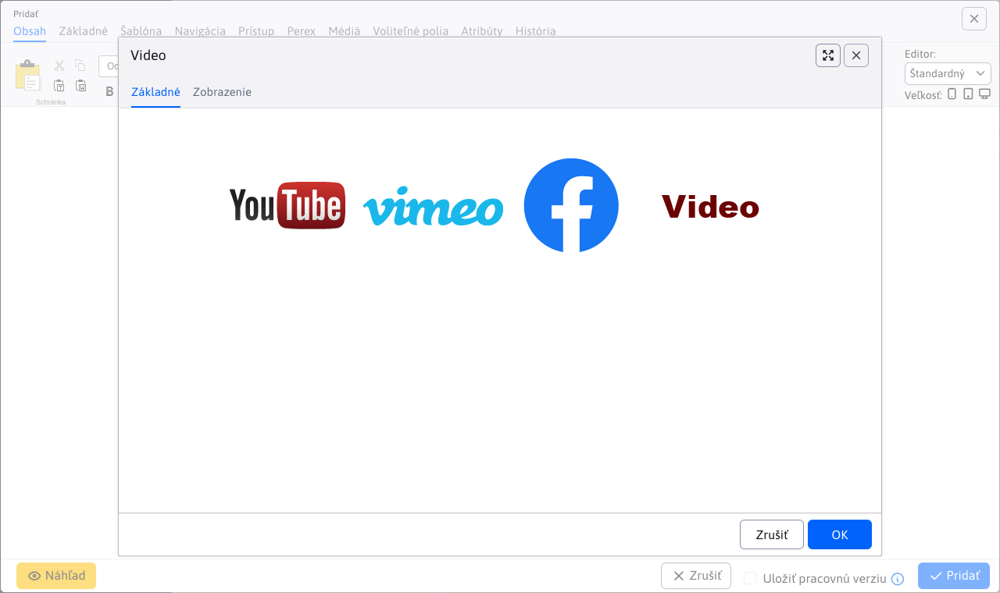
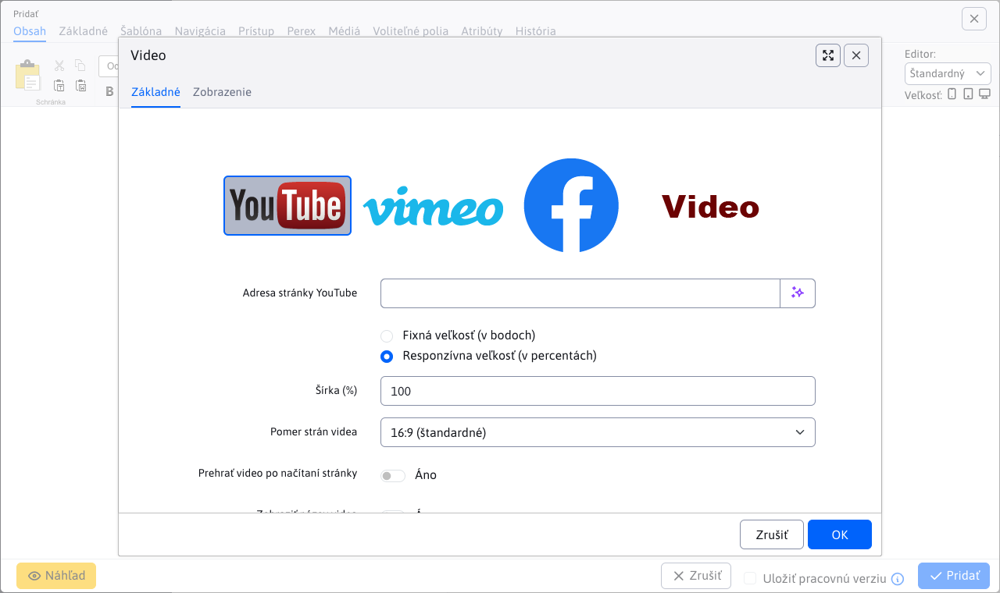
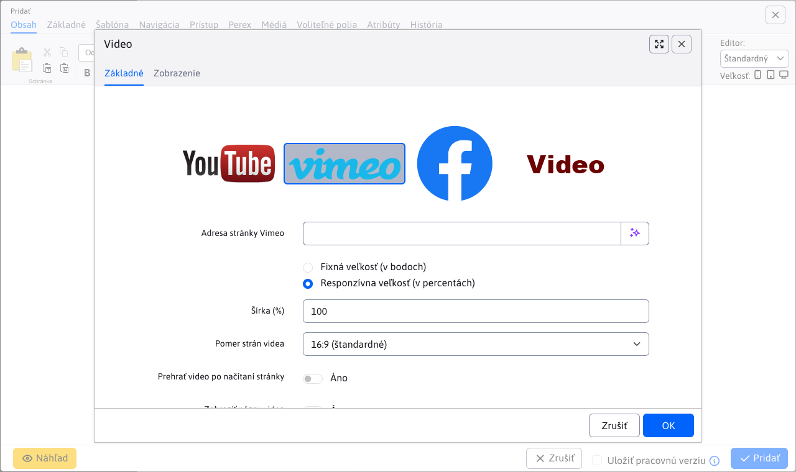
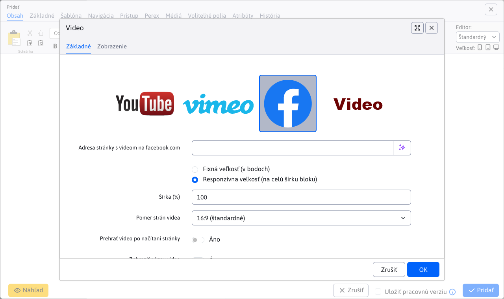
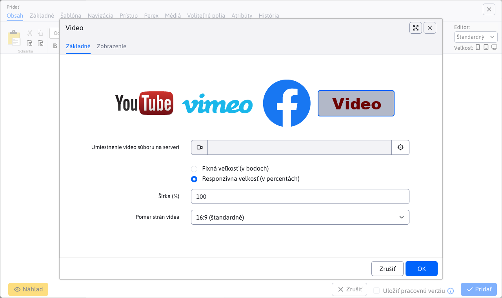
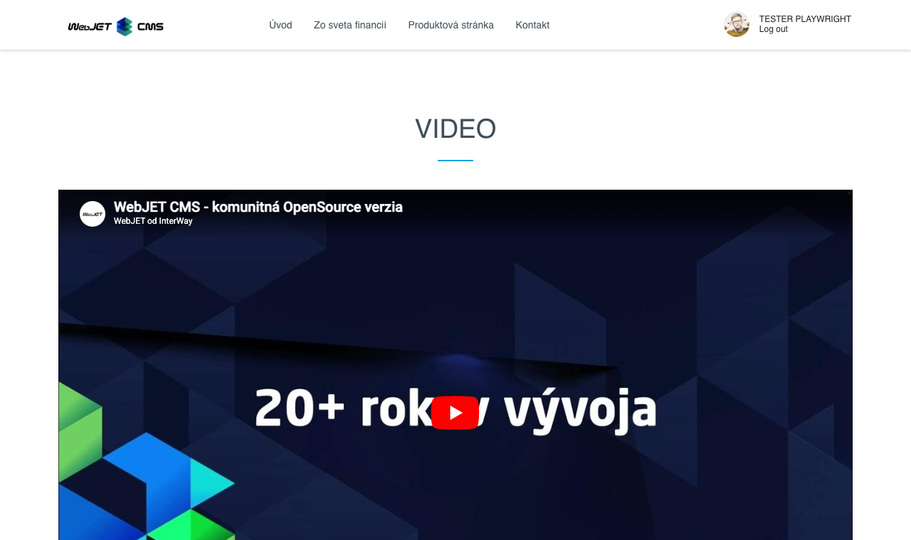

# Video

Pridajte na svoju stránku pútavé video obsahy z YouTube, Vimeo, Facebook alebo nahratých mp4 súborov. S možnosťou nastavenia veľkosti a vlastností prehrávania, môžete zaujať a angažovať svojich návštevníkov.

## Nastavenia aplikácie

### Zdroj videa

V tejto časti je možné vybrať z dostupných zdrojov videa:

- YouTube
- Vimeo
- Facebook
- Video na serveri



### YouTube

YouTube video parametre:

- **Adresa stránky YouTube**, stačí jednoducho vložiť odkaz na web stránku s videom
- Fixná veľkosť (v bodoch)
  - Šírka
  - Výška
- Responzívna veľkosť (v percentách)
  - Šírka (%)
- Pomer strán videa - výber pomeru strán pre responzívne zobrazenie videa (napr. 16:9, 4:3, 1:1, 21:9, 9:16)
- Prehrať video po načítaní stránky
- Zobraziť názov videa
- Zobraziť YouTube logo
- Zobraziť možnosť prechodu na plnú obrazovku
- Zobraziť ovládacie ikony
- Zobraziť podobné videá po skončení prehrávania



### Vimeo

Vimeo video parametre:

- **Adresa stránky Vimeo**, stačí jednoducho vložiť odkaz na web stránku s videom
- Fixná veľkosť (v bodoch)
  - Šírka
  - Výška
- Responzívna veľkosť (v percentách)
  - Šírka (%)
- Pomer strán videa - výber pomeru strán pre responzívne zobrazenie videa (napr. 16:9, 4:3, 1:1, 21:9, 9:16)
- Prehrať video po načítaní stránky
- Zobraziť názov videa
- Zobraziť autorov text na videu
- Zobraziť možnosť prechodu na plnú obrazovku
- Zobraziť fotku autora na videu
- Povoliť zobrazenie vodoznaku na videu



### Facebook

Facebook video parametre:

- **Adresa stránky s videom na facebook.com**, stačí jednoducho vložiť odkaz na web stránku s videom
- Fixná veľkosť (v bodoch)
  - Šírka
- Responzívna veľkosť (na celú šírku bloku)
- Pomer strán videa - výber pomeru strán pre responzívne zobrazenie videa (napr. 16:9, 4:3, 1:1, 21:9, 9:16)
- Prehrať video po načítaní stránky
- Zobraziť názov videa
- Zobraziť autorov text na videu
- Zobraziť možnosť prechodu na plnú obrazovku



### Video

Serverové video parametre:

- **Umiestnenie video súboru na serveri**, výber videa pomocou prieskumníka súborov (podporované je aj priame zadanie cesty k súboru)
- Fixná veľkosť (v bodoch)
  - Šírka
  - Výška
- Responzívna veľkosť (v percentách)
  - Šírka (%)
- Pomer strán videa - výber pomeru strán pre responzívne zobrazenie videa (napr. 16:9, 4:3, 1:1, 21:9, 9:16)



## Konfigurácia

Správa zobrazenia videa sa dá prispôsobiť nasledujúcimi konfiguračnými premennými:

| Premenná | Popis | Predvolená hodnota |
| --- | --- | --- |
| `videoClasses` | Čiarkou oddelený zoznam dostupných pomerov strán v editore. Formát: `prekladový_kľúč:css_triedy` alebo len `css_triedy`. Prvá položka je predvolená hodnota. | 16:9, 4:3, 1:1, 21:9, 9:16 (Bootstrap 4+5 triedy) |
| `videoItemClass` | CSS trieda pre vnútorný `<iframe>` element videa. Pre Bootstrap 4 použite `embed-responsive-item`, pre Bootstrap 5 môže byť prázdna. | `embed-responsive-item` |

Príklad zmeny na vlastné CSS triedy (bez Bootstrap):

```txt
videoClasses=Pomer 16:9:video-wrapper-16x9,Pomer 4:3:video-wrapper-4x3
videoItemClass=
```

## Zobrazenie aplikácie

