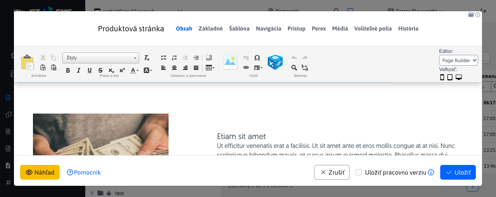
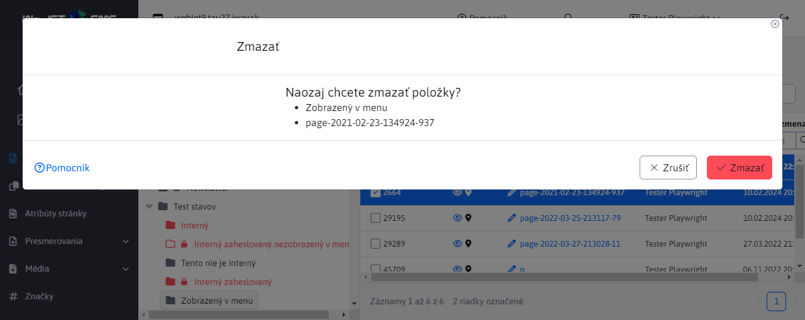
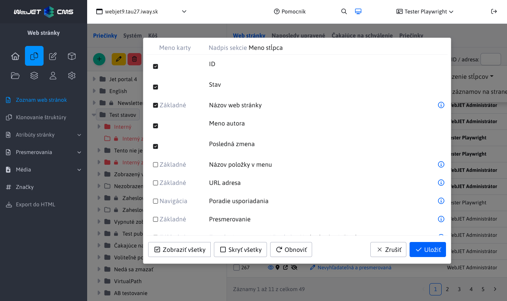
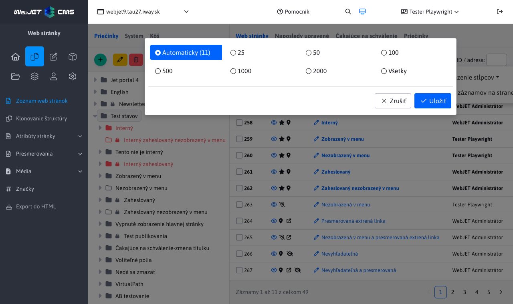

# Datatabuľky

## Základy práce s data tabuľkami

Dátové tabuľky sú základom rozhrania v CMS WebJET, pozrite si inštruktážne video ako s tabuľkami pracovať.

<div class="video-container">
    <iframe width="560" height="315" src="https://www.youtube.com/embed/-NN6pMz_bKw" title="YouTube video player" frameborder="0" allow="accelerometer; autoplay; clipboard-write; encrypted-media; gyroscope; picture-in-picture" allowfullscreen></iframe>
</div>

## Nové vlastnosti

Oproti vyššie uvedenému videu má štandardná datatabuľka nové vlastnosti.

### Zobrazenie názvu v hlavičke okna

Pri editácii existujúcej položky (ak sa edituje jeden záznam) sa v hlavičke dialógového okna editora zobrazuje názov editovanej položky (na ukážke text **Produktová stránka**) namiesto všeobecného textu **Upraviť**.



Podobne pri potvrdení zmazania sa zobrazí zoznam označených položiek pre potvrdenie záznamov, ktoré chcete zmazať.



### Možnosť presúvať okno

Okno editora je možné presúvať (ak napr. potrebujete vidieť informáciu na stránke prekrytú oknom). Stačí keď v oblasti hlavičky začnete okno ťahať (ako štandardné okno vo ```Windows```).

### Pamätanie usporiadania

Ak tabuľke zmeníte spôsob usporiadania (kliknutím na názov stĺpca) tabuľka si bude tento spôsob usporiadania pamätať vo vašom prehliadači. Keď sa vrátite znova na danú časť bude tabuľka usporiadaná podľa vašej preferencie.

Kliknutím na ikonu <i class="ti ti-adjustments-horizontal" role="presentation"></i>, následne na nastavenie Zobrazenie stĺpcov a následne na tlačidlo Obnoviť sa tabuľka nastaví do základnej podoby vrátane usporiadania.

### Zmena poradia stĺpcov

V tabuľke môžete presúvať stĺpce a meniť tak ich poradie podľa vašich potrieb. Stačí keď chytíte hlavičku (názov) stĺpca a začnete ho ťahať vľavo, alebo vpravo. Poradie stĺpcov sa zapamätá v prehliadači a keď sa znova vrátite na danú časť bude poradie stĺpcov zachované.

Kliknutím na ikonu <i class="ti ti-adjustments-horizontal" role="presentation"></i>, následne na nastavenie Zobrazenie stĺpcov a následne na tlačidlo Obnoviť sa tabuľka nastaví do základnej podoby vrátane poradia stĺpcov.

## Nastavenie zobrazenia stĺpcov

Kliknutím na tlačidlo <i class="ti ti-adjustments-horizontal" role="presentation"></i> nastavenia sa zobrazí možnosť nastavenia zobrazenia stĺpcov a počtu zobrazených záznamov na jednej strane.

Vo väčšine tabuliek sa štandardne zobrazujú všetky stĺpce, niektoré ako tabuľka v zozname web stránok ale obsahuje veľmi veľa stĺpcov, preto sú štandardne zobrazené len tie základné. Kliknutím na možnosť **Zobrazenie stĺpcov** sa otvorí dialógové okno, v ktorom môžete **zvoliť, ktoré stĺpce chcete zobraziť**. Ľubovoľne ich označíte a po kliknutí na **Uložiť**, sa zvolené stĺpce vo **vašom prehliadači zapamätajú**. Aj po obnovení stránky sa zobrazia zvolené stĺpce.



V okne sa zobrazujú nasledovné stĺpce:

- Meno karty - zobrazuje názov karty v ktorej sa pole nachádza v editore. Ak sa pole nezobrazuje v editore, hodnota je prázdna.
- Nadpis sekcie - zobrazuje nadpis nad poľami v editore (ak je zadaný), umožňuje rozlíšiť skupinu polí, napr. pre nastavenie zobrazenia pre prihláseného, alebo odhláseného používateľa.
- Meno stĺpca - meno poľa v editore, hodnota reprezentuje stĺpec, ktorý chcete zobraziť.

V nastavení zobrazenia stĺpcov je aj tlačidlo **Obnoviť**, ktoré obnoví **predvolené nastavenie zoznamu stĺpcov**. Okrem toho tam máme aj tlačidlá **Zobraziť všetky** a **Skryť všetky**, ktoré jedným kliknutím zapnú alebo vypnú zobrazenie všetkých stĺpcov.

!>**Upozornenie:** čím viac stĺpcov si necháte zobraziť, tým dlhšie bude trvať vášmu počítaču zobrazenie tabuľky.

## Počet záznamov na strane

Kliknutím na tlačidlo <i class="ti ti-adjustments-horizontal" role="presentation"></i> nastavenia sa zobrazí možnosť nastavenia počtu záznamov na strane.

Aby okno obsahovalo ideálny počet riadkov tabuľky je vypočítaná jeho veľkosť a prednastavená hodnota podľa tohto výpočtu. V nastavení počtu záznamov sa zobrazí ako prvá možnosť Automaticky (X) kde X je vypočítaný počet riadkov podľa výšky okna.



Pod tabuľkou riadkov sa zobrazuje informácia o zobrazenom počte záznamov, celkovom počte záznamov a prípadne stránkovanie (prechod na ďalšie strany).

Automatické nastavenie počtu riadkov tabuľky sa použije len v hlavnom okne, nie je použité vo vnorených tabuľkách v editore (napr. v karte História editácie web stránky).

Hodnota všetky je limitovaná nastavením konfiguračnej premennej `datatablesExportMaxRows`, čiže pri hodnote Všetky sa reálne načíta maximálny počet riadkov definovaný v tejto konfiguračnej premennej. Riadky sa zobrazujú priamo v prehliadači a pri vysokom počte dôjde k vysokému zaťaženiu procesora.

## Upozornenia na neuložené zmeny

### Obnovenie alebo opustenie stránky

Ak máte otvorené okno editora datatabuľky a obnovíte stránku klávesom **F5**, prejdete na inú stránku alebo zatvoríte kartu prehliadača, prehliadač zobrazí upozornenie na možné neuložené zmeny. V tomto prípade sa kontroluje iba to, či je okno editora otvorené a viditeľné. **Nekontroluje sa, či ste v jeho poliach skutočne niečo zmenili.** Upozornenie sa preto môže zobraziť aj hneď po otvorení záznamu bez úprav.

Ide o ochranu pred stratou rozpracovaných údajov pri nechcenom obnovení alebo opustení stránky. Ak chcete zmeny zachovať, zostaňte na stránke a uložte ich tlačidlom **Uložiť**. Potvrdením odchodu alebo obnovenia sa neuložené údaje zahodia. Presný text upozornenia a názvy tlačidiel určuje prehliadač, preto sa napríklad v Chrome a Firefoxe líšia.

### Tlačidlo Zrušiť v okne editora

Tlačidlo **Zrušiť** zatvára okno editora bez uloženia rozpracovaných zmien. Samotná stránka administrácie zostáva otvorená, takže sa nevyvoláva vyššie opísané upozornenie pri odchode zo stránky.

V **editore webových stránok** sa pred zatvorením porovnáva aktuálny obsah stránky s obsahom zaznamenaným po načítaní editora:

- Ak sa obsah nezmenil, okno sa zatvorí bez upozornenia.
- Ak sa obsah zmenil, zobrazí sa upozornenie na neuložený text. Tlačidlom **OK** potvrdíte zatvorenie bez uloženia, tlačidlom **Zrušiť** v upozornení sa vrátite do editora.

Táto kontrola sa týka **obsahu webovej stránky**, nie všetkých polí formulára. Samotnú zmenu názvu stránky alebo nastavení na iných kartách týmto spôsobom nezisťuje. Ani ostatné datatabuľky nemajú všeobecnú kontrolu zmien všetkých polí pri tlačidle **Zrušiť**. Ak chcete rozpracované údaje zachovať, pred zatvorením použite **Uložiť**.

Pri zisťovaní príčiny upozornenia môžete v konzole prehliadača zobraziť objekt `window.top.lastDirty`. Po zistení zmeny obsahuje pôvodný a aktuálny HTML kód aj prvý nájdený rozdiel. Čitateľný súhrn vypíšete príkazom `console.log(window.top.lastDirty.summary)`. Objekt uchováva poslednú zistenú zmenu a slúži **iba pre obsah webových stránok**, nie pre ostatné polia alebo datatabuľky.

## Klávesové skratky

Pre efektívnejšiu prácu môžete použiť nasledovné klávesové skratky (```Windows/MacOS```):

- ```CTRL+S/CMD+S``` - vykoná uloženie záznamu do databázy, ale zároveň ponechá otvorené okno editora. Funkcia nemusí byť dostupná, ak je otvorených viacero dialógových okien naraz.
