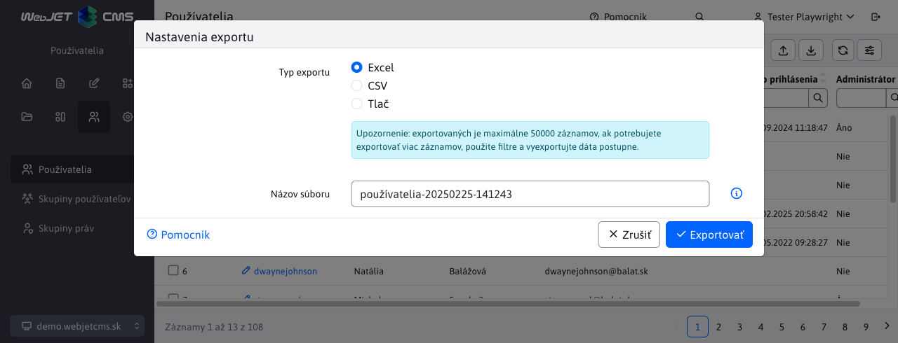
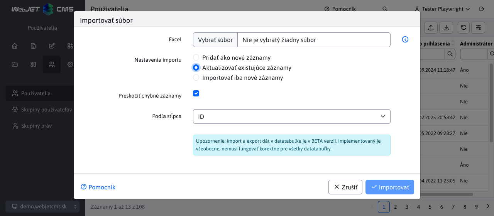

# Export a import

Datatabuľky poskytujú v hlavičke možnosť exportu a importu dát:



- Umožňuje export do **Excelu(xlsx) a priamu tlač na tlačiareň**
- Súboru sa nastaví meno podľa aktuálneho ```title``` stránky a automaticky sa doplní aktuálny dátum a čas.
- Exportom sa naraz dá získať **maximálne 50 000 záznamov**. Pri potrebe exportovať viac záznamov použite viacnásobné exportovanie s využitím filtrovania. Maximálny počet záznamov je možné zvýšiť nastavením konf. premennej `datatablesExportMaxRows`.
- Pri exporte sa v prvom riadku pripraví zoznam stĺpcov, **import následne nie je citlivý na poradie stĺpcov**.
- Pre **výberové polia** (select/číselníky) sa **exportuje textová hodnota** a pri importe sa nazad rekonštruuje na ID. Umožňuje to mať **rozdielne ID naviazaných záznamov** medzi prostrediami (napr. ID šablóny pre web stránku), ak sa zhoduje meno, korektne sa záznam spáruje. V exporte je následne aj ľudsky zrozumiteľný text namiesto ID hodnoty.
- Import umožňuje **importovať dáta ako nové** (doplnia sa do databázy) alebo **párovať existujúce dáta podľa zvoleného stĺpca** (napr. meno, URL adresa a podobne). Pri párovaní najskôr pohľadá záznam v databáze a následne ho aktualizuje. Ak neexistuje, vytvorí nový záznam.
- Importuje sa z formátu **xlsx**.

## Export dát

Po kliknutí na ikonu Exportovať  sa otvorí dialógové okno v ktorom sa automaticky nastaví meno súboru exportu podľa aktuálnej stránky a dátumu a času. Zvoliť je možnosť exportu vo formáte Excel (xlsx), alebo tlač tabuľky.

V karte Pokročilé je pri tabuľke so serverovým stránkovaním je možné nastaviť typ exportovaných dát **aktuálna strana/všetky, filtrované/všetky riadky, zoradenie**. Pri tabuľke s klientským stránkovaním sa zobrazí len možnosť aktuálna/všetky strany.


Po kliknutí na tlačidlo Exportovať sa vytvorí ```xlsx``` súbor na stiahnutie, alebo v prípade možnosti Tlač sa zobrazí štandardné okno tlače.

Pri exporte vo formáte Excel sa **exportujú stĺpce podľa editora**, nie podľa zobrazených stĺpcov. Je to tak preto, aby záznamy následne bolo možné importovať. V prvom riadku Excel súboru sa nachádzajú názvy stĺpca ale aj jeho kódové meno vo formáte ```Pekný názov|kodovyNazov```. Napr. v používateľoch je použitý stĺpec Meno aj v osobných údajoch, aj v kontaktných údajoch. Bez kódového názvu by sme stĺpec pri importe nevedeli presne spárovať na správne pole v editore.


## Import dát

Po kliknutí na ikonu Importovať  sa otvorí dialógové okno pre import z Excel (xlsx) formátu. V nastavení importu je možné zvoliť:

- Pridať ako nové záznamy - záznamy sa importujú ako nové, stĺpec ID sa ignoruje. Pri importe môže nastať chyba, ak vznikne obmedzenie duplicity (napr. prihlasovacie meno v zozname používateľov, ktoré musí byť jedinečné).
- Aktualizovať existujúce záznamy - pri tejto možnosti sa zobrazí výberové pole **Podľa stĺpca**, v ktorom je možné vybrať stĺpec, na základe ktorého sa budú dáta aktualizovať. Pri importe sa v databáze nájdu **zhodné záznamy (môže ich byť viacej**, ak sa napr. importuje podľa Priezviska alebo iného stĺpca, ktorý nie je jedinečný) a tie sa aktualizujú podľa údajov v Exceli. Ak sa nenájde záznam v databáze podľa zadaného stĺpca, tak sa **vytvorí ako nový záznam**.
- Importovať iba nové záznamy - v poli **Podľa stĺpca** vyberte stĺpec, podľa ktorého sa identifikuje existencia záznamu. Importujú sa iba záznamy, ktoré sa podľa zadaného stĺpca nenájdu.



Kliknutím na tlačidlo Importovať sa spustí import z vybraného Excel súboru.

Väčšina tabuliek pri aktualizácii existujúceho záznamu umožňuje **importovať stĺpce čiastkovo**. V Exceli môžete zmazať stĺpce, ktoré chcete v databáze zachovať bez zmeny. Následne pri importe sa v existujúcich záznamoch prenesú len zmeny z ponechaných stĺpcov v Exceli.

### Preskočiť chybné záznamy

Import ponúka možnosť preskočenia chybných záznamov. Ak je táto možnosť  **vypnutá**, a importované dáta obsahujú chybu, import sa preruší a bude zobrazené chybové hlásenie. Nevýhoda je pri importovaní veľkého množstva záznamov, kde jedna chyba preruší importovanie ďalších záznamov.

Všetky vyhovujúce záznamy pred chybným záznamom sa uložili.


Ak je táto možnosť **zapnutá**, import sa pri nájdenej chybe nezastaví, ale pokračuje ďalej. Chybné hodnoty aj s číslom riadku sa zobrazia v notifikácii:


Notifikácií sa môže zobraziť viac, nakoľko dáta sa spracovávajú po častiach - odosielajú sa postupne po 25 záznamoch, pre každý sa môže zobraziť chybové hlásenie. Viac technických informácií nájdete v sekcii [Konverzia z Excelu](../../developer/datatables/export-import.md#konverzia-z-excelu).