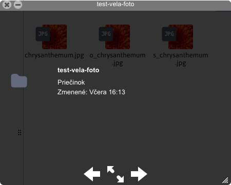
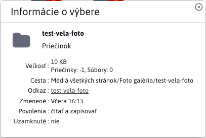
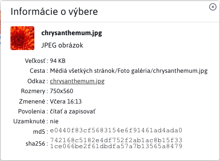
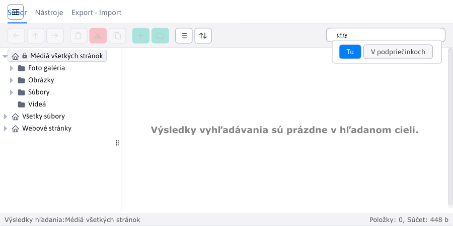

# Prieskumník

Prieskumník je aplikácia na správu a prácu so súbormi.

Pozostáva z niekoľkých častí:
- panel nástrojov
- navigačná lišta
- hlavná plocha
- pätička

## Panel nástrojov

Panel nástrojov ponúka široký výber nástrojov/funkcií na prácu so súbormi a priečinkami daných súborov. Každé tlačidlo, ponúka iný jedinečný nastroj.
!>**Upozornenie:** jednotlivé tlačidlá sa aktivujú iba za špecifický podmienok, takže nie sú vždy dostupné. Panel nástrojov obsahuje taktiež vyhľadávanie.

Dané nástroje sú poľa logiky rozdelené do 3 kariet:
- Súbor
- Nástroje
- Export - Import

### Karta Súbor

Karta Súbor ponúka základné možnosti na prácu ako:

- <button class="btn btn-sm btn-outline-secondary"><i class="ti ti-arrow-left"></i></button>, **Späť**, navigácia o krok späť v stromovej štruktúre. Možnosť dostupná, iba ak pred aktuálne zvoleným priečinkom bol zvolený iný priečinok.
- <button class="btn btn-sm btn-outline-secondary"><i class="ti ti-arrow-up"></i></button>, **Prejsť do nadradeného priečinka**, navigácia v stromovej štruktúre o úroveň vyššie. Možnosť dostupná, iba ak aktuálne zvoleným priečinkom má rodičovský priečinok, na ktorý vieme prejsť.
- <button class="btn btn-sm btn-outline-secondary"><i class="ti ti-arrow-right"></i></button>, **Ďalej**, navigácia o krok dopredu v stromovej štruktúre. Možnosť dostupná, iba ak použili **Späť**.

- <button class="btn btn-sm btn-outline-secondary"><i class="ti ti-clipboard"></i></button>, **Vložiť**, vloží do aktuálne zvolenej lokácie skopírovaný/vystihnutý súbor alebo priečinok.
- <button class="btn btn-sm btn-danger"><i class="ti ti-cut"></i></button>, **Vystrihnúť**, skopíruje označený súbor/priečinok zo zdrojovej lokácie. Po vložení do cieľovej lokácie sa originál zo zdrojovej lokácie vymaže.
- <button class="btn btn-sm btn-outline-secondary"><i class="ti ti-copy"></i></button>, **Kopírovať**, skopíruje označený súbor/priečinok
  
- <button class="btn btn-sm btn-success"><i class="ti ti-plus"></i></button>, **Nahrať súbory**, umožní do aktuálne zvolenej lokácie nahrať súbory.
- <button class="btn btn-sm btn-success"><i class="ti ti-folder-plus"></i></button>, **Nový priečinok**, umožní v aktuálne zvolenej lokácií vytvoriť nový priečinok.
  
- <button class="btn btn-sm btn-outline-secondary"><i class="ti ti-list"></i></button>, **Zoznam**, zmení zobrazenie súborov/priečinkov v pracovnej zóne na listové zobrazenie.
- <button class="btn btn-sm btn-outline-secondary"><i class="ti ti-layout-grid"></i></button>, **Ikony**, zmení zobrazenie súborov/priečinkov v pracovnej zóne na zobrazenie pomocou ikon.

Zoznam                     |  Ikony
:-------------------------:|:-------------------------:
     |  

- <button class="btn btn-sm btn-outline-secondary"><i class="ti ti-arrows-up-down"></i></button>, **Zoradiť**, umožňuje zoradiť súbory/priečinky podľa vybraného kritéria.

### Karta Nástroje

Ponúka rozšírené nástroje na prácu s priečinkami/súbormi.

- <button class="btn btn-sm btn-outline-secondary"><i class="ti ti-file-download"></i></button>, **Stiahnuť**, umožňuje stiahnutie vybraného súboru (IBA súboru).

- <button class="btn btn-sm btn-outline-secondary"><i class="ti ti-eye"></i></button>, **Náhľad**, poskytuje rozdielnu funkcionalitu v závislosti od zvoleného elementu, základom je vždy dialógové okno, ktoré je možné zväčšiť/zmenšiť. Naraz môže byť otvorené vždy **len jedno okno**. Pri výbere iného súboru/priečinka sa okno aktualizuje (neotvorí sa nové). Pomocou šípok viete meniť zvolený súbor/priečinok v aktuálne zvolenej lokácií.
  - Priečinok alebo bežný súbor, poskytne informáciu o názve a poslednej úprave.
  - Textový súbor ako `text/plain`, `text/html`, `text/jsp`, `text/javascript`, `text/css`, `text/xml`, `text/x-js`, `text/markdown`, otvorí súbor v dialógovom okne (súbor sa však **nedá upraviť**).
  - Obrázok sa zobrazí ako náhľad v dialógovom okne.

Priečinok/súbor            |  Textové súbory           | Obrázok
:-------------------------:|:-------------------------:|:-------------------------:
  |    | 

- <button class="btn btn-sm btn-outline-secondary"><i class="ti ti-info-square-rounded"></i></button>, **Získať info**, poskytuje podrobné informácie o zvolenom súbore/priečinku, ktoré sa zobrazia v okne. Týchto okien môže byť viac (na rozdiel oproti **Náhľadu**). Ak zvolíte viacero súborov/priečinkov, získate iba informáciu o ich počte a spoločnej veľkosti.

Priečinok                  |  Súbor
:-------------------------:|:-------------------------:
       |  

!>**Upozornenie:** veľkosť priečinku ráta veľkosť súborov v danom priečinky, neráta súbory v pod-priečinkoch.

  
- <button class="btn btn-sm btn-warning"><i class="ti ti-edit"></i></button>, **Upraviť**, umožňuje úpravy súborov a IBA súborov. Bližšie informácie v časti [Úprava súborov](../fbrowser/file-edit/README.md).
- <button class="btn btn-sm btn-duplicate"><i class="ti ti-copy"></i></button>, **Duplikovať**, umožňuje duplikovať označené priečinky/súbory. Klonované priečinky/súbory sa uložia do rovnakej lokácie, z ktorej boli duplikované.
- <button class="btn btn-sm btn-danger"><i class="ti ti-trash"></i></button>, **Vymazať**, umožňuje permanentne vymazať zvolené priečinky/súbory.
- <button class="btn btn-sm btn-outline-secondary"><i class="ti ti-abc"></i></button>, **Premenovať**, umožňuje premenovať priečinok/súbor. Zvolený môže byť v rovnakej chvíli iba JEDEN priečinok/súbor.
  
- <button class="btn btn-sm btn-outline-secondary"><i class="ti ti-archive-off"></i></button>, **Vytvoriť archív**, umožňuje archivovať všetky označené priečinky/súbory do jedného ZIP archívu (ZIP je jediný podporovaný). Archív sa uloží do rovnakej lokácie ako zvolené priečinky/súbory.
- <button class="btn btn-sm btn-outline-secondary"><i class="ti ti-archive"></i></button>, **Extrahovať súbory z archívu**, umožňuje extrahovanie dát z označených ZIP archívov. Extrahovanie sa vykoná v rovnakej lokalite, v ktorej sa archív nachádza.

### Karta Export - Import

Klikom na kartu Export - Import sa otvorí dialógové okno k exportu/importu/rollback-u súborov.

### Vyhľadávanie

V pravej časti panela nástrojov je dostupné vyhľadávanie súborov . Súbory sú vyhľadávane pod názvu ako aj prípony. Prednastavený je mód "Tu" kedy sa vyhľadávajú iba súbory v aktuálne zvolenom priečinku. V móde "V podpriečinkoch", sa vyhľadávajú súbory aj aktuálno priečinku ako aj vo všetkých pod-priečinkoch (a to vo všetkých úrovniach vnorenia).

Mód "Tu"                   |  Mód "V pod-priečinkoch"
:-------------------------:|:-------------------------:
     |  

## Navigačná lišta

Obsahuje zoradené priečinky so súbormi vo forme stromovej štruktúry. Ak majú priečinky pod-priečinky (deti) je možné ich rozbaliť/zbaliť poď potreby. Pre potrebu navigácie v tejto stromovej štruktúre existujú aj nástroje **Späť**, **Prejsť do nadradeného priečinka** a **Ďalej** zo sekcie [panel nástrojov](#karta-súbor).

Šírka navigačnej lišty nie je fixná, a dá sa meniť podľa potreby. Stromová štruktúra podporuje taktiež `Drag and Drop`, čiže umožňuje presúvanie priečinkov. Každý riadok s priečinkom môže obsahovať ikony:
- <i class="ti ti-home"></i>, hlavný priečinok, ktorý už nemá nad sebou rodičovský priečinok
- <i class="ti ti-lock"></i>, uzamknutý priečinok, povolené je len čítanie
- <i class="ti ti-caret-right-filled"></i>, priečinok ktorý obsahuje pod-priečinky, ale zoznam je zbalený
- <i class="ti ti-caret-down-filled"></i>, priečinok ktorý obsahuje pod-priečinky, a zoznam je rozbalený

## Hlavná plocha

Na hlavnej ploche máme všetky priečinky a súbory aktuálne zvoleného priečinka.
!>**Upozornenie:** nezobrazujú sa vnorené priečinky a súbory.

Ako aj "Navigačná lišta", "Hlavná plocha" taktiež podporuje `Drag and Drop` akciu.
!>**Upozornenie:** akcia `Drag and Drop` funguje aj medzi "Hlavná plocha" a "Navigačná lišta", čiže môžete priečinok/súbor presunúť z plochy priamo do priečinka navigačnej lišty.

**Ľavý klik**, slúži na označenie priečinkov a súborov.

**Dvojitý ľavý klik**, na:
- priečinok, vykoná jeho otvorenie
- na textový súbor typov `text/plain`, `text/html`, `text/jsp`, `text/javascript`, `text/css`, `text/xml`, `text/x-js`, `text/markdown`, spusti akciu úpravy
- na iné nepodporované súbory ako `.tld`, neurobí nič

**Pravý klik** slúži hlavne na zobrazenie najpoužívanejších nástrojov z [Panela nástrojov](#panel-nástrojov). Zobrazí sa malé okno s dostupnými nástrojmi, ktoré sa môžu líšiť podľa toho, na ako elemente sa vykonali pravý klik.

Pravý klik na plochu       |  Pravý klik na priečinok  | Pravý klik na súbor
:-------------------------:|:-------------------------:|:-------------------------:
      |         | 

Ako môžete vidieť z predchádzajúcej série obrázkov, zobrazené nástroje sa líšia v závislosti od zvoleného elementu. Napríklad pre súbor máme zobrazenú možnosť **Stiahnuť** ale pre priečinok nie, nakoľko povolené je IBA sťahovanie súborov.
Taktiež ste si mohli všimnúť nástroje, ktoré sme si v sekcií [Panela nástrojov](#panel-nástrojov) nespomenuli, nakoľko nemajú vlastné tlačidlo v paneli. Ide o nástroje:
- <i class="ti ti-reload"></i>, **Obnoviť**, je to akcia nad hlavnou plochou, ktorá vykoná opätovné načítanie dát aktuálneho priečinka.
- <i class="ti ti-file-plus"></i>, **Nový textový súbor**, je to akcia nad hlavnou plochou, umožňuje okamžite v aktuálnom priečinku vytvoriť textový súbor týchto typov `TEXT, CSS, HTML`.
- <i class="ti ti-folder-cog"></i>, **Nastavenie adresáru**, je to akcia nad priečinkom, bližšie informácie v časti [Nastavenie adresáru](../fbrowser/folder-settings/README.md).
- <i class="ti ti-maximize"></i>, **Zobraziť súbor**, otvorí súbor v novej karte.
- <i class="ti ti-file-upload"></i>, **Aktualizovať súbor**, je to akcia nad súborom, umožňuje nahrať nový súbor, ktorý nahradí zvolený súbor (nad ktorom sme volali túto akciu).
- <i class="ti ti-file-settings"></i>, **Nastavenie súboru**, je to akcia nad súborom, bližšie informácie v časti [Nastavenie súboru](../fbrowser/file-settings/README.md).

## Konfigurácia

- `elfinderMoveConfirm` - štandardne sa zobrazí potvrdenie presunu súboru alebo priečinka, pri použití funkcie "drag & drop" alebo kopírovania/vloženia cez kontextové menu. Ak chcete potvrdzovanie presunu súboru alebo priečinka vypnúť zmeňte hodnotu konfiguračnej premennej `elfinderMoveConfirm` na `false`.

