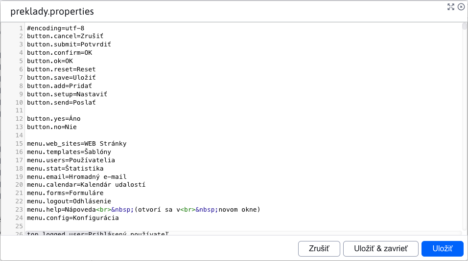
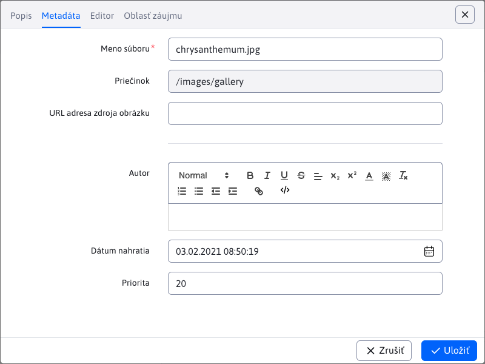
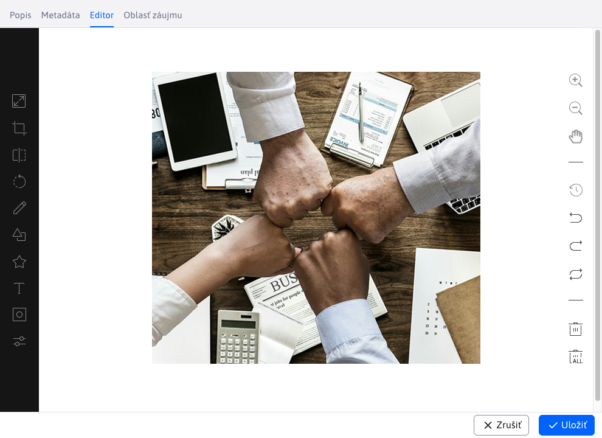

# Úprava súborov

Nakoľko úprava súborov v aplikácií [Prieskumník](../../fbrowser/README.md) má viacero stavov, venujeme sa jej v tejto samostatnej sekcií.

Pri úprave textových súborov ako `.text .json .properties` sa vyvolá dialógové okno, podobne ako v prípade **Náhľad**. Rozdiel je v tom, že toto dialógové okno môže byť otvorené pre viacero súborov súčasne a umožňuje úpravu samotného súboru.

Úprava obrázkov sa líši podľa lokality súboru.

Ak cesta obrázka obsahuje `/gallery`, tak tak to znamená že je to obrázok z galérie. V takomto prípade, sa otvorí v novom okne prehliadača aplikácia [galéria](../../../../redactor/apps/gallery/README.md), kde sa pre daný obrázok automatický otvorí editor.

Ak cesta obrázka neobsahuje `/gallery`, otvorí sa dialógové okno s editorom obrázkov.

