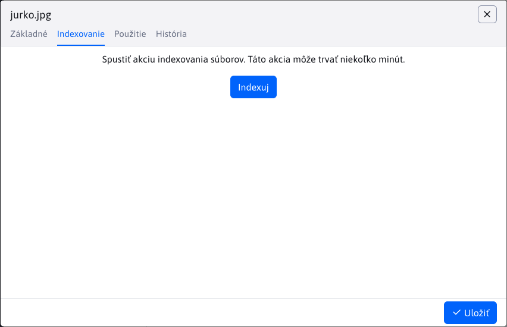
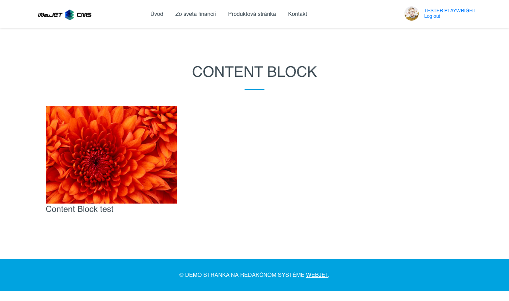

# Nastavenie súboru

Nastavenie súboru zobrazíte kliknutím pravým tlačidlom na súbor a voľbou Nastavenie súboru. Okno obsahuje nasledovné karty:

- Základné
- Indexovanie (**Upozornenie:** zobrazená iba za špeciálnych okolnosti)
- Použitie

## Základné

Karta **Základné** informuje o názve a umiestnení súboru. Názov súboru je možné zmeniť.

Parametrom "Zmeniť názov vo všetkých súboroch" sa prepíše názov súboru za nový, aby linka na tento súbor bola aktuálna po zmene jeho názvu.

## Indexovanie

Karta **Indexovanie** sa zobrazí IBA ak umiestnenie daného súboru začína hodnotou `/files`. Slúži k akcií indexovania súboru.

Po stlačení tlačidla "Indexuj" sa spustí indexovanie, ktoré môže trvať niekoľko minút.

## Použitie

Karta **Použitie** zobrazuje použitie priečinka vo forme vnorenej data-tabuľky. Každý záznam predstavuje web stránku využívajúcu daný súbor. Data-tabuľka obsahuje stĺpce:
- Názov, web stránky
- URL adresa, web stránky

Obe hodnoty sú súčasne linky smerujúce na rozdielne lokácie.

**Názov** web stránky je linka na [Zoznam web stránok](../../../../redactor/webpages/README.md), kde sa daná web stránka vyhľadá a automatický otvorí editor.

**URL adresa** web stránky je linka priamo na danú web stránku.

