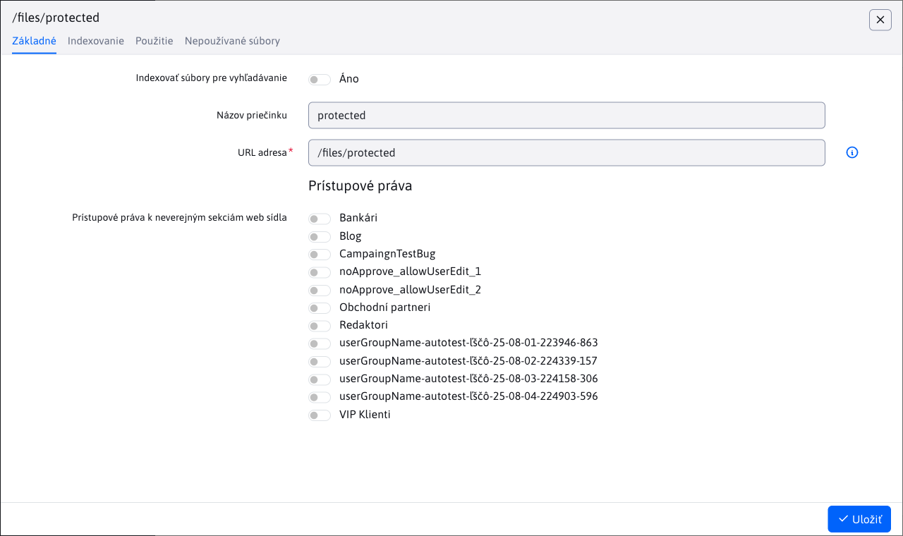
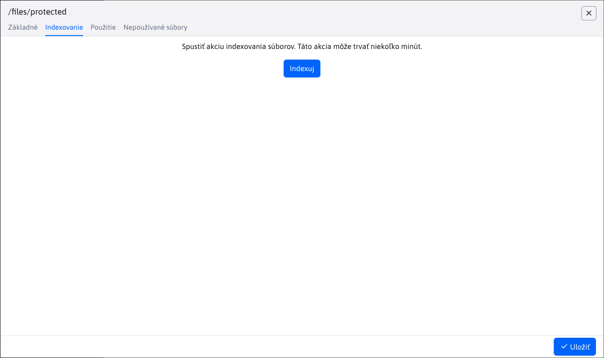
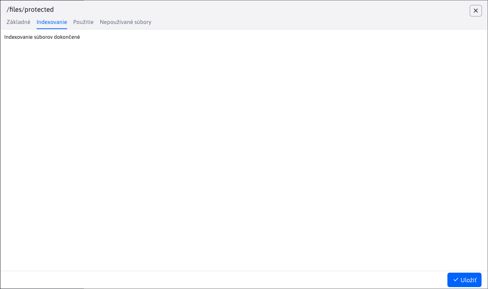
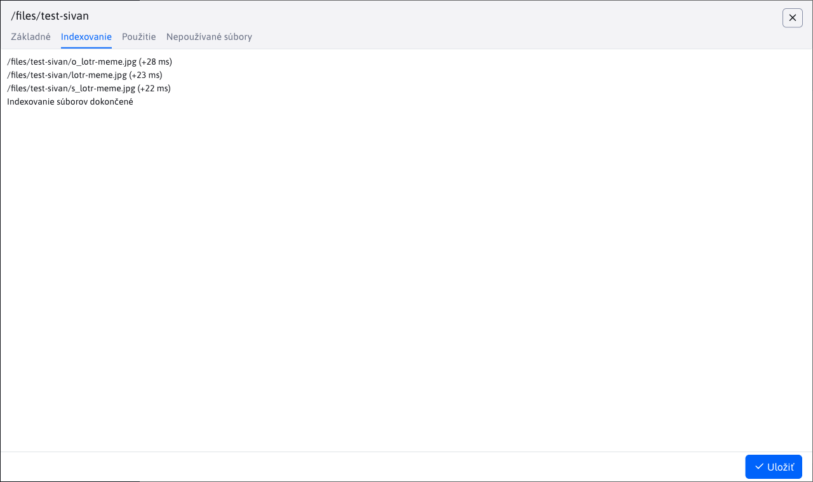
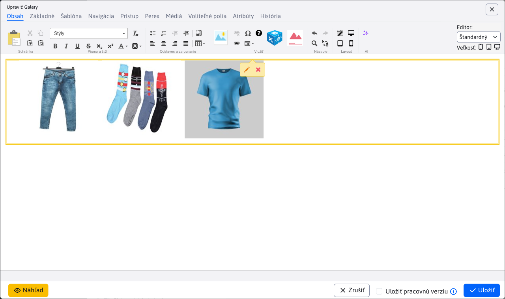
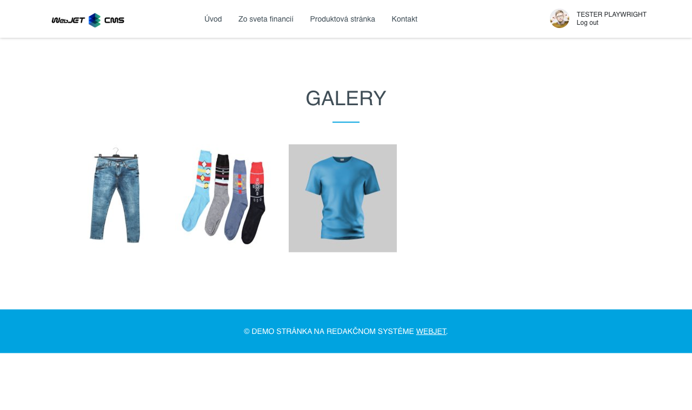

# Nastavenie priečinka

Nastavenie priečinka zobrazíte kliknutím pravým tlačidlom na priečinok a voľbou Nastavenie priečinka. Okno obsahuje nasledovné karty:

- Základné
- Indexovanie (**Upozornenie:** zobrazená iba za špeciálnych okolnosti)
- Použitie
- Nepoužívané súbory

## Základné

Karta **Základné** poskytuje základné informácie o priečinku ako aj možnosť obmedziť prístupové práva pomocou Skupiny používateľov.

Možnosťou "Indexovať súbory pre vyhľadávanie" povoľujete indexovanie súborov daného priečinka.

## Indexovanie

Karta **Indexovanie** sa zobrazí IBA ak URL adresa daného priečinka začína hodnotou `/files`. Slúži k akcií indexovania súborov. Indexovanie sa vykoná IBA  ak je povolené v karte [Základné](#základné).

Po stlačení tlačidla "Indexuj" sa spustí indexovanie, ktoré môže trvať niekoľko minút.

Indexovanie nie je povolené, alebo sa nenašli súbory k indexovaniu |  Indexovanie je povolené a našli sa súbory k indexovaniu
:-----------------------------------------------------------------:|:-----------------------------------------------------------------:
                               |  

## Použitie

Karta **Použitie** zobrazuje použitie priečinka vo forme vnorenej datatabuľky. Každý záznam predstavuje web stránku. Datatabuľka obsahuje stĺpce:

- Názov, web stránky
- URL adresa, web stránky

Obe hodnoty sú súčasne linky smerujúce na rozdielne lokácie.

**Názov** web stránky je linka na [Zoznam web stránok](../../../../redactor/webpages/README.md), kde sa daná web stránka vyhľadá a automatický otvorí editor.

**URL adresa** web stránky je linka priamo na danú web stránku.

## Nepoužívané súbory

Karta **Nepoužívané súbory** slúži na vyhľadanie a odstránenie súborov, pre ktoré sa v známych častiach systému nenašlo použitie. Pomáha uvoľniť miesto na disku a udržiavať poriadok v priečinkoch tým, že upozorní na súbory, ktoré už pravdepodobne nie sú potrebné.

!> Karta je dostupná iba používateľovi s právom na správu súborov, ktorý má zároveň právo zapisovať do zvoleného priečinka. Ostatným používateľom sa karta nezobrazí.

### Spustenie kontroly

Nová kontrola sa **nespustí automaticky** – vždy ju musíte spustiť ručne. Ak je však pre aktuálneho administrátora, doménu a priečinok dostupná posledná kontrola, po otvorení karty sa automaticky obnoví jej stav, nastavenie prepínača **Zahrnúť podpriečinky** a výsledok. Ak kontrola ešte prebieha, obnoví sa aj sledovanie jej stavu. Postup spustenia novej kontroly:

1. V prípade potreby povoľte prepínač **Zahrnúť podpriečinky**. Predvolene je vypnutý, takže sa kontrolujú iba súbory priamo v zvolenom priečinku. Po zapnutí sa kontrolujú aj všetky jeho podpriečinky.
2. Spustite kontrolu tlačidlom <button class="btn btn-sm btn-warning" type="button"><i class="ti ti-line-scan"></i></button> **Spustiť kontrolu**.
3. Počkajte na dokončenie. Kontrola prebieha na pozadí, okno priečinka zostáva použiteľné a jeho stav sa priebežne aktualizuje.

Stav kontroly sa zobrazuje v informačnom pruhu nad tabuľkou:

Stav | Význam
:----|:------
Kontrola zatiaľ nebola spustená. | Východiskový stav pred prvým spustením.
Kontrolujú sa nepoužívané súbory… | Kontrola práve prebieha.
Nájdených nepoužívaných súborov: N | Kontrola skončila a našla N súborov.
Nenašli sa žiadne nepoužívané súbory. | Kontrola skončila, všetky súbory sa používajú.

### Výsledok a mazanie

Výsledok sa zobrazí v tabuľke, ktorá obsahuje tieto stĺpce:

- **Názov súboru** – kliknutím naň otvoríte náhľad súboru
- **URL adresa** – úplná virtuálna cesta k súboru
- **Dátum** – dátum poslednej zmeny súboru
- **Veľkosť**

Súbory z výsledku odstránite dvoma spôsobmi:

- Označené súbory zmažete tlačidlom <button class="btn btn-sm buttons-selected btn-danger" type="button"><i class="ti ti-trash"></i></button> **Zmazať označené**.
- Celý zobrazený výsledok naraz zmažete tlačidlom <button class="btn btn-sm btn-danger" type="button"><i class="ti ti-recycle"></i></button> **Zmazať všetky**.

!> Mazanie je nevratné. Pred potvrdením si preto skontrolujte, či skutočne ide o súbory, ktoré už nepotrebujete. Prečítajte si aj časť [Obmedzenia](#obmedzenia), pretože použitie z niektorých zdrojov systém nemusí rozpoznať.

?> Každý administrátor spúšťa vlastnú kontrolu s vlastným výsledkom. Výsledky sa medzi administrátormi ani doménami nezdieľajú a môže ich načítať iba používateľ, ktorý kontrolu spustil. Dokončený výsledok je uložený v aplikačnej pamäti 30 minút a pri opätovnom otvorení rovnakého priečinka sa automaticky načíta. Po uplynutí tohto času je potrebné kontrolu spustiť znova. Súbory, ktoré medzičasom prestali existovať, sa pri opätovnom načítaní výsledku nezobrazia.

### Čo sa kontroluje

Kontrola porovnáva súbory s ich použitím v publikovaných webových stránkach a vo vybraných častiach systému:

- externé odkazy stránok,
- bannery,
- kalendár,
- diskusné fórum,
- galéria,
- médiá,
- tipy dňa,
- odkazy v súboroch šablón a komponentov príslušnej inštalácie.

Systémové a skryté cesty sa do výsledku **nezaraďujú**, konkrétne:

- `/WEB-INF`, `/META-INF`, `/admin`, `/wjerrorpages`,
- priečinok `/components` (okrem priečinka komponentov aktuálnej inštalácie),
- skryté priečinky (obsahujúce `/.`) a priečinky `CVS`.

### Súbežná práca viacerých administrátorov

S kartou môže naraz pracovať viacero administrátorov. Aby sa nestalo, že sa súbor kontroluje presne v okamihu, keď ho iný administrátor maže, systém dodržiava jednoduché pravidlá:

- **Kontroly sa navzájom nikdy neblokujú.** Rovnaký priečinok môže súčasne kontrolovať viacero administrátorov a každý dostane vlastný výsledok.
- **Mazanie sa uzamkne k priečinku.** Kým v priečinku prebieha mazanie, iná kontrola alebo mazanie toho istého priečinka sa nespustí.
- **Konfliktná akcia sa nezaradí do fronty.** Ak je akcia zablokovaná, systém ju rovno odmietne (nečaká sa na uvoľnenie). Po dokončení prebiehajúcej operácie ju jednoducho spustite znova.

Nasledujúca tabuľka ukazuje, čo je povolené a čo je dočasne zablokované:

Súbežné operácie | Správanie
:-----------------|:---------
Dve kontroly rovnakého priečinka | ✅ Povolené – každý administrátor dostane vlastný výsledok.
Kontrola a mazanie v rovnakom priečinku | ⛔ Druhá operácia je zablokovaná.
Kontrola *so* podpriečinkami + mazanie v jeho podpriečinku | ⛔ Druhá operácia je zablokovaná.
Kontrola *bez* podpriečinkov + mazanie v jeho podpriečinku | ✅ Povolené – kontrola sa podpriečinka netýka.
Kontrola podpriečinka + mazanie v rodičovskom priečinku | ✅ Povolené.
Dve mazania v rovnakom priečinku | ⛔ Druhá operácia je zablokovaná.
Mazania v rôznych priečinkoch (napr. rodič a podpriečinok) | ✅ Povolené – uzamyká sa vždy konkrétny priečinok.

?> Ak jedna požiadavka maže súbory z viacerých priečinkov, systém najprv skontroluje a rezervuje všetky dotknuté priečinky. Pri konflikte odmietne celú požiadavku ešte pred odstránením prvého súboru.

### Obmedzenia

Pred spustením kontroly a mazania je dobré poznať tieto obmedzenia:

- **Kontrola môže chvíľu trvať.** Pri veľkom počte súborov alebo webových stránok môže trvať aj niekoľko minút. Naraz bežia najviac dve kontroly, ďalšie čakajú v poradí. Aj čakajúca kontrola dočasne blokuje mazanie v priečinkoch, ktoré pokrýva.
- **Rozpoznáva sa iba použitie zo známych zdrojov.** Kontrola pozná štandardné umiestnenia a databázové polia WebJET CMS. Ak súbor používate z vlastného kódu, externého systému, konfiguračného súboru alebo iného neštandardného zdroja, systém to nemusí rozpoznať a súbor môže omylom označiť za nepoužívaný.
- **Medzi kontrolou a mazaním sa použitie neoveruje znova.** Mazanie vychádza z výsledku poslednej kontroly a neporovnáva veľkosť ani dátum zmeny súboru. Ak medzičasom niekto súbor začne používať alebo zmení, mazanie o tom nevie.
- **Pred každým mazaním prebehne bezpečnostná kontrola.** Systém overí cestu súboru, jeho typ a vaše právo na zápis. Súbor, ktorý medzičasom prestal existovať, sa považuje za bezpečne odstránený; súbor, ktorý sa nepodarí odstrániť, zostane vo výsledku.
- **Koordinácia platí len v rámci jedného servera.** Pri prevádzke na viacerých serveroch (uzloch) sa operácie spustené na rôznych serveroch navzájom neblokujú.
