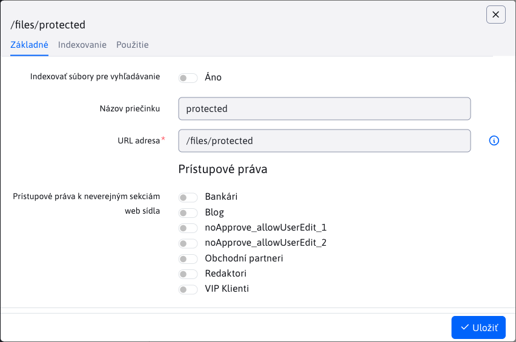
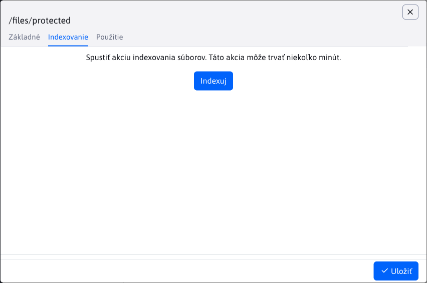
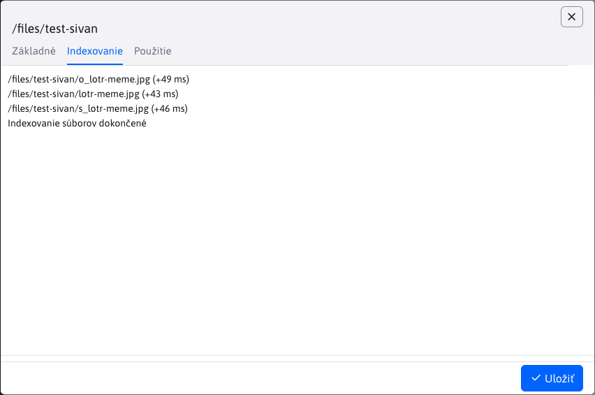
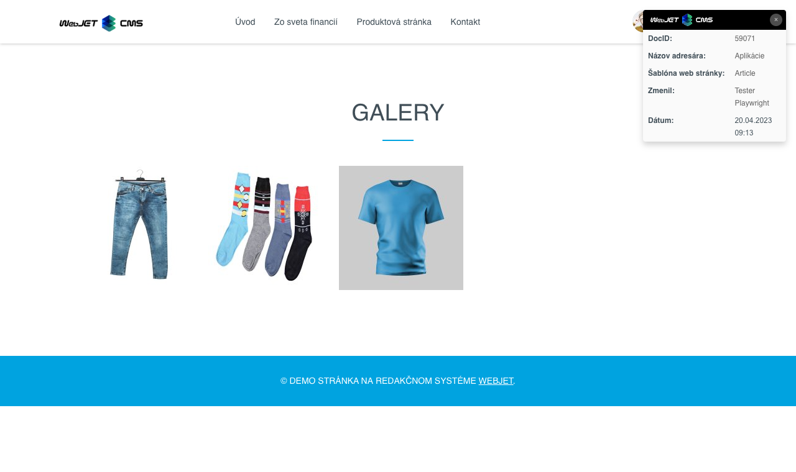

# Nastavenie priečinka

Nastavenie priečinka zobrazíte kliknutím pravým tlačidlom na priečinok a voľbou Nastavenie priečinka. Okno obsahuje nasledovné karty:

- Základné
- Indexovanie (**Upozornenie:** zobrazená iba za špeciálnych okolnosti)
- Použitie

## Základné

Karta **Základné** poskytuje základné informácie o priečinku ako aj možnosť obmedziť prístupové práva pomocou Skupiny používateľov.

Možnosťou "Indexovať súbory pre vyhľadávanie" povoľujete indexovanie súborov daného priečinka.

## Indexovanie

Karta **Indexovanie** sa zobrazí IBA ak URL adresa daného priečinka začína hodnotou `/files`. Slúži k akcií indexovania súborov. Indexovanie sa vykoná IBA  ak je povolené v karte [Základné](#základné).

Po stlačení tlačidla "Indexuj" sa spustí indexovanie, ktoré môže trvať niekoľko minút.

Indexovanie nie je povolené, alebo sa nenašli súbory k indexovaniu |  Indexovanie je povolené a našli sa súbory k indexovaniu
:-----------------------------------------------------------------:|:-----------------------------------------------------------------:
                               |  

## Použitie

Karta **Použitie** zobrazuje použitie priečinka vo forme vnorenej datatabuľky. Každý záznam predstavuje web stránku. Datatabuľka obsahuje stĺpce:
- Názov, web stránky
- URL adresa, web stránky

Obe hodnoty sú súčasne linky smerujúce na rozdielne lokácie.

**Názov** web stránky je linka na [Zoznam web stránok](../../../../redactor/webpages/README.md), kde sa daná web stránka vyhľadá a automatický otvorí editor.

**URL adresa** web stránky je linka priamo na danú web stránku.

