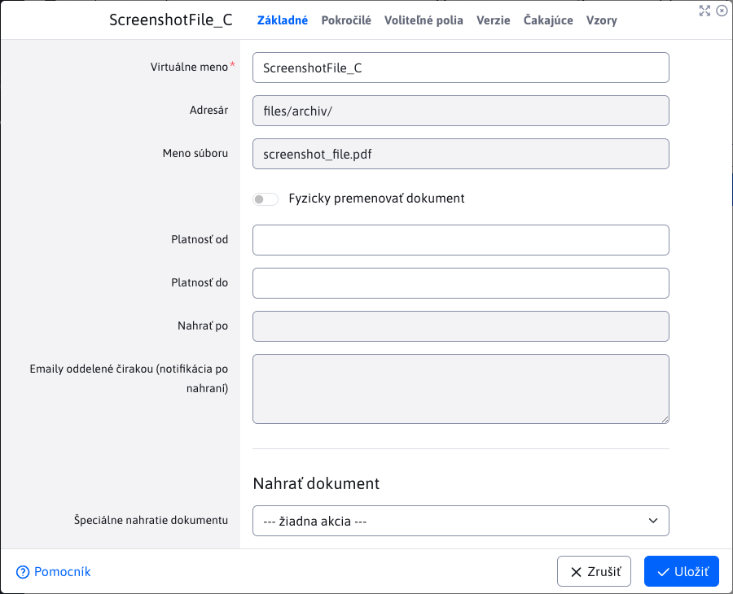
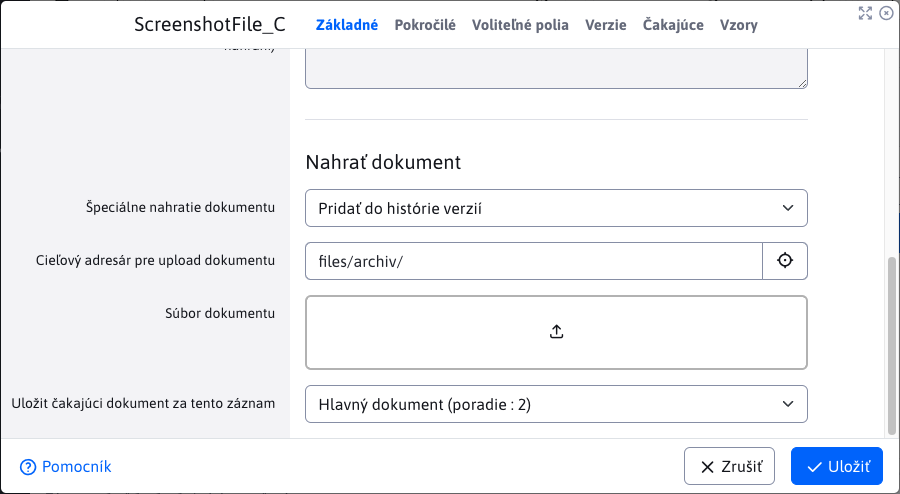

# Manažér dokumentov

Aplikácia pre manažment dokumentov a ich verzií na jednom mieste. Umožňuje nastavovať aj publikovanie dokumentov do budúcna a jednotlivé dokumentov zaradiť do kategórií a priradiť ich k produktom. Pre prácu s aplikáciou budete potrebovať právo Manažér dokumentov (`cmp_file_archiv`).

## Dokumenty

V zobrazenom zozname vidíme všetky dokumenty, ktoré boli vložené do manažéra v aktuálne zvolenej doméne. Prednastavené je filtrovanie, ktoré zobrazuje iba **hlavné dokumenty**, inak povedané aktuálne verzie dokumentov.


### Stav dokumentov

Stav dokumentov zobrazuje stĺpec **Stav**, ktorý obsahuje ikony reprezentujúce jednotlivé stavy dokumentov, ktoré môžu nadobudnúť.


- <i class="ti ti-star"></i> - **Aktuálna verzia dokumentu** alebo inak povedané **hlavný dokument**, ktorý sa aktuálne používa a môže (no nemusí) mať jeden alebo viac **historických verzií**. Hodnota stĺpca **Referencia** je -1.
- <i class="ti ti-star-off"></i> - **Historická verzia dokumentu**, ktorá sa používala v minulosti a teraz už je nahradená **hlavným dokumentom**. Tieto historické verzie sa v tabuľke označujú sivou farbou pre ich lepšie rozlíšenie. Hodnota stĺpca **Referencia** je väčšia 0;
- <i class="ti ti-map-pin"></i> - **Zobrazuje dokument** čiže **majú** povolené zobrazovanie súborov
- <i class="ti ti-map-pin-off"></i> - **Nezobrazuje dokument** čiže **nemajú** povolené zobrazovanie súborov
- <i class="ti ti-texture"></i> - **Vzor** iného hlavného dokumentu (ktorý nie je vzor). Ak referovaný hlavný dokument je formulár, tak vzor môže byť napríklad vzorovo vyplnený formulár.
- <i class="ti ti-calendar-time" style="color : #ff4b58!important"></i> - **Dokument čaká na nahratie (v budúcnosti)** jedná sa o dokument, ktorý bol nahraný s oneskorením. To znamená, že sa automatický nahrá v budúcnosti vo zvolenom dátume a čase. Až sa dokument úspešne nahrá, tak už **nebude** naďalej mať tento stav. Dokumenty s týmto stavom sú označené červenou farbou, nakoľko sú špeciálne.
- <i class="ti ti-calendar-plus"></i> - **Má novú verziu dokumentu, ktorá čaká na nahratie (v budúcnosti)** dokument má novú verziu, ktorá ho má v budúcnosti nahradiť ako **hlavný dokument**. Dokument bude automatický nahradený následne sa z tejto vezie stane **historická verzia**.

## Vloženie nového dokumentu do manažéra

V tejto časti si najprv prejdeme obsah jednotlivých kariet a následne vysvetlíme postup a možné problémy pri vkladaní nového dokumentu do manažéra.

### Karta - Základné

Karta obsahuje základné informácie pre vloženie dokumentu.


- **Názov** - zadajte meno dokumentu, ktoré sa bude na stránke zobrazovať (ako odkaz na dokument). Pole je **povinné**. Môže obsahovať diakritiku, medzery, špeciálne znaky.
- **Platnosť od** - nastavenie dátumu a času začiatku platnosti dokumentu
- **Platnosť do** - nastavenie dátumu a času konca platnosti dokumentu
- **Cieľový adresár pre upload dokumentu** -  vyberte adresár, do ktorého chcete dokument nahrať (neskôr Vám to poslúži pri filtrovaní zobrazenia dokumentov na stránke). Prednastavený cieľový adresár nastavíte konfiguračnou premennou ```fileArchivDefaultDirPath```. Používateľ si bude môcť zvoliť aj pod-priečinok.
- **Súbor** - pole pre nahratie súboru, ktorý reprezentuje dokument. Viac o poli ```UPLAOD``` sa dočítate [tu](../../../developer/datatables-editor/field-file-upload.md). Povolené prípony súboru nastavíte pomocou konfiguračnej premennej ```fileArchivAllowExt```.
- **Nahrať dokument neskôr** - v prípade potreby nahrania dokumentu do manažéra v presný čas a dátum, je možné nastaviť nahranie dokumentu automaticky v budúcnosti. Výberom možnosti sa Vám zobrazia ukryté polia
  - **Nahrať po** - výber dátumu a času, po ktorom sa má dokumentu nahrať
  - **Emaily oddelené čiarkou (notifikácia po nahraní)** - zadajte emaily oddelené čiarkou, na ktoré chcete zaslať notifikáciu o úspešnom/neúspešnom nahraní dokumentu

### Karta - Pokročilé


- **Produkt** - zadajte ľubovoľný názov produktu. Pole Vám bude automatický ponúkať iné už zadefinované produkty v manažéri. Na správu môžete využiť sekciu [Produkty](./product-manager.md).
- **Kategória** - zadajte ľubovoľný názov kategórie. Pole Vám bude automatický ponúkať iné už zadefinované kategórie v manažéri. Na správu môžete využiť sekciu [Kategórie](./category-manager.md).
- **Kód produktu** - zadajte ľubovoľný názov kódu produktu
- **Zobraziť** - nastavenie pre zobrazenie dokumentu na stránke (ak nechcete dokumentu na stránke zobraziť, odškrtnite toto nastavenie)
- **Prehľadávaťr** - umožňuje povoliť indexovanie súborov. Nové súbory majú túto možnosť predvolene zapnutú. Viac
- **Priorita** - pomocou priority viete ľubovoľne nastaviť poradie zobrazenia dokumentov na stránke
- **Hlavný dokument** - referencia na hlavný dokument. Pole ponúka cesty k jednotlivým hlavným dokumentom, na ktoré sa aktuálny dokument môže odkazovať, čím sa stáva **vzorom**. Ponúkané sú iba cesty dokumentov, ktoré spĺňajú:
  - nejde o rovnaký dokument, ktorý sa upravuje
  - dokument musí byť hlavný (nedá sa referencovať historický)
  - dokument nesmie čakať na nahratie (musí byť už nahratý)
  - nemôže to byť vzor
- **Poznámka** - poznámka sa zobrazí na stránke pri odkaze na dokument
- **Uložiť dokument aj keď už existuje** - manažér štandardne nedovoľuje pridanie toho istého dokumentu viac krát (aby sa zabránilo duplicite). Ak to chcete povoliť, musíte zaškrtnúť túto možnosť.

!>**Upozornenie:** polia **Produkt** / **Kategória**  / **Kód produktu** Vám neskôr poslúžia pri filtrovaní zobrazenia súborov na stránke

### Karta - Voliteľné polia

V karte Voliteľné polia viete dokumentu nastavovať voliteľné atribúty (hodnoty, texty) podľa vašej potreby. Typy (text, číslo, výberové pole...) a názvy polí je možné nastaviť podľa potreby, viac informácií je v sekcii [Voliteľné polia](../../../frontend/webpages/customfields/README.md).


### Postup vloženia nového dokumentu

Najprv je potrebné vyplniť povinné polia **Názov**. **Cieľový adresár pre upload dokumentu** je taktiež povinná hodnota, ktorá sa pred-vyplní automaticky, no viete ju zmeniť. Následné musíte vložiť súbor (reprezentujúci dokument) s povolenou príponou. Po úspešnom nahratí súboru môžete uložiť nový záznam do manažéra.

Ak ste nahrali súbor zo zlým formátom, validácia záznam neuloží, a pripomenie, ktoré prípony súboru sú povolené na nahratie.


Na pozadí sa kontroluje, či nahrávaný súbor/dokument, už existuje v manažéri.

!>**Upozornenie:** nekontroluje sa názov dokumentu ale jeho **obsah**. To znamená, že ak dokumenty sú rovnaké, nepomôže ich premenovanie.

V prípade, že sa deteguje už existujúci dokument, uloženie bude bude prerušené a zobrazí sa chybová hláška. Zobrazená bude aj notifikácia obsahujúca zoznam všetkých dokumentov s rovnakým obsahom. Ak tento dokument chcete aj tak uložiť, musíte povoliť možnosť **Uložiť dokument aj keď už existuje** z karty pokročilé.


## Publikovanie naplánovaných verzií

Ak ste pri vytváraní nového hlavného dokumentu zvolili možnosť **Nahrať dokument neskôr**, váš dokument bude nahratý až po zadanom dátume a čase. To isté platí aj pre dokumenty typu **Vzor**. Áno, môžete naplánovať aj nahratie vzoru do budúcnosti.

K automatickému nahratiu dokumentu slúži vytvorená [Automatizovaná úloha](../../../admin/settings/cronjob/README.md). Táto úloha s označením `sk.iway.iwcm.components.file_archiv.FileArchivatorInsertLater`, sa automatický vykonáva (**iba ak je povolená**) v časovom intervale, ktorý si viete upraviť. Vždy po časovom intervale skontroluje, či nejaký dokument očakáva nahratie a jeho zadaná hodnota **Nahrať po** obsahujúca dátum/čas nahratia už nastala. Ak áno, automatický nahraje tento dokument.

## Úprava historickej verzie dokumentu v manažéri

!>**Upozornenie:** manažér **nepovoľuje** úpravu historickej verzie dokumentu. Môžete otvoriť editor, pozrieť si uložené hodnoty, ale vaše zmeny nebudete schopný uložiť.

## Úprava aktuálnej verzie dokumentu v manažéri

Manažér umožňuje rôzne akcie a úpravy nad hlavnými dokumentami. Zloženie karty **Základné** sa zmenilo a pridali sa nové karty **Verzie**, **Čakajúce** a **Vzory**. O funkcionalitách jednotlivých pridaných kariet si povieme neskôr. K tejto akcii a všetkým akciám editácie, potrebujete mať právo `cmp_fileArchiv_edit_del_rollback`.

!>**Upozornenie:** ak chcete pri editácii vkladať nové súbory, musíte mať naviac k právu `cmp_fileArchiv_edit_del_rollback` povolenú aj konfiguračnú premennú `fileArchivCanEdit`.

!>**Upozornenie:** pre dokumenty typu **vzor** sa karta **Vzory** nezobrazuje, nakoľko vzorové dokumenty nemôžu mať svoj vzor.

Ak ste dokument pridali ako naplánovanú verziu do budúcnosti, editor Vám umožní zmeniť dátum/čas nahratia ako aj emaily pre notifikácie. Ak sa dokument už nahral, tieto polia budú zablokované a ich ďalšia zmena nebude možná.

Najdôležitejšia zmena v karte základné je pridanie sekcie **Nahrať dokument**, kde si viete vybrať špeciálnu akciu, ktorá sa má vykonať nad daným dokumentom. Tieto akcie si opíšeme v nasledujúcich kapitolách a ide o akcie:

- **Nahrať novú verziu**
- **Nahradiť aktuálny dokument**
- **Pridať do histórie verzií**



### Fyzicky premenovať dokument/súbor

Karta základné ponúka možnosť fyzicky **premenovať dokument** (čiže reálny súbor reprezentujúci náš dokument) nie jeho virtuálne meno. Pri zvolení tejto možnosti Vám zobrazí nové pole **Nové meno dokumentu bez prípony** kde zadáte nové meno pre dokument.

!>**Upozornenie:** Po tejto zmene je treba aktualizovať všetky statické odkazy na tento dokument.

### Akcia - Nahrať novú verziu

Táto akcia vytvorí novú aktuálnu verziu dokumentu. Z práve aktuálnej verzie (ktorú ideme nahradiť) sa stane historická verzia dokumentu. Stačí nahrať nový dokument, nakoľko cieľový adresár je pred-vyplnený (ale môže byť zmenený). K možnosti **Nahrať dokument neskôr** sa dostaneme až v nasledujúcej časti.

!>**Upozornenie:** povolené je nahrať iba dokument s rovnakým typom, ako práve nahrádzaný aktuálny dokument.

Treba si uvedomiť, že nahrávaný dokument bude po uložení automaticky fyzicky premenovaný podľa názvu aktuálne nahrádzaného dokumentu. Ak chcete aby sa dokument volal inak, musíte použiť možnosť **Fyzicky premenovať dokument** a zadať nové meno.


!>**Upozornenie:** táto akcia nie je povolená pre historické dokumenty a dokumenty čakajúce na nahratie. Pri výbere akcie sa žiadne z daných polí pre tieto dokumenty nezobrazí.

Po úspešnom nahratí si pôvodnú (teraz už historickú verziu) viete pozrieť v karte **Verzie**.

Karta **Verzie** obsahuje všetky historické verzie práve upravovaného aktuálneho dokumentu. Vnorená tabuľka **nepodporuje akcie** nad dátami. Jednotlivé záznamy sa dajú otvoriť ako pri editácii, ale nebude schopný svoje zmeny uložiť.


**Číslovanie verzií**

Všimnite si, že reálne meno historických verzií sa zmenilo. Nakoľko pri nahratí novej verzie sa nahrávaný súbor reprezentujúci dokument **vždy pomenuje rovnako** a súborový systém neumožňuje 2 súborom mať rovnaké meno v rovnakej lokácií, tak sa historický automaticky premenuje s pridaním pätičky ```_v_X``` (X je nahradené za číslo). To číslo sa zväčšuje s každým súborom, ktorý má rovnaké meno v rovnakom priečinku.

**Poradie usporiadania**

Hlavný dokument má vždy hodnotu poradia usporiadania -1. Pri keď sa hlavný dokument stane historickou verziou, nastaví sa mu hodnota 2 a všetkým starším historickým verziám sa táto hodnota zväčší o 1. Pomocou tejto hodnoty viete povedať, ktorý dokument je najstarší (má **najväčšie** číslo) a ktorý je najnovší, čo je aktuálny hlavný dokument s hodnotou -1. Táto hodnota je veľmi dôležitá pri akcií typu [Vrátenie poslednej zmeny spať](#vrátenie-poslednej-zmeny-spať).

### Akcia - Nahrať novú verziu do budúcnosti

Postup je praktický identický ako v prípade **Akcia - Nahrať novú verziu**. Rozdiel pri zvolení možnosti **Nahrať dokument neskôr**, kedy máme možnosť zadať do poľa **Nahrať po** dátum/čas kedy sa nová verzia dokumentu nahraje. Takto pridaná nová verzia dokumentu, nenahradí okamžite hlavný dokument, ale bude čakať na nahratie. Nová verzia sa nahraje ako to je popísané v sekcií [publikovanie-naplánovaných-verzií](#publikovanie-naplánovaných-verzií)


Všetky čakajúce verzie daného dokumentu sú dostupné priamo v jeho karte **Čakajúce**. Na rozdiel od historických verzií v karte verzie, tabuľka v karte čakajúce umožňujú akcie nad čakajúcimi verziami. Môžete ich vymazať alebo upraviť. Samozrejme, toto všetko platí aj pre dokumenty typu **Vzor**, čiže si viete naplánovať novú verziu vzoru.


### Akcia - Nahradiť aktuálny dokument

Táto akcia robí presne to, čo názov napovedá. Nenahraje novú verziu dokumentu, ale vymení práve aktuálny hlavný dokument za iný, čiže sa vymení súbor reprezentujúci dokument. Dokument môže mať iný názov, ale automaticky sa zachová názov pôvodného dokumentu.

Táto akcia funguje aj pre dokumenty typu **Vzor** ako aj pre dokumenty, ktoré čakajú na nahratie. Takto viete napr. vymeniť dokument, ktorý sa má nahrať v budúcnosti bez potreby vymazania pôvodného dokumentu a vytvárania nového záznamu.

!>**Upozornenie:** povolené je nahrať iba dokument s rovnakým typom, ako práve nahrádzaný aktuálny dokument.


### Akcia - Pridať do histórie verzií

Akcia umožňuje doplniť historickú verziu dokumentu. Použitie môže byť napríklad v prípade, ak Vám medzi historickými verziami chýba nejaká verzia a vy ju chcete doplniť bez toho, aby ste ovplyvnili aktuálny dokument. Naviac, k tejto akcii potrebujete ďalšie právo `cmp_fileArchiv_advanced_settings`.

!>**Upozornenie:** povolené je nahrať iba dokument s rovnakým typom, aký má hlavný dokument.



Okrem nahratia potrebného dokumentu, musíte zvoliť za aký dokument sa tento vloží. Buď sa vloží priamo za hlavný dokument, alebo už za existujúci historický dokument. Možnosti obsahujú v zátvorke aj poradie, ktorým bude dokument disponovať po vložení sa konkrétny dokument. Všetkým dokumentom, za týmto poradím (vrátane pôvodne daného) sa zvýši poradie o 1. Treba si uvedomiť, že **poradie dokumentu** je dôležitý faktor pri akcií typu [Vrátenie poslednej zmeny spať](#vrátenie-poslednej-zmeny-spať) a preto  si treba dobre premyslieť, za aký dokument sa tento vloží.


!>**Upozornenie:** táto akcia nie je povolená pre historické dokumenty a dokumenty čakajúce na nahratie. Pri výbere akcie sa žiadne z daných polí pre tieto dokumenty nezobrazí.

## Vrátenie poslednej zmeny spať

Vrátenie poslednej zmeny spať alebo `rollback` je akcia, ktorá umožňuje vrátenie historickej verzie späť ako hlavnú verziu dokumentu a funguje aj pre dokumenty typu **Vzor**. K tejto akcii potrebujete mať právo `cmp_fileArchiv_edit_del_rollback`.

Pre fungovanie akcie `rollback` je potrebné splniť tieto požiadavky:

- musí sa jednať o hlavný dokument
- dokument už musí byť nahratý (nesmie čakať na nahratie)
- musí mať aspoň jeden historický dokument (inak by táto akcia nemala zmysel)
- dokument nesmie mať **naplánovanú verziu**, ktorá sa má nahrať v budúcnosti

### Priebeh vrátenia

Po označení hlavného dokumentu akciu spustíte tlačidlom . Zobrazí sa ešte dialógové okno, kde musíte túto akciu potvrdiť.


Po potvrdení sa spustí akcia, kedy aktuálny hlavný dokument **bude vymazaný** a nahradí ho historický dokument s najmenšou hodnotou **Poradie usporiadania**, čiže hodnotou 2. Takže sme spätne nahradili aktuálny dokument najmladším historickým dokumentom. Všetkým ostatným historickým dokumentom (ak nejaké ostali) sa následne zníži **Poradie usporiadania** o hodnotu 1. Takže dokumentu čo mal poradie 3 sa po akcii znížilo poradie na 2, čím sa stal nasledujúcim dokumentom, ktorým by sa použil pri tejto akcii. Takto sa vieme vracať k pôvodným verziám až kým nám neostane žiaden historický dokument.

## Vzory

To ako sa vzory nastavujú sme si už vysvetlili. Jeden hlavný dokument môže mať viacero vzorov, takže sú v pomere `1:N`. Všetky **hlavné** vzory (čiže hlavné dokumenty, nie historické verzie) sa zobrazujú v poslednej karte editora **Vzory**. Ak chcete vidieť historické verzie vzorov, pozrite si ich v karte **Verzie** daného vzoru.


Táto karta sa nezobrazuje dokumentom, ktoré sú vzory, nakoľko vzor nemôže mať svoj vlastný vzor. Tabuľka v karte umožňuje úpravu ako aj mazanie dostupných vzorov.

Vzory sú definované tým, že sa odkazujú na hlavný dokument. Tento odkaz je v stĺpci **Hlavný dokument**. V prípade, že hlavný dokument zmení lokalitu (hodnota **Adresár**) alebo fyzicky premenuje (hodnota **Reálne meno**) tak **všetkým** vzorom odkazujúcim na daný dokument sa automaticky upraví hodnota **Hlavný dokument**. A to sa týka hlavných vzorov ale aj ich historických verzií.

!>**Upozornenie:** ak hlavný dokument má na seba aspoň jeden odkazujúci vzor, tak tento hlavný dokument sa nemôže sám stať vzorom.

## Mazanie

Podmienky a následky akcie mazanie sa líšia podľa toho, aký typ dokumentu chceme vymazať. V tejto kapitole si všetky typy vysvetlíme. Spoločné majú však to, že vymazaním sa vymaže aj fyzický dokument (resp. súbor ktorý ho reprezentuje), ktorý bol dostupný pomocou [Prieskumníka](../fbrowser/README.md). K tejto akciám mazania potrebujete mať právo `cmp_fileArchiv_edit_del_rollback`.

### Mazanie hlavného čakajúceho dokumentu

Ak máte hlavný dokument, ktorý očakáva nahratie v budúcnosti, viete ho vymazať priamo v hlavne tabuľke. Nemá to žiadne iné následky, nakoľko čakajúci dokument nemôže mať ani historické verzie ani vzory.

### Mazanie vzorov

Mazanie je povolené iba pre hlavné vzory. Historické verzie sa nedajú vymazať. Ak vymažete hlavný vzor, vymažete aj všetky historické verzie. Hlavný dokument, na ktorý sa vzor odkazoval nebude nijak ovplyvnený.

!>**Upozornenie:** hlavný vzor sa nedá vymazať, pokiaľ má čakajúcu verziu na nahratie.

V takomto prípade, buď počkáte kým sa všetky naplánované verzie nahrajú ALEBO v záložke **Čakajúce** daného vzoru, vymažete všetky čakajúce verzie. Toto mazanie čakajúcich verzií sa dá vykonať **IBA** skrz tabuľku v karte.

### Mazanie hlavného dokumentu

Vymazaním hlavného dokumentu (ktorý nie je vzor) sa vymažú aj všetky historické verzie a taktiež aj všetky vzory, ktoré odkazujú na tento dokument.

!>**Upozornenie:** hlavný dokument sa nedá vymazať, pokiaľ má čakajúcu verziu na nahratie.

Ako aj pri mazaní vzorov, tieto naplánované verzie sa dajú vymazať **IBA** pomocou tabuľky v karte **Čakajúce**.

## Vyhľadávanie a indexovanie

Zvolením možnosti **Prehľadávať** povolíte vyhľadávanie dokoumnetu cez aplikáciu **Vyhľadávanie** a indexovanie v externých vyhľadávačoch. Predvolene, táto možnosť je povolená pre nové dokumnety. Ak sa dokument stane **historickou verziou**, toto povolenie sa automaticky deaktivuje, avšak je možné ho opätovne povoliť podľa potreby.

### Vyhľadávače typu Google

Ak možnosť **Prehľadávať** nie je povolená, pre takýto dokumnet sa pridá `HTTP` hlavička `X-Robots-Tag` s hodnotou `noindex, nofollow`, aby sa zabránilo indexovaniu takéhoto dokumnetu.