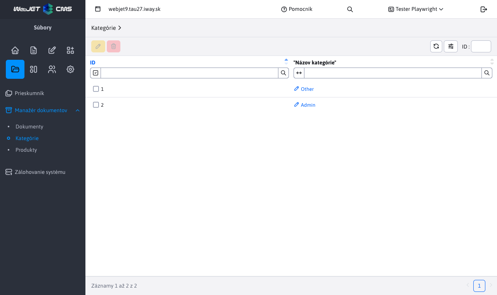

# Kategórie

Sekcia kategórie slúži na manažovanie **už existujúcich** kategórií, ktoré boli zadefinované v [Manažéri dokumentov](./README.md). Povolené sú len 2 akcie a to **úprava** a **mazanie**. Pre prácu s touto sekciou potrebujete právo Manažér dokumentov-Kategórie (`menuFileArchivManagerCategory`).

## Úprava kategórie

Pri úprave kategórie prakticky premenujeme už existujúcu kategóriu. To znamená, že všetkým dokumentom s touto kategóriou sa zemní hodnota, na novú zadanú.

Použitie je v prípade, ak chceme globálne v celom manažéri dokumentov zmeniť meno existujúcej kategórie, bez nutnosti upravovať jednotlivé záznamy.

## Vymazanie kategórie

Vymazaním zvolenej (zvolených) kategórií, nastane vlastne akcia **úpravy**, kedy sa všetkým záznamom z manažéra dokumentov vymaže daná nastavená kategória. Táto kategória zmizne aj z tabuľky, nakoľko už nebude nikde použitá.