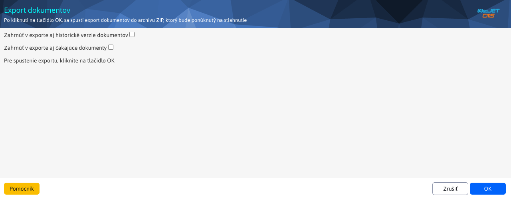
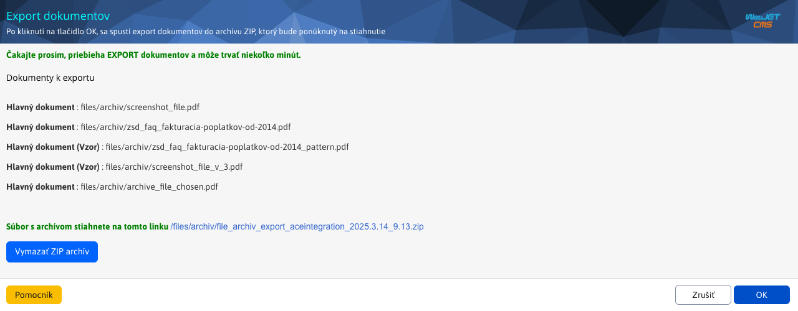

# Export dokumentov

Upravený export slúži na exportovanie dokumentov z [Manažéra dokumentov](./README.md) do `ZIP` súboru. Prednastavené, exportujú sa **iba** hlavné dokumenty vrátane vzorov. Pre prácu s exportom potrebujete právo Manažér dokumentov-Export dokumentov (`menuFileArchivExportFiles`).

## Exportovanie hlavných dokumentov/vzorov

Pre exportovanie hlavných súborov (vrátane vzorov) Vám stačí stlačiť tlačidlo s názvom `OK`. Týmto sa spustí prednastavený export, ktorý môže trvať aj niekoľko minút pri veľkom množstve dát. V okne sa vypíše zoznam jednotlivých exportovaných **hlavných** dokumentov a to vrátane aj hlavných dokumentov typu **Vzor**.

!>**Upozornenie:** historické a čakajúce verzie dokumentov sa **neexportujú**

## Exportovanie hlavných a čakajúcich dokumentov/vzorov

Pre exportovanie hlavných dokumentov/vzorov **vrátane čakajúcich**, musíte zvoliť možnosť **Zahrnúť v exporte aj čakajúce dokumenty** a následne stlačiť tlačidlo s názvom `OK`. Týmto sa spustí export, ktorý môže trvať aj niekoľko minút pri veľkom množstve dát. V okne sa vypíše zoznam jednotlivých exportovaných dokumentov/vzorov. čakajúce dokumenty/vzory sú zvýraznené červenou farbou pre lepší prehľad.

## Exportovanie hlavných a historických dokumentov/vzorov

Pre exportovanie hlavných dokumentov/vzorov **vrátane historických** verzií, musíte zvoliť možnosť **Zahrnúť v exporte aj historické verzie dokumentov** a následne stlačiť tlačidlo s názvom `OK`. Týmto sa spustí export, ktorý môže trvať aj niekoľko minút pri veľkom množstve dát. V okne sa vypíše zoznam jednotlivých exportovaných dokumentov/vzorov tak, aby k hlavnému dokumentu boli vizuálne priradené jeho historické verzie.

## Exportovanie všetkých dokumentov/vzorov

Pre exportovanie všetkých dokumentov musíte zvoliť obe možnosti **Zahrnúť v exporte aj čakajúce dokumenty** a **Zahrnúť v exporte aj historické verzie dokumentov**. Následne stlačiť tlačidlo s názvom `OK`. Týmto sa spustí export, ktorý môže trvať aj niekoľko minút pri veľkom množstve dát.

## Stiahnutie súboru

Súbor stiahnete kliknutím na priloženú linku, ktorá môže vyzerať ako `/files/archiv/file_archiv_export_aceintegration_2025.2.27_14.39.zip`.

## Vymazanie súboru

Nakoľko sa vytvorený `ZIP` súbor k stiahnutiu vytvára v hlavnej lokácií kde začínajú archívne súbory, máte možnosť tento vytvorený súbor vymazať a to kliknutím na tlačidlo s názvom **Vymazať ZIP archív**. Po úspešnom zmazaní sa zobrazí hláška.

