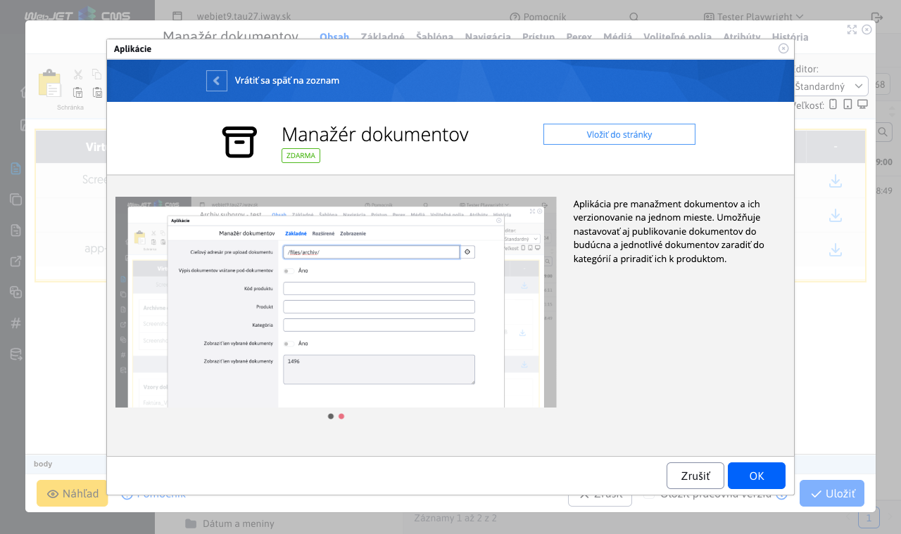
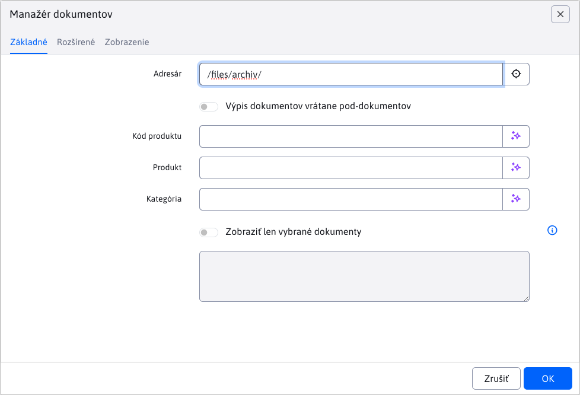
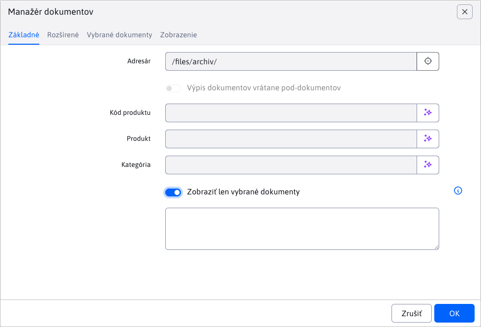
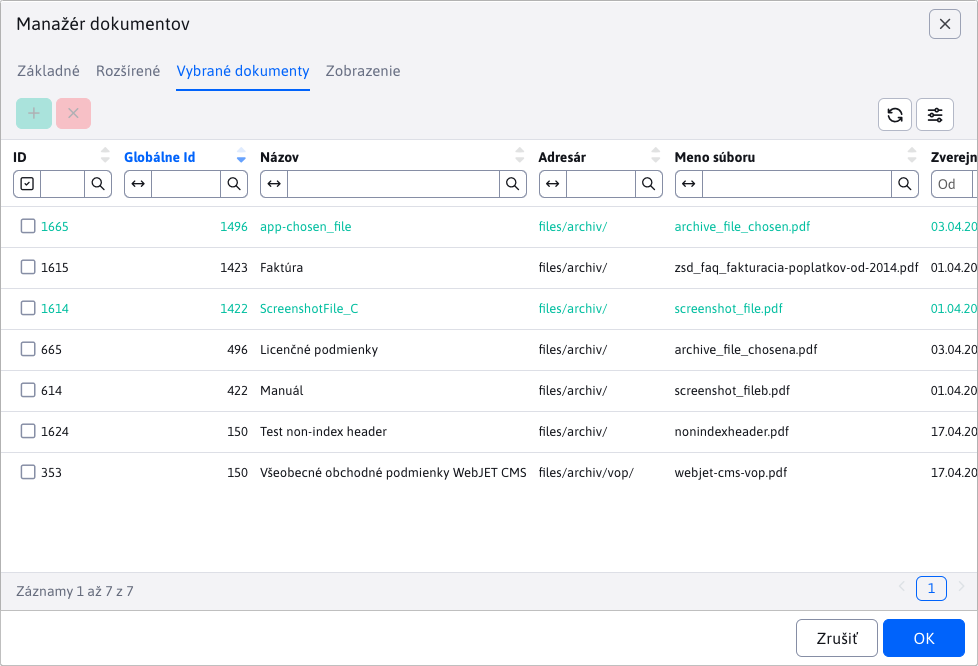
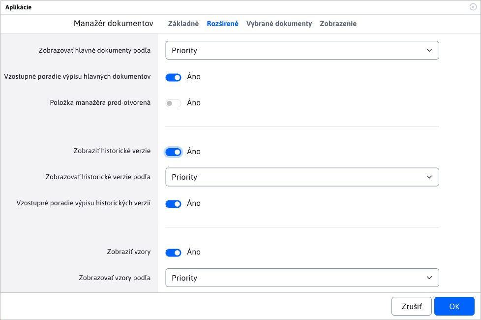
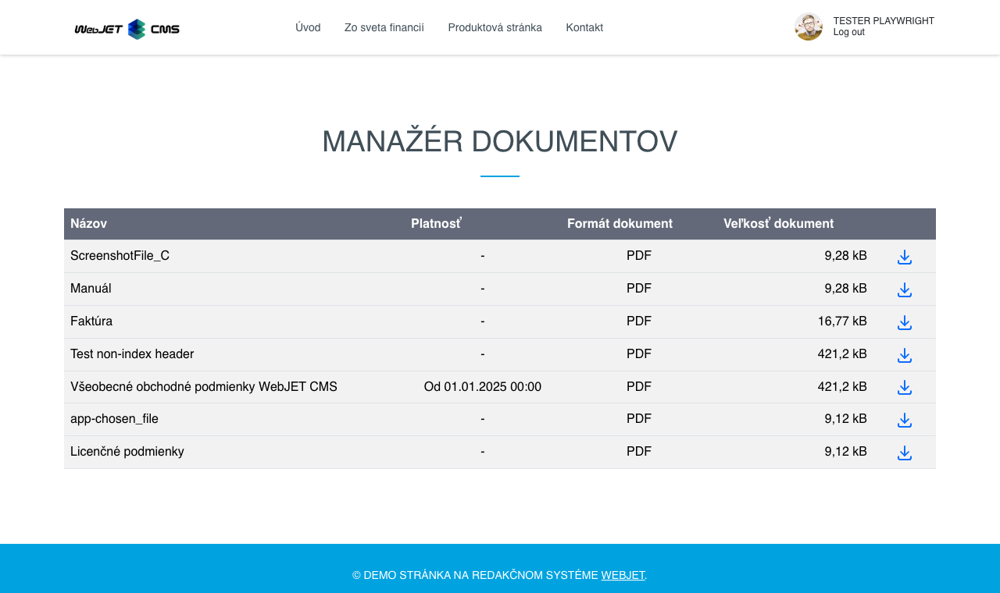
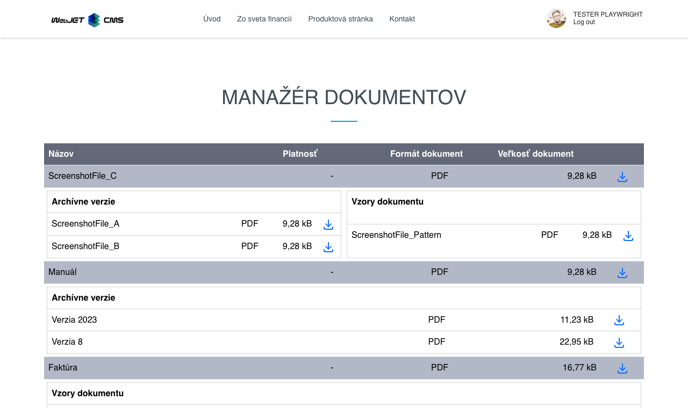
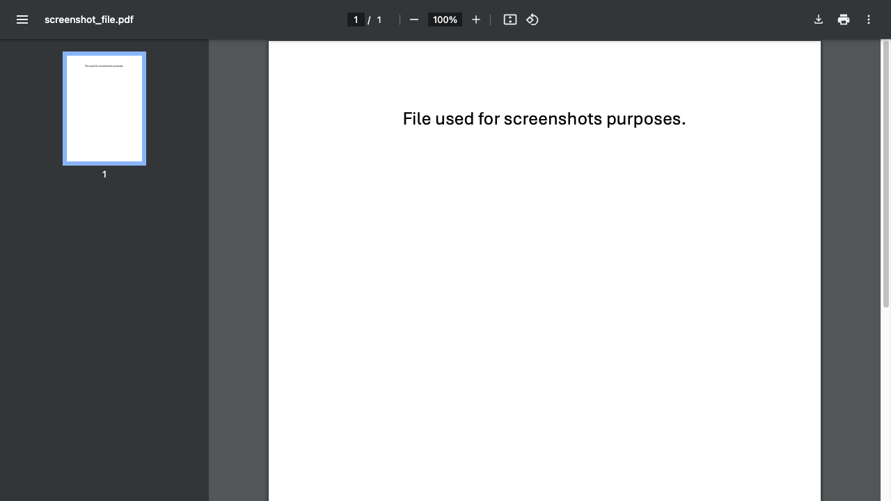

# Aplikácia Manažér dokumentov

Aplikácia slúži na prehľadné zobrazenie zvolených (filtrovaných) dokumentov z [Manažéra dokumentov](./README.md).

## Použitie aplikácie

Aplikáciu môžete do svojej stránky pridať cez obchod s aplikáciami



alebo priamo ako kód do stránky

```html
!INCLUDE(sk.iway.iwcm.components.file_archiv.FileArchiveApp, dir=&quot;/files/archiv/&quot;, subDirsInclude=true, productCode=, product=, category=, showOnlySelected=false, globalIds=, orderMain=priority, ascMain=true, open=false, archiv=true, order=priority, asc=true, showPatterns=true, orderPatterns=priority, ascPatterns=true)!
```

v kóde si môžete všimnúť množstvo parametrov, ktoré si vysvetlíme v ďalšej časti.

## Nastavenie aplikácie

Pomocou nastavenia viete filtrovať zobrazenie iba určitých dokumentov ako aj štýlu, ako sa majú zobrazovať.

### Karta - Základné

Karta **Základné** slúži na nastavenie filtrovania dokumentov pre zobrazenie.

!>**Upozornenie:** dokumenty, ktoré ešte len čakajú na nahratie, sa v aplikácií **nezobrazujú**.

- **Adresár** - viete nastaviť, zobrazenie dokumentov iba z konkrétneho priečinka. Prednastavená hodnota je koreňový priečinok pre nahratie dokumentov. Môžete túto hodnotu zmeniť, ale nemôžete ísť vyššie ako koreňový priečinok.
- **Výpis dokumentov vrátane pod-dokumentov** - prednastavené je zobrazenie dokumentov **IBA** zo zvoleného (bez pod-priečinkov). Ak túto možnosť zvolíte, zobrazia sa **všetky** dokumenty zo zvoleného priečinka ale **AJ** pod-priečinkov.

!>**Upozornenie:** zvolením možnosti **Výpis dokumentov vrátane pod-dokumentov** na priečinku, ktorý je vysoko v stromovej štruktúre sa vystavujete riziku práce s veľkým množstvom dát. Preto sa táto možnosť odporúča pri menších množstvách, alebo s užším filtrovaním.

- **Kód produktu** - zobrazíte iba dokumenty s daným kódom produktu.
- **Produkt** - pole automatický ponúka zadefinované produkty v manažéri, podľa ktorých môžete filtrovať.
- **Kategória** - pole automatický ponúka zadefinované kategórie v manažéri, podľa ktorých môžete filtrovať.



**Zobraziť len vybrané dokumenty** - ide o špeciálnu možnosť, kedy sa budú ignorovať všetky doterajšie filtre ako **Adresár** / **Kód produktu** atď, a zobrazia sa iba dokumenty, ktoré majú zadané `globalId` v poli **Zobraziť len vybrané dokumenty**.

Všetky doterajšie filtre si zachovajú hodnoty, ale nemajú žiaden vplyv a sú zablokované. Naviac sa ešte zobrazí nová karta [Vybrané dokumenty](#karta---vybrané-dokumenty), kde môžete manažovať ktoré súbory sú zvolené k zobrazeniu (ideálne ak nepoznáte potrebné `globalId`).



### Karta - Vybrané dokumenty

Karta sa zobrazí iba v prípade, ak je zvolená možnosť **Zobraziť len vybrané dokumenty**. V karte je vnorená tabuľka zobrazujúcu **IBA** dokumenty, ktoré je možne použiť ako vybrané dokumenty. Tieto dokumenty musia spĺňať:

- musí to byť hlavný dokument (niehistorická verzia)
- nesmie to byť vzorový dokument
- nemôže to byť dokument naplánovaný na nahratie v budúcnosti

Dokumenty v tabuľke môžete označiť a zvoliť tlačidlom <button class="btn btn-sm btn-success" type="button"><span><i class="ti ti-plus"></i></span></button> čím sa hodnoty ich `globalId` (čiže Globálne Id) zapíše do poľa **Zobraziť len vybrané dokumenty** v karte **Základné**. Naopak tlačidlom <button class="btn btn-sm btn-danger" type="button"><span><i class="ti ti-x"></i></span></button> sa daný dokument z výberu odoberie. Vďaka tejto karte môžete jednoducho zvoliť ktoré dokumenty chcete zobraziť bez nutnosti poznať ich `globalId`. Logika je samozrejme ošetrená voči duplicite a pod.

Zvolené dokumenty (ktorý hodnota `globalId` je zapísaná v poli **Zobrazit len vybrané dokumenty**) sú v tabuľke farebne označené.



### Karta - Rozšírené

Karta slúži k nastaveniu štýlu zobrazenia a zoradenia dokumentov.

- **Zobrazovať hlavné dokumenty podľa** - výber hodnoty, podľa ktorej sa majú hlavné dokumenty zoradiť
- **Vzostupné poradie výpisu hlavných dokumentov** - ak je možnosť zvolená, hlavné dokumenty sa budú radiť vzostupne, inak naopak
- **Položka manažéra pred-otvorená** - ak možnosť zvolíte, manažované položky sa pri zobrazovaní automaticky otvoria

---

- **Zobraziť historické verzie** - zvolením možnosti sa povolí zobrazenie historický verzií dokumentov (ak nejaké má). Taktiež sa odkryjú možnosti pre zoradenie týchto historických verzií
- **Zobrazovať historické verzie podľa** - výber hodnoty, podľa ktorej sa majú historické verzie zoradiť
- **Vzostupné poradie výpisu historických verzií** - ak je možnosť zvolená, historické verzií sa budú radiť vzostupne, inak naopak

---

- **Zobraziť vzory** - zvolením možnosti sa povolí zobrazenie vzorov daného dokumentu (ak nejaké má). Zobrazujú sa iba hlavné vzory, nie ich historické verzie. Taktiež sa odkryjú možnosti pre zoradenie týchto vzorov
- **Zobrazovať vzory podľa** - výber hodnoty, podľa ktorej sa majú vzory zoradiť
- **Vzostupné poradie výpisu vzorov** - ak je možnosť zvolená, vzorové dokumenty sa budú radiť vzostupne, inak naopak



## Aplikácia

Samotná aplikácia v stránke zobrazuje zadané alebo vy-filtrované hlavné dokumenty.



Ak ste nezvolili možnosť **Položka manažéra pred-otvorená**, položka za uzavretá a až po kliknutí na ňu sa zobrazia dostupné **Historické dokumenty** a **Vzory dokumentu**.



Samozrejme, tieto tabuľky sa zobrazia iba v prípade že:

- je povolená možnosť **Zobraziť historické verzie** prípadne **Zobraziť vzory**
- daný hlavný dokument má nejaké historické dokumenty alebo vzory

Hlavný dokument môže mať obe tabuľky súčasne, alebo ani jednu, v závislosti od toho, či sú povolené alebo majú nejaké hodnoty.

**Zobraziť vzory** zobrazuje iba hlavné vzory, nakoľko aj vzory môžu mať historické verzie.

Ikona <i class="ti ti-download" style="color: #00a3e0;"></i> je dostupná pre hlavné dokumenty, historické dokumenty ako aj pre vzory. Kliknutím na ňu sa zobrazí daný dokument v novom okne, kde si ho vieme prezrieť alebo stiahnuť.

