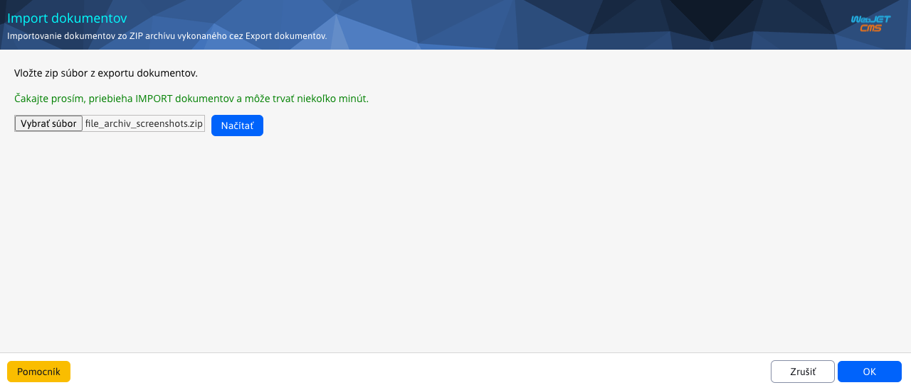
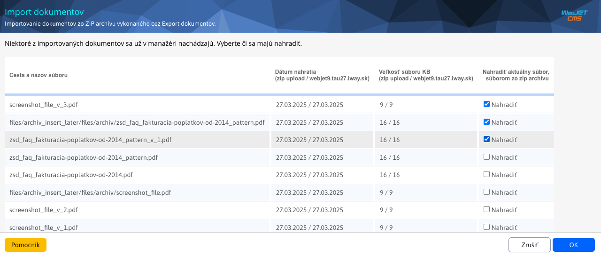
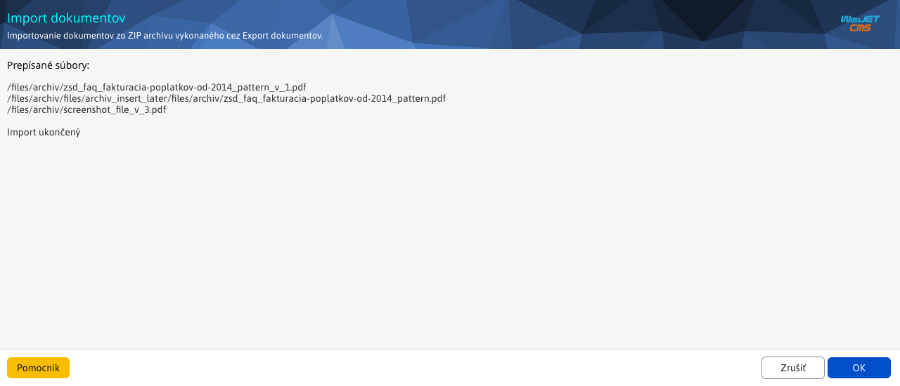

# Import dokumentov

Upravený import slúži na importovanie dokumentov/vzorov zo `ZIP` súboru späť do [Manažéra dokumentov](./README.md). Pre prácu s importom potrebujete právo Manažér dokumentov-Import dokumentov (`menuFileArchivImportFiles`).

Po vybratí `ZIP` súboru spustite proces tlačidlom **Načítať** (prípadne tlačidlom `OK`). Nakoľko tento proces môže trvať niekoľko minút v závislosti od množstva dát, zobrazí sa upozornenie.

Systém skontroluje či sú medzi importovanými dokumentami/vzormi také, ktoré už existujú. Ak áno, zobrazí ich. Vy máte následne možnosť zvoliť tie, ktoré chcete nahradiť. Prednastavené je to tak, že sú vybrané všetky, ale vy môžete vybrať iba časť alebo aj žiaden z nich.

Pokračujete stlačením tlačidlá `OK`, kde sa následne vypíšu dokumenty/vzory, ktoré boli nahradené (ak ste nejake zvolili) a tie, ktoré sa v manažéra dokumentov nenachádzali vôbec a museli byť importované.

