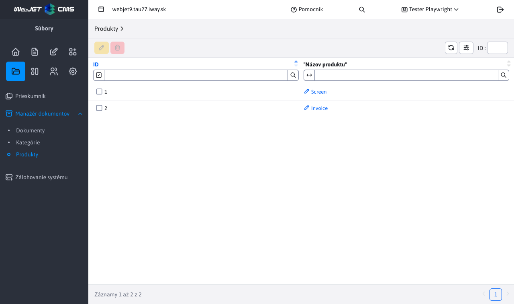

# Produkty

Sekcia produkty slúži na manažovanie **už existujúcich** produktov, ktoré boli zadefinované v [Manažéri dokumentov](./README.md). Povolené sú len 2 akcie a to **úprava** a **mazanie**. Pre prácu s touto sekciou potrebujete právo Manažér dokumentov-Kategórie (`menuFileArchivManagerCategory`).

## Úprava produktu

Pri úprave produktu prakticky premenujeme už existujúci produkt. To znamená, že všetkým dokumentom s týmto názvom produktu sa zemní hodnota, na novú zadanú.

Použitie je v prípade, ak chceme globálne v celom manažéri dokumentov zmeniť meno existujúceho produktu, bez nutnosti upravovať jednotlivé záznamy.

## Vymazanie produktu

Vymazaním zvoleného názvu (názvov) produktov, nastane vlastne akcia **úpravy**, kedy sa všetkým záznamom z manažéra dokumentov vymaže daná nastavená hodnota produktu. Tento produkt zmizne aj z tabuľky, nakoľko už nebude nikde použitý.