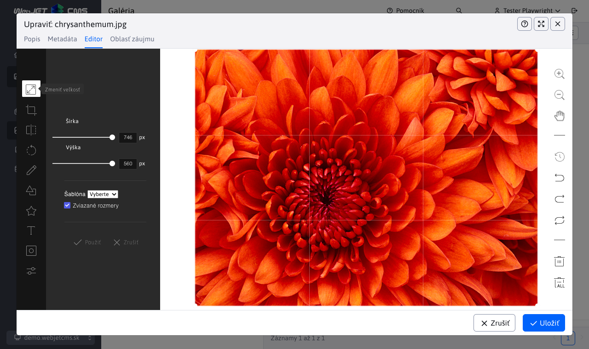
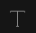
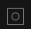
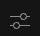

# Editor obrázkov

Editor obrázkov umožňuje priamo v prehliadači vykonať pokročilé úpravy obrázkov na serveri. Použitý je v galérii, je ale možné ho vyvolať pri editácii web stránky kliknutím na obrázok a následným kliknutím na ikonu editácie obrázka, alebo z prieskumníka pravým kliknutím na obrázok a zvolením možnosti Upraviť.

Dostupné sú nasledovné nástroje:

- , **Zmeniť veľkosť**: môžete upraviť veľkosť obrázka. Upozorňujeme, že predvolene je obrázok zobrazený na maximálnu veľkosť 1000 bodov na šírku, takže úprava rozmeru nemusí byť viditeľná, pretože obrázok môže byť reálne väčší ako zobrazená veľkosť.
  - Veľkosť je možné zmeniť na základe definovaných šablón veľkostí (ak opakovane potrebujete nastaviť presný rozmer obrázka). Zoznam možností sa nastavuje v konfiguračnej premennej `imageEditorSizeTemplates`, predvolene nastavené na hodnotu `80x80;640x480;800x600;`.
  - Možnosť zviazané rozmery zachová pomer strán, v prípade použitia šablóny sa nastaví šírka a výška sa dopočíta podľa pomeru strán aktuálneho obrázka.
- , **Orezať**: Po kliknutí na túto funkciu môžete orezať fotografiu v galérii.
  - Fotografia sa dá orezať do ľubovoľného obdĺžnika, alebo si môžete vybrať z preddefinovaných pomerov strán: štvorec, 3:2, 4:3, 5:4, 7:5, 16:9.
  - Pomery strán je možné definovať v konfiguračnej premennej `imageEditorRatio`, predvolene nastavené na hodnotu `3:2, 4:3, 5:4, 7:5, 16:9`.
- , **Prevrátiť**: Táto funkcia umožňuje prevrátiť fotografiu horizontálne (Prevrátiť X) alebo vertikálne (Prevrátiť Y), čím vytvoríte zrkadlový obraz.
- , **Otočiť**: V tejto funkcii môžete pomocou posuvníka vybrať hodnotu v stupňoch od -360 do 360, alebo využiť tlačidlá, ktoré rotujú fotografiu o 30 stupňov v smere alebo proti smeru hodinových ručičiek.
- , **Kresliť**: Táto funkcia vám umožňuje kresliť na fotografiu voľne alebo rovnú čiaru. Môžete si vybrať farbu a hrúbku čiary (rozsah).
- , **Tvar**: Pomocou tejto funkcie môžete pridávať na fotografiu rôzne tvary ako napríklad kruhy, obdĺžniky alebo trojuholníky. Farbu ťahu a výplne môžete meniť podľa potreby, pričom sa dá špecifikovať hrúbka ťahu. Vytvorené objekty je možné presúvať, zmenšovať, zväčšovať a rotovať, vrátane objektov vytvorených pomocou funkcie Kresliť.
- , **Ikona**: Funkcia Ikona umožňuje pridávať na fotografiu rôzne ikony a nálepky z preddefinovanej knižnice alebo vlastné nahrané ikony. Farbu môžete meniť podľa potreby. Vytvorené objekty je možné presúvať, zmenšovať, zväčšovať a rotovať.
- , **Text**: Pomocou tejto funkcie môžete pridávať text na fotografiu. Text môžete formátovať na tučný, kurzívu alebo podčiarknutý. Zvoliť sa dá farba a veľkosť.
- , **Maska**: Funkcia Maska umožňuje aplikovať rôzne masky na fotografiu, ktoré môžu slúžiť na skrytie alebo zvýraznenie častí fotografie.
- , **Filter**: Použitím tejto funkcie môžete aplikovať na fotografiu rôzne filtre, ktoré upravia jej vzhľad. Medzi filtre, z ktorých sa dá vyberať, patria: čiernobiely filter, sépia, rozmazanie, razenie, negatív, zaostrenie. Nastaviť viete odstránenie bielej, jas, šum, zrnitosť a filter farieb. Ďalej je možné nastaviť Tint, Multiply a Blend pre každú farbu.
    - **Tónovanie**: Umožňuje aplikovať na fotografiu farebný odtieň. Môžete nastaviť intenzitu farby pomocou opacity (priehľadnosti).
    - **Násobenie**: Tento efekt zvyšuje tmavosť obrazu kombinovaním farieb fotografie s farebnou vrstvou. Výsledná farba je vždy tmavšia.
    - **Miešanie**: Umožňuje kombinovať dve vrstvy obrazu pomocou rôznych režimov:
      - **Add**: Pridáva farby dvoch vrstiev. Výsledok je svetlejší.
      - **Diff**: Zobrazuje rozdiely medzi vrstvami.
      - **Subtract**: Odčítava farby jednej vrstvy od druhej. Výsledok je tmavší.
      - **Multiply**: Kombinuje farby vrstiev a vytvára tmavší výsledok.
      - **Screen**: Invertuje farby, vynásobí ich, a potom opäť invertuje. Výsledok je svetlejší.
      - **Lighten**: Zobrazuje svetlejšie farby z dvoch vrstiev.
      - **Darken**: Zobrazuje tmavšie farby z dvoch vrstiev.
