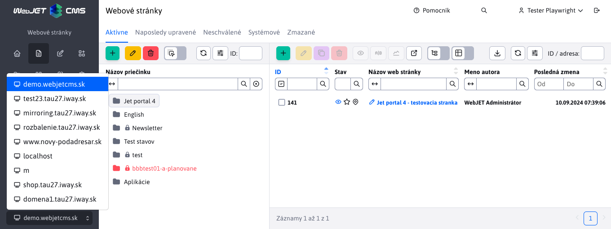
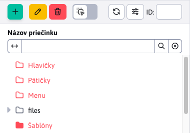
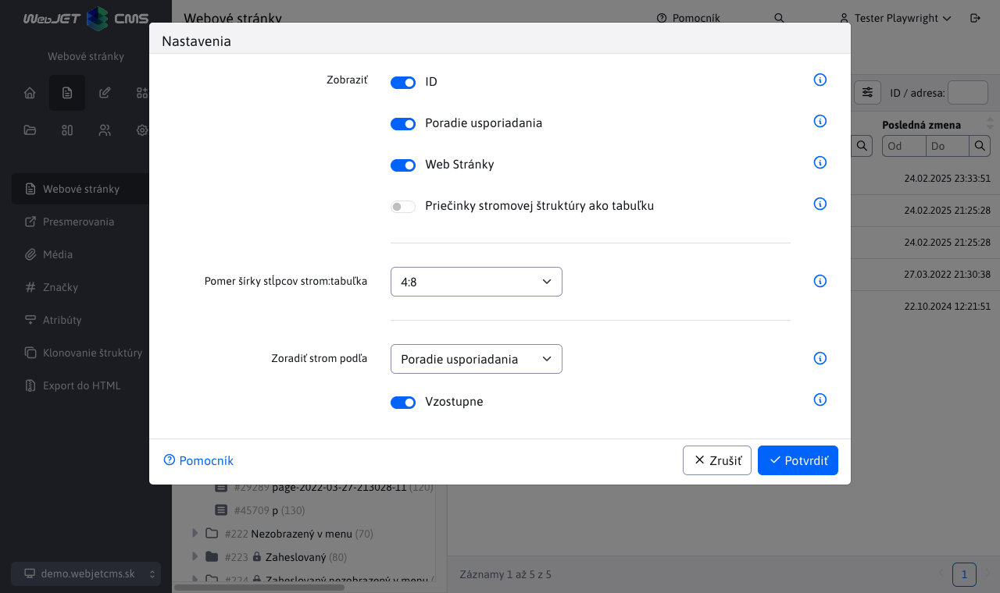

# Web stránky

## Základné ovládacie prvky

### Výber domény

Vo vrchnej časti sa pre viac doménové web sídla zobrazuje výber domény. V stromovej štruktúre stránok sa zobrazujú len priečinky so zvolenej domény a priečinky, ktoré nemajú doménu nastavenú.



### Zobrazenie priečinkov Systém a Kôš

Špeciálne priečinky Systém (obsahuje stránky potrebné pre šablónu ako hlavička a pätička) a Kôš (obsahuje zmazané stránky) sa zobrazujú v karte Systém alebo Kôš.

Zobrazenie v karte Systém je závislé od konfigurácie WebJETu:

- štandardne zobrazí obsah priečinka ```/System``` (globálny priečinok pre všetky domény)
- ak je zapnutý režim **lokálneho Systém priečinka** (nastavená konfiguračná premenná ```templatesUseDomainLocalSystemFolder``` na ```true```) a pre aktuálne zvolenú doménu existuje lokálny System priečinok zobrazí jeho obsah
- ak je zapnutý režim hľadania Systém priečinka **rekurzívne v stromovej štruktúre** (nastavená konfiguračná premenná ```templatesUseRecursiveSystemFolder``` na ```true```) zobrazí priečinkovú štruktúru obsahujúcu priečinok System

Okrem Systém priečinka sa v tejto karte zobrazuje aj priečinok `/files` s plno textovým indexom pre vyhľadávanie v súboroch (ak je plno textové vyhľadávanie aktívne). V tomto priečinku sa nachádzajú texty získané zo súborov, pričom text sa používa pri vyhľadávaní v súboroch.

V karte Kôš sa zobrazuje obsah priečinka ```/System/Kôš```.

Tieto priečinky sa nezobrazujú v karte Priečinky (sú filtrované), ak ale z nejakého dôvodu potrebujete vidieť presnú stromovú štruktúru bez filtrovania, kliknite na kartu Priečinky so stlačenou klávesou `shift`. V takom prípade sa vypne filtrovanie a zobrazia sa všetky priečinky v aktuálne zvolenej doméne a priečinky, ktoré doménu nemajú nastavenú.



### Zapamätanie naposledy otvoreného priečinka

Zoznam web stránok si vrámci jedného prihlásenia pamätá naposledy otvorený priečinok, pri návrate na zoznam web stránok sa priečinok znova otvorí. Zapamätanie priečinka sa zmaže pri prepnutí domény, alebo pri zadaní adresy ```/admin/v9/webpages/web-pages-list/?groupid=0```, čiže adresa stránky s parametrom ```groupid=0```.

Zároveň pri prechádzaní stromovej štruktúry sa v adresnom riadku prehliadača zobrazuje adresa stránky s parametrom ```groupid```, ktorý reprezentuje ID priečinka. Pri obnove stránky, alebo zaslaní odkazu, sa otvorí priečinková štruktúra podľa ID v adresnom riadku. Na úvodnej stránke si môžete do bloku Záložky [pridať adresu stránky aj s ID priečinka](https://youtu.be/G5Ts04jSMX8) a vytvoriť tak na úvodnej stránke odkaz do vnorenej priečinkovej štruktúry.

### Karty web stránok

V pravej sekcii je možné zobraziť nasledovné karty:

- ```Web stránky``` - zobrazuje štandardný zoznam web stránok vo vybranom priečinku v stromovej štruktúre.
- ```Naposledy upravené``` - zobrazuje zoznam vašich posledne upravených stránok.
- ```Čakajúce na schválenie``` - ak schvaľujete zmeny vo web stránkach zobrazia sa v tejto karte stránky, ktoré čakajú na vaše schválenie.
- ```Priečinky``` - prepne zobrazenie zo zoznamu web stránok na zoznam priečinkov. Kliknutím na priečinok v stromovej štruktúre sa zobrazí zvolený priečinok a jeho pod priečinky. Ak označíte v stromovej štruktúre viaceré priečinky (napr. pomocou stlačenia klávesy CTRL) zobrazia sa označené priečinky. Tabuľkové zobrazenie priečinkov umožňuje napr. vykonávať hromadné operácie s priečinkami (napr. zmena šablóny), použiť funkciu Úprava bunky alebo funkciu Duplikovať. **Upozornenie**: zobrazenie priečinkov musíte najskôr zapnúť v [nastavenia zobrazenia stromovej štruktúry](#nastavenie-zobrazenia-stromovej-štruktúry).


### Zobraziť stránky aj z podadresárov

V prípade potreby môžete zobraziť web stránky aj z podadresárov prepnutím prepínača **Zobraziť stránky aj z podadresárov** v hlavičke datatabuľky. Po prepnutí do režimu zobrazenia stránok z podadresárov sa zobrazia stránky z aktuálne zvoleného adresára v stromovej štruktúre vrátane jeho podadresárov. V stromovej štruktúre môžete kliknúť na iný adresár, čo znova spôsobí zobrazenie stránok z vybraného adresára a jeho podadresárov.

V nastavení tabuľky si môžete zapnúť zobrazenie stĺpca **Nadradený priečinok** v ktorom budete vidieť adresár v ktorom sa stránka nachádza.


### Obnovenie web stránok a adresárov z koša

Zoznam web stránok ponúka taktiež špeciálnu ikonu  na obnovenie web stránky alebo celého priečinka z koša. Tieto ikony sa zobrazujú iba za špecifických okolností. Bližšie objasnená logika sa nachádza v sekcii [Obnovenie web stránok a priečinkov z koša](./recover.md)

### Špeciálne ikony

Data tabuľka v zozname stránok obsahuje nasledovné špeciálne ikony:

- <i class="far fa-eye fa-btn" role="presentation"></i> - Zobraz stránku - po označení jedného alebo viacerých riadkov a kliknutí na ikonu sa otvorí v novom okne/karte zvolená web stránka.
- <i class="fas fa-restroom fa-btn" role="presentation"></i> - Uložiť ako AB test - vytvorí B verziu stránky pre [AB testovanie](../apps/abtesting/README.md).
- <i class="far fa-chart-line fa-btn" role="presentation"></i> - Štatistika stránky - zobrazí [návštevnosť](../apps/stat/README.md) označenej web stránky.
- <i class="far fa-link-slash fa-btn" role="presentation"></i> - Kontrola odkazov a prázdnych stránok - skontroluje [platnosť odkazov](linkcheck.md) v stránkach v aktuálnom priečinku a podpriečinkoch, zobrazí stránky, ktoré nemajú zadaný žiaden text.
-  - Zobraziť stránky aj z podadresárov - prepnutím prepínača do zapnutej polohy zobrazíte v tabuľke aj web stránky z podadresárov

### Ikony a farby v stromovej štruktúre a zozname stránok

V stromovej štruktúre priečinkov a stránok sa môžu zobraziť nasledovné typy ikon a farieb:

- <i class="fas fa-folder" role="presentation"></i> plná ikonka priečinku = priečinok je zobrazený v menu
- <i class="far fa-folder" role="presentation"></i> prázdna ikonka priečinku = nie je nezobrazený v menu
- <i class="fas fa-map-marker-alt" role="presentation"></i> stránka je zobrazená v menu
- <i class="far fa-map-marker-alt-slash" role="presentation"></i> stránka nie je zobrazená v menu
- <i class="fas fa-folder-times" role="presentation"></i> nemáte práva na editáciu/zmazanie priečinku, v tomto priečinku nebudete vidieť ani žiaden zoznam web stránok (aj keď priečinok v skutočnosti web stránky obsahuje). Používa sa v prípade, keď máte povolené práva len na niektorý z podpriečinkov.
- <i class="fas fa-lock" role="presentation"></i> zámok = dostupné len pre prihláseného návštevníka
- <span style="color: #FF4B58">červená farba</span> = nedostupné pre verejnosť (interný adresár) alebo stránka s vypnutým zobrazením
- <i class="fas fa-star"></i>, **tučné písmo** = hlavná stránka adresára
- <i class="fas fa-external-link-alt"></i> šípka von = stránka je presmerovaná
- <i class="fas fa-eye-slash"></i> preškrtnuté oko = stránka sa nedá vyhľadať
- <i class="fas fa-restroom"></i> B variant stránky pre aplikáciu [AB testovanie](../apps/abtesting/README.md)

## Nastavenie zobrazenia stromovej štruktúry

V prípade potreby môžete v stromovej štruktúre kliknutím na ikonu <i class="far fa-wrench"></i> Nastavenia zobraziť dialógové okno nastavení:

- ```ID``` - Pred názvom zobrazí aj ID adresára vo forme #ID. Zobrazenie je vhodné, ak potrebujete manuálne do niektorej aplikácie zadať ID priečinka, alebo migrujete stránky medzi prostrediami a potrebujete rýchlo skontrolovať nastavenie vložených aplikácií.
- ```Poradie usporiadania``` - Za názvom zobrazí poradie usporiadania vo forme (poradie).
- ```Web Stránky``` - Zobrazí v stromovej štruktúre aj web stránky. **Upozornenie:** znižuje výkon a rýchlosť načítania údajov. Možnosť odporúčame zapnúť len ak potrebujete presúvať web stránky pomocou funkcie ```Drag&Drop```.
- ```Priečinky stromovej štruktúry ako tabuľku``` - Zobrazí kartu Priečinky v datatabuľke. Umožňuje používať funkcie datatabuľky ako hromadné operácie, duplikovať, úprava bunky atď. s priečinkami stromovej štruktúry.
- ```Pomer šírky stĺpcov strom:tabuľka``` - Nastaví pomer šírky stĺpcov zobrazenej stromovej štruktúry a datatabuľky pre lepšie využitie šírky monitora. Štandardný pomer je 4:8. Upozornenie: pri niektorých pomeroch a nevhodnej veľkosti monitora môže dôjsť k nesprávnemu zobrazeniu nástrojovej lišty/tlačidiel.

