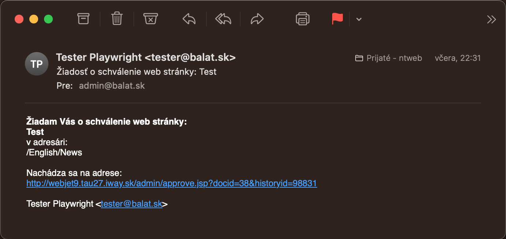
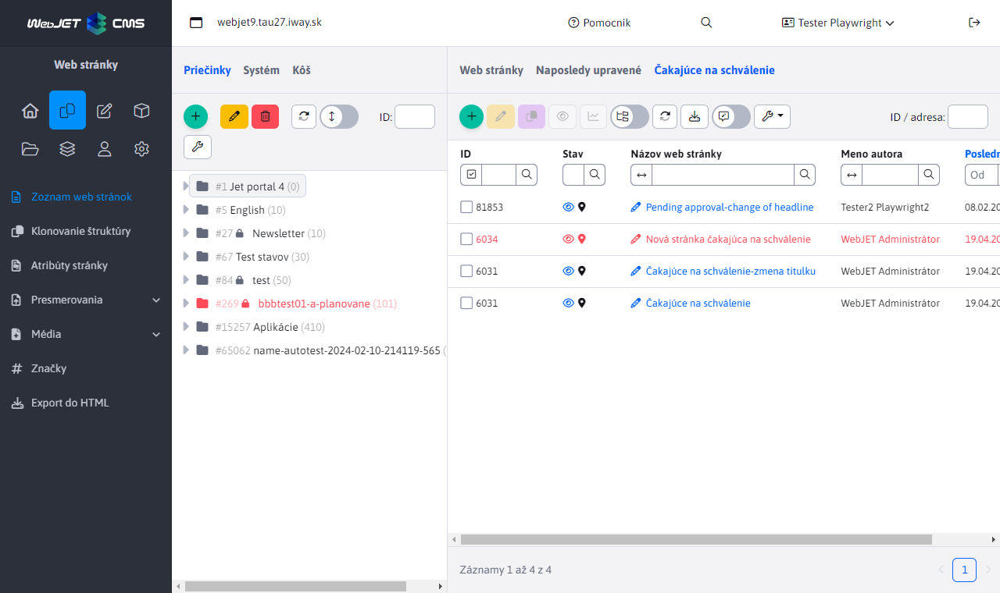

# Schvaľovanie zmien

WebJET umožňuje režim, v ktorom sú zmeny na web stránke pred publikovaním na verejnú časť schvaľované definovanými používateľmi.

Stránka sa na webe zobrazí až po jej schválení, pričom o schválení je notifikovaný aj autor stránky. Ak schvaľovateľ stránku neschváli, autor stránky bude notifikovaný emailom, ktorý obsahuje aj pripomienky k stránke. Po zapracovaní pripomienok môže znova požiadať o schválenie.

Podobne funguje aj proces zmazania, ak používateľ zmaže stránku odošle sa žiadosť schvaľovateľovi a stránka sa naďalej zobrazuje. Až po schválení zmazania sa stránka zmaže (presunie do koša).

## Nastavenie schvaľovania

Schvaľovanie sa nastavuje v sekcii Používatelia. Kliknutím na meno schvaľovateľa sa zobrazí okno s nastaveniami používateľa.

V karte Schvaľovanie sa definuje proces schvaľovania zmien stránok. Ak administrátorovi nastavíte určitý adresár na schvaľovanie a nejaký iný administrátor v tomto adresári publikuje stránku, tak táto zmena/stránka sa neobjaví hneď na verejnom web sídle, ale zostane čakať na schválenie. Schvaľovateľovi príde žiadosť o schválenie emailom. Ak daný adresár schvaľuje viacero administrátorov, príde email všetkým, pričom ak niektorý z nich stránku schváli, systém nedovolí inému administrátorovi stránku schváliť znova (zobrazí sa mu informácia, že stránka je už schválená).

Kliknutím na tlačidlo Pridať sa otvorí okno, v ktorom môžete vybrať adresár pre schvaľovanie. V poli Akcia môžete nastaviť nasledovné možnosti:

- Schválenie - zašle sa email so žiadosťou o schválenie
- Notifikácia - používateľovi sa zašle email s notifikáciou o zmene stránky. Ak je na daný adresár nastavené aj schvaľovanie, notifikácia sa pošle až po schválení stránky. Táto akcia je užitočná, ak nepožadujete, aby sa stránky museli schvaľovať, ale aj tak chcete byť informovaný o všetkých zmenách, ktoré sa na stránkach udejú.
- Žiadna - nevykoná sa žiadna akcia. Používa sa to, ak je v systéme definovaných viacero zodpovedných administrátorov, pričom len jeden schvaľuje zmeny bežných používateľov. Ak by iný zodpovedný administrátor vykonal nejakú zmenu, musel by mu ju iný administrátor schváliť. To je niekedy neželané, preto treba ostatným zodpovedným administrátorom nastaviť adresár na schvaľovanie s režimom Žiadna, aby v ňom mohli vykonávať zmeny bez potreby schvaľovania.
- Schválenie - druhá úroveň - druho úrovňové schvaľovanie. Zašle sa email so žiadosťou o schválenie po schválení prvým stupňom (používateľom ktorý má nastavenú možnosť schválenie).

Schvaľovatelia sa vyhľadávajú v stromovej štruktúre smerom od priečinka v ktorom nastala zmena ku koreňovému priečinku. Prvý priečinok s definovaným schvaľovateľom sa použije. Môžete tak definovať rôznych schvaľovateľov pre pod priečinky (napr. Produkty, Novinky) a zároveň pre všetky ostatné priečinky definovať schvaľovateľa pre koreňový priečinok. Ak nastane zmena v Produkty/WebJET CMS použije sa schvaľovateľ pre priečinok Produkty, ak nastane zmena v Kontakty použije sa schvaľovateľ pre koreňový priečinok.

## Proces schvaľovania

Pri zmene v sekcii, ktorá sa schvaľuje sa odošle email schvaľovateľovi s odkazom na schválenie/zamietnutie zmeny.

Stránky na schválenie sa zobrazujú schvaľovateľom aj v sekcii Web stránky v karte Čakajúce na schválenie.

Kliknutím na odkaz v emaile alebo na názov stránky v karte Čakajúce na schválenie sa zobrazí porovnanie aktuálnej a zmenenej stránky s formulárom na schválenie alebo zamietnutie zmeny. Text zadaný do poľa Komentár sa odošle emailom autorovi stránky. Zadajte tam vaše pripomienky pri neschválení zmeny.

