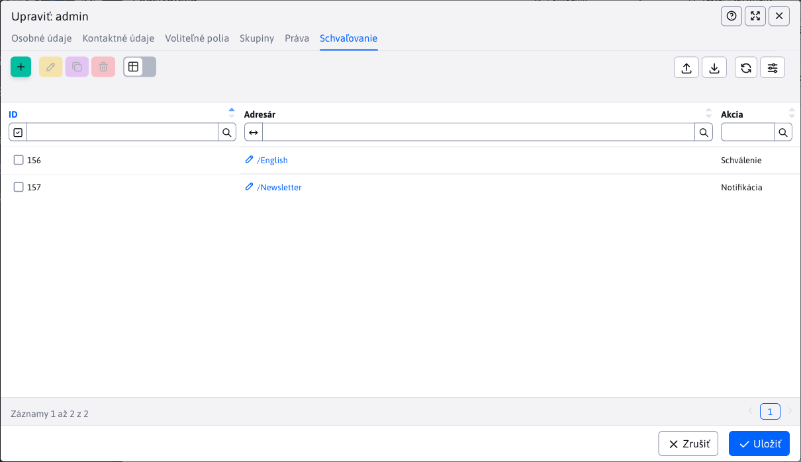
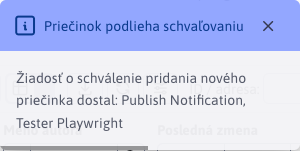
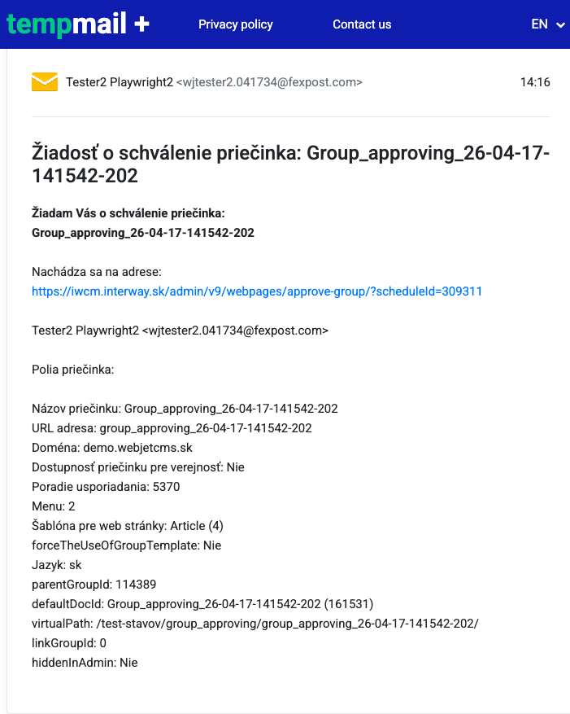
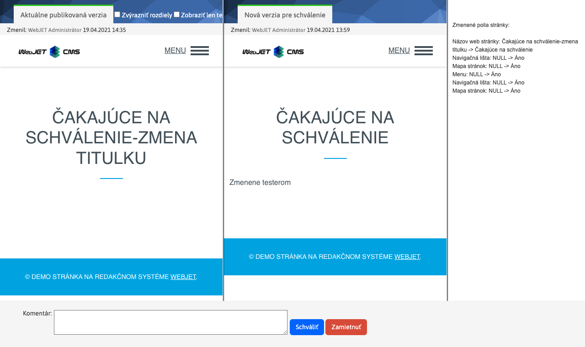
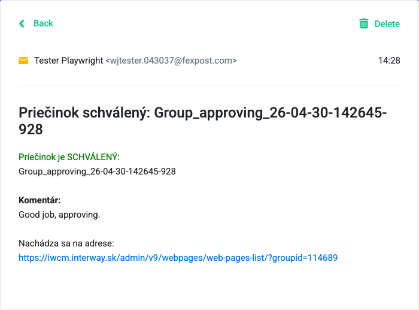
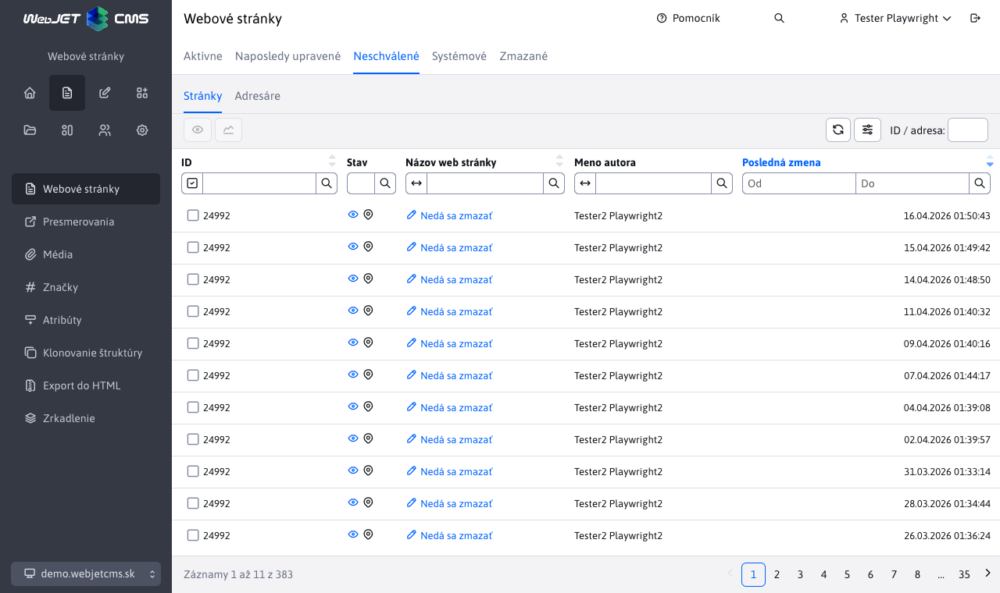
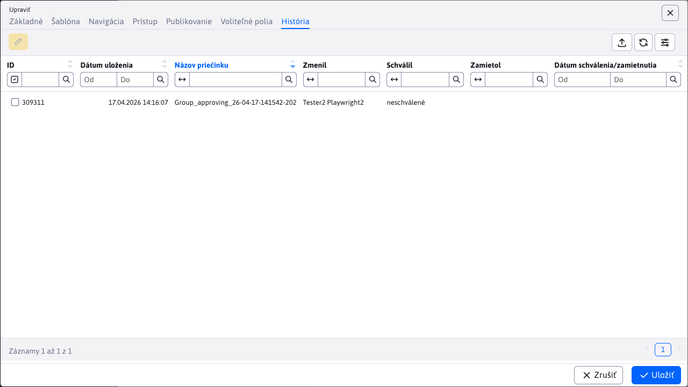

# Schvaľovanie zmien

WebJET CMS umožňuje režim, v ktorom sú zmeny na webovej stránke pred publikovaním na verejnú časť schvaľované definovanými používateľmi. Tento mechanizmus zabezpečuje kontrolu kvality obsahu a zabraňuje publikovaniu neodsúhlasených zmien.

Stránka sa na webe zobrazí až po jej schválení, pričom o výsledku schválenia je autor stránky notifikovaný emailom. Ak schvaľovateľ stránku neschváli, autor stránky obdrží email s pripomienkami k stránke. Po zapracovaní pripomienok môže autor znova požiadať o schválenie.

Podobne funguje aj proces zmazania. Ak používateľ zmaže stránku, odošle sa žiadosť schvaľovateľovi a stránka sa naďalej zobrazuje na verejnej časti webu. Až po schválení zmazania sa stránka skutočne zmaže (presunie do koša).

## Nastavenie schvaľovania

Schvaľovanie sa nastavuje v sekcii **Používatelia**. Kliknutím na meno schvaľovateľa sa zobrazí okno s nastaveniami používateľa, kde prejdite na kartu **Schvaľovanie**.

V karte **Schvaľovanie** sa definuje proces schvaľovania zmien stránok a priečinkov. Ak administrátorovi nastavíte určitý adresár na schvaľovanie a iný administrátor v tomto adresári publikuje stránku, zmena sa neobjaví okamžite na verejnom webovom sídle, ale zostane čakať na schválenie. Schvaľovateľovi príde žiadosť o schválenie emailom. Ak daný adresár schvaľuje viacero administrátorov, email príde všetkým, pričom ak niektorý z nich stránku schváli, systém nedovolí inému administrátorovi stránku schváliť znova (zobrazí sa mu informácia, že stránka je už schválená).

### Pridanie priečinka na schvaľovanie

Kliknutím na tlačidlo **Pridať** sa otvorí okno, v ktorom vyberte adresár pre schvaľovanie. V poli **Akcia** je možné nastaviť nasledovné možnosti:

- **Schválenie** - zašle sa email so žiadosťou o schválenie. Zmena sa neprejaví, kým schvaľovateľ zmenu neschváli.
- **Notifikácia** - používateľovi sa zašle email s notifikáciou o zmene stránky. Ak je na daný adresár nastavené aj schvaľovanie, notifikácia sa pošle až po schválení stránky. Táto akcia je užitočná, ak nepožadujete, aby sa stránky museli schvaľovať, ale chcete byť informovaný o všetkých zmenách, ktoré sa na stránkach udejú.
- **Žiadna** - nevykoná sa žiadna akcia. Používa sa v prípade, ak je v systéme definovaných viacero zodpovedných administrátorov, pričom len jeden schvaľuje zmeny bežných používateľov. Ak by iný zodpovedný administrátor vykonal zmenu, musel by mu ju iný administrátor schváliť. To je niekedy neželané, preto treba ostatným zodpovedným administrátorom nastaviť adresár na schvaľovanie s režimom **Žiadna**, aby v ňom mohli vykonávať zmeny bez potreby schvaľovania.
- **Schválenie - druhá úroveň** - druho-úrovňové schvaľovanie. Žiadosť o schválenie sa zašle až po schválení prvým stupňom (používateľom, ktorý má nastavenú akciu **Schválenie**).

### Vyhľadávanie schvaľovateľov v stromovej štruktúre

Schvaľovatelia sa vyhľadávajú v stromovej štruktúre smerom od priečinka, v ktorom nastala zmena, ku koreňovému priečinku. Použije sa prvý priečinok s definovaným schvaľovateľom. Môžete tak definovať rôznych schvaľovateľov pre podpriečinky (napr. Produkty, Novinky) a zároveň pre všetky ostatné priečinky definovať schvaľovateľa pre koreňový priečinok.

**Príklad:** Ak nastane zmena v priečinku `Produkty/WebJET CMS`, použije sa schvaľovateľ definovaný pre priečinok `Produkty`. Ak nastane zmena v priečinku `Kontakty`, použije sa schvaľovateľ definovaný pre koreňový priečinok.

## Proces schvaľovania

Ak nastane zmena v priečinku (alebo podpriečinku), ktorý podlieha schvaľovaniu, systém overuje, či aktuálne prihlásený používateľ je schvaľovateľ daného priečinka. Ak je schvaľovateľom, zmena sa **automaticky** schváli a okamžite sa aplikuje. Ak nie je schvaľovateľom, zmena sa **neaplikuje** a čaká na schválenie.

### Podporované operácie

Proces schvaľovania sa vzťahuje na nasledovné operácie:

- **Vytvorenie** nového priečinka alebo stránky
- **Úprava** existujúceho priečinka alebo stránky
- **Zmazanie** priečinka alebo stránky

!>**Upozornenie:** Akcia **obnovenia** priečinka/stránky z koša do priečinka, ktorý podlieha schvaľovaniu, nepodlieha procesu schvaľovania. Obnovenie do takéhoto priečinka môže vykonať iba schvaľovateľ. Ak používateľ bez oprávnenia schvaľovateľa skúsi obnoviť položku, zobrazí sa upozornenie, že nemá právo obnoviť do tohto priečinka a akcia sa nevykoná.

### Priebeh procesu schvaľovania

**1. Notifikácia o čakaní na schválenie**

Po vykonaní zmeny sa autorovi zobrazí notifikácia o tom, že zmena čaká na schválenie, vrátane informácie, komu bola odoslaná žiadosť o schválenie (môže to byť aj viacero schvaľovateľov).

**2. Email so žiadosťou o schválenie**

Schvaľovateľovi sa zašle email so žiadosťou o schválenie. Email obsahuje detaily o zmene a odkaz na stránku schvaľovania. Platí to pre akcie nad priečinkami aj stránkami v daných priečinkoch.

**3. Stránka schvaľovania**

Schvaľovateľ použije odkaz v emaile, aby sa dostal na stránku schvaľovania. Na tejto stránke môže skontrolovať detaily zmeny, pridať komentár a zmenu **schváliť** alebo **zamietnuť**.

Pri schvaľovaní stránok sa zobrazuje porovnanie aktuálne publikovanej verzie a novej verzie čakajúcej na schválenie. Schvaľovateľ môže zvýrazniť rozdiely medzi verziami, čím získa prehľadný náhľad na vykonané zmeny. V pravej časti sa zobrazuje zoznam zmenených polí stránky.

**4. Notifikačný email o výsledku**

Po schválení alebo zamietnutí sa autorovi odošle informačný email o výsledku schválenia s prípadnými pripomienkami.

Počas celého procesu schvaľovania systém overuje, či používateľ má na danú akciu oprávnenia a či priečinok/stránka neboli medzičasom schválené iným schvaľovateľom, aby sa zabránilo duplicitnému schváleniu.

## Schvaľovanie priečinkov

Ak je pre daný adresár nastavený schvaľovateľ, zmeny v adresári sa neprejavia okamžite, ale čakajú na schválenie.

### Vytvorenie priečinka

Pri vytváraní nového adresára sa priečinok vytvorí ako **Nedostupný** (interný) a čaká na schválenie. Ak je nastavená možnosť generovania predvolenej stránky, vytvorená stránka sa pred-nastaví s vypnutým zobrazením. Odosiela sa **iba** žiadosť o schválenie vytvorenia adresára - stránka sa schváli alebo zamietne spolu s adresárom.

Po **schválení** sa priečinok automaticky nastaví ako dostupný a predvolená stránka sa nastaví ako zobrazená.
Po **zamietnutí** sa priečinok ani stránka nevymažú, iba zostanú nedostupné/skryté.

### Úprava priečinka

Pri úprave existujúceho adresára (napr. zmena názvu, šablóny, URL adresy a pod.) sa zmenená verzia priečinka uloží ako **historická** verzia, ktorá čaká na schválenie. Pôvodný priečinok zostane nezmenený, kým schvaľovateľ zmenu neschváli.

Po **schválení** sa zmeny aplikujú a historická verzia sa stane aktuálnou verziou.
Po **zamietnutí** sa zmeny neaplikujú a historická verzia ostane v karte **História** ako neschválená verzia.

### Zmazanie priečinka

Pri zmazaní adresára, ktorý podlieha schvaľovaniu, sa adresár nezmaže okamžite. Vytvorí sa historická verzia s prefixom `[DELETE]` v názve priečinka, aby bolo jednoznačné, že ide o žiadosť o zmazanie.

Po **schválení** sa priečinok presunie do koša.
Po **zamietnutí** sa žiadosť o zmazanie zahodí a priečinok zostane nezmenený.

## Schvaľovanie stránok

Ak je pre daný adresár nastavený schvaľovateľ, zmeny stránok v adresári sa neprejavia okamžite, ale čakajú na schválenie. Zmenená verzia stránky sa uloží ako historická verzia a pôvodná publikovaná stránka zostane nezmenená.

### Vytvorenie stránky

Pri vytvorení novej stránky v adresári, ktorý podlieha schvaľovaniu, sa stránka uloží ako nepublikovaná a čaká na schválenie. Schvaľovateľovi sa zašle email so žiadosťou o schválenie.

Po **schválení** sa stránka automaticky publikuje.
Po **zamietnutí** sa stránka nepublikuje a autorovi sa zašle email s prípadnými pripomienkami.

### Úprava stránky

Pri úprave existujúcej stránky sa zmenená verzia uloží ako **historická** verzia, ktorá čaká na schválenie. Pôvodná publikovaná verzia stránky zostane nezmenená, kým schvaľovateľ zmenu neschváli. Schvaľovateľovi sa zašle email s porovnaním zmien oproti aktuálne publikovanej verzii.

Po **schválení** sa zmeny aplikujú a historická verzia sa stane aktuálnou publikovanou verziou.
Po **zamietnutí** sa zmeny neaplikujú a historická verzia ostane v karte **História** ako neschválená verzia.

### Zmazanie stránky

Pri zmazaní stránky v adresári, ktorý podlieha schvaľovaniu, sa stránka nezmaže okamžite. Vytvorí sa historická verzia s prefixom `[DELETE]` v názve stránky. Stránka zostane naďalej publikovaná, kým schvaľovateľ neschváli jej zmazanie.

Po **schválení** sa stránka presunie do koša.
Po **zamietnutí** sa žiadosť o zmazanie zahodí a stránka zostane publikovaná.

## Zobrazenie priečinkov/stránok čakajúcich na schválenie

Priečinky/stránky čakajúce na schválenie sa zobrazujú na dvoch miestach:

- V karte **Neschválené** - zobrazí sa iba aktuálna neschválené verzie priečinok/stránok (podľa pod-karty **Stránky** / **Adresáre**), bez histórie neschválených verzií.

- V detaile priečinka/stránky v karte **História** - historické verzie čakajúce na schválenie sú zobrazené spolu s informáciami o stave schválenia, kto ich schváli/zamietol a kedy.

