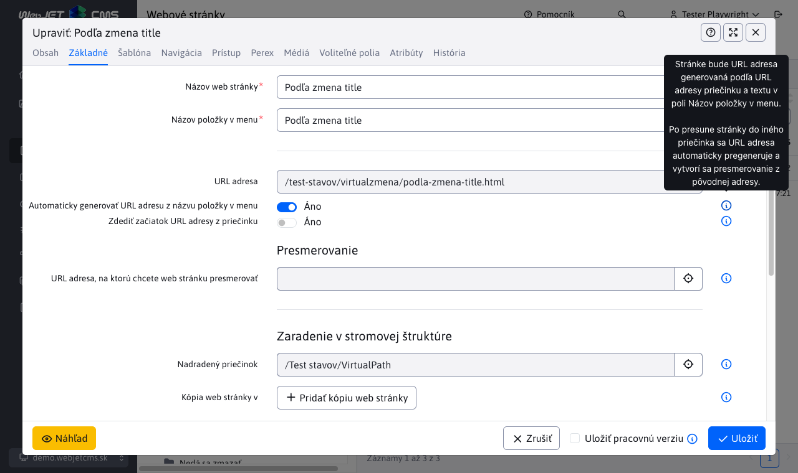
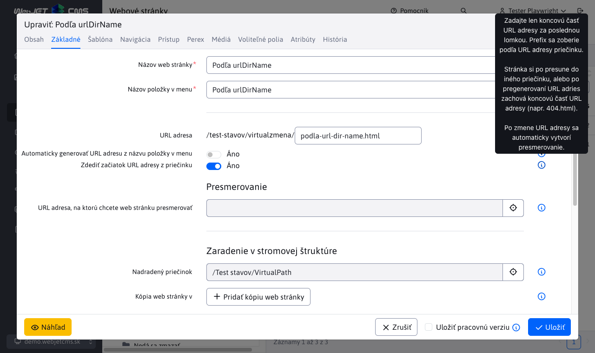
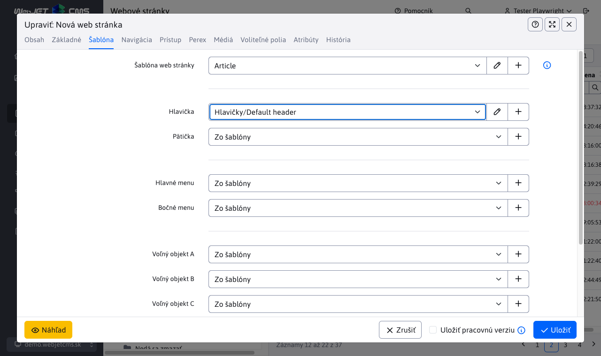
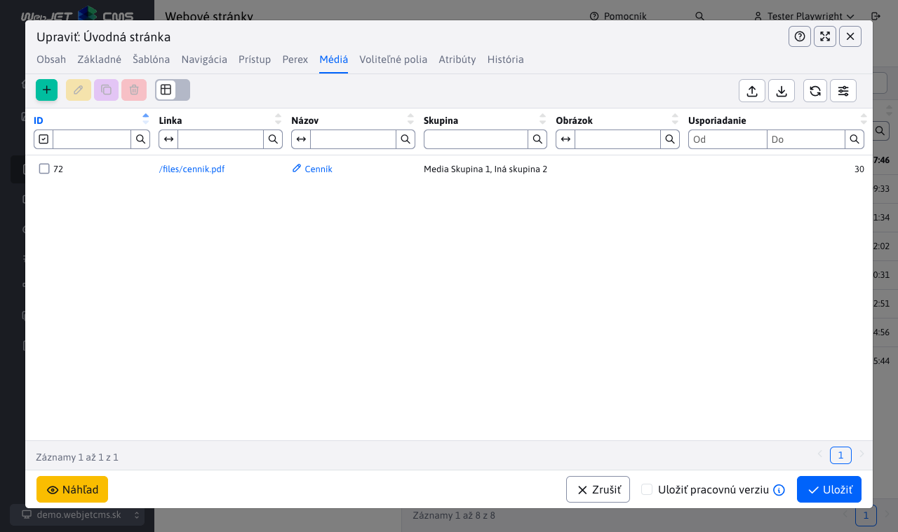
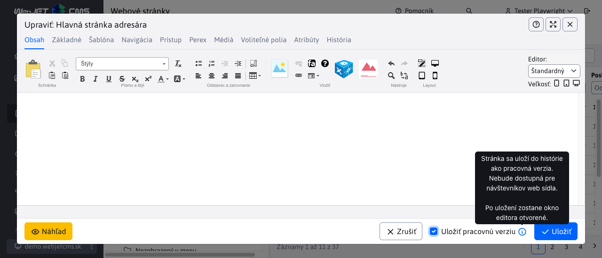
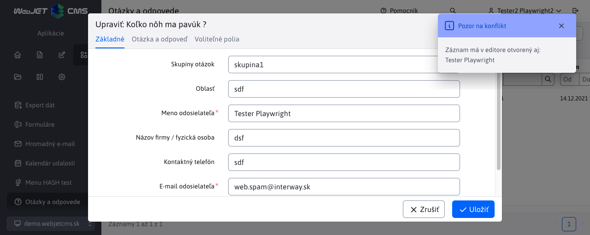

# Editácia web stránky

Editor web stránok je univerzálny nástroj na úpravu a tvorbu web stránok. Pri editácii existujúcej web stránky sa vám do hlavného okna editora načíta obsah uloženej web stránky. Pri tvorbe novej stránky je okno editora prázdne a vy môžete začať s písaním jej obsahu.

Ak idete vytvoriť novú web stránku, najprv sa musíte nastaviť do správneho adresára, v ktorom sa má web stránka nachádzať a následne kliknutím na ikonu "Pridať" sa vám zobrazí okno editora.

## Karta obsah

V karte „Obsah“ je možné upravovať obsahovú časť samotnej web stránky. Editácia stránok ponúka štandardné funkcie úpravy obsahu dokumentov podobné funkciám bežne používaných v aplikáciách MS Word a Excel. Väčšina príkazov je prístupná pomocou formátovacích tlačidiel z nástrojovej lišty editora. Kontextové funkcie sú prístupné po kliknutí pravým tlačítkom myši nad príslušným objektom stránky, napr. obrázkom, tabuľkou, označeným blokom textu a pod.

Dostupné sú viaceré typy editorov podľa nastavenia skupiny šablón, alebo šablóny (pole Typ editora stránok). Aktuálne sú podporované nasledovné typy editorov:

- Štandardný - editor typu `WYSIWYG`, teda vizuálny editor v ktorom to čo vidíte na obrazovke sa aj uloží. Práca je podobná práci v MS Word, kedy viete jednoducho označiť text, nastaviť tučné písmo, vkladať obrázky atď.
- HTML editor - pri otvorení sa zobrazí HTML kód stránky. Je určený pre špeciálne stránky, ktorých kód by bol pokazený pri editore typu `WYSIWYG`, napr. stránky pre hromadný email, ktoré obsahujú celý HTML kód vrátane hlavičky a pätičky. Kód je v takomto prípade typicky dodaný z externej agentúry a je len vložený do stránky bez potreby jeho zmien.
- Page Builder - režim skladania web stránky z [pripravených blokov](pagebuilder.md), umožňuje jednoducho bloky upravovať, pridávať, presúvať poradie atď. Je určený na vytváranie komplexných web stránok.

## Karta základné

Najdôležitejším parametrom každej web stránky je jej titulok (nadpis). Titulok sa zadáva do textového poľa v karte Základné. Pokiaľ vytvárate novú web stránku v prázdnom priečinku, tak si systém automaticky preberie titulok z názvu tohto priečinka. V opačnom prípade je tam pri vytvorení novej web stránky text "Nová web stránka", ktorý samozrejme musíte zmeniť na zmysluplný názov definujúci obsah web stránky. Titulok sa zadáva normálne s diakritikou aj medzerami ako obyčajný text.

Hlavná stránka priečinka má štandardne synchronizovaný [názov web stránky s názvom priečinku](group.md#synchronizácia-názvu-priečinka-a-web-stránky).


Každá stránka, ktorá má byť verejne zobraziteľná na web sídle musí mať zadané „Áno“ v časti  **Zobrazovať**. Pokiaľ nemá takéto nastavenie, je pre návštevníka nedostupná. Dostupná bude len pre prihláseného administrátora, aby počas tvorby web stránky videl ako bude skutočne vyzerať.

### Zaradenie v stromovej štruktúre

Web stránku môžete uložiť do **viacerých priečinkov**, ktorých zoznam je v sekcii Zaradenie v stromovej štruktúre. Hlavný priečinok je označený ako Nadradený priečinok, dodatočné sú v časti Kópia web stránky v. Technicky vzniknú kópie web stránky vo všetkých zvolených priečinkoch. Pri uložení ľubovoľnej stránky sa skopírujú všetky údaje do ostatných kópií web stránky okrem:

- URL adresa - stránke a jej kópiám je možné URL adresu v prípade potreby modifikovať (ak nie je zvolená možnosť Automaticky generovať URL adresu z názvu položky v menu)
- Poradie usporiadania - v prípade potreby môžete kópii stránky nastaviť vhodné poradie usporiadania

V prípade, ak **vymažete kópiu web stránky** tak bude presunutá do koša. Kým bude táto kópia v koši, tak originálna stránka z nadradeného priečinka bude mať pri editácii zmenenú adresu priečinku kópie na kôš. Samozrejme, môžete ďalej pridávať ďalšie kópie a to aj do priečinku, odkiaľ sme vymazali tu prvú kópiu. Vymazané kópie web stránky sa po permanentnom vymazaní z koša už naďalej nebudú zobrazovať ako existujúca kópia pri editácii originálnej stránky.

V prípade, ak **vymažete originálnu web stránku** z nadradeného priečinka, tá sa presunie do koša bez toho, aby to ovplyvnilo už existujúce kópie tejto stránky. Upozorňujeme ale, že pri editácii stránky bude mať vypnutý atribút Zobrazovať, ktorý samozrejme môžete znova zapnúť pre zobrazovanie stránok. Po permanentnom **vymazaní originálnej** web stránky z koša sa **permanentne vymažú všetky jej kópie**. To znamená, že tieto kópie už nebudú naďalej dostupné (ani v koši) a nebudú sa dať obnoviť.

### URL adresa

V poli URL adresa nastavujete adresu web stránky na internete (časť za doménovým menom), napr. ```/produkty/webjet-cms/funkcie.html```.

Pole sa **pri uložení novej web stránky automaticky vyplní** podľa URL adresy priečinku a poľa Názov položky v menu, nemusíte ho manuálne vypĺňať.

Z pohľadu optimalizácie pre vyhľadávače by URL adresa stránky mala obsahovať kľúčové slová. Tie ale musia byť ideálne aj v titulku stránky, nadpisoch a v texte stránky.

Ak URL adresu stránky zmeníte, automaticky sa vytvorí presmerovanie v aplikácii Presmerovania ciest. Ak iná stránka odkazuje na pôvodnú URL adresu bude presmerovaná na novú adresu stránky.

#### Automaticky generovať URL adresu z názvu položky v menu

Pri zvolení tejto možnosti sa bude URL adresa stránky automaticky meniť:

- pri zmene hodnoty poľa Názov položky v menu
- pri zmene hodnoty poľa URL adresa priečinku, v ktorom sa web stránka nachádza ale aj rodičovských priečinkov
- pri presune web stránky do iného priečinku

Pri zmene URL adresy stránky sa automaticky vytvorí presmerovanie v aplikácii Presmerovania ciest zo starej URL adresy na novú.



#### Zdediť začiatok URL adresy z adresára

Pri tejto voľbe môžete zadať koncovú URL web stránky, pričom jej začiatok sa prevezme z rodičovských adresárov. Je to vhodné, ak potrebujete aby stránka mala vždy rovnaké koncové URL, napríklad ```404.html``` alebo ```cta.html```.

Hodnota URL adresy sa bude meniť pri:

- pri zmene hodnoty poľa URL adresa priečinku, v ktorom sa web stránka nachádza ale aj rodičovských priečinkov
- pri presune web stránky do iného priečinku

pričom ako je napísané vyššie koncová časť sa preberie podľa zadanej hodnoty.

Pri zmene URL adresy stránky sa automaticky vytvorí presmerovanie v aplikácii Presmerovania ciest zo starej URL adresy na novú.



### Poznámka redaktora

V karte Základne je pole Poznámka redaktora. Zadaný text sa zobrazí v hornej časti editora ako upozornenie pre všetkých redaktorov/administrátorov pri editácii danej web stránky. Jedná sa o interný atribút, ktorý sa nezobrazuje vo verejnej časti web sídla. Poznámka sa neukladá do histórie stránky, je vždy aktualizovaná zadanou/aktuálnou hodnotou.

Umožňuje zobrazovať informácie ako: **Upozornenie: na stránku vedie odkaz z VOP, nikdy nemeňte adresu stránky**.

## Správa viacerých domén

Ak je WebJET [nastavený na správu viacerých domén](../../frontend/setup/README.md#správa-viacerých-domén) tak v karte Základne sa pre priečinky v koreňovom priečinku zobrazuje pole Doména.

### Vytvorenie novej domény

Ak potrebujete vytvoriť novú doménu postupujte nasledovne:

- Kliknite na ikonu pre pridanie nového priečinka
- Zadajte potrebné údaje ako Názov priečinku atď.
- Zmeňte Nadradený priečinok na Koreňový priečinok.
- Po nastavení na koreňový priečinok sa zobrazí pole Doména, zadajte doménové meno.
- Uložte priečinok kliknutím na tlačidlo Pridať.

Priečinok sa vytvorí a vo WebJET CMS vznikne nová doména a automaticky sa na ňu prepne zoznam web stránok. Dostupné domény sa zobrazujú v hlavičke administrácie vo výberovom poli domén. Môžete sa na medzi nimi prepínať cez toto výberové pole.


Poznámka: okrem pridania domény vo WebJET CMS je potrebné jej nastavenie na aplikačnom serveri. Aplikačný server spravuje len domény, ktoré pozná. Ak používate Tomcat môže správca servera v `conf/server.xml` nastaviť `defaultHost="domena.sk"` na elemente `<Engine` pre smerovanie všetkých domén na `domena.sk`, alebo musí implicitne definovať domény pomocou `<Alias>www.domena.sk</Alias>` pre príslušné `<Host` elementy. Samozrejme odporúčame aj vytvoriť httpS certifikáty pre jednotlivé domény.

### Premenovanie domény

Premenovanie domény vykonáte v editačnom okne priečinka. V poli doména zadajte novú hodnotu a zvoľte možnosť **Zmeniť presmerovania domény, konfiguračné premenné a prekladové texty s prefixom domény**. Pri zaškrtnutí tejto možnosti sa vykonajú zmeny:

- Zadaná doména sa nastaví aj všetkým podpriečinkom.
- Doména sa nastaví aj pre priečinok `Systém`.
- Zmení sa doména zo starej hodnoty na novú v presmerovani ciest, konfiguračných premenných a prekladových textoch.

Ak máte v doméne viacero koreňových priečinkov (napr. podľa jazykov), vykonajte zmenu domény postupne na všetkých priečinkoch.

## Karta Šablóna

Každá web stránka musí mať nastavenú dizajnovú šablónu. O správne nastavenie šablóny sa stará administrátor, ktorý ich definuje pre jednotlivé priečinky web sídla. Pri vytvorení novej stránky v priečinku sa nastaví šablóna podľa nastavenia priečinka. Štandardne by ste pri svojej práci nemali potrebovať meniť šablónu web stránky.

V poliach môžete v prípade potreby zmeniť hlavičku/pätičku/menu a voľné objekty vo vybranej šablóne (ak napr. potrebujete mať na stránke inú pätičku, alebo špecifické menu).



Pole pre výber šablóny obsahuje ikonu ceruzky, kliknutím na ňu sa otvorí dialógové okno s editáciou šablóny (ak napr. potrebujete upraviť nejaké jej vlastnosti). Kliknutím na ikonu + môžete vytvoriť novú šablónu.

Pri poliach hlavička/pätička/menu/voľný objekt pri výbere konkrétnej stránky sa zobrazí ikona ceruzky pre možnosť úpravy zvolenej stránky. Môžete tak jednoducho upraviť napr. hlavičku priamo počas editácie web stránky.

## Karta navigácia

V karte Navigácia je možné upravovať ďalšie možnosti zobrazovania stránky v stromových štruktúrach (zobrazenie stránky v menu, navigačnej lište alebo mape stránky). Zobrazenie je možné rozlíšiť podľa prihlásenia používateľa.

Pole Poradie usporiadania určuje poradie stránky v menu a v mape stránok. Čim je číslo vyššie tým nižšie bude stránka umiestnená.


## Karta prístup

V časti „Prístup“ je možné pre danú stránku spravovať kto a za akých podmienok môže k stránke pristupovať. Ak je stránka určená pre aplikáciu hromadný email je možné definovať aj zaradenie do email skupiny (typu newsletra).


## Karta perex

V karte Perex môžete nastaviť platnosť zobrazenia stránky, alebo nastaviť jej oneskorené zverejnenie alebo zmenu. Viete stránke priradiť aj vhodné značky na jej kategorizovanie.


Polia **Dátum začiatku**, **Dátum konca** a **Dátum konania** sa zvyčajne používajú len pri novinkách, tlačových správach, udalostiach a konferenciách. Pole **Dátum začiatku** a **Dátum konca** majú však aj špeciálnu funkciu v prípade, ak chcete načasovať publikovanie alebo zrušenie stránky od istého časového okamihu v budúcnosti. Táto funkcia je aktivovaná po zaškrtnutí políčka **Zverejniť stránku po tomto dátume**, resp. **Odverejniť stránku po tomto dátume**. Hodnotu polí **Dátum začiatku** a **Dátum konca** je nutné vyplniť pre všetky udalosti a konferencie v kalendári udalostí. Pre novinky stačí zadať dátum začiatku.

Perex (Anotácia) obsahuje stručný popis, čoho sa stránka týka. Nemal by byť dlhší ako cca 160 znakov. Perex sa používa hlavne pri písaní noviniek, tlačových správ, udalostí a konferencií, kde predstavuje krátky popis k článku, ktorý je zobrazený v zozname správ.

Obrázok môžete zadefinovať cez ikonku, ktorá sa nachádza za políčkom **Obrázok**.

### Publikovanie web stránky

Ak ste si načasovali publikovanie web stránky a chcete byť o tomto publikovaní ako **autor stránky** informovaný, stačí nastaviť konfiguračnú premennú ```webpagesNotifyAutorOnPublish```. Prednastavená hodnota je **true**, čiže vždy po publikovaní novej verzie web stránky sa jej autorovi odošle nasledujúci informačný email.


Koniec emailu obsahuje odkaz na stránku, kde môžete skontrolovať novú verziu stránky. Ak si tieto informačné emaily neželáte, musíte nastaviť hodnotu konfiguračnej premennej ```webpagesNotifyAutorOnPublish``` na **false**.

Tato akcia sa [Audituje](../../sysadmin/audit/README.md) kde typ auditu je ```SAVEDOC``` a opis auditovanej akcie obsahuje informáciu ```publishStatus: Webpage was published```, vďaka čomu viete akcie publikovania jednoducho nájsť.


## Karta média

V karte Média viete spravovať dokumenty a súbory súvisiace s danou stránkou. Viac informácii v [sekcii Média](media.md).



Kliknutím na tlačidlo „pridať“ sa vám zobrazí formulár na pridanie odkazu.

V poli „Linka“ si volíte, kam má daný odkaz smerovať. Pri Dokumentoch na stiahnutie si tlačidlom Vybrať zvolíte dokument, pri Súvisiacich odkazoch konkrétnu Web stránku.

Názov predstavuje text, ktorý bude zobrazený na web stránke. Preto by mal byť zadefinovaný ako normálny text (s diakritikou a medzerami).

V poli Náhľadový obrázok je možné odkazu nastaviť vhodný náhľadový obrázok, ak to aplikácia média vložená v stránke/šablóne používa.

Usporiadanie definuje poradie odkazov. Médiá priradené do rôznych skupín sa navzájom neovplyvňujú. Čísla poradia môžu byť aj rovnaké, v takom prípade zoradí systém odkazy podľa abecedy.

!>**Upozornenie:** novo pridané médium sa na web stránke začne zobrazovať až po uložení web stránky. Viete tak v prípade potreby časovať pridanie média spolu s web stránkou, ak stránke nastavíte oneskorené publikovanie.

## Karta voliteľné polia

V karte Voliteľné polia je možné web stránke a adresáru nastavovať voliteľné atribúty (hodnoty, texty) podľa vašej potreby. Hodnoty je následne možné preniesť a použiť v šablóne stránky. Typy (text, číslo, výberové pole, výber súboru...) a názvy polí je možné nastaviť podľa potreby, viac informácií je v sekcii [Voliteľné polia](../../frontend/webpages/customfields/README.md).


## Karta história

V karte História sa zobrazujú publikované historické verzie web stránky a aktuálne rozpracované (ešte nepublikované) verzie. Pri publikovaní rozpracovanej verzie sa z histórie zmažú dočasné/pracovné verzie stránky, v histórii sa ponechajú len publikované verzie.

V prípade schvaľovania/zamietnutia stránky sa zobrazuje aj meno používateľa, ktorý danú verziu schválil, alebo zamietol.

Viac informácii je v sekcii [História](history.md).


## Uložiť pracovnú verziu

Po zvolení možnosti Uložiť pracovnú verziu pred kliknutím na tlačidlo Uložiť sa upravená web stránka uloží ako pracovná verzia do histórie. Nebude dostupná pre návštevníkov web sídla.

Umožní vám to aj niekoľko dní pripravovať novú verziu textu web stránky bez dopadu na aktuálne zverejnenú verziu pre návštevníkov. Po uložení pracovnej verzie a znova otvorení editora web stránok sa zobrazí hlásenie, že existuje rozpracovaná verzia stránky. Prejdite do karty História, označte riadok v tabuľke s verziou, ktorú chcete do editora otvoriť (typicky najnovšia verzia na vrchu) a kliknite na žltú ikonu Edituj stránku.

Po každom uložení pracovnej verzie sa táto ponechá v karte História, budete tam teda mať viacero záznamov. Kvôli efektivite ale po kliknutí na Uložiť bez zvolenej možnosti Uložiť pracovnú verziu (čiže pri vypublikovaní pre návštevníkov web sídla) sa zmažú všetky vaše pracovné verzie web stránky.

Zároveň pri uložení pracovnej verzie sa nezatvorí okno editora, môžete tak pokračovať v práci.



## Náhľad stránky

Kliknutím na tlačidlo ```Náhľad``` v pätičke okna editora sa otvorí nová karta v prehliadači s náhľadom kompletnej stránky bez potreby jej uloženia. Môžete tak vykonať zmeny v stránke a pozrieť si ako reálne bude vyzerať po jej uložení.

Zároveň ak okno náhľadu nezatvoríte sa náhľad automaticky aktualizuje pri uložení stránky. To je výhodné využití s funkciou [Uložiť pracovnú verziu](#uložiť-pracovnú-verziu) kde môžete presunúť okno náhľadu napr. na druhý monitor a mať ho stále otvorené počas práce. Pri každom uložení sa vám náhľad automaticky aktualizuje.

<div class="video-container">
    <iframe width="560" height="315" src="https://www.youtube.com/embed/6OSTrMJj8z4" title="YouTube video player" frameborder="0" allow="accelerometer; autoplay; clipboard-write; encrypted-media; gyroscope; picture-in-picture" allowfullscreen></iframe>
</div>

## Kolaborácia viacerých redaktorov

Aby nedošlo k prípadu, že jednu stránku editujú súčasne dvaja rôzni používatelia, systém WebJET vás v takom prípade upozorní hlásením, že na stránke v súčasnosti už niekto pracuje. Znamená to, že editovanú stránku má už niekto načítanú v editore. V takej situácii musíte opustiť editor a počkať, kým dotyčný používateľ neskončí svoju prácu, aby ste si navzájom neprepísali svoje úpravy.

Odporúčame, aby ste po ukončení práce a uložení / publikovaní stránky opustili editor stránok, minimalizujete tým možnosť zobrazenia hlásenia pre iného redaktora.

Takúto vlastnosť majú aj aplikácie, postup práce teda platí pre všetky časti, nielen pre editor stránok.

