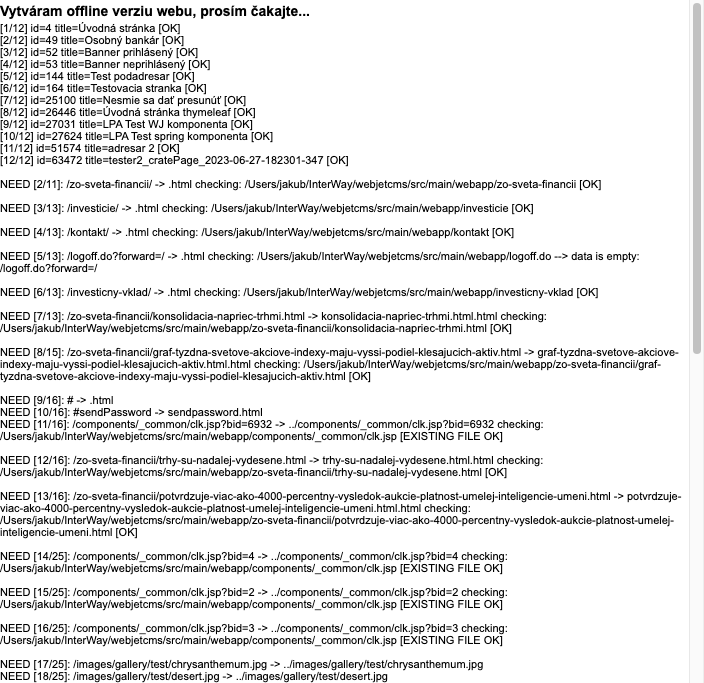
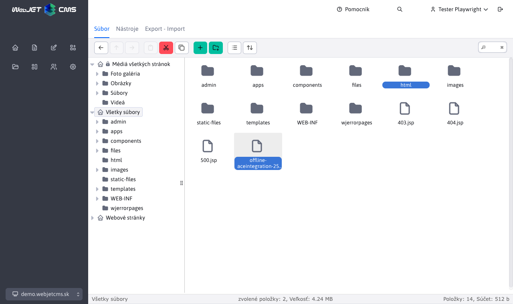

# Export do HTML

Cez aplikáciu **Export do HTML** je možné exportovať web stránky do HTML formátu a následne ich v obmedzenej miere použiť v offline prostredí. Export funguje na princípe sťahovania výsledných web stránok a ich uloženia do HTML súboru

Vygenerované stránky sa uložia do priečinku `/html`.

## Proces generovania HTML súborov

Po zadaní ID priečinku, pre ktorý chcete vytvoriť offline verziu, a kliknutí na **OK** sa spustí proces generovania HTML súborov. Tento proces môže trvať niekoľko desiatok minút podľa počtu stránok v danej vetve web sídla.

Čakajte, kým celý proces skončí. Počas toho by sa vám v okne mala zobrazovať informácia o počte už vygenerovaných stránok a o celkovom počte stránok. Výsledkom je priečinok `/html` obsahujúci HTML kód jednotlivých stránok a prípadne ZIP archív so zvolenými priečinkami (do ZIP archívu sa automaticky pridáva aj priečinok `/html`).

## Vytvorenie ZIP archívu

Na vytvorenie ZIP archívu je potrebné zvoliť možnosť **Zálohovanie systému**, môžete aj vybrať, ktoré priečinky sa do ZIP archívu majú zahrnúť. Upozorňujeme, že objem dát v zvolených priečinkoch môže byť veľký a ZIP súbor sa nemusí vygenerovať správne (obmedzenie je na 2GB súbor).

## Exportované súbory

Vygenerované stránky sa uložia do priečinku `/html` a po zvolení možnosti Zálohovanie systému sa výsledný ZIP súbor uloží do koreňového priečinka.

!> **Upozornenie:** po vytvorení exportu odporúčame ihneď zmazať celý priečinok `/html` a aj ZIP archív s názvom začínajúcim na `offline-` v koreňovom priečinku servera.