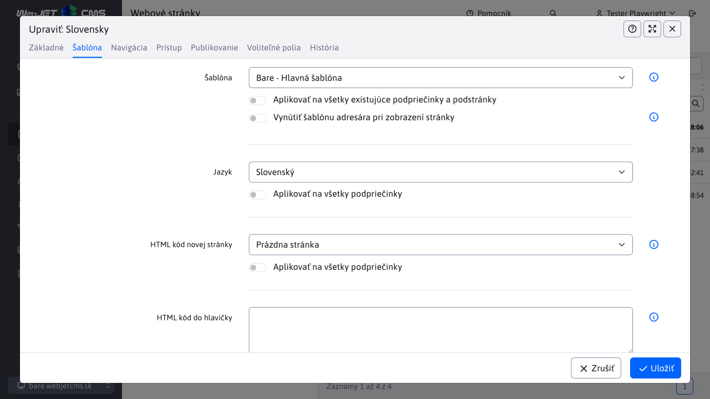

# Priečinok web stránky

Všetky stránky sú usporiadané do priečinkov a tvoria stromovú štruktúru webu. Priečinky sú zaradené podľa poradia, ktoré majú nastavené ako jeden zo svojich parametrov. Základnú štruktúru tvoria hlavný priečinok, často členený podľa jazykových mutácií webu a môže byť ľubovoľne členený pomocou podpriečinkov podľa logickej štruktúry webu.

Po kliknutí na priečinok v stromovej štruktúre sa zobrazia web stránky vo vybranom priečinku.

# Karta Základné

- Názov priečinka
- Názov položky v menu - názov, ktorý sa bude zobrazovať v navigačnej lište (drobečková navigácia / breadcrumb) a v generovanom menu web stránky.
- URL adresa - názov, ktorý sa použije pre vygenerovanie adresy stránok (URL) v tomto adresári. Ak obsahuje značku / na začiatku, tak sa vygenerovaná URL adresa začne zadanou adresou bez ohľadu na rodičovský priečinok. Ak sa zadá hodnota - tak sa pri generovaní URL adries tento priečinok preskočí.
  - Aplikovať na všetky existujúce podpriečinky a podstránky - ak zaškrtnete a priečinok uložíte, vygeneruje sa nová URL adresa všetkým podstránkam toho priečinka a podpriečinkov.
- Doména - ak používate Multi Domain WebJET a upravujete koreňový adresár sem zadávate doménu pre ktorú sa zobrazujú stránky v tomto adresári (a podadresároch).
  - Zmeniť presmerovania domény, konfiguračné premenné a prekladové texty s prefixom domény - ak zmeníte doménu a zvolíte túto možnosť doméne sa zmení aj v existujúcich presmerovaniach, konfiguračných premenných a prekladových kľúčoch s prefixom pôvodnej domény.
- Nadradený priečinok - priečinok, ktorý je rodičom tohto priečinka. Určuje kde sa bude tento priečinok nachádzať v stromovej štruktúre.
- Hlavná stránka priečinka - web stránka, ktorá bude použitá ako hlavná web stránka priečinka po kliknutí na názov priečinka v menu.
- Dostupnosť priečinku pre verejnosť - určuje či sa jedná o verejný, alebo neverejný (interný) priečinok. Neverejný priečinok sa bežným návštevníkom nezobrazuje v stromovej štruktúre navigácie (zobrazuje sa iba v admin časti). Stránky v neverejnom priečinku sa nedajú vyhľadať a nezobrazujú sa v menu.

## Karta Šablóna

- Šablóna - šablóna pre daný priečinok, použije sa na nastavenie šablóny pri vytvorení novej stránky v tomto priečinku.
  - Aplikovať na všetky existujúce podpriečinky a podstránky - ak zaškrtnete a priečinok uložíte, nastaví sa zvolená šablóna všetkým podstránkam a podpriečinkom tohto priečinka.
  - Vynútiť šablónu priečinka pri zobrazení stránky - ak je zvolená táto možnosť ignoruje sa nastavená šablóna bo web stránke a vynúti sa použitie nastavenej šablóny v priečinku.
- Jazyk - jazyk stránok v tomto priečinku. Štandardná možnosť je Jazyk sa preberie zo šablóny, pri ktorom sa jazykové nastavenie preberá z definície použitej šablóny stránky.
  - Jazyk ovplyvňuje vložené aplikácie - texty ktoré aplikácia vypisuje sa riadia zvoleným jazykom.
  - WebJET automaticky vyhľadá aj jazykové mutácie priradených hlavičiek, pätičiek a menu. Ak má šablóna nastavenú hlavičku s názvom "default hlavička" alebo "SK-default hlavička"  automaticky pri zobrazení stránky s nastaveným jazykom EN WebJET vyhľadá stránku "EN-default hlavička".
- HTML kód novej stránky - určuje, čo sa zobrazí v editore po kliknutí na ikonu Pridať web stránku. Buď je to prázdna stránka, alebo pripravená stránka z priečinka /System/Šablóny.
- HTML kód do hlavičiek podstránok - voliteľne môžete zadať HTML kód, ktorý sa priamo vloží do HTML kódu web stránky v tomto adresári. Napr. špecifickú META značku pre vyhľadávače, alebo JavaScript kód potrebný pre túto web stránku.

## Karta Navigácia

- Poradie usporiadania - určuje poradie zobrazovania priečinkov vrámci rodičovského priečinka (v stromovej štruktúre).
- Pregenerovať poradie stránok a adresárov v tomto adresári (vrátane podpriečinkov) - ak zvolíte upraví poradie stránok a priečinkov tak, aby automaticky mali zvyšovanú hodnotu poradia usporiadania po 10.
- Menu - informácia ako sa má adresár zobrazovať v menu:
    - Zobraziť - zobrazuje sa hlavná stránka a podpriečinky
    - Nezobraziť - priečinok a podpriečinky sa v menu nebude zobrazovať
    - Bez podpriečinkov - v menu sa zobrazí len hlavná stránka priečinka
    - Zobraziť vrátane web stránok - v menu sa zobrazia stránky aj priečinky. Pre všetky stránky priečinka zobrazí zaškrtávacie políčko Základné údaje > Zobraziť v menu
- Navigačná lišta - spôsob zobrazenia priečinku v navigačnej lište (navbar/breadcrumb):
  - Rovnako ako menu - spôsob zobrazenia je zhodný so zobrazením v navigačnom menu.
  - Zobraziť - priečinok sa vždy bude zobrazovať.
  - Nezobraziť - priečinok sa nebude zobrazovať.
- Mapa stránok - spôsob zobrazenia priečinka v mape stránok:
    - Rovnako ako menu - spôsob zobrazenia je zhodný so zobrazením v navigačnom menu.
    - Zobraziť - priečinok sa vždy bude zobrazovať.
    - Nezobraziť - priečinok sa nebude zobrazovať.
- Aplikovať na všetky podpriečinky - nastavená hodnota sa aplikuje aj na existujúce podpriečinky.

Spôsob zobrazenia je rozdelený na prihláseného a neprihláseného návštevníka. Môžete tak jednotlivé položky v menu skryť, ak používateľ nie je prihlásený, alebo naopak napr. položku Prihlásenie nezobrazovať, ak je používateľ prihlásený.

## Karta prístup

V karte prístup nastavujete oprávnenia pre prístup k stránkam v tomto priečinku. Ak zvolíte niektorú používateľskú skupinu nebude obsah priečinka verejne dostupný. Bude dostupný len prihlásenému návštevníkovi, ktorý patrí do jednej z vybraných používateľských skupín. POZOR: nejedná sa o nastavenie oprávnení pre administrátorov, ale pre vytvorenie tzv. zaheslovanej sekcie na web stránke (pre návštevníkov stránky)

- Povoliť prístup len pre skupinu používateľov - ak zvolíte niektorú skupinu používateľov bude pre zobrazenie stránky vyžadované prihlásenie používateľa z danej skupiny.
Priradiť stránku k hromadnému emailu - stránka bude dostupná pre hromadný email používateľov vo zvolenej skupine. Je možné takto kategorizovať odosielané hromadné emaily podľa preferencií návštevníkov.
- Stránka s formulárom pre prihlásenie - ak máte vytvorenú špeciálnu stránku s prihlasovacím formulárom tu ju nastavte. Stránka je rekurzívne vyhľadávané ku koreňovému adresáru, takže nemusí byť nastavené pre všetky priečinky, stačí pre koreňový adresár.
- Použiť základné nastavenie - zmaže nastavenú stránku pre prihlásenie a použije štandardný/základný prihlasovací formulár.

## Karta Publikovanie

V tejto karte môžete nastaviť publikovanie zmeny uloženia priečinka do budúcnosti. Ak nastavíte dátum a čas zmeny a zvolíte možnosť Naplánovať vykonanie zmien a priečinok uložíte, tak zmeny, ktoré ste vykonali sa neprejavia ihneď, ale až po zadanom dátume a čase. Môžete tak napr. zverejniť novú sekciu webu až v určitý čas. Publikovaná verzia bude mať hodnotu Menu na Nezobrazovať, nebude sa teda zatiaľ zobrazovať v menu. V načasovanej verzii napr. na zajtra ráno nastavíte hodnotu na Zobraziť. Zajtra ráno sa teda začne adresár zobrazovať v menu.

Ak existuje naplánovaná verzia na publikovanie v tejto karte ju uvidíte a môžete ju zmazať alebo načítať jej hodnoty do formuláru.

## Karta Voliteľné polia

Pole A - Pole D: [voliteľné pole](../../frontend/webpages/customfields/README.md) ktoré je možné použiť na prenesenie hodnôt do HTML šablóny.

## Karta História

Zobrazí históriu zmien v nastavení priečinka s dátumom a menom redaktora, ktorý zmenu vykonal. Kliknutím na ikonu ceruzky môžete načítať danú zmenu do editora priečinka.

## Synchronizácia názvu priečinka a web stránky

Konfiguračná premenná `syncGroupAndWebpageTitle` nastavená na hodnotu `true` zabezpečuje synchronizáciu názvu priečinka a názvu **hlavnej** web stránky. To znamená, že ak sa zmení názov priečinka, automatický sa zmení názov hlavnej web stránky tak, aby bol rovnaký a naopak.

Existujú však výnimky, kedy táto synchronizácia nenastane ani ak je zapnutá táto konfiguračná premenná.

### Výnimka 1

Výnimka nastáva pre koreňové priečinky, v ktorých sa názov priečinka a stránky nesynchronizuje.

Príklad: Máme koreňový priečinok SK a v ňom stránku s názvom Úvod, názov priečinku a web stránky sa nesynchronizuje.

### Výnimka 2

Táto výnimka nastáva ak je stránka nastavená ako **hlavná** stránka pre **viacero priečinkov**.

Príklad: Máme priečinok Jazyk. Tento priečinok obsahuje pod-priečinkom Slovenský. Obe priečinky majú ako hlavnú web stránku nastavenú tú istú stránku (jej lokalita nie je podstatná). V takomto prípade nastane výnimka.

### Výnimka 3

Táto výnimka nastáva ak sa **hlavná** stránka priečinka nenachádza priamo v danom priečinku.

Príklad: Máme priečinok Jazyk, ktorý obsahuje stránky Slovenský a Anglický. Máme druhý priečinok Novinky. Výnimka nastáva ak hlavná stránka priečinka Novinky je stránka Slovenský, ktorá sa nachádza v inom priečinku.

