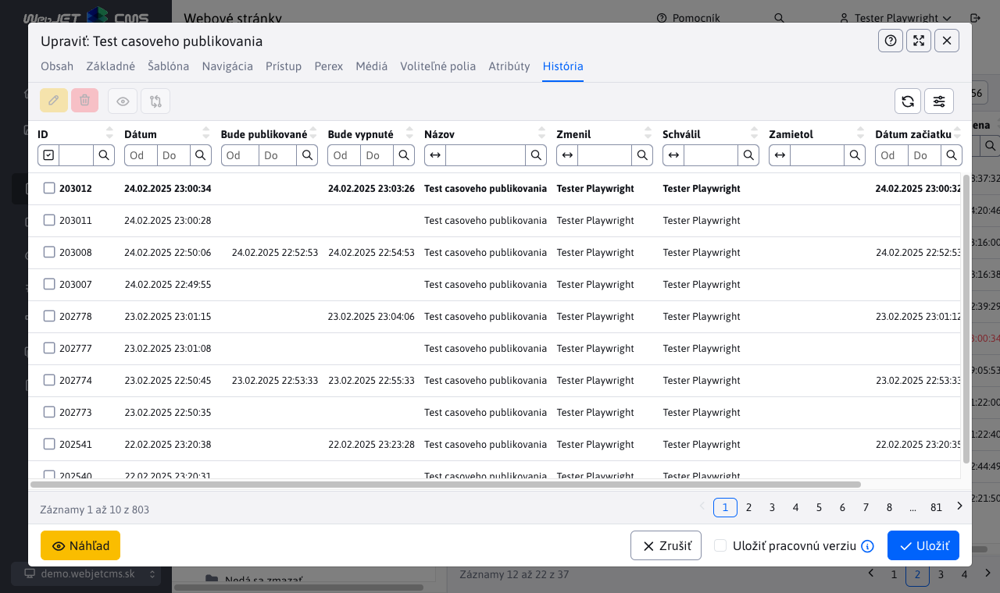
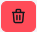
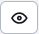
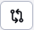

# História web stránky

V karte História sa zobrazujú publikované historické verzie web stránky a **aktuálne rozpracované (ešte nepublikované) verzie**. Pri publikovaní rozpracovanej verzie sa z histórie zmažú dočasné/pracovné verzie stránky a v histórii sa ponechá publikovaná verzia.

Plánované verzie (budúce) majú v stĺpci **Bude publikované** zobrazený dátum, kedy daná verzie bude/bola publikovaná. Ak máte naplánovanú stránku na publikovanie a chcete ju zrušiť stačí ju zmazať.

Stránky, ktoré majú nastavenú možnosť **Odverejniť stránku po tomto dátume** zobrazujú dátum v stĺpci **Bude vypnuté**. V danom čase sa vypne verejné zobrazovanie web stránky (stránka nebude pre verejnosť dostupná). Ak potrebujete vypnutie stránky zrušiť je potrebné upraviť danú verziu a plánované vypnutie zrušiť jej znova uložením.

Tučným písmom je zvýraznená aktuálne zverejnená verzia stránky.

Stĺpce dátum začiatku a dátum konca zobrazujú nastavené údaje v karte Perex v editore stránok.

V prípade schvaľovania/zamietnutia stránky sa zobrazuje aj meno používateľa, ktorý danú verziu schválil, alebo zamietol.

Zvolením riadku a kliknutím na ikonu je možné vykonať akcie:

-  - Editovať stránku - zvolená verzia sa načíta z histórie do editora. Umožňuje Vám nanovo publikovať staršiu verziu stránky.
-  - Zmazať - zmaže stránku z histórie, je možné použiť len na stránky s naplánovaným publikovaním (majú vyplnený dátum v **Bude publikované**).
-  - Zobraziť stránku - zobrazí zvolenú web stránku z histórie. Upozorňujeme, že v histórii sa ukladá text stránky, ak dôjde k zmene šablóny (napr. v pätičke stránky) toto nebude reflektované pri zobrazení.
-  - Porovnať stránku - zobrazí sa vám nové okno, ktoré je rozdelené na dve časti s obsahom aktuálnej a novej verzie stránky. Obe časti sú vzájomne synchronizované, takže sa vám pri prezeraní obsahu pohybujú súčasne. V okne porovnania máte tiež možnosť zvýrazniť zmeny uloženej verzie z histórie voči aktuálnej publikovanej verzii web stránky. Táto operácia sa vykoná po kliknutí na odkaz "Zvýrazniť rozdiely" v hornej časti okna.