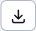
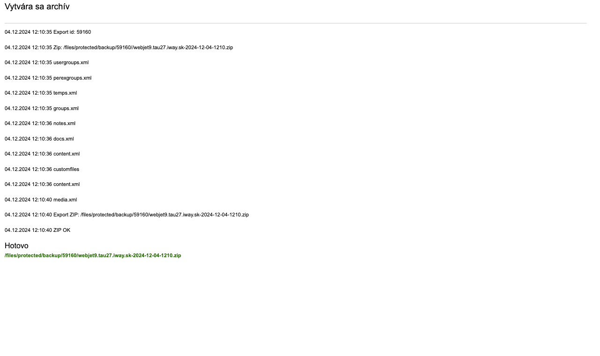
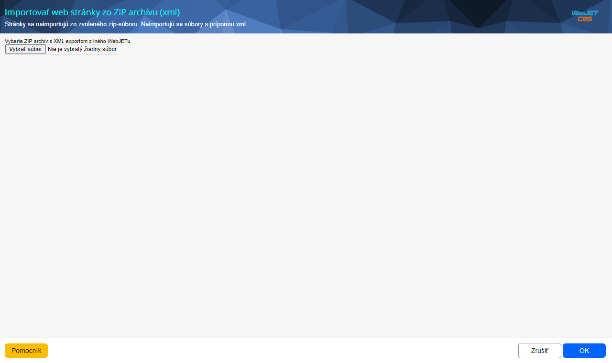
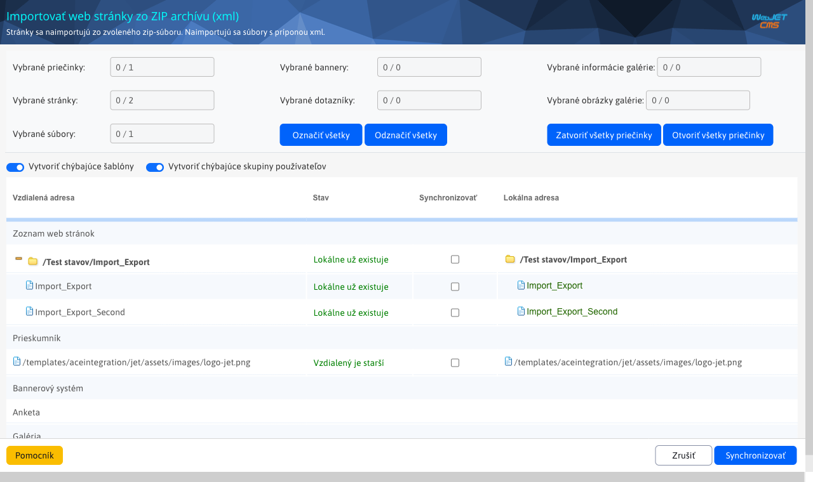
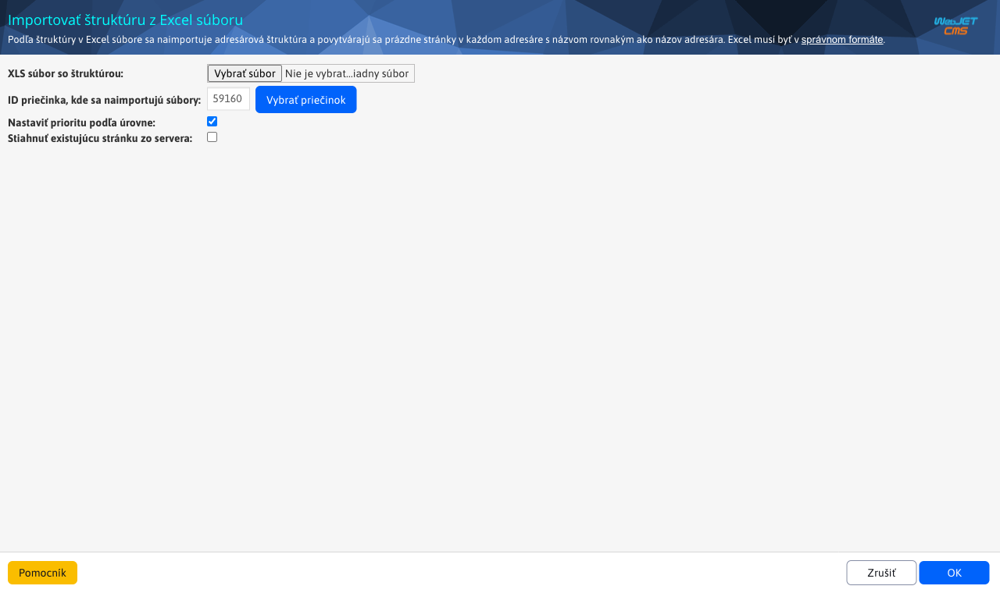
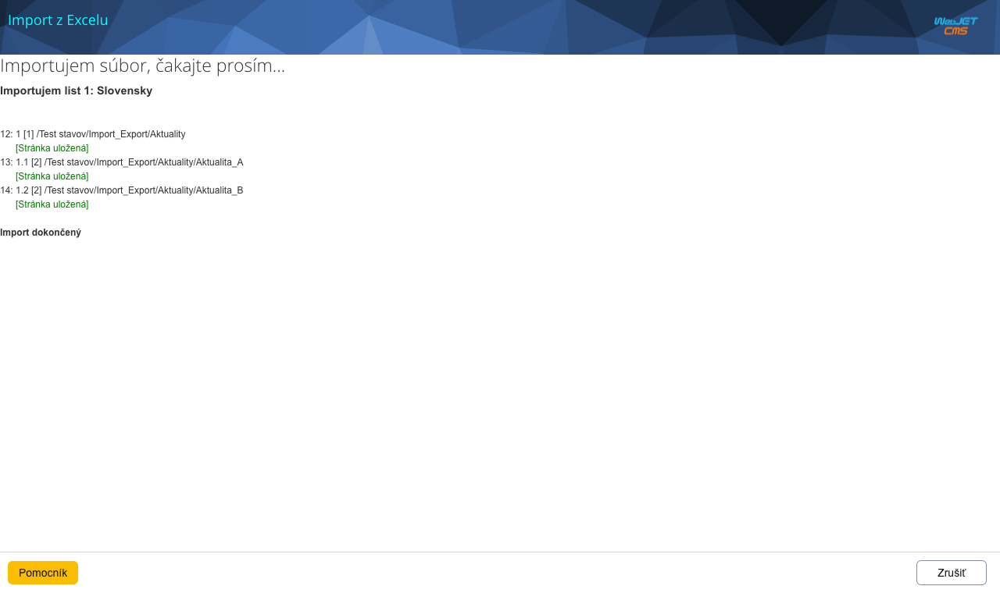

# Import a export web stránok

Export web stránok exportuje web stránky vrátane ich textu, stromovej štruktúry a vložených obrázkov a súborov. Umožňuje jednoducho prenášať obsah medzi viacerými inštanciami WebJET CMS, napr. medzi produkčným a testovacím prostredím. Pri importe je zobrazené okno, v ktorom sú porovnané jednotlivé stránky s možnosťou voľby stránok, ktoré sa skutočne naimportujú. Viete tak skontrolovať a potvrdiť údaje pred ich importom.

Ak pripravujete nové web sídlo môžete vopred pripraviť stromovú štruktúru web sídla a tú naimportovať do WebJET CMS.

## Exportovanie web stránok

Najprv sa uistite, či sa nachádzate v adresári, ktorý chcete exportovať. Stlačte tlačidlo  a počkajte na zobrazenie okna. Pre štandardný export obsahu zvoľte v tomto okne možnosť **Exportovať web stránky do ZIP archívu (xml)** a spustite export vo zvolenej vetve stromu stránok tlačidlo s textom **OK**.

Výstup by mal vyzerať podobne ako na nasledujúcom obrázku. Úplne na konci výstupu sa zobrazí odkaz na ZIP súbor k stiahnutiu. Ponúknutý súbor si stiahnete na váš počítač. Tento súbor budete môcť následne použiť na import na inom prostredí CMS WebJET.

## Importovanie web stránok zo ZIP archívu

Najprv sa uistite, či sa nachádzate v adresári, do ktorého chcete import aplikovať. Stlačte tlačidlo  a počkajte na zobrazenie okna. V okne zvoľte možnosť **Importovať web stránky zo ZIP archívu (xml)** a stlačte tlačidlo s textom **OK**. Budete vyzvaný k nahratiu ZIP súboru, ktorý by mal byť v rovnakom stave ako keď bol vyexportovaný cez možnosť **Exportovať web stránky do ZIP archívu (xml)**. Akékoľvek experimentovanie s jeho obsahom môže mať za následok nesprávne fungovanie importu s dôsledkom poškodenia výsledného obsahu web sídla.

Po nahratí zip súboru a potvrdení vloženia tlačidlo s textom **OK** počkajte, nech systém súbor spracuje, až kým vám nezobrazí porovnávaciu tabuľku pre import.

Nad tabuľkou sa nachádzajú dve zaškrtávacie polia:

- Vytvoriť chýbajúce šablóny
- Vytvoriť chýbajúce skupiny používateľov

Ich zaškrtnutie nechávam na zváženie, odporúčané je však ponechať ich zaškrtnutie.

V tabuľke sa nachádzajú pod sebou postupne najprv Web stránky, potom Súbory, ktoré sú nasledované ďalšími dátami modulov, pokiaľ boli v exporte nejaké prítomné. Tabuľka obsahuje 4 stĺpce:

- Vzdialená adresa – názov stránky/súboru v ZIP súbore
- Stav – informácia o tom, či už rovnaký objekt v cieľovom úložisku existuje
- Synchronizovať – zaškrtávacie políčko, ktoré vymedzuje synchronizáciu len na konkrétne položky zo zoznamu
- Lokálna adresa – názov a umiestnenie stránky/súboru na cieľovom úložisku (vo WebJETe, do ktorého importujem)

Po prejdení celého zoznamu a po zvolení zaškrtávacích políčok na položkách, ktoré chcete synchronizovať môžete kliknúť tlačidlo **Synchronizovať** v spodnej časti okna. Tým pádom sa vykoná synchronizácia dát, web stránkam sa vy-publikuje nový obsah, pôvodné súbory budú prepísané novými.

K web stránke sa exportujú aj použité obrázky a súbory. Ak je v stránke použitá aplikácia Bannerový systém, Galéria alebo Anketa, exportujú sa aj základné dáta týchto aplikácií. Môžete zvoliť možnosti importu dát pre danú aplikáciu.

## Import štruktúry z Excel súboru

Pred importom sa uistite, či sa nachádzate v adresári, do ktorého chcete import aplikovať. Stlačte tlačidlo  a počkajte na zobrazenie okna. V okne zvoľte možnosť **Importovať štruktúru z Excel súboru** a stlačte tlačidlo s textom **OK**. Zobrazí sa Vám nastavenie importu, ktoré Vás vyzve k zadaniu `XLS` súboru so štruktúrou. Nezabudnite, že **súboru musí byť typu XLS**. Nemôže byť typu `XLSX` ani `XLSM` iba práve XLS. Dostupné sú aj ďalšie možnosti importu:

- ID priečinka, kde sa na-importujú súbory, táto možnosť bude prednastavená podľa skôr zvoleného priečinka, ale stále sa dá zmeniť (zmeniť cieľový priečinok)
- Nastaviť prioritu podľa úrovne - priorita usporiadania sa nastaví podľa vnorenia v stromovej štruktúre, čím je stránka hlbšie, tým bude mať väčšie číslo priority. Význam to má pri vyhľadávaní a usporiadaní výsledkov podľa priority, aby stránky na nižšej úrovni boli skôr vo výsledkoch vyhľadávania - predpokladá sa, že stránka sekcie je významnejšia ako jej pod-stránka.
- Stiahnuť existujúcu stránku zo servera - pre vytvorené stránky je možné stiahnuť text z existujúceho web sídla. Je možné zadať aj začiatočný a koncový HTML kód orezania, podľa ktorého sa v stiahnutom HTML kóde identifikuje samotný text stránky. Sťahuje sa len samotný text bez obrázkov a priložených súborov.

Po nahratí súboru a prípadne úprave nastavení importu sa proces spustí stlačením tlačidla s textom **OK**. Podľa štruktúry v Excel súbore sa na-importuje adresárová štruktúra a vytvoria sa prázdne stránky v každom adresáre s názvom rovnakým ako názov adresára.Postupne budú vypísané jednotlivé vytvorené stránky (aj s celou adresou v štruktúre). Čakajte, kým celý proces neskončí a nebude vypísané hlásenie o ukončení importu.

