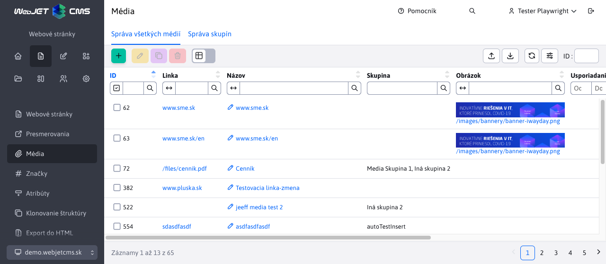

# Média

## Zobrazenie vo web stránke

Média slúžia na priradenie súvisiacich súborov / obrázkov / odkazov k aktuálnej stránke.

Zobrazujú sa v editore web stránok v karte média, kde je možné zadať Názov, skupinu (média je možné radiť do viacerých skupín podľa potrieb), linku na súbor/stránku, náhľadový obrázok (ak je potrebné) a prioritu usporiadania.

Média sa dajú používať na rôzne účely:

- zoznam súvisiacich súborov k stránke
- zoznam súvisiacich stránok k aktuálnej stránke
- zoznam audio / video súborov k stránke (obrázky, animácie, videá)


V stránke / šablóne je v aplikácii Média možné získať zoznam médií podľa ID stránky a skupiny médií.

Upozornenie: aplikácia média zobrazuje len média:

- Odkazujúce na existujúci súbor (ak sa súbor zmaže médium sa automaticky prestane zobrazovať).
- Vložené skôr ako je dátum a čas uloženia web stránky (po pridaní nového média uložte web stránku pre jeho zobrazenie). Umožňuje to časovať zobrazenie nových médií - jednoducho ich pridajte k web stránke, nastavte jej časové zobrazenie do budúcna a pridané média sa zobrazia až po časovom publikovaní web stránky.

## Správa všetkých médií

V menu Web stránky/Média/Správa všetkých médií je možné vyhľadávať a spravovať všetky médiá **naprieč všetkými web stránkami** v aktuálne zobrazenej doméne. Pri filtrovaní môžete do poľa Web stránka zadať jej názov, alebo celú cestu, alebo aj priamo ID stránky (docid).



Pri editácii/vytváraní nového média je potrebné zadanie názvu média a výber web stránky pomocou stromovej štruktúry.


Zobrazenie tejto možnosti **vyžaduje právo** "Média - Správa všetkých média".

## Správa média skupín

Pomocou média skupín môžete organizovať zadávané média do skupín. Napríklad "Súbory na stiahnutie", alebo "Súvisiace odkazy". Spravujú sa v menu Web stránky/Média/Správa skupín a **vyžadujú právo** "Média - Správa skupín".

Pomocou aplikácie Média následne do web stránky (alebo v šablóne napr. v pravom menu, alebo pod textom web stránky) zobrazíte média web stránky podľa vybranej skupiny médií.

Skupina médií môže mať nastavené obmedzenie pre zobrazenie skupiny len v určitom adresári web stránok.


## Implementačné detaily

Všetky Média záznamy sú filtrované podľa práve zvolenej domény.

V prípade záznamov z **Správa všetkých médií** je parameter mena tabuľky nastavovaný na hodnotu **documents** automaticky na pozadí. Pre identifikáciu či ide o volanie datatabuľky práve z tejto sekcie zabezpečuje url parameter ```isCalledFromTable=true```.