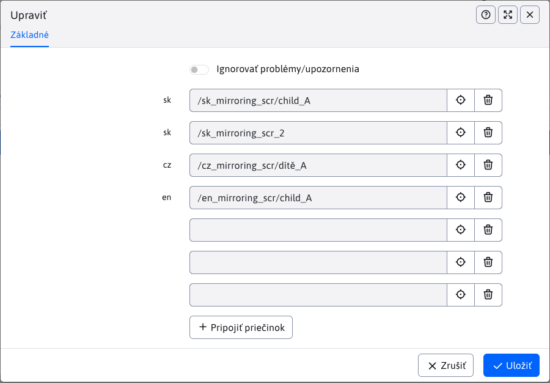

# Priečinky

Sekcia obsahuje prehľad previazaných priečinkov pod spoločným synchronizačným identifikátorom `syncId`.

## Štruktúra tabuľky

Aby sme vedeli v tabuľke čítať, musíme pochopiť štruktúru tabuľky, kde:

- **Riadky**, každý riadok obsahujú všetky priečinky (presnejšie cesty k priečinkom), ktoré sú navzájom previazané rovnakou hodnotou parametera `syncId` (minimálne jeden priečinok)
- **Stĺpce** sa delia nasledovne:
  - **SyncID**, hodnota synchronizačného identifikátora, ktorým sú priečinky v riadku previazané
  - **Stav**, ikony, ktoré upozorňujú na špeciálne stavy (viac v sekcii [stav previazania](./groups#stav-previazania))
  - **sk, en, ...**, sú automaticky generované stĺpce, kde každý stĺpec obsahuje priečinky pre danú jazykovú mutáciu. Tento jazyk sa získa z priečinka alebo šablóny priečinka. Počet stĺpcov v tabuľke sa dynamický mení a závisí na tom, v koľkých jazykových mutáciách previazané priečinky sú. Ak hodnota v stĺpci chýba, tak neexistuje pre daný `syncId` previazaný priečinok v danej jazykovej mutácií.

!>**Upozornenie:** v prípade existencie viacerých previazaných priečinkov s rovnakou hodnotou `syncId` a v rovnakej jazykovej mutácií, ich hodnoty sa v stĺpci pre danú jazykovú mutáciu spoja, takže hodnota v stĺpci bude obsahovať cesty k viacerým priečinkom.

## Stav previazania

Stĺpec **Stav** ponúka pomocou ikon rýchly prehľad o stave previazania. Podporuje nasledujúce stavy:

- <i class="ti ti-exclamation-circle" style="color: #ff4b58;"></i>, ikona zodpovedná stavu **Zlé mapovanie**. Previazanie priečinok nadobudne tento stav v prípade objavenia viacerých previazaných priečinkov v rovnakej jazykovej mutácií.
- <i class="ti ti-alert-triangle" style="color: #fabd00;"></i>, ikona zodpovedná stavu **Nerovnomerné vnorenie**. Previazanie priečinok nadobudne tento stav v prípade rozdielnej hĺbky previazaných priečinok od koreňového priečinka.
- **nič**, žiadna ikona sa nezobrazuje v prípade ak previazanie je korektné (nespadá do predcházdajúcich stavov)

### Zlé mapovanie

Nakoľko previazané by mali byť iba priečinky s rovnakým obsahom len v inej jazykovej mutácií, nedáva zmysel mať previazaných viac priečinkov v rovnakej jazykovej mutácií. Preto sa takéto previazania vyhodnocujú ako **zlé mapovanie**.

### Nerovnomerné vnorenie

Nakoľko previazané by mali byť rovnaké štruktúry, rozdielne hĺbky previazaných priečinkov indikujú chybu medzi štruktúrami. Oproti **zlému mapovaniu** nemusí ísť hneď o chybu, takéto previazania sú označené pre lepšie hľadanie prípadných chýb.

## Vymazanie/zrušenie previazania

Pri vymazaní/zrušení celého previazania zaniká existujúci synchronizačný parameter `syncId`, nakoľko už nemá čo previazať. Pre každý priečinok, ktorý bol previazaný sa vykoná akcia **rozviazania priečinka**.

### Rozviazanie priečinka

Akcia rozviazanie priečinka kaskádovito odstráni synchronizačný parameter `syncId` pre zvolený priečinok ako aj každý jeho pod-priečinok. Táto zmena sa týka aj stránok v týchto priečinkoch, ktoré taktiež stratia nastavený `syncId`.

## Editácia previazania

Pri editácii previazania sa zobrazí každý previazaný priečinok ako výberové pole adresára stránok aj so skratkou jazyka ako štítkom.

Na nasledujúcom obrázku môžeme vidieť príklad **zlého mapovania**, kde sú previazané viaceré priečinky v rovnakej jazykovej mutácií, konkrétne v prípade `sk` jazyka.

### Zmena priečinkov

Pri editácii je možné previazané priečinky zmeniť. V takomto prípade bude nahradenému priečinku odstránený synchronizačný parameter `syncId`, na priečinku sa vyvolá akcia [rozviazania priečinka](./groups#rozviazanie-priečinka) a novo-zvolenému priečinku sa pridá parameter `syncId`.

Pre zvolené priečinky nie je povolené:

- duplicitné zvolenie toho istého priečinka
- zvolenie priečinka s nastaveným `syncId` (samozrejme iným ako práve upravované). Ak stále budete trvať na previazaní daného priečinka, najprv musíte zrušiť jeho aktuálne previazanie (odstráníť `syncId`) a až následne ho môžete previazať s iným priečinkom (pridať nové `syncId`).
- výber viacerých priečinkov v tej istej jazykovej mutácií (chyba [zlé mapovanie](./groups#zlé-mapovanie))
- výber priečinkov v rôznej hĺbke (chyba [nerovnomerné vnorenie](./groups#nerovnomerné-vnorenie))

Každá z týchto chýb sa kontroluje. Ak sa takáto chyba objaví pri pokuse o zmenu, akcia bude zablokovaná.

!>**Upozornenie:** editor poskytuje možnosť **Ignorovať problémy/upozornenia**. Zvolením tejto možnosti viete uložiť aj záznamy, ktoré obsahujú chyby **zlé mapovanie** a **nerovnomerné vnorenie**. Túto ochranu viete vypnúť na vlastnú zodpovednosť, ak to situácia vyžaduje.

### Pridanie priečinka

Tabuľka neumožňuje vytvorenie úplne nového previazania (nového `syncId`) ale umožňuje pridanie (previazanie) nových priečinkov k už existujúcim. V editore pri editácii záznamu sa nachádza tlačidlo

<button id="add-sync-btn" class="btn btn-outline-secondary" onclick="showNewSelector(groupsMirroringTable)">
    <i class="ti ti-plus"></i>
     Pripojiť priečinok 
</button>

pomocou ktorého viete pridať nové polia pre výber adresárov stránok. Keď zobrazíte maximálny povolený počet polí (povolených previazaní) tlačidlo sa skryje.

### Odstránenie previazania

Akciou zmeny priečinka viete prakticky odstrániť celé previazanie. Táto situácia nastane, keď odstránite všetky previazané priečinky.