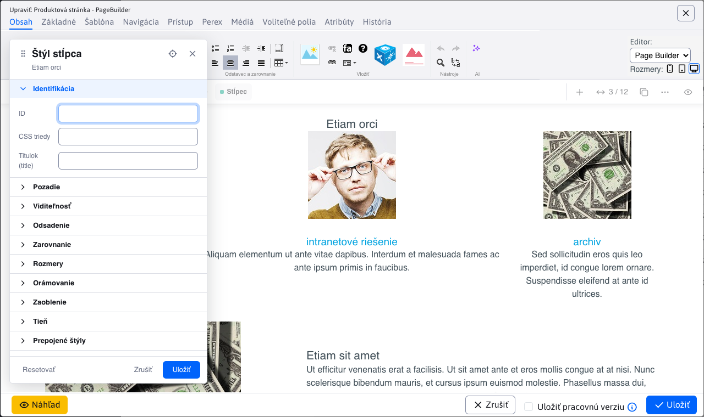

# Page Builder

Page Builder je špeciálny režim editácie stránok. V tomto režime nie je editovaná celá stránka ale len jej vybrané časti. Page Builder oddeľuje editáciu textov/obrázkov a štruktúry stránok. Nestane sa tak to, že omylom zmažete štrukturálne elementy web stránky pri editácii jej textu.

<div class="video-container">
    <iframe width="560" height="315" src="https://www.youtube.com/embed/ieaNWY57Exc" title="YouTube video player" frameborder="0" allow="accelerometer; autoplay; clipboard-write; encrypted-media; gyroscope; picture-in-picture" allowfullscreen></iframe>
</div>

Režim je potrebné aktivovať, pripraviť bloky a nastaviť šablóny, postup je v sekcii pre [web dizajnéra](../../frontend/page-builder/README.md).

Pri nastavení možnosti použitia Page Builder pre šablónu sa pri otvorení web stránky v editore načíta režim Page Builder.


V prípade potreby je v okne možnosť prepnúť editor do štandardného režimu. Prepnutie z PageBuilder režimu na režim Štandardný sa zapamätá do znova obnovenia stránky. Aj iná PageBuilder stránka sa následne zobrazí v štandardnom režime. Prepnutie nazad na režim PageBuilder musíte vykonať prepnutím výberového poľa, alebo obnovením celej stránky.

!>**Upozornenie:** obsah editorov nie je počas vašich úprav synchronizovaný. Oba načítajú rovnaký obsah iba pri otvorení okna. Nemôžete teda začať vykonávať zmeny v Page Builder a potom sa prepnúť do štandardného editora a tam spraviť ďalšie zmeny.

## Základná práca

Pri použití Page Builder vytvárate web stránku z vopred pripravených blokov. Kliknutím do obsahu vyberiete blok a zároveň môžete ihneď písať. Zvýraznený je vždy jeden blok; počas písania sa jeho rámik zjemní. Farba označuje typ bloku:

- Modrá farba reprezentuje sekciu - hlavný stavebný blok, zvyčajne na celú šírku obrazovky.
- Červená farba reprezentuje kontajner - blok určený na vkladanie stĺpcov, je zvyčajne užší ako sekcia pre lepšiu čitateľnosť textov na stránke.
- Zelená farba reprezentuje stĺpec - ten už obsahuje typicky editovateľný text, obrázky alebo aplikácie.
- Oranžová farba reprezentuje duplikovateľnú položku alebo riadok.


Nástroje vybraného bloku sú v pevnej lište pod CKEditorom. Klikateľná cesta, napríklad **Sekcia › Kontajner › Riadok › Stĺpec**, umožňuje vybrať nadradenú časť bez hľadania rámikov v texte. Na úzkej obrazovke otvoríte zoznam predkov tlačidlom vedľa aktuálneho typu bloku. Lišta obsahuje možnosti:

- Štýl - umožní pokročilo nastaviť štýl/vlastnosti bloku ako obrázok pozadia, farby, zarovnania, odsadenia a podobne.
- Šírka stĺpca - nastavuje šírku stĺpca, je možné nastaviť rôzne šírky pre rôzne zariadenia (telefón, tablet, počítač).
- Presun bloku - umožňuje presunúť blok na iné miesto v stránke, po kliknutí na ikonu sa zobrazia možnosti kam je blok možné presunúť.
- Duplikovať vedľa - vloží kópiu hneď za vybraný blok a označí ju.
- Ďalšie akcie - otvorí ponuku na vloženie bloku pred alebo za výber, presun o jednu pozíciu a pôvodné duplikovanie alebo presun s výberom cieľového miesta.
- Obľúbené - pridá blok do zoznamu obľúbených blokov.
- Zmazať - zmaže označený blok.



Ponuka obsahuje iba operácie podporované vybraným typom. Bežný riadok slúži na orientáciu; duplikovateľný riadok a položka podporujú presun, duplikovanie a zmazanie. Samostatný editovateľný text nemá nástroje na úpravu štruktúry. Presun duplikovateľných prvkov zostáva obmedzený na kompatibilných súrodencov toho istého rodiča.

Voľbou **Vložiť blok pred** alebo **Vložiť blok za** otvoríte existujúci výber blokov. Ten obsahuje karty:

- Základné - jednoduché bloky rôznych veľkostí.
- Knižnica - bloky vytvorené pre vašu web stránku.
- Obľúbené - bloky, ktoré ste označili ako obľúbené.


V karte knižnica môžete vyhľadávať bloky podľa názvu, alebo filtrovať bloky podľa štítkov. Tie môžete definovať v súbore `pagebuilder.properties` pri [vytváraní blokov](../../frontend/page-builder/blocks.md#názov-a-značky-bloku) pre vašu web stránku.

Na konci stránky sa zobrazuje ikona `+` pre jednoduchšie pridanie novej sekcie.


## Štruktúra stránky a pokojné zobrazenie

Tlačidlo **Štruktúra** otvorí strom blokov s názvami odvodenými z ich obsahu. Vetvy možno rozbaliť a bloky vyhľadať podľa názvu. Výber položky označí príslušný blok a posunie stránku na jeho miesto. Panel sa otvára nad obsahom a nemení šírku ani zalomenie stránky. Na úzkej obrazovke sa po výbere zatvorí.

Skryté bloky majú označenie **Skrytý**. Ich výber nemení viditeľnosť ani aktívnu kartu stránky. Strom nepridáva do HTML nové názvy alebo identifikátory a neumožňuje presun ťahaním myšou. Na presun použite akcie hornej lišty.

V strome sa pohybujete šípkami, vetvy otvárate a zatvárate šípkami doprava a doľava a výber potvrdíte klávesom Enter alebo medzerníkom. Escape zatvorí otvorenú ponuku či panel alebo zruší presun.

Tlačidlo **Skryť pomôcky** dočasne skryje označenia a strom. Obsah aj jeho zalomenie zostávajú zachované, pomôcky obnovíte rovnakým tlačidlom. Skutočný **Náhľad** a uloženie používajú HTML očistené od ovládacích prvkov PageBuildera.

## Nastavenie šírky stĺpcov

Editor umožňuje nastaviť šírky stĺpca podľa zvoleného zariadenia. V nástrojovej lište pri prepínači typu editora je možnosť nastaviť veľkosť (šírku) zariadenia.


- Desktop - je určený pre šírku väčšiu/rovnú ako 1200 bodov (nastavuje CSS triedu ```col-xl```).
- Tablet - je určený pre šírku 768-1199 bodov (nastavuje CSS triedu ```col-md```)
- Mobil - je určený pre šírku menšiu ako 768 bodov (nastavuje CSS triedu ```col-```)

<div class="video-container">
    <iframe width="560" height="315" src="https://www.youtube.com/embed/aru-B1vxReo" title="YouTube video player" frameborder="0" allow="accelerometer; autoplay; clipboard-write; encrypted-media; gyroscope; picture-in-picture" allowfullscreen></iframe>
</div>

## Rozdelenie stĺpca

Funkciu Rozdeliť stĺpec vyvoláte pomocou kliknutia na `+` v žltej lište a zvolením možnosti Blok. Následne v karte Základné zvolíte možnosť Rozdeliť stĺpec. Funkcia umožňuje rýchle rozdelenie stĺpca bez nutnosti vkladať nový stĺpec a presúvať obsah. Umožní vám vkladať nové komplexné bloky napr. do dlhého textového stĺpca.
