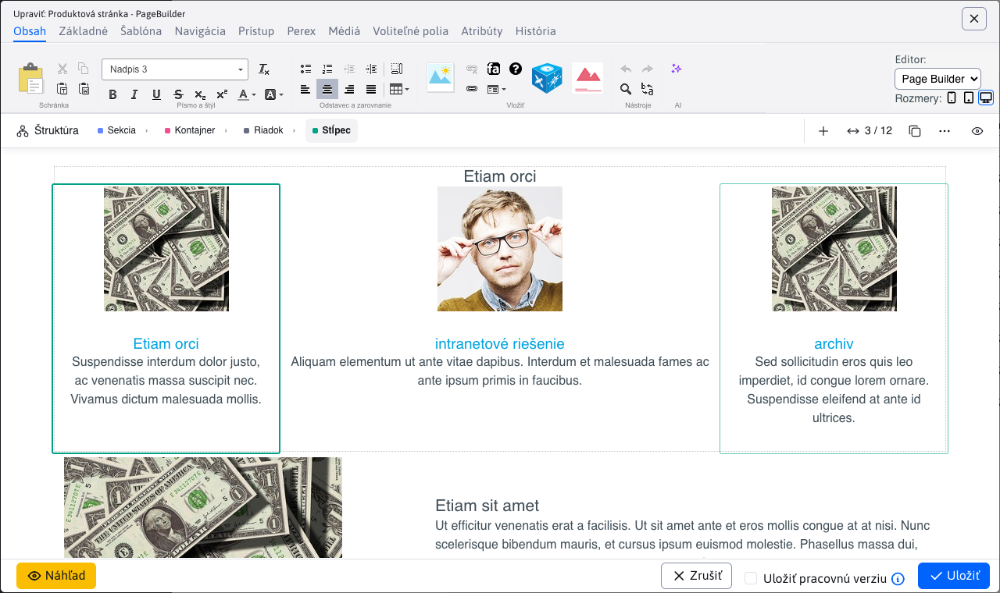
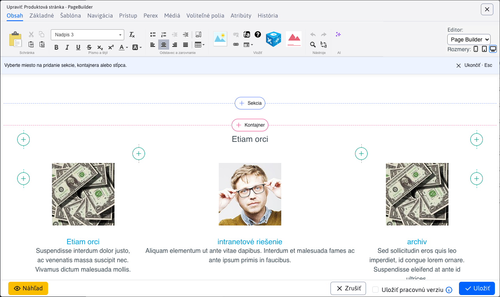
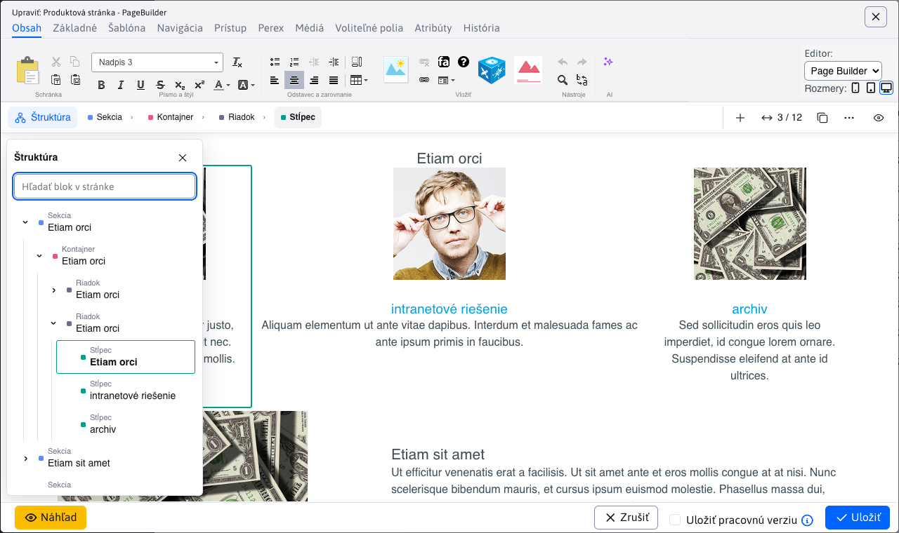
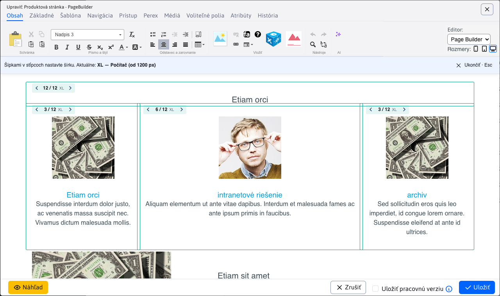

# Page Builder

Page Builder je špeciálny režim editácie stránok. V tomto režime nie je editovaná celá stránka ale len jej vybrané časti. Page Builder oddeľuje editáciu textov/obrázkov a štruktúry stránok. Nestane sa tak to, že omylom zmažete štrukturálne elementy web stránky pri editácii jej textu.

    <iframe width="560" height="315" src="https://www.youtube.com/embed/ieaNWY57Exc" title="YouTube video player" frameborder="0" allow="accelerometer; autoplay; clipboard-write; encrypted-media; gyroscope; picture-in-picture" allowfullscreen></iframe>

Režim je potrebné aktivovať, pripraviť bloky a nastaviť šablóny, postup je v sekcii pre [web dizajnéra](../../frontend/page-builder/README.md).

Pri nastavení možnosti použitia Page Builder pre šablónu sa pri otvorení web stránky v editore načíta režim Page Builder.

Vo výbere **Editor** môžete prepnúť medzi režimami **Page Builder**, **Štandardný** a **HTML**. Zvolený režim sa zapamätá aj pre ďalšie otvorené Page Builder stránky. Ak chcete opäť skladať stránku z blokov, vyberte **Page Builder**.

Pri prepnutí sa aktuálny obsah prenesie do zvoleného editora. Môžete tak napríklad upraviť HTML a pokračovať v Page Builderi. Zmeny stránky uložíte tlačidlom **Uložiť**.

## Základná práca

Pri použití Page Builder vytvárate web stránku z vopred pripravených blokov. Pri prechode myšou ponad obsah sa zobrazí jemný polopriehľadný rámik. Ukazuje hranice bloku, do ktorého môžete kliknúť; zelený rámik pomáha nájsť časti určené na úpravu textu.

Kliknutím do textu vyberiete blok a zároveň môžete ihneď písať. Vybraný blok má výraznejší rámik a zobrazí sa v ceste v hornej lište. Prechod myšou na iný blok tento výber nemení. Počas písania sa rámik výberu zjemní a pomocný rámik pod myšou sa skryje.

V predvolenom nastavení farba označuje typ bloku:

- Modrá farba reprezentuje sekciu - hlavný stavebný blok, zvyčajne na celú šírku obrazovky.
- Ružová farba reprezentuje kontajner - obsahuje riadky so stĺpcami a je zvyčajne užší ako sekcia pre lepšiu čitateľnosť textov na stránke.
- Sivá farba reprezentuje riadok - usporadúva stĺpce v kontajneri.
- Zelená farba reprezentuje stĺpec alebo samostatný editovateľný text. Stĺpec obsahuje typicky text, obrázky alebo aplikácie.
- Oranžová farba reprezentuje duplikovateľnú položku, napríklad položku zoznamu.

Nástroje vybraného bloku sú v pevnej lište pod CKEditorom. Klikateľná cesta, napríklad **Sekcia › Kontajner › Riadok › Stĺpec**, umožňuje vybrať nadradenú časť bez hľadania rámikov v texte. Na úzkej obrazovke otvoríte zoznam nadradených blokov tlačidlom vedľa aktuálneho typu bloku. Lišta obsahuje možnosti:

- Štruktúra - otvorí strom blokov stránky.
- Pridať blok (`+`) - zobrazí miesta na vloženie sekcie, kontajnera alebo stĺpca priamo v stránke, bez potreby najskôr označiť príslušný blok.
- Šírka stĺpca - zobrazuje aktuálnu šírku, napríklad `3 / 12`, a otvorí jej nastavenie pre zvolenú veľkosť zariadenia.
- Duplikovať vedľa - vloží kópiu hneď za vybraný blok a označí ju.
- Ďalšie akcie (`…`) - otvorí ponuku ďalších operácií s vybraným blokom.
- Rámiky (ikona oka alebo vrstiev) - prepína rozsah zobrazených rámikov.

V ponuke **Ďalšie akcie** nájdete podľa typu vybraného bloku:

- Štýl - nastavenie obrázka pozadia, farieb, zarovnania, odsadenia a ďalších vlastností.
- Vložiť blok pred / Vložiť blok za - otvorí knižnicu pre rovnaký typ bloku na zvolenej strane výberu.
- Presunúť pred predchádzajúci blok / Presunúť za nasledujúci blok - posunie blok o jednu pozíciu.
- Presunúť / Duplikovať - zobrazí dostupné cieľové miesta v stránke; kliknutím vyberiete, kam blok presunúť alebo vložiť jeho kópiu. Výber miesta môžete zrušiť klávesom **Escape**.
- Pridať do obľúbených - uloží blok medzi vaše obľúbené bloky v knižnici.
- Zmazať - zmaže označený blok.

Ponuka obsahuje iba operácie podporované vybraným typom. Bežný riadok slúži na orientáciu; duplikovateľný riadok a položka podporujú presun, duplikovanie a zmazanie. Samostatný editovateľný text nemá nástroje na úpravu štruktúry. Presun duplikovateľných prvkov zostáva obmedzený na kompatibilných súrodencov toho istého rodiča.

## Vkladanie blokov

Najrýchlejší postup pridania bloku nevyžaduje označenie existujúcej sekcie ani stĺpca:

1. Kliknite na **Pridať blok** (`+`) v hornej lište. Tlačidlo sa zvýrazní modrou a pod lištou sa zobrazí pomocník s pokynom na výber miesta a tlačidlom **Ukončiť · Esc**.
2. V stránke kliknite na plus na mieste, kam chcete nový blok vložiť. Modré pásy označujú vloženie sekcie, ružové kontajnera a zelené pluská stĺpca. Miesta sú pred prvým blokom, medzi susednými blokmi a za posledným blokom. Názov pri páse a popis tlačidla pomáhajú určiť typ aj pozíciu.
3. V otvorenej knižnici vyberte blok. Knižnica ponúka príslušný typ a v hornej časti pripomína miesto vloženia. Po vložení sa režim ukončí, nový blok sa označí a môžete upravovať jeho obsah.

Knižnicu môžete otvoriť aj pre označený blok cez **Ďalšie akcie → Vložiť blok pred / Vložiť blok za**. Obsahuje karty:

- Základné - jednoduché bloky rôznych veľkostí.
- Knižnica - bloky vytvorené pre vašu web stránku.
- Obľúbené - bloky, ktoré ste označili ako obľúbené.

V karte knižnica môžete vyhľadávať bloky podľa názvu, alebo filtrovať bloky podľa štítkov. Tie môžete definovať v súbore `pagebuilder.properties` pri [vytváraní blokov](../../frontend/page-builder/blocks.md#názov-a-značky-bloku) pre vašu web stránku.

Na konci stránky sa zobrazuje ikona `+` pre jednoduchšie pridanie novej sekcie.

Pri zapnutí režimu vkladania sa plynulo rozbalia dočasné medzery bez odscrollovania viditeľných miest. Šírky stĺpcov sa nemenia: pluská sa zobrazujú v medzerách medzi nimi, pri zalomení medzi riadkami a pri nedostatku priestoru nad obsahom. Rámiky výberu aj rámiky pod myšou sa počas výberu miesta skryjú.

Zatvorením knižnice sa vrátite na vybrané plus. Režim vkladania ukončíte tlačidlom **Ukončiť · Esc** v pomocníkovi, klávesom **Escape** alebo opätovným kliknutím na `+` v lište. Medzery sa plynulo zbalia a fokus sa vráti na `+`. Kliknutie do obsahu ukončí režim a vyberie daný blok. Ak máte v systéme nastavené obmedzenie animácií, zobrazenie aj skrytie prebehne okamžite. Pomocné pásy sa neukladajú ani nezobrazujú v náhľade.

## Štruktúra stránky a pokojné zobrazenie

Tlačidlo **Štruktúra** otvorí strom blokov s názvami odvodenými z ich obsahu. Bloky môžete vyhľadať podľa názvu alebo typu. Kliknutie na položku označí príslušný blok, posunie stránku na jeho miesto a rozbalí zatvorenú vetvu. Opakované kliknutie na položku nechá vetvu otvorenú; šípkou vedľa názvu ju môžete rozbaliť alebo zbaliť bez zmeny výberu.

Vybraná položka má tenký rámik vo farbe svojho typu, ktorý zodpovedá rámiku v stránke. Panel sa otvára nad obsahom a nemení šírku ani zalomenie stránky. Na úzkej obrazovke sa po výbere zatvorí.

Skryté bloky majú označenie **Skrytý**. Ich výber nemení viditeľnosť ani aktívnu kartu stránky. Strom nepridáva do HTML nové názvy alebo identifikátory a neumožňuje presun ťahaním myšou. Na presun použite akcie hornej lišty.

V strome sa pohybujete šípkami nahor a nadol. Vetvy otvárate a zatvárate šípkami doprava a doľava. Kláves **Enter** alebo medzerník vyberie položku a rozbalí jej zatvorenú vetvu. **Escape** zatvorí otvorenú ponuku či panel, ukončí nastavovanie šírky alebo zruší výber miesta presunu či vkladania.

Tlačidlo s ikonou oka postupne prepína tri režimy:

- **Rámik vybraného bloku** (predvolený) - zvýrazní výber a pri prechode myšou jemne naznačí ďalší blok.
- **Žiadne rámiky** (preškrtnuté oko) - skryje výber aj pomocné rámiky pod myšou.
- **Rámiky celej hierarchie aktívneho bloku** (ikona vrstiev) - zobrazí aj nadradenú sekciu, kontajner a riadok. Hierarchiu ukáže aj pri prechode myšou, jemnejšími čiarami. Spoločné nadradené bloky nezvýrazňuje dvakrát.

Prehliadač si voľbu pamätá aj po opätovnom otvorení editora. Lišta, panel Štruktúra a zalomenie obsahu sa prepínaním nemenia. V **Náhľade** ani na uloženej stránke sa pomocné rámiky a ovládacie prvky nezobrazujú.

## Nastavenie šírky stĺpcov

Editor umožňuje nastaviť odlišnú šírku stĺpca pre mobil, tablet a počítač:

1. Pri výbere **Editor** zvoľte ikonou veľkosť zariadenia.
2. Kliknite do požadovaného stĺpca a v lište vyberte **Šírka stĺpca**, napríklad `3 / 12`. Tlačidlo sa zvýrazní modrou a zachová si ikonu aj hodnotu. Pod lištou sa zobrazí rovnaký modrý pomocník ako pri vkladaní blokov; vysvetľuje práve upravovaný rozmer, napríklad **MD — Tablet (768–1199 px)**.
3. Šípkami vnútri jednotlivých stĺpcov zmeňte ich šírku. Hodnota označuje počet dielov mriežky; v predvolenej 12-dielnej mriežke je `3 / 12` štvrtina a `12 / 12` celá šírka. Dostupná je aj hodnota `auto` pre automatické prispôsobenie.
4. Režim ukončíte tlačidlom **Ukončiť · Esc** v pomocníkovi, klávesom **Escape** alebo opätovným kliknutím na tlačidlo šírky. Obnoví sa pôvodné nastavenie rámikov.

Zelené rámiky počas nastavovania označujú všetky stĺpce v danom kontajneri, ktorých šírku môžete meniť, aj keď máte bežné rámiky skryté. Ovládače s jemným zeleným pozadím majú vyhradené miesto vnútri svojho stĺpca nad jeho obsahom. V úzkych stĺpcoch sa hodnota zobrazí nad šípkami. Po ukončení režimu sa miesto pre ovládače uvoľní.

Zariadenie môžete prepnúť aj počas nastavovania. Ovládače aj pomocník sa aktualizujú a ďalšie zmeny šírky sa použijú pre zvolené zariadenie.

Skratka vedľa hodnoty šírky označuje práve upravovanú veľkosť zariadenia. Predvolené nastavenia sú:

| Zariadenie | Označenie | Šírka náhľadu | CSS trieda |
| --- | --- | --- | --- |
| Počítač | `XL` | od 1200 px | `col-xl-` |
| Tablet | `MD` | 768–1199 px | `col-md-` |
| Mobil | bez skratky | menej než 768 px | `col-` |

Šablóna môže používať vlastné označenia a hranice rozlíšenia. V takom prípade pomocník zobrazí označenie podľa šablóny, napríklad `SM`, bez predvolených hraníc uvedených v tabuľke.

    <iframe width="560" height="315" src="https://www.youtube.com/embed/aru-B1vxReo" title="YouTube video player" frameborder="0" allow="accelerometer; autoplay; clipboard-write; encrypted-media; gyroscope; picture-in-picture" allowfullscreen></iframe>

## Rozdelenie stĺpca

Funkcia **Rozdeliť stĺpec** je súčasťou blokov vkladaných do textu:

1. Umiestnite textový kurzor na miesto, kde chcete obsah rozdeliť.
2. V lište CKEditora kliknite na **Bloky**.
3. V otvorenej knižnici prejdite na kartu **Základné** a vyberte **Rozdeliť stĺpec**.

Obsah sa rozdelí do dvoch stĺpcov v mieste kurzora. Nemusíte ručne vytvárať nový stĺpec a presúvať doň text. Tlačidlo **Bloky** používajte aj na vkladanie pripravených textových častí; tlačidlo `+` v lište Page Buildera slúži na pridávanie sekcií, kontajnerov a stĺpcov.
