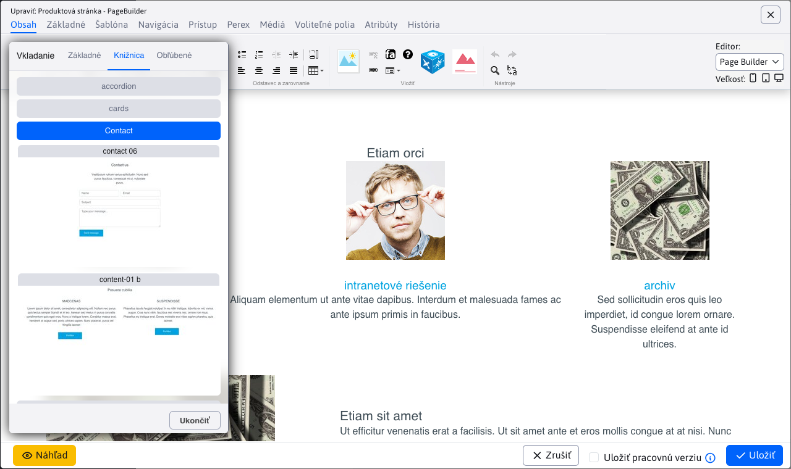
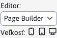

# Page Builder

Page Builder je špeciálny režim editácie stránok. V tomto režime nie je editovaná celá stránka ale len jej vybrané časti. Page Builder oddeľuje editáciu textov/obrázkov a štruktúry stránok. Nestane sa tak to, že omylom zmažete štrukturálne elementy web stránky pri editácii jej textu.

<div class="video-container">
    <iframe width="560" height="315" src="https://www.youtube.com/embed/ieaNWY57Exc" title="YouTube video player" frameborder="0" allow="accelerometer; autoplay; clipboard-write; encrypted-media; gyroscope; picture-in-picture" allowfullscreen></iframe>
</div>

Režim je potrebné aktivovať, pripraviť bloky a nastaviť šablóny, postup je v sekcii pre [web dizajnéra](../../frontend/page-builder/README.md).

Pri nastavení možnosti použitia Page Builder pre šablónu sa pri otvorení web stránky v editore načíta režim Page Builder.


V prípade potreby je v okne možnosť prepnúť editor do štandardného režimu. Prepnutie z PageBuilder režimu na režim Štandardný sa zapamätá do znova obnovenia stránky. Aj iná PageBuilder stránka sa následne zobrazí v štandardnom režime. Prepnutie nazad na režim PageBuilder musíte vykonať prepnutím výberového poľa, alebo obnovením celej stránky.

!>**Upozornenie:** obsah editorov nie je počas vašich úprav synchronizovaný. Oba načítajú rovnaký obsah iba pri otvorení okna. Nemôžete teda začať vykonávať zmeny v Page Builder a potom sa prepnúť do štandardného editora a tam spraviť ďalšie zmeny.

## Základná práca

Pri použití Page Builder vytvárate web stránku z vopred pripravených blokov. Prechodom kurzoru ponad blok sa zvýraznia jednotlivé časti, kde:

- Modrá farba reprezentuje sekciu - hlavný stavebný blok, zvyčajne na celú šírku obrazovky.
- Červená farba reprezentuje kontajner - blok určený na vkladanie stĺpcov, je zvyčajne užší ako sekcia pre lepšiu čitateľnosť textov na stránke.
- Zelená farba reprezentuje stĺpec - ten už obsahuje typicky editovateľný text, obrázky alebo aplikácie.


Každá zvýraznená časť zobrazuje ikonu ozubeného kolesa, kliknutím na ozubené koleso sa zobrazí nástrojová lišta. Tá obsahuje možnosti:

- Štýl - umožní pokročilo nastaviť štýl/vlastnosti bloku ako obrázok pozadia, farby, zarovnania, odsadenia a podobne.
- Šírka stĺpca - nastavuje šírku stĺpca, je možné nastaviť rôzne šírky pre rôzne zariadenia (telefón, tablet, počítač).
- Presun bloku - umožňuje presunúť blok na iné miesto v stránke, po kliknutí na ikonu sa zobrazia možnosti kam je blok možné presunúť.
- Duplikovať - duplikuje označený blok.
- Obľúbené - pridá blok do zoznamu obľúbených blokov.
- Zmazať - zmaže označený blok.


Po kliknutí na ozubené koleso sa taktiež zobrazia ikony + pre vloženie nového bloku. Kliknutím na príslušné miesto sa zobrazí výber bloku. Ten obsahuje karty:

- Základné - jednoduché bloky rôznych veľkostí.
- Knižnica - bloky vytvorené pre vašu web stránku.
- Obľúbené - bloky, ktoré ste označili ako obľúbené.



## Nastavenie šírky stĺpcov

Editor umožňuje nastaviť šírky stĺpca podľa zvoleného zariadenia. V nástrojovej lište pri prepínači typu editora je možnosť nastaviť veľkosť (šírku) zariadenia.



- Desktop - je určený pre šírku väčšiu/rovnú ako 1200 bodov (nastavuje CSS triedu ```col-xl```).
- Tablet - je určený pre šírku 768-1199 bodov (nastavuje CSS triedu ```col-md```)
- Mobil - je určený pre šírku menšiu ako 768 bodov (nastavuje CSS triedu ```col-```)

<div class="video-container">
    <iframe width="560" height="315" src="https://www.youtube.com/embed/aru-B1vxReo" title="YouTube video player" frameborder="0" allow="accelerometer; autoplay; clipboard-write; encrypted-media; gyroscope; picture-in-picture" allowfullscreen></iframe>
</div>