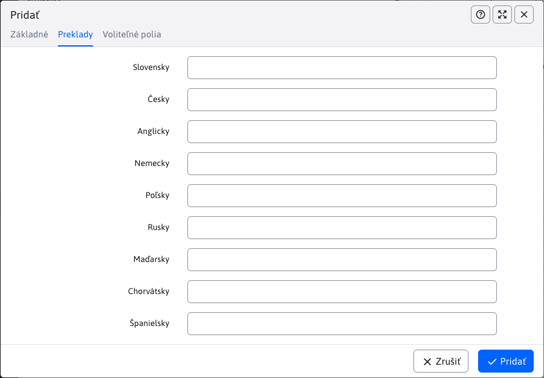
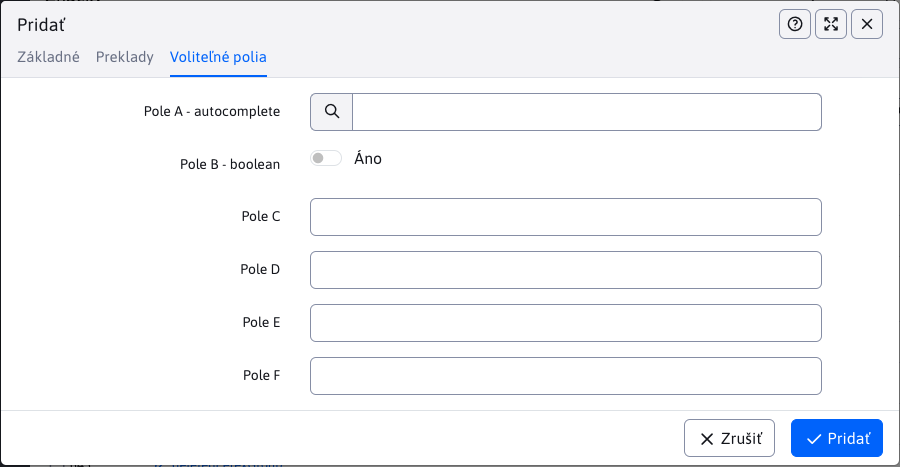
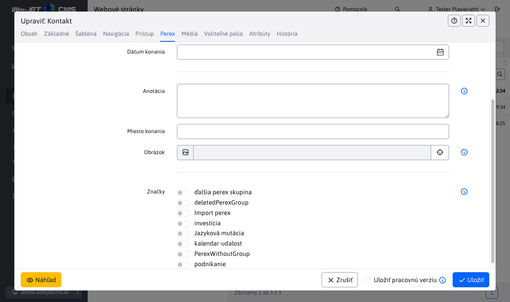

# Značky

Pomocou značiek (pôvodný názov **perex skupiny**) alebo anglicky ```hashtag``` môžete označiť kľúčové slová vo web stránke. V aplikácii novinky je možné použiť filtrovanie noviniek podľa značiek.

Pre prístup k menu položke Web stránky - značky potrebujete mať právo **Web stránky - Značky**, inak sa menu položka nezobrazí.


## Vytváranie značiek

Editor pre vytvorenie značiek je jednoduchý a obsahuje iba 2 karty.

### Karta Základné

Karta obsahuje nasledujúce polia:
- **Názov skupiny**, unikátny názov značky, je povinný.
- **Zobraziť pre**, nastavenie obmedzenia zobrazenia značiek len pre určité adresáre web stránok.


### Karta Preklady

Karta preklady slúži na **voliteľné** zadefinovanie názvu značky pre jednotlivé jazykové mutácie. Ak sú zadefinované použijú sa vo web stránke namiesto hodnoty **Názov skupiny**.



### Karta Voliteľné polia

Karta **Voliteľné polia** obsahuje voľne použiteľné polia. Viac informácii k ich konfigurácii nájdete v dokumentácii [voliteľné polia](../../frontend/webpages/customfields/README.md).



## Web stránky

Značky sa zobrazujú v editore stránok v liste Perex, kde je možné ich jednoducho web stránke priradiť:



Značky sa štandardne zobrazujú ako zaškrtávacie polia, ak je ale definovaných viac ako 30 značiek, zobrazia sa z dôvodu prehľadnosti ako viac násobné výberové pole. Hodnota 30 sa dá zmeniť v konf. premennej `perexGroupsRenderAsSelect`.

!> **Upozornenie:** názov značky (perex skupiny) sa mení v závislosti od zvoleného jazyka. Ak takáto jazyková mutácia existuje, zobrazí sa. Ak nie, zobrazí sa hodnota z poľa **Názov skupiny**.

### Duplicita názvov značiek

V prípade, že vytvoríte viac značiek s rovnakou jazykovou mutáciou názvu, v editore web stránky sa pri výbere značky zobrazí ich **ID** a **Názov skupiny** pre rozlíšenie. Ak značka má iba **Názov skupiny** alebo jazyková mutácia je rovnaká ako **Názov skupiny**, naviac sa zobrazí iba **ID**.


!> **Upozornenie:** hodnoty sa porovnávajú bez vplyvu diakritiky a veľkých/malých písmen

### Použitie

Značky môžete použiť napríklad v zozname noviniek. Ukážka šablóny noviniek, ktorá zobrazí meno perex skupiny danej novinky a podľa ID skupiny nastaví CSS štýl `color-ID` pre nastavenie farby perex skupiny. Automaticky podľa jazyka stránky použije jazykovú variantu značky (ak je definovaná):

```velocity
<section class="md-news-subpage">
    <div class="container">
        #foreach($doc in $news)
            #if ($velocityCount % 3 == 1) <div class="row"> #end
            <div class="col-sm-4 portfolio-item">
                <a href="$context.link($doc)">
                    #foreach($perexGroup in $doc.perexGroupsList)
                        <span class="tag color$perexGroup.perexGroupId">$perexGroup.perexGroupName</span>
                    #end
                </a>
                <h3><a href="$context.link($doc)">$doc.title</a></h3>
                <p>$doc.perexPre</p>
            </div>
            #if ($velocityCount % 3 == 0) </div> #end
        #end
    </div>
</section>
```

