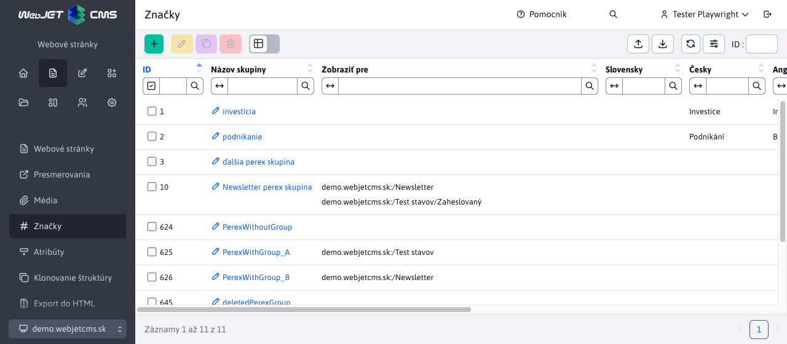

# Značky

Pomocou značiek (pôvodný názov **perex skupiny**) alebo anglicky ```hashtag``` môžete označiť kľúčové slová vo web stránke. V aplikácii novinky je možné použiť filtrovanie noviniek podľa značiek.

Značkám môžete obmedziť zobrazenie len pre určité adresáre web stránok.

Pre prístup k menu položke Web stránky - značky potrebujete mať právo **Web stránky - Značky**, inak sa menu položka nezobrazí.



Značky sa zobrazujú v editore stránok v liste Perex, kde je možné ich jednoducho web stránke priradiť:


