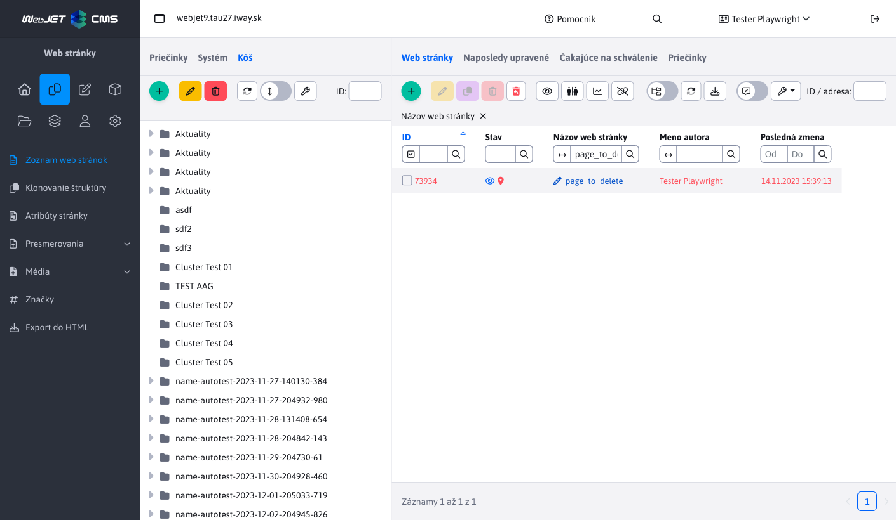
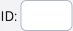
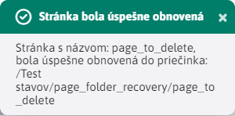
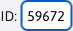
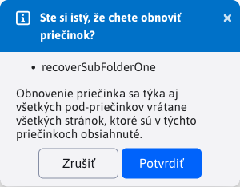
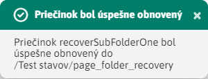

# Obnovenie z koša

Obnovenie web stránok a priečinkov je proces, ktorý sa dá vykonať iba na tých stránkach/priečinkoch, ktoré sú umiestnené v priečinku **Kôš**. K tejto akcií slúži špeciálna ikona .

Technicky obnovenie web stránky je vykonané získaním jej verzie z histórie.



## Obnovenie web stránky

Obnovená web stránka sa presunie z priečinka Kôš do posledného priečinka, kde sa nachádzala pred vymazaním.

Pre úspešné obnovenie web stránky musí platiť:

- Nie je zvolený žiaden priečinok v Koši. Overíte si to tak, že pole ID  kde je identifikátor práve zvoleného priečinka je prázdny. Dôvodom je fakt, že ak stránka bola vymazaná aj s celým priečinkom, tak nemáme kam túto stránku obnoviť. Obnovenie je preto povolené iba u stránok, ktoré neboli vymazané s priečinkom a teda nespadajú pod žiaden pod-priečinok priečinka Kôš.
- Vymazaná web stránka má predchádzajúcu verziu v zozname histórie. Takáto historická verzia je potrebná, aby sme vedeli, odkiaľ bola stránka vymazaná - v akom priečinku sa naposledy nachádzala. Ak vymazaná stránka takúto historickú verziu nemá (napríklad je vymazaná cez aplikáciu mazanie dát), obnovenie stránky nebude možné.
- Musíte mať právo na editáciu cieľového priečinka, do ktorého sa má web stránka obnoviť. V prípade, že toto právo nemáte, obnovenie nenastane a budete vyzvaný ku kontaktovaniu administrátora, ktorý stránku môže obnoviť.

Ak boli splnené všetky požiadavky označte stránku zaškrtnutím možnosti v riadku pri jej ID a kliknite na tlačidlo . Po obnovení budete informovaný o adrese cieľového priečinka, do ktorého sa stránka obnovila.



## Obnovenie priečinka

Obnovený priečinok sa presunie z Koša do posledného priečinka, alebo do ```Koreňového priečinka``` ak priečinok nemá zaznamenanú žiadnu históriu. Obnovia sa aj všetky pod-priečinky a všetky stránky z týchto priečinkov. Stránkam sa nastaví možnosť zobrazovať podľa histórie stránky, alebo na Áno ak stránka nemá históriu.

Pre úspešné obnovenie priečinka musí platiť:

- Musí byť zvolený priečinok v Koši. Overíte si to tak, že pole ID  kde je identifikátor práve zvoleného priečinka nie je prázdny.

Po označení priečinka a stlačení ikony  musíte najskôr potvrdiť akciu obnovenia.



Potvrdením sa spustí akcia obnovenia a na konci ktorej budete oboznámený s jej úspešným ukončením. Pri hlbokej štruktúre môže obnovenie trvať aj niekoľko minút.



### Vlastnosť zobrazovať po obnovení

Nakoľko web stránky, ktoré sa nachádzali v obnovených priečinkoch, chceme uviesť do pôvodného stavu, musíme im nastaviť správnu hodnotu možnosti **Zobrazovať**. Možnosť web stránok **Zobrazovať** sa pri vymazaní priečinka automatický vypla, čím sa web stránky skryli na web sídle (platí to pre všetky web stránky aj tie z adresárov).

Pri obnovení, sa hodnota možnosti **Zobrazovať** nastaví podľa nasledujúcich pravidiel:

- získa sa aktuálny záznam z histórie pre každú obnovovanú web stránku, a jej hodnota **Zobrazovať** sa nastaví podľa vzoru z histórie
- ak neexistuje aktuálny záznam v histórií pre túto stránku, využije sa najnovší neaktuálny záznam z histórie
- ak stránka nemá žiaden záznam v histórii, jej hodnota **Zobrazovať** sa automaticky zapne

**Dajte si pozor na tento rozdiel:**
- pri Obnovení web stránky, sa stránka **NEDÁ obnoviť** bez záznamu v histórii, nakoľko nevieme, kde sa táto stránka nachádzala.
- pri Obnovení priečinka, sa web stránka **DÁ obnoviť** aj bez záznamu v histórii, nakoľko vieme kde sa nachádza (jej poloha v obnovovanom priečinku je jasná) a záznam z histórie používame výhradne na nastavenie hodnoty možnosti **Zobrazovať**.