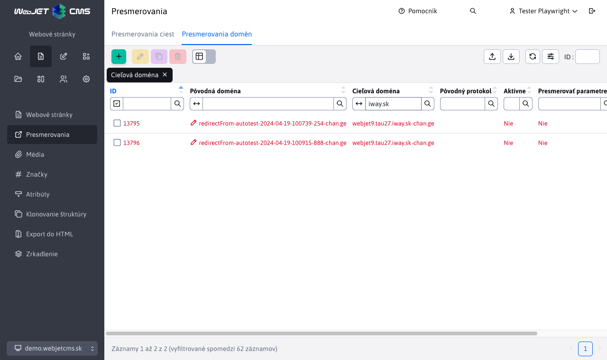
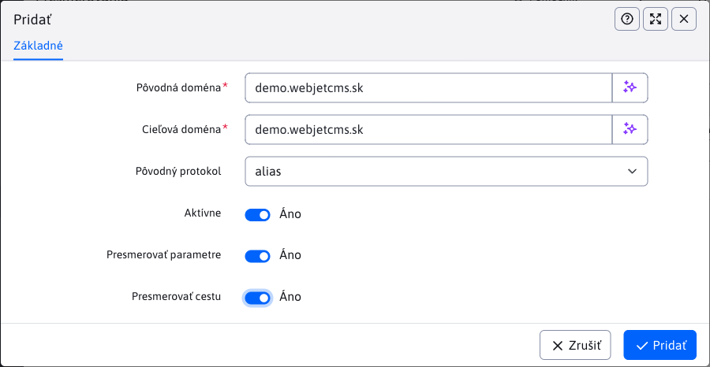

# Presmerovania

## Presmerovania ciest

Zobrazuje zoznam existujúcich presmerovaní, ktoré sa vykonajú, ak zadaná URL adresa neexistuje. Presmerovania vznikajú automaticky pri zmene URL adresy existujúcej stránky alebo pri zmene adresárovej štruktúry.

Kliknutím na ikonu **Pridať** je možné zadefinovať nové presmerovanie. Podporované je aj presmerovanie vrátane parametrov v URL adrese. Najskôr sa hľadá zhoda vrátane parametrov, ak sa nenájde, systém sa pokúsi nájsť zhodu bez zadaných parametrov.

Hodnota poľa [presmerovací kód](https://developer.mozilla.org/en-US/docs/Web/HTTP/Redirections) určuje typ presmerovania, najčastejšie sa používajú nasledovné kódy:

- `301` trvalé presmerovanie, vyhľadávače by si mali upraviť adresu stránky na túto novú hodnotu.
- `302` dočasné presmerovanie.

Môžete nastaviť aj platnosť presmerovania pre určité dátumy, zadaním buď začiatku, alebo konca, alebo oboch dátumov. Presmerovania, ktoré už nie sú časovo platné, sa zobrazia červenou farbou v tabuľke. Do poľa poznámka môžete zadať informáciu, na čo presmerovanie slúži.

### Presmerovania cez regulárne výrazy

Pomocou regulárnych výrazov je možné nastaviť zložitejšie presmerovania celých vetiev URL adries (napr. po migrácii starého webu). Presmerovania cez regulárny výraz sa zadávajú s prefixom `regexp:`.

Pôvodné URL je teda možné zadať vo formáte `regexp:^\/thisiswhere\/oldfiles\/(.+)` ktoré sa bude korektne prekladať na novú URL aj s vykonaním/prenesením skupín na nové URL v tvare `/thisiswhere/myfilesmovedto/$1`

Vykoná sa presmerovanie napr. `/thisiswhere/oldfiles/page.html` na `/thisiswhere/myfilesmovedto/page.html`.

## Čistenie presmerovaní

Karta **Čistenie** umožňuje skontrolovať presmerovania vybranej domény, odstrániť nepotrebné záznamy a skrátiť reťazce presmerovaní.

Čistenie sa vykonáva v dvoch krokoch, aby ste si všetky navrhované zmeny mohli najskôr prezrieť:

1. **Analýza presmerovaní**
2. **Vykonanie čistenia**

!> **Upozornennie:** Pre jednu doménu môže súčasne prebiehať iba jedna analýza alebo jedno čistenie. Ak už operáciu spustil iný administrátor, systém ďalšie spustenie nepovolí, kým sa nedokončí prebiehajúca operácia. V takom prípade sa zobrazí upozornenie, že je potrebné počkať na dokončenie prebiehajúcej operácie.

### Analýza presmerovaní

Analýza presmerovaní sa spustí kliknutím na tlačidlo <button class="btn btn-sm btn-warning" type="button"><i class="ti ti-scan"></i></button> v sekcii **Čistenie**. Počas analýzy sa vyhodnotia všetky existujúce presmerovania a navrhnú sa zmeny, ktoré je možné vykonať.

V náhľade analýzy presmerovaní sa pre každý záznam zobrazí práve jedna z nasledujúcich akcií:

- **Zmazať starú verziu** - odstráni starý cieľ URL adresy, ktorý bol nahradený novším cieľom.
- **Zmazať krok cyklu** - pri cyklickom presmerovaní, napríklad `/a -> /b -> /a`, odstráni najnovšie vytvorený krok, ktorý cyklus uzatvára.
- **Zmazať duplikát** - pri rovnakých presmerovaniach ponechá najstarší záznam a novšie duplikáty odstráni.
- **Skrátiť reťazec** - upraví iba cieľovú URL adresu tak, aby napríklad reťazec `/a -> /b -> /c` skrátil na `/a -> /c`.

**Ignorované presmerovania:**

- presmerovania zadané cez **regulárny výraz** s prefixom `regexp:`
- presmerovania s nastaveným **dátumom zverejnenia**
- presmerovania s nastaveným **koncom platnosti**

Súhrnná správa po analýze uvádza aj počet takýchto ignorovaných záznamov.

Presmerovania bez domény tvoria samostatnú skupinu a nikdy sa nekombinujú s presmerovaniami pomenovanej domény. Predvolene sa analyzuje iba aktuálne zvolená pomenovaná doména. Ak chcete do analýzy pridať aj samostatnú skupinu presmerovaní bez domény, označte možnosť **Zahrnúť presmerovania bez domény**.

Výsledok analýzy sa na 60 minút uloží ako spoločný plán pre aktuálnu doménu. Rovnaký náhľad preto vidia všetci administrátori s právom na správu presmerovaní a čistenie môže vykonať ktorýkoľvek z nich.

### Vykonanie čistenia

Vykonanie čistenia sa spustí kliknutím na tlačidlo <button class="btn btn-sm btn-danger" type="button"><i class="ti ti-trash"></i></button> v sekcii **Čistenie**. Akcia je dostupná iba ak **existuje analýza** pre aktuálnu doménu. Počas vykonávania sa zmeny uložia a presmerovania sa upravia podľa navrhnutého plánu.

Pri vykonaní sa použije presne uložený plán bez novej analýzy. Záznamy, ktoré boli medzičasom odstránené alebo už nie sú dostupné, sa preskočia a ich počet sa zobrazí vo výslednej správe. Ak vykonanie zlyhá, zmeny sa neuložia a plán zostane dostupný na opakovanie.

## Presmerovania domén

V sekcii **Presmerovania domén** môžete definovať presmerovanie požiadaviek celej domény (napr. presmerovanie `domena.sk` na `www.domena.sk`).

V dialógovom okne pre definíciu domény môžete zadať nasledovné hodnoty:

- **Pôvodná doména** - názov domény, ktorú chcete presmerovať, napr. `domena.sk`.
- **Cieľová doména** - názov domény, na ktorú chcete požiadavku presmerovať, napr. `www.domena.sk`, odporúčame zadať aj `http/s` prefix `https://www.domena.sk`.
- **Pôvodný protokol** - určuje, pre aký protokol sa presmerovanie použije:
  - **prázdna hodnota** - presmerovanie sa použije bez ohľadu na protokol.
  - **http** - presmerovanie sa použije len, ak je pôvodný protokol `http` (nastavte, ak chcete presmerovať http verziu na zabezpečenú `https` verziu, v tom prípade aj zadajte do poľa Cieľová doména doménu s protokolom `https://` na začiatku).
  - **https** - presmerovanie sa použije len, ak je pôvodný protokol `https`.
  - **alias** - vytvorí doménový alias - hodnota zadaná v poli Pôvodná doména bude interne pre WebJET videná (a spracovaná) ako hodnota domény v poli Cieľová doména. Použite keď napr. migrujete dáta z produkcie na test, ako pôvodnú doménu zadajte hodnotu v test prostredí a ako cieľovú zadajte doménu v produkcii (bez http prefixu).
- **Aktívne** - presmerovanie sa použije, len ak je toto pole zaškrtnuté.
- **Presmerovať parametre** - ak zaškrtnete, pridajú sa k presmerovaniu aj parametre pôvodnej HTTP požiadavky, napr. `?docid=4`.
- **Presmerovať cestu** - ak zaškrtnete, pridá sa k presmerovaniu aj cesta pôvodnej HTTP požiadavky, napr. `/produkty/webjet/novinky.html`.

