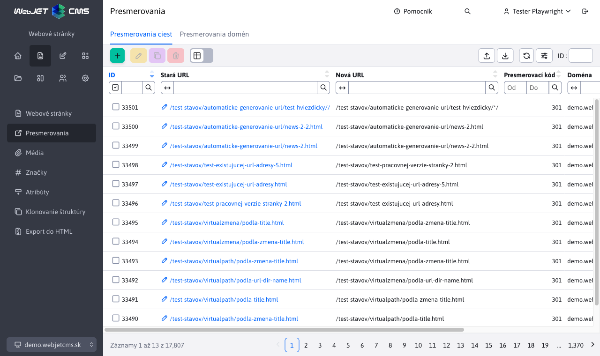
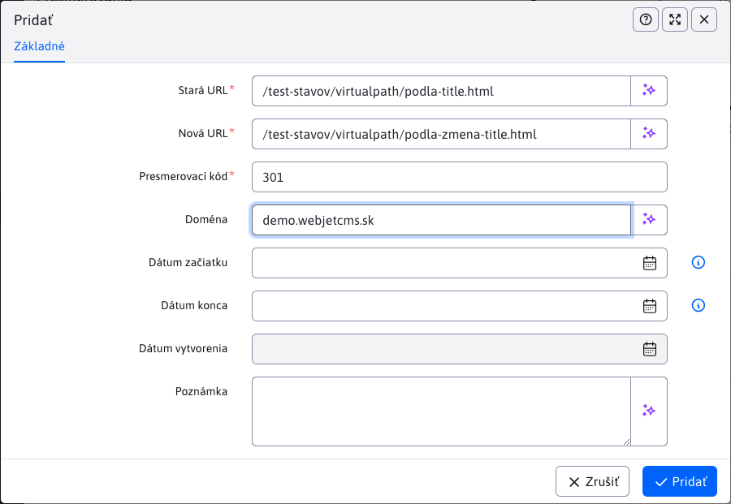
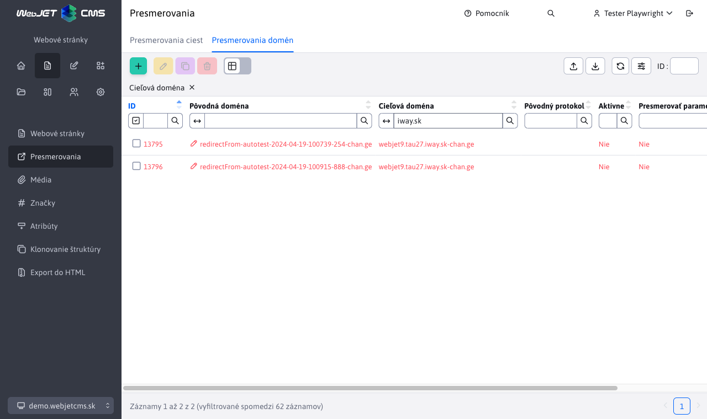

# Presmerovania

## Presmerovania ciest

Zobrazuje zoznam existujúcich presmerovaní, ktoré sa vykonajú, ak zadaná URL adresa neexistuje. Presmerovania vznikajú automaticky pri zmene URL adresy existujúcej stránky alebo pri zmene adresárovej štruktúry.

Kliknutím na ikonu **Pridať** je možné zadefinovať nové presmerovanie. Podporované je aj presmerovanie vrátane parametrov v URL adrese. Najskôr sa hľadá zhoda vrátane parametrov, ak sa nenájde, systém sa pokúsi nájsť zhodu bez zadaných parametrov.

Hodnota poľa [presmerovací kód](https://developer.mozilla.org/en-US/docs/Web/HTTP/Redirections) určuje typ presmerovania, najčastejšie sa používajú nasledovné kódy:

- `301` trvalé presmerovanie, vyhľadávače by si mali upraviť adresu stránky na túto novú hodnotu.
- `302` dočasné presmerovanie.

### Presmerovania cez regulárne výrazy

Pomocou regulárnych výrazov je možné nastaviť zložitejšie presmerovania celých vetiev URL adries (napr. po migrácii starého webu). Presmerovania cez regulárny výraz sa zadávajú s prefixom `regexp:`.

Pôvodné URL je teda možné zadať vo formáte `regexp:^\/thisiswhere\/oldfiles\/(.+)` ktoré sa bude korektne prekladať na novú URL aj s vykonaním/prenesením skupín na nové URL v tvare `/thisiswhere/myfilesmovedto/$1`

Vykoná sa presmerovanie napr. `/thisiswhere/oldfiles/page.html` na `/thisiswhere/myfilesmovedto/page.html`.

## Presmerovania domén

V sekcii **Presmerovania domén** môžete definovať presmerovanie požiadaviek celej domény (napr. presmerovanie `domena.sk` na `www.domena.sk`).

V dialógovom okne pre definíciu domény môžete zadať nasledovné hodnoty:

- **Pôvodná doména** - názov domény, ktorú chcete presmerovať, napr. `domena.sk`.
- **Cieľová doména** - názov domény, na ktorú chcete požiadavku presmerovať, napr. `www.domena.sk`, odporúčame zadať aj `http/s` prefix `https://www.domena.sk`.
- **Pôvodný protokol** - určuje, pre aký protokol sa presmerovanie použije:
  - **prázdna hodnota** - presmerovanie sa použije bez ohľadu na protokol.
  - **http** - presmerovanie sa použije len, ak je pôvodný protokol `http` (nastavte, ak chcete presmerovať http verziu na zabezpečenú `https` verziu, v tom prípade aj zadajte do poľa Cieľová doména doménu s protokolom `https://` na začiatku).
  - **https** - presmerovanie sa použije len, ak je pôvodný protokol `https`.
  - **alias** - vytvorí doménový alias - hodnota zadaná v poli Pôvodná doména bude interne pre WebJET videná (a spracovaná) ako hodnota domény v poli Cieľová doména. Použite keď napr. migrujete dáta z produkcie na test, ako pôvodnú doménu zadajte hodnotu v test prostredí a ako cieľovú zadajte doménu v produkcii (bez http prefixu).
- **Aktívne** - presmerovanie sa použije, len ak je toto pole zaškrtnuté.
- **Presmerovať parametre** - ak zaškrtnete, pridajú sa k presmerovaniu aj parametre pôvodnej HTTP požiadavky, napr. `?docid=4`.
- **Presmerovať cestu** - ak zaškrtnete, pridá sa k presmerovaniu aj cesta pôvodnej HTTP požiadavky, napr. `/produkty/webjet/novinky.html`.

