# Práca v editore

WebJET obsahuje inteligentný editor web stránok, ktorý vám čo najvernejšie zobrazuje, ako daná stránka bude vyzerať.

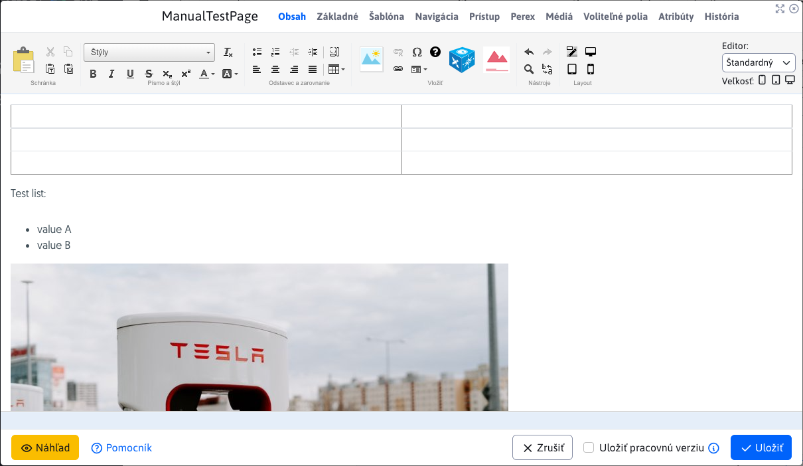

## Práca s textom (písanie / vkladanie / kopírovanie)

Pri práci s textom si musíte v prvom rade uvedomiť rozdiel medzi odsekom a zalomeným textom, čiže rozdelením vety do ďalšieho riadku. Jednotlivé odseky vytvoríte bežným stlačením ```ENTER```, zatiaľ čo zalomenie textu pomocou klávesovej kombinácie ```SHIFT + ENTER```.

Rozdiel medzi nimi je zreteľný hlavne kvôli väčšiemu odsadeniu medzi odsekmi (oproti zalomeniu textu). Ďalší dôležitý rozdiel je v tom, že viaceré úpravy textu (ako napríklad vytvorenie nadpisu) sa aplikujú na celý odsek. Pokiaľ takýto odsek obsahuje zalomenie riadka, tak sa táto zmena aplikuje aj na zalomený riadok.

Pokiaľ chcete, aby sa text po napísaní medzery nezalomil, môžete okrem normálnej medzery vložiť **pevnú medzeru**. Takýto prípad sa môže vyskytnúť napríklad pri písaní dátumov ```10. 2. 2009``` alebo rôznych iných textov, ktoré by nemali byť rozdelené na dva riadky, ako napr. veľkosť súborov ```123 kB``` alebo telefónne číslo ```0905 123 456```. Pevná medzera sa vkladá klávesovou kombináciou CTRL+Medzera. Vzhľadovo sa nijak neodlišuje, rozdielne je len jej správanie sa voči okolitému textu na konci riadka.

**Text vo WebJET editore môžete upravovať nasledovnými spôsobmi**:

- písaním priamo do editora
- vložením z iného dokumentu (```DOC```, ```PDF```, ```XLS```, iná web stránka...)

### Vloženie z iného dokumentu

**Klasické vloženie textu** z panelu nástrojov pomocou ikony alebo kombináciou kláves ```CTRL + v```. Pri vložení textu týmto spôsobom sa text vloží aj s pôvodným formátovaním zdrojového textu. Tento spôsob je však neželaný hlavne z dôvodu ponechania jednotného štýlovania textov na celom webe podľa preddefinovaných štýlov.

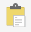

**Vloženie neformátovaného textu** z panelu nástrojov pomocou ikony alebo kombináciou kláves ```CTRL + t``` či ```CTRL + SHIFT + v```.
Tento spôsob vkladania textu vám text vloží bez akéhokoľvek formátovania, pre vkladanie bežného textu je preto najvhodnejší.

**Vloženie textu z ```Word``` / ```Excel``` súboru** z panelu nástrojov pomocou ikony  alebo kombináciou kláves ```CTRL + w```.
Táto možnosť vloží text so zachovanými odsekmi a tabuľkami, ale očistený od všetkých štýlov z pôvodného dokumentu. Bohužiaľ niektoré prehliadače majú túto klávesovú skratku vyhradenú na zavretie okna/záložky, takže v
takom prípade je lepšie vkladať text cez kliknutie na ikonku v paneli nástrojov a nie cez klávesovú skratku.

### Kopírovanie textu

Kopírovanie textu je možné označením textu a kliknutím na ikonku  (alebo kombináciou kláves ```CTRL + c```).

### Vystrihnutie textu

Vystrihnutie textu je možné označením textu a kliknutím na ikonku  (alebo kombináciou kláves ```CTRL + x```).

## Práca so štýlmi a formátovanie textu

Vo WebJETe máte k dispozícii istý počet preddefinovaných štýlov pre nadpisy a pre písma, ktoré sa používajú na štýlovanie stránky do prijateľnej formy. Správne definovanie nadpisov má zároveň značný význam pre optimalizáciu pre vyhľadávače (```SEO```) a vnútornú štruktúru dokumentu.

Preddefinované nadpisy sa aplikujú vždy na celý odsek. Nadpis vytvoríte kliknutím do požadovaného odseku, z ktorého chcete urobiť nadpis a z rozbaľovacej ponuky vyberiete požadovanú úroveň nadpisu.

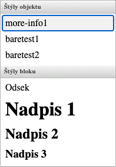

Na každej web stránke by mal byť vždy iba jeden hlavný Nadpis 1, ktorým by sa mal text začínať. Nakoľko tento nadpis je na štandardne stránke automaticky vygenerovaný z názvu stránky (ak to tak šablóna definuje), nie je potrebné ho vkladať do tela stránky. Sekcie v rámci stránky sa oddeľujú Nadpisom 2, ich pod-sekcie Nadpisom 3, atď.

V tejto ponuke sú aj ďalšie preddefinované štýly, ich použitie však vychádza z ich pomenovania, napríklad štýly obsahujúce text "tabuľka" sa používajú len na tabuľky a podobne. Kliknutím do ľubovoľného textu stránky v editore sa vám do poľa Štýl automaticky nastaví štýl použitý na danej pozícii kurzora. Aktuálne použitý štýl je zvýraznený podfarbením jeho názvu. Pre elementy typu `DIV,SECTION` je možné nastaviť viacero štýlov. Opakovaným zvolením už nastaveného štýlu sa tento štýl odstráni.

Pokiaľ chcete zmeniť štýl takéhoto textu v rámci odseku, nesmiete text označovať. Stačí kliknúť do daného textu v stránke, štýl farby sa automaticky pred-nastaví v rozbaľovacej ponuke **Štýl** a následne ho môžete zmeniť na iný štýl.

Pomocou preddefinovaných štýlov môžete text na stránke aj zvýrazňovať. Vo výbere nájdete napr. rôzne typy nadpisov, farebné zvýraznenia. Používanie štýlov zabezpečí jednotný vzhľad stránok.

Ďalší spôsob formátovania textu je pomocou nasledujúcich štandardných nástrojov (aplikujú sa označením textu, ktorý chcete upraviť):

- 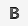, **hrubé písmo**
- 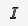, *kurzíva*
- 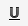, <ins>podčiarknutie</ins>
- 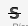, ~~prečiarknutie~~
- 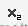, <sub>horný index</sub>
- 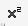, <sup>dolný  index</sup>

Formátovanie textu pomocou nástroja na zmenu farby textu 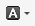 a podfarbenia textu 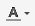 odporúčame nepoužívať, nakoľko spôsobuje grafickú nekonzistentnosť web stránky a degraduje jej hodnotu v rámci web sídla.

## Odstraňovanie formátovania

Ak chcete zrušiť štýl nadpisu, kliknite do textu nadpisu a zvoľte z rozbaľovacej ponuky prvú položku **Odsek**. Následne by sa mal štýl nadpisu z textu odstrániť (platí pre všetky štýly z rozbaľovacej ponuky).

Pokiaľ chcete odstrániť z textu bežné formátovanie napríklad tučný text alebo kurzívu, môžete to spraviť dvomi spôsobmi. Buď po označení daného textu znova kliknete na daný formátovací nástroj, až kým sa formátovanie nezruší, alebo použijete univerzálny nástroj na odstraňovanie formátovania 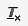

Tento nástroj funguje tak, že formátovaný text označíte a po kliknutí na  sa odstráni formátovanie na označenom texte. Tento nástroj odstraňuje aj kombinované formátovanie na texte (napr. kurzíva a tučný text spolu)

## Zoznamy (odrážkové / číslované) a odsadenie textu

Na vytvorenie očíslovaného zoznamu slúži ikonka 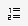.
Na vytvorenie odrážkového (nečíslovaného) zoznamu slúži ikonka 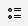.

Z obyčajného odseku vytvoríte zoznam tak, že kliknete do daného odseku a kliknete na ikonku požadovaného zoznamu (číslovaný alebo odrážkový).

Pokiaľ chcete zmeniť typ odrážok pri číslovanom zozname, kliknite do položky zoznamu a cez kontextové menu (pravý klik myši) sa dostanete do vlastností zoznamu, kde si môžete zvoliť iný typ zoznamu.

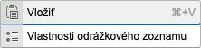

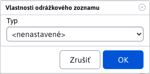

Pokiaľ chcete vytvoriť vnorený zoznam, kliknete do danej položky zoznamu a kliknutím na ikonku odsadenia doprava 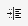 vytvoríte vnorený zoznam. Zrušiť vnorený zoznam môžete ikonkou na odsadenie textu doľava .

Vytváranie zoznamu ukončíte dvoj násobným stlačením klávesy ```ENTER``` na konci zoznamu.

## Odkazy na súbory a nahrávanie súborov

Ak chcete vytvoriť odkaz na dokument/súbor označte si text, ktorý má byť odkazom, kliknete na ikonku Odkaz 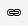 alebo pomocou skratky ```CTRL + k```, zobrazí sa vám dialógové okno pre vytvorenie odkazu:

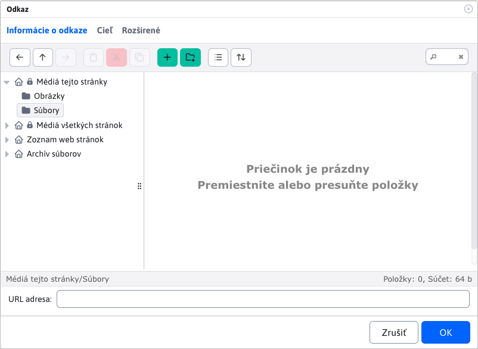

- v prípade ak je dokument **určený len pre aktuálnu web stránku**, je potrebné zvoliť položku “Média tejto stránky” a v nej položku “Súbory”.
  - Vyhľadáte dokument, kliknete naň a odkaz na dokument sa automaticky skopíruje do poľa URL.
  - V prípade ak sa v zozname požadovaný dokument nenachádza, funkciou ```drag&drop``` je možné nahrať dokument z vášho počítača
  - Potvrdíte OK, čím sa vám na vyznačenom mieste vytvorí odkaz na súbor.

- v prípade ak dokument **nie je určený len pre danú stránku** (dokument sa môže nachádzať aj na inej stránke), je potrebné zvoliť položku **Média všetkých stránok** a v nej položku **Súbory**.
  - Zobrazí sa vám adresárová štruktúra adresárov a súborov na serveri, na ktoré máte povolený prístup.
  - Vyhľadáte v adresároch požadovaný súbor, kliknete naň a odkaz na dokument sa automaticky skopíruje do poľa URL
  - Potvrdíte OK, čím sa vám na vyznačenom mieste vytvorí odkaz na súbor.

Podľa smernice na prístupnosť web sídla by všetky textové súbory na stiahnutie nachádzajúce sa na web stránkach mali byť uverejňované hlavne vo formáte ```PDF```. Formáty používané aplikáciou ```Word``` a ```Excel``` (```DOC``` a ```XLS```) nie sú vyhovujúce.

Pokiaľ máte na to oprávnenie, tak môžete v danom adresári pre súbory vytvárať aj nové pod-adresáre kliknutím na ikonku .
Názvy súborov na serveri by nemali obsahovať medzery, špeciálne znaky a písmená s diakritikou.

## Vkladanie a úprava odkazov na iné web stránky

Linky / odkazy na ďalšie stránky vkladáte podobne ako odkaz na dokument/súbor:

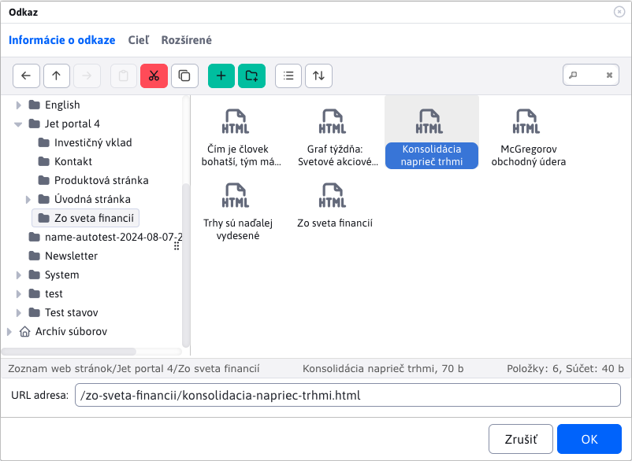

- Označte text (slovo), ktorý má byť klikateľný ako odkaz. Potom kliknete na ikonku Odkaz  alebo pomocou skratky ```CTRL+ k```. Otvorí sa vám dialógové okno, v ktorom je potrebné zvoliť položku **Web stránky** a v stromovej štruktúre vyhľadať stránku na ktorú chcete vytvoriť odkaz. Po kliknutí na meno stránky sa vám do poľa URL adresa skopíruje adresa označenej stránky. Potvrdením ```OK``` sa vám na stránke vytvorí odkaz na zvolenú web stránku.

- Ak chcete vložiť odkaz na stránku nachádzajúcu sa na inom web sídle (linka na externú web stránku), zadajte jej adresu priamo do poľa URL adresa (aj s prefixom ```https://```). Zároveň sa automaticky zmení pole **Cieľ** (v karte Cieľ) na hodnotu **Nové okno (```_blank```)**, čo zabezpečí, že po kliknutí na tento odkaz sa stránka otvorí v novom okne/karte prehliadača. Pole **Cieľ** sa na hodnotu  **Nové okno (```_blank```)** nastavuje aj v prípade, ak chcete vytvoriť odkaz na dokument na stiahnutie. Ak nechcete, aby sa odkaz otvoril do nového okna, treba parameter **Cieľ** nastaviť na hodnotu **To isté okno ```_self```**. Pri odkazoch na externé web stránky a na dokumenty je však otvorenie odkazu do nového okna odporúčané.

## Tlačidlá

Ak je vo web stránke vložený odkaz, alebo tlačidlo, ktoré má nastavený CSS štýl obsahujúci výraz `btn-` alebo CSS štýl má nastavenú hodnotu `display` obsahujúcu `block`, teda aj napríklad `inline-block` zobrazí sa po kliknutí na takýto odkaz v editore okno nastavenia tlačidla. V ňom je možné jednoducho zmeniť text tlačidla a nastaviť odkaz po kliknutí. Môžete prípadne aj zmeniť farbu pozadia, písma a zaoblenie rohov, štandardne ale tieto hodnoty neodporúčame meniť - mali by byť nastavené podľa CSS štýlov web stránky.

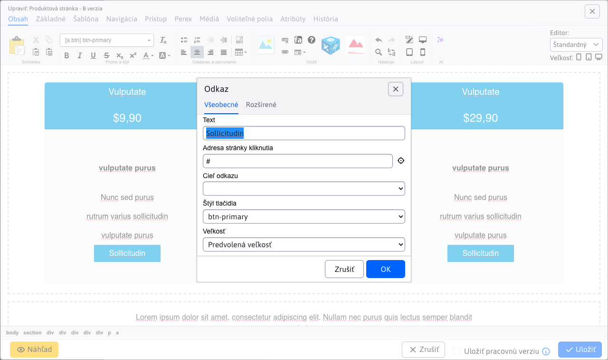

## Vkladanie obrázkov

Ak chcete vložiť na stránku obrázok, umiestnite kurzor na riadok alebo do bunky tabuľky, kde sa obrázok má nachádzať, a kliknite na ikonku pre vloženie obrázku .

Ak chcete zmeniť existujúci obrázok je potrebné najprv raz kliknúť na obrázok, ktorý si želáte zmeniť. Následne je treba kliknúť na rovnakú ikonku vložiť/zmeniť obrázok alebo cez kontextové menu na položku **Vlastnosti obrázku**. Ďalší postup je v oboch prípadoch zhodný.

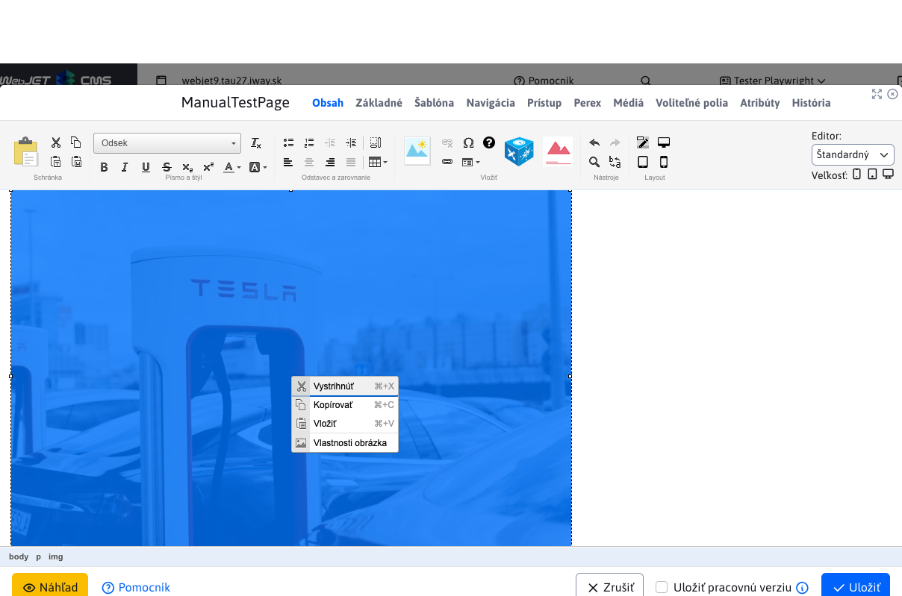

Po kliknutí na ikonku sa vám zobrazí dialógové okno na vloženie obrázka:

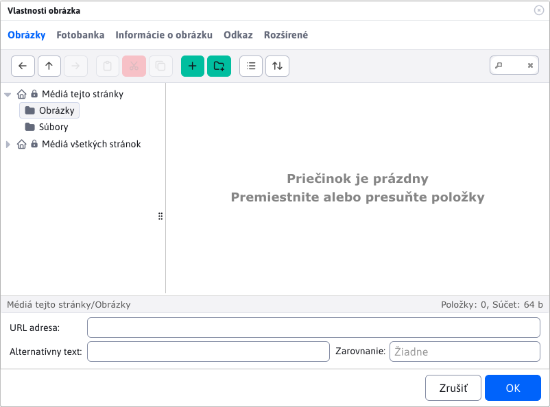

Pri prechádzaní cez stromovú štruktúru sú zobrazené len súbory typu obrázok alebo video, ostatné súbory sú filtrované.

### Karta Obsah

Ak sa súbor obrázka už nachádza na serveri, môžete ho vyhľadať v adresárovej štruktúre a kliknutím naň sa umiestnenie obrázka automaticky zapíše do políčka URL adresa.

Pri obrázkoch je potrebné zadefinovať aj Alternatívny text pre obrázok, ktorý sa využíva hlavne pre komunikáciu so slabozrakými a nevidiacimi návštevníkmi web stránky, alebo keď má používateľ vypnuté zobrazovanie obrázkov na web stránkach. Alternatívny text by mal vystihovať, čoho sa obrázok týka alebo čo je na ňom zobrazené.

Po zvolení obrázka sa automaticky vyplnia polia šírka a výška, ktoré definujú aktuálnu veľkosť zvoleného obrázka.

### Karta Fotobanka

Karta **Fotobanka** umožňuje získanie (stiahnutie) obrázkov z bezplatnej online platformy [Pixabay](https://pixabay.com). Táto platforma poskytuje rozsiahlu zbierku obrázkov, ktoré je [možné použiť zdarma](https://pixabay.com/service/license-summary/).

Po zadaní a vyhľadaní výrazu, Vám budú ponúknuté vyhovujúce obrázky. Ponuka obsahuje niekoľko strán, medzi ktorými viete prechádzať.

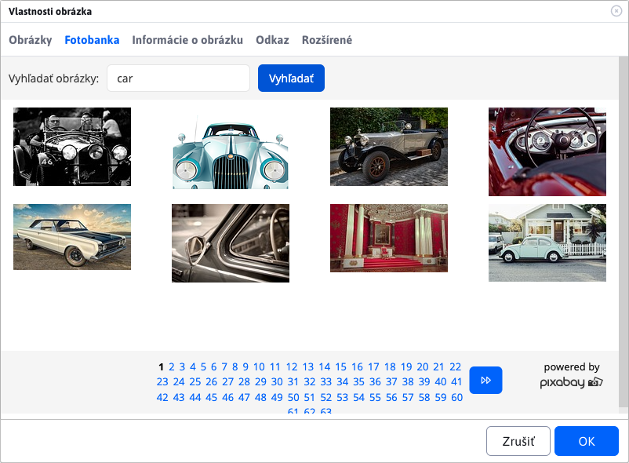

Po kliknutí na niektorý z ponúkaných obrázkov sa zobrazí dialóg, s náhľadom a hodnotami **šírka** / **výška** daného obrázka.


Ak si želáte zmeniť rozmery obrázka, môžete upraviť hodnotu **šírka** a jeho **výška** sa automaticky vypočíta podľa pôvodného pomeru obrázka.


Následne po kliknutí na tlačidlo **Uložiť do WebJET** sa obrázok stiahne a uloží. Automaticky sa prepne karta na **Obsah**, kde máte okamžite tento obrázok dostupný.


**URL adresa zdroja obrázku**

Uložené obrázky z **Fotobanky** majú automaticky vyplnenú hodnotu **URL adresa zdroja obrázku**. Túto hodnotu si viete pozrieť/upraviť v časti [Prieskumník](../../files/fbrowser/README.md) pri akcii [Úprava súborov](../../files/fbrowser/file-edit/README.md).


### Video súbory

Cez dialógové okno pre vloženie obrázku môžete vkladať aj video súbory. Buď priamo z vášho servera výberom video súboru, alebo do poľa URL adresa zadáte odkaz na web stránku `YouTube/Facebook/TikTok`.

WebJET automaticky pre video súbor vloží namiesto obrázka video prehrávač.

### Editácia obrázkov

Pokiaľ je obrázok príliš veľký a nevojde sa vám do stránky, alebo potrebujete vykonať v obrázku inú zmenu môžete použiť editor obrázkov. Kliknite na obrázok a následne na ikonu ceruzky pre otvorenie [editora obrázkov](../../image-editor/README.md).

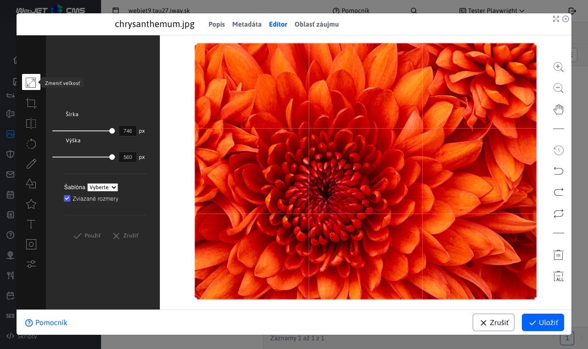

## Vkladanie a úprava tabuliek

Tabuľku je možné vytvoriť dvomi spôsobmi. Použiť preddefinovanú oštýlovanú tabuľku, alebo vložiť tabuľku kopírovaním z ```Word``` / ```Excel``` súboru.

### Vytvorenie farebnej tabuľky

Tabuľku vytvoríte kliknutím na ikonku **Vložiť tabuľku**,  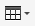:

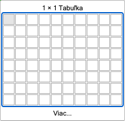

V prípade ak potrebujete vytvoriť komplexnejšiu tabuľku, je potrebné kliknúť na **Viac** kde sa vám zobrazí dialógové okno pre nastavenie tabuľky:

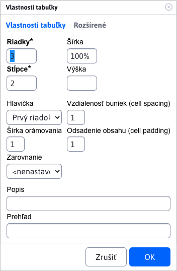

Tu môžete nastaviť počet stĺpcov a riadkov. Pokiaľ chcete, aby sa tabuľka šírkou prispôsobovala obsahu, tak šírku zadávať nemusíte (vymažte pred-vyplnenú hodnotu). Ostatné parametre by mali ostať s nulovou hodnotou, aby sa nebili s prednastaveným štýlom tabuľky. Potvrdením ```OK``` vložíte tabuľka na pôvodnú pozíciu kurzora.

### Vkladanie tabuľky z ```Word``` a ```Excel``` súboru

Pri vkladaní tabuľky z iných aplikácií, resp. dokumentov cez klávesovú skratku ```CTRL + v``` sa vás systém automaticky spýta, či chcete tabuľku vyčistiť. Pokiaľ kliknete ```OK```, tak editor očistí tabuľku  od neželaných formátovacích znakov pôvodného dokumentu, ale ponechá štruktúru tabuľky v pôvodnej forme.

Tabuľka zostane v obsahu stránky zachovaná aj vtedy, ak použijete na vkladanie textu nástroj na vkladanie textu z ```Word``` / ```Excel``` súboru (```CTRL + w```) 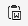.

### Úprava existujúcej tabuľky

Ak potrebujete nejakým spôsobom upraviť existujúcu tabuľku, ktorá sa na stránke nachádza, alebo ktorú ste tam práve vložili niektorým z už spomenutých spôsobov, tak na jej úpravu máte k dispozícii viacero nástrojov. Kliknutím do niektorej z buniek tabuľky pravým tlačidlom myši sa vám zobrazí kontextové menu.

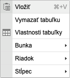

Pre vymazanie alebo pridanie ďalšieho riadka slúži pod-menu položky **Riadok**.

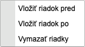

Pre vkladanie alebo zmazanie stĺpca slúži pod-menu položky **Stĺpec**.

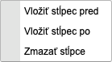

Pokiaľ chcete zlúčiť dve susedné bunky (v rámci riadka), tak musíte označiť ich obsah (ak neobsahujú žiaden text najskôr do bunky zadajte ľubovoľný text aby sa dala bunka lepšie označiť), kliknúť pravým tlačidlom na tento označený obsah a zvoliť pod-menu položky **Bunka** a v tomto pod-menu položku **Zlúčiť bunky**.


Obsah buniek sa potom zlúči do jednej a vy ho môžete ďalej upravovať.

Pokiaľ chcete odstrániť pôvodné orámovanie tabuľky, zmeniť odsadenie buniek, alebo urobiť tabuľku farebnú kliknite na položku **Vlastnosti tabuľky**. Zobrazí sa vám dialógové okno, v ktorom môžete zmeniť rôzne parametre tabuľky okrem počtu riadkov a stĺpcov tabuľky (tie sa upravujú už spomenutým spôsobom na predchádzajúcej strane).


Pokiaľ chcete, aby sa tabuľka svojou šírkou prispôsobovala obsahu, tak sa šírka tabuľky zadávať nemusí (vymažte hodnotu). Ak chcete, aby bola tabuľka na celú šírku stránky, tak môžete zadať hodnotu 100 percent. Výšku nezadávajte.

Pokiaľ chcete zmeniť zarovnanie textu v bunke tabuľky na stred alebo doprava, tak kliknite do danej bunky pravým tlačidlom myši a zvoliť pod-menu položky **Bunka** a v tomto pod-menu položku **Vlastnosti bunky**.

Zobrazí sa vám dialógové okno pre vlastnosti bunky, v ktorom si môžete nastaviť vertikálne alebo horizontálne zarovnanie textu v bunke. Ostatné parametre v okne nemeňte.

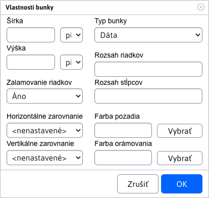

## Vloženie aplikácie

Pre vloženie aplikácie kliknite na ikonu modrej kocky aplikácie . Zobrazí sa nám dialógové okno so zoznamom aplikácií:

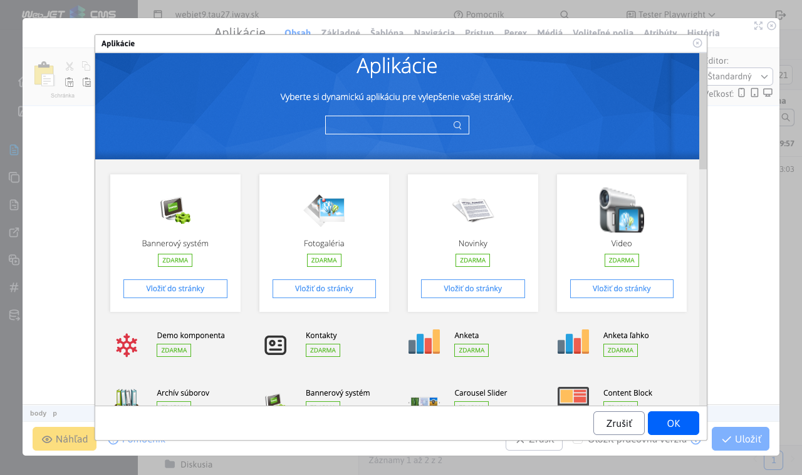

Do vyhľadávania môžete zadať názov aplikácie:

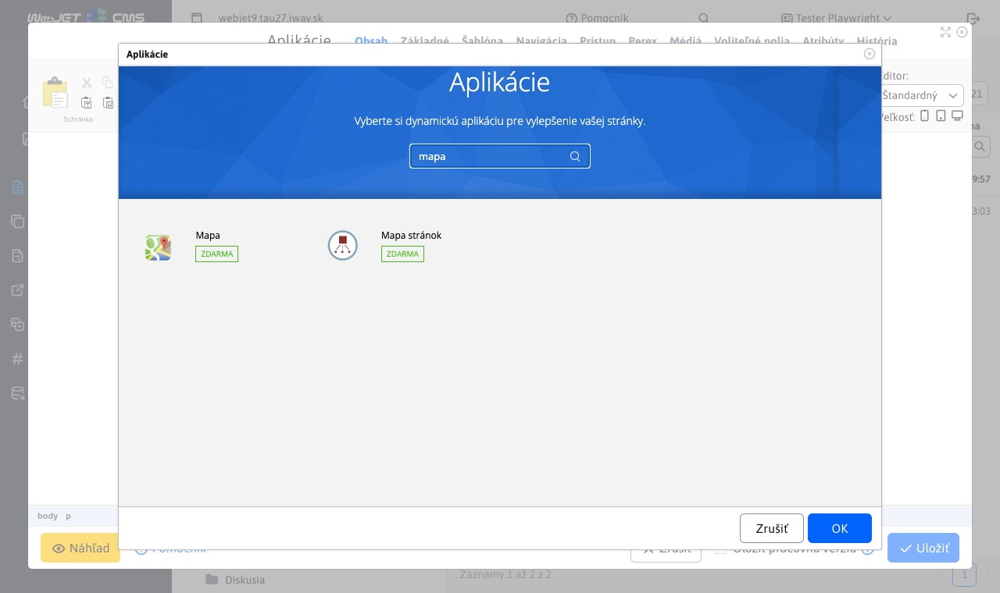

Po kliknutí na meno aplikácie sa zobrazia podrobnosti o aplikácii - jej opis, fotky a možnosť vložiť aplikáciu do stránky:

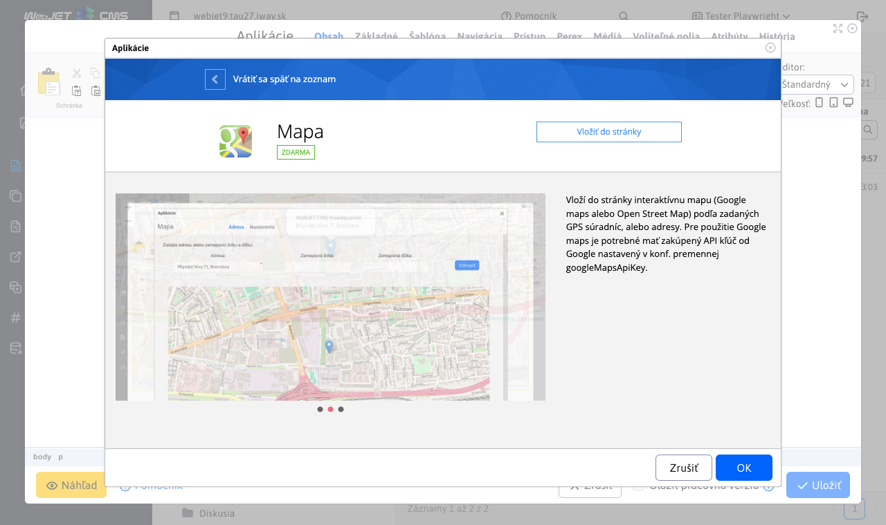

Pri kliknutí na tlačidlo "Vložiť do stránky" sa aplikácia vloží do stránky a zobrazia sa nastavenia aplikácie:

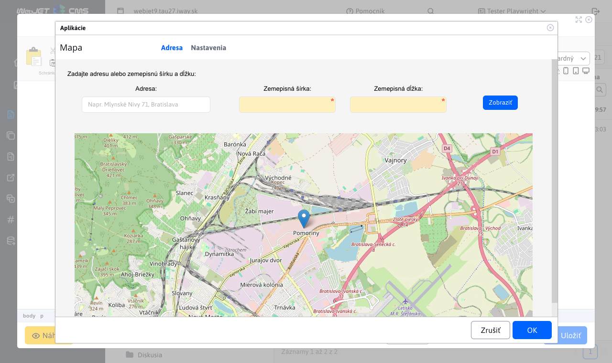

Ak už je aplikácia vložená v stránke kliknutím do vnútra aplikácie sa vám zobrazí rovnaké okno nastavenia aplikácie. Môžete tak jednoducho upraviť jej existujúce nastavenia.

### Karta zobrazenie

Väčšina aplikácii obsahuje kartu Zobrazenie pre spoločné nastavenia (ak táto možnosť v aplikácii nie je z rôznych dôvodov vypnutá).


Karta obsahuje parametre:

- Zobrazenie na zariadeniach, slúžiaci na nastavenie [podmieneného zobrazenia aplikácia](../../../custom-apps/appstore/README.md#podmienené-zobrazenie-aplikácie) na zariadeniach typu tablet, telefón alebo štandardný počítač. Ak nie je zvolená žiadna možnosť, zobrazí sa aplikácia na všetkých zariadeniach (rovnako ako keď sú zvolené všetky možnosti).
- Prihlásený používateľ - umožňuje nastaviť zobrazenie aplikácie podľa stavu prihlásenia návštevníka web sídla - zobrazenie vždy, len ak je používateľ prihlásený, alebo ak nie je prihlásený. V editore stránok sa aplikácia zobrazí vždy, ale v náhľade, alebo zobrazení stránky sa zobrazí podľa nastavenej hodnoty.
- Čas vyrovnávacej pamäte (minúty) - slúži na nastavenie doby v minútach, po akú má byť inicializovaná aplikácia uložená vo vyrovnávacej pamäti pre jej rýchlejšie zobrazenie. Napríklad zoznam noviniek sa nemení často a ich načítanie je náročné na databázový server, je teda vhodné nastaviť napríklad hodnotu 30. Ak je prihlásený administrátor, vyrovnávacia pamäť sa nepoužije a vždy sa zobrazia aktuálne údaje.

## Pred pripravené bloky

Editor stránky ponúka možnosť vkladania prednastavených blokov (```HTML``` objektov) na stránku. Napr. tabuľka, text, kontaktný formulár atď. Viete vložiť aj obsah inej stránky do aktuálnej stránky (napr. opakujúci sa formulár).

Zobrazenie blokov vykonáte kliknutím na ikonu   v editore stránky, ktorá zobrazí dialógové okno s kategóriami blokov.

Viac informácii v opise aplikácie [pred-pripravené bloky](../../apps/htmlbox/README.md).

## Vkladanie špeciálnych znakov

Môžu nastať prípady, keď budete potrebovať pri písaní napísať aj znaky, ktoré slovenská klávesnica neobsahuje, napríklad znak Dolára (```$```), Euro (```€```) alebo zavináč (```@```). Na uľahčenie práce máte k dispozícii vkladanie špeciálnych znakov pomocou pripraveného modulu. Kliknutím na ikonku 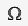 sa vám zobrazí dialógové okno s ponukou špeciálnych (ale aj štandardných) znakov.

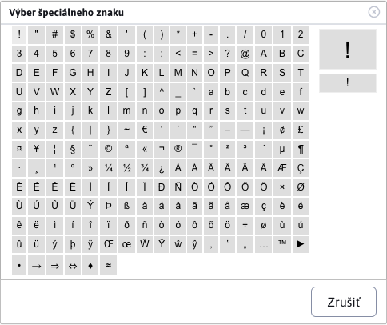

Po kliknutí na požadovaný znak sa vám daný znak napíše na pozíciu kurzora. Špeciálne znaky sa vkladajú ako text, takže nemajú žiadne ďalšie nastavenia.

!> Upozornenie: ikona pre vkladanie špeciálnych znakov môže byť v niektorých prípadoch zmenená na ikonu  pre vkladanie [FontAwesome](../../../frontend/webpages/fontawesome/README.md) obrázkov.

## Detekcia zmeny obsahu stránky

Editor stránok obsahuje mechanizmus, ktorý detekuje zmeny obsahu stránky. Keď kliknete na tlačidlo Zrušiť na zatvorenie okna a zároveň boli vykonané zmeny v obsahu stránky, zobrazí sa vám dialógové okno s upozornením, že neboli uložené zmeny. Kliknutím na OK okno zatvoríte bez uloženia zmien, kliknutím na Zrušiť sa vrátite späť do editora stránky.

Po otvorení stránky v editore sa po 5 sekundách získa aktuálny obsah stránky (aby sa stihli načítať všetky skripty a náhľady aplikácii) a tento sa následne porovnáva s aktuálnym obsahom pri kliknutí na tlačidlo Zrušiť. Čiže správna detekcia funguje po 5 sekundách od otvorenia stránky v editore.