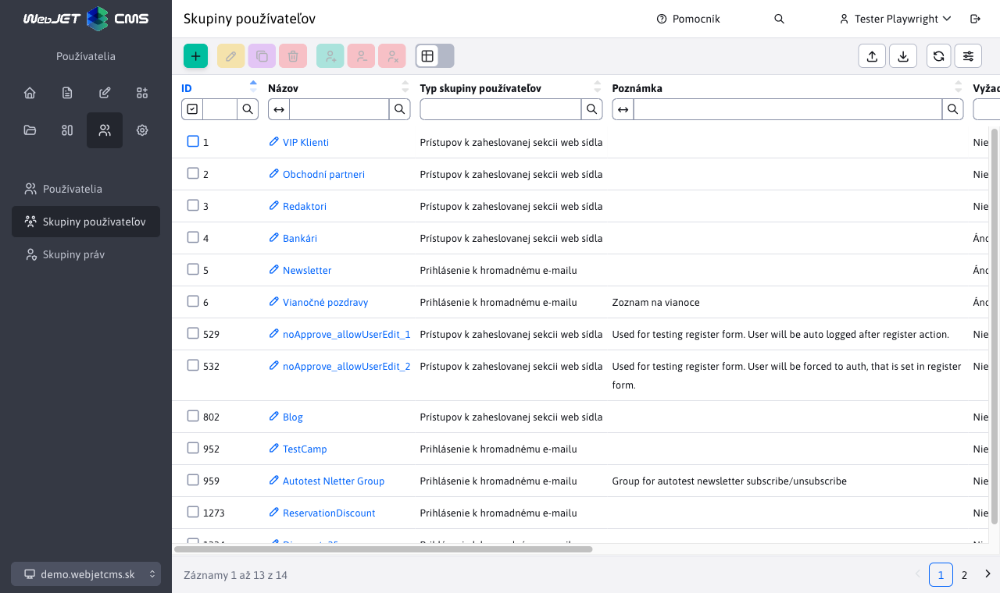
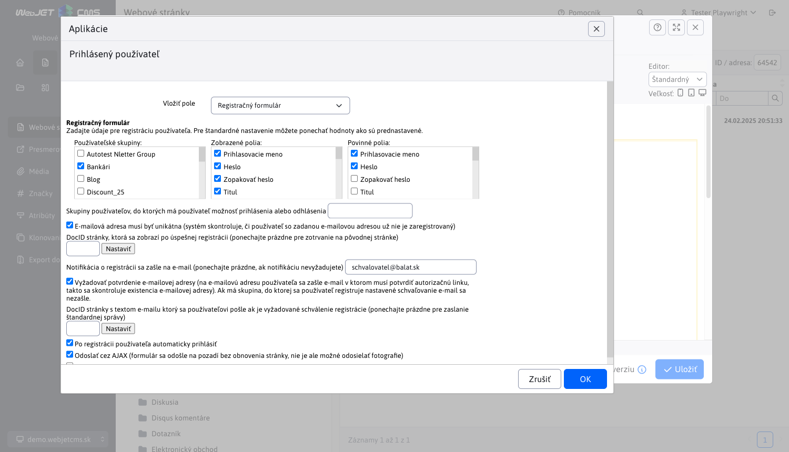
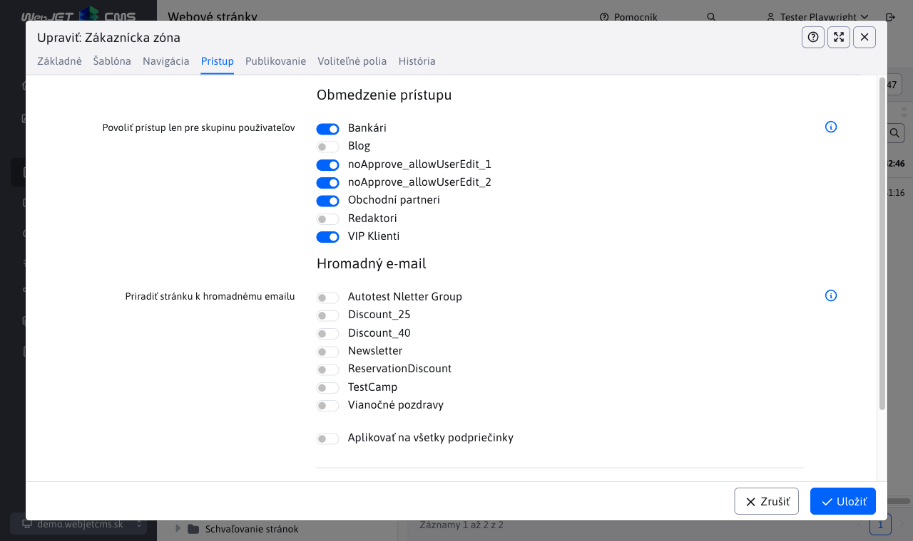
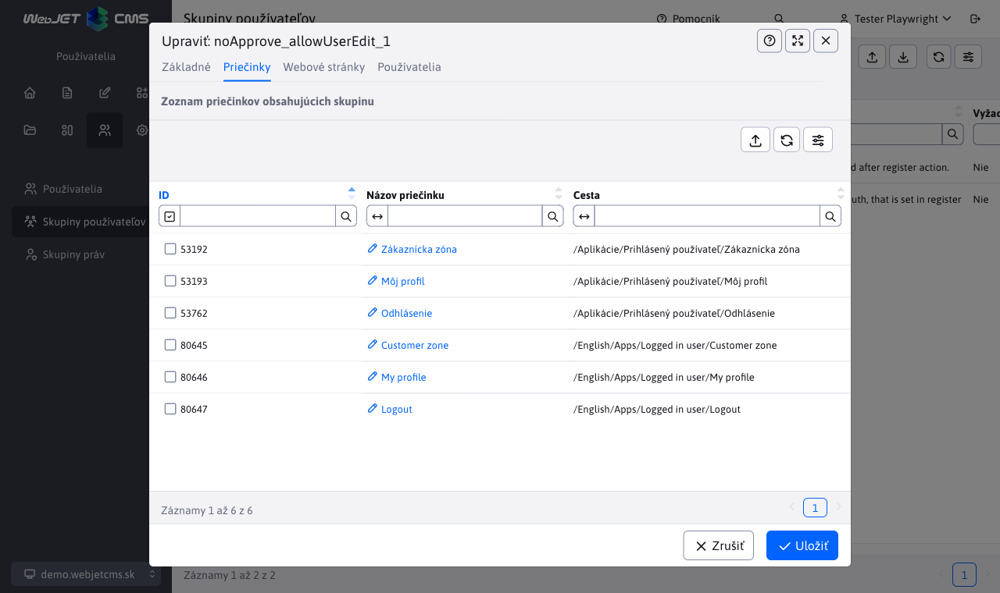

# Zaheslované stránky

Pomocou zaheslovaných stránok je možné definovať časť web sídla prístupnú len po zadaní mena a hesla - niekedy označované ako členská sekcia, respektíve sekcia s kontrolovaným prístupom. Je možné definovať viacero skupín používateľov a tým zadefinovať niekoľko rôznych častí web sídla dostupných pre používateľov v rôznych skupinách. Jedna časť webu môže byť dostupná len pre Klientov a iná zase pre Obchodných partnerov.

## Definovanie skupín

Najskôr je potrebné zadefinovať skupiny používateľov. Zoznam skupín používateľov je dostupný v ľavom menu v sekcii **Používatelia** ako **Skupiny používateľov**.



Systém rozlišuje dva typy skupín:

- Prístupov k zaheslovanej sekcii web sídla - skupina pre zaheslované stránky
- Prihlásenie k hromadnému e-mailu - skupina pre distribučný zoznam na posielanie emailov

Nás ďalej zaujíma práve typ **Prístupov k zaheslovanej sekcii web sídla**. V editore môžete nastaviť vlastnosti:

- Názov - unikátny názov skupiny.
- Typ skupiny používateľov - typ skupiny, ktorý sme spomínali vyššie.
- Poznámka - ľubovoľná poznámka.
- Vyžaduje schválenie - ak je zaškrtnuté tak po zaregistrovaní používateľa do tejto skupiny sa najskôr zašle email na schválenie registrácie administrátorovi. Používateľ sa vytvorí v databáze, nebude mať ale zvolenú možnosť Schválený a nebude sa môcť prihlásiť.
- Povoliť pridávanie/odoberanie zo skupiny samotným používateľom - ak je zvolené, tak skupinu si bude môcť pridať/odobrať sám používateľ pri registrácii, alebo v jeho profile/nastaveniach. Zvyčajne sa používa pre skupiny pre hromadný email, aby si sám používateľ mohol nastaviť do akých emailových skupín bude prihlásený. Možnosť je potrebné zvoliť aj pre skupiny k zaheslovanej sekcii do ktorých sa môže používateľ registrovať. Napr. používateľ sa registruje do skupiny Zákazník, ktorá má povolenú možnosť, ale skupina Veľkoobchod túto možnosť nemá a skupinu môže priradiť zákazníkovi len administrátor.
- Vyžadovať potvrdenie e-mailovej adresy - ak je nastavené, tak používateľovi bude po registrácií odoslaný email s odkazom, na ktorý bude musieť kliknúť pre overenie platnosti email adresy.
- ID stránky s textom e-mailu - ID stránky s textom emailu ktorý sa používateľovi zašle po jeho schválení. Typicky sa jedná o uvítací email.


Do stránky s textom e-mailu je možné pomocou aplikácie Prihlásený používateľ vkladať polia, ktoré sa nahradia za hodnoty zadané používateľom podobne ako pri definovaní [hromadného emailu](../apps/dmail/campaings/README.md#základné). Okrem uvedených polí je možné zadať dodatočné polia:

- `!APPROVER_USER_NAME!` - celé meno schvaľovateľa.
- `!APPROVER_USER_PHONE!` - telefónny kontakt na schvaľovateľa.
- `!APPROVER_USER_EMAIL!` - emailová adresa schvaľovateľa.
- `!LOGGED_USER_PASSWORD!` - zadané heslo je možné použiť len pri okamžitom schválení (kedy je heslo dostupné ešte z registračného formuláru) alebo pri kliknutí na tlačidlo pre schválenie s generovaním nového hesla.

## Stránka s prihlasovacím dialógom

WebJET zobrazí štandardný prihlasovací dialóg ak pristupujete k zaheslovanej stránke. Môžete ale vytvoriť a použiť špeciálnu stránku s vhodným textom a dizajnom pre prihlásenie.

Vytvorte novú stránku (je jedno kde sa bude nachádzať, môže byť buď v hlavnom adresári, alebo v adresári, ktorý chcete zaheslovať) a do stránky vložte aplikáciu Prihlásený používateľ->Prihlasovací formulár. Názov stránky je taktiež ľubovoľný. Teda obsah stránky bude kód ```!INCLUDE(/components/user/logon.jsp)!```, ktorý reprezentuje prihlasovací formulár.


Stránku uložte a poznamenajte si jej ID. Do stránky môžete vložiť ešte nejaký vysvetľujúci text, prípadne odkaz na stránku s registráciou.

## Stránka s registráciou

Ak chcete, aby návštevníci mali možnosť registrácie vytvorte stránku a vložte do nej aplikáciu Prihlásený používateľ->Registračný formulár. Obsah stránky bude teda kód ```!INCLUDE(/components/user/newuser.jsp, ...)!``` , ktorý reprezentuje formulár registrácie.


Pri editácii registračného formulára môžete okrem vzhľadu formulára nastaviť aj jeho spávanie. Najdôležitejšie parametre sú:

- **Zobrazené polia** a **Povinné polia**, ktorými nastavíte samotný vzhľad formulára a ktoré polia sú povinné.
- **E-mailová adresa musí byť unikátna**, ak je možnosť zvolená, systém skontroluje, či používateľ so zadanou e-mailovou adresou už nie je zaregistrovaný, a ak áno, opätovná registrácia bude zamietnutá.
- **DocID stránky, ktorá sa zobrazí po úspešnej registrácii**, tu zadajte ID stránky, ktorá obsahuje text o úspešnej registrácii.
- **Notifikácia o registrácii sa zašle na e-mail**, ak je možnosť zvolená, na tento e-mail sa odošle notifikácia pri každej registrácií nového užívateľa (ak je hodnota prázdna, notifikácie sa nebudú odosielať).
- **Vyžadovať potvrdenie e-mailovej adresy**, bude sa vyžadovať overenie e-mailovej adresy užívateľom alebo jeho schválenie administrátorom. Bližšie informácie o tom nájdete v sekcií [Typy overení](#typy-overení).



## Definovanie dostupných stránok / priečinkov

Pre správne fungovanie je potrebné zadefinovať stránky, alebo priečinky, ktoré majú byť dostupné až po zadaní hesla. Ak zaheslujete priečinok, všetky stránky v tomto priečinku budú zaheslované. Netýka sa to však podpriečinkov a stránok v podpriečinkoch.

Kliknite na menu WEB Stránky->Zoznam web stránok a prejdite do priečinka, ktorý chcete zaheslovať. Kliknite na Upraviť priečinok a tam v karte Prístup zvoľte skupiny, pre ktoré má byť priečinok dostupný.



Zoznam priečinkov pre ktoré je Skupina Používateľov použitá sa zobrazuje pri editácii skupiny v karte **Priečinky**.



Priečinku môžete nastaviť ID stránky so špeciálnym formulárom pre prihlásenie. Ak nie je nastavená, zobrazí sa jednoduchý/štandardný formulár pre prihlásenie. Stránku môžete nastaviť buď priečinku, ktorý je zaheslovaný, alebo najlepšie koreňovému priečinku, pretože ID stránky s prihlasovacím formulárom sa vyhľadáva rekurzívne až ku koreňovému priečinku, kým sa nenájde. Do tohto poľa teda zadajte ID stránky do ktorej ste vložili aplikáciu `/components/user/logon.jsp`, prípadne kliknutím na tlačidlo Vyber stránku vyberte zo zoznamu.


Ak chcete zaheslovať iba špecifickú stránku, otvorte si ju v editore a kliknite na kartu Prístup a tam zvoľte skupiny, pre ktoré má byť stránka dostupná.

Zoznam web stránok pre ktoré je Skupina Používateľov použitá sa zobrazuje pri editácii skupiny v karte **Web stránky**.


## Typy overení

Na základe nastavení registračného formuláru a zvolených požívateľských skupín rozlišujeme 3 spôsoby registrácie.

Pred samotným vysvetlením jednotlivých spôsobov registrácie musíme spomenúť vzťah medzi parametrami **Vyžaduje schválenie** a **Povoliť pridávanie/odoberanie zo skupiny samotným používateľom** pri editácii skupiny používateľov. V prípade, že možnosť **Povoliť pridávanie/odoberanie zo skupiny samotným používateľom** nie je zvolená, vyžadované schválenie pre skupinu sa ignoruje. V princípe nie je potrebné schvaľovať skupinu používateľov, ktorú si používateľ aj tak nemôže pridať.

### Okamžité schválenie

Okamžité schválenie nového registrovaného používateľa nastáva iba v prípade:

1. registračný formulár NEMÁ zvolenú možnosť **Vyžadovať potvrdenie e-mailovej adresy**
2. používateľské skupiny vo formulári NEMAJÚ zvolenú možnosť **Vyžaduje schválenie**
3. používateľské skupiny vo formulári MAJÚ zvolenú možnosť **Povoliť pridávanie/odoberanie zo skupiny samotným používateľom**

Ak sú tieto požiadavky splnené, používateľ bude po registrácií automaticky schválený a okamžite prihlásený. Taktiež používateľ obdrží email o úspešnej registrácií, ktorý bude obsahovať používateľove prihlasovacie meno a heslo.

!>**Upozornenie:** V prípade, že používateľská skupina vyžaduje schválenie, ale nemá povolené pridávanie/odoberanie zo skupiny samotným používateľom, parameter **Vyžaduje schválenie** sa bude ignorovať aj keby bol zvolený a okamžité schválenie prebehne.

!>**Upozornenie:** V prípade, že parameter **Povoliť pridávanie/odoberanie zo skupiny samotným používateľom** nie je pri skupine užívateľov zvolený, skupina sa užívateľovi nepridá, aj keď samotná registrácia prebehne úspešne. Následkom môže byť stav, kedy sa používateľovi nepridá žiadna skupina a nebude schopný prihlásiť sa do zaheslovanej sekcie (registrácia prebehne úspešne a neohlási žiadnu chybu, no prihlásenie nebude možné).

### Potvrdenie email adresy

Môže nastať situácie, kedy používateľ bude vyzvaný k tomu, aby najskôr overil svoj email pomocou poslaného odkazu na tento email. Bez overenia nebude schopný prihlásiť sa. Táto situácia nastáva v prípade ak:

1. registračný formulár MÁ zvolenú možnosť **Vyžadovať potvrdenie e-mailovej adresy**
2. používateľské skupiny vo formulári NEMAJÚ zvolenú možnosť **Vyžaduje schválenie**
3. používateľské skupiny vo formulári MAJÚ zvolenú možnosť **Povoliť pridávanie/odoberanie zo skupiny samotným používateľom**

Ak sú tieto požiadavky splnené, na uvedenú email adresu používateľa bude zaslaný email s odkazom, na ktorú bude musieť kliknúť pre overenie. Po úspešnom overení sa používateľ bude vedieť prihlásiť do zaheslovanej sekcie a taktiež obdrží email o úspešnej registrácií, ktorý bude obsahovať používateľove prihlasovacie meno ale nie heslo.

!>**Upozornenie:** V prípade, že parameter **Povoliť pridávanie/odoberanie zo skupiny samotným používateľom** nie je pri skupine užívateľov zvolený, skupina sa užívateľovi nepridá, aj keď samotná registrácia prebehne úspešne. Následkom môže byť stav, kedy sa používateľovi nepridá žiadna skupina a nebude schopný prihlásiť sa do zaheslovanej sekcie (registrácia prebehne úspešne a neohlási žiadnu chybu, no prihlásenie nebude možné).

### Schválenie administrátorom

Môže nastať situácie, kedy užívateľ musí byť schválený predtým, ako bude pridaný do skupiny používateľov. V takomto prípade sa nebude môcť prihlásiť do momentu, než ho administrátor schváli. Táto situácia nastáva v prípade ak:

1. parameter **Vyžadovať potvrdenie e-mailovej adresy** bude mať akúkoľvek hodnotu. Schválenie skupiny má väčšiu prioritu, takže schválenie email-u bude ignorované
2. používateľské skupiny vo formulári MAJÚ zvolenú možnosť **Vyžaduje schválenie**
3. používateľské skupiny vo formulári MAJÚ zvolenú možnosť **Povoliť pridávanie/odoberanie zo skupiny samotným používateľom**

Schvaľovanie registrácie užívateľa (schválenie pridania do skupiny užívateľov) sa deje v sekcií **Zoznam používateľov**.


Schvaľovanie je možné vykonať:

- pomocou tlačidla  v nástrojovej lište, kde používatelia v označených riadkoch budú schválený. Po tomto schválení sa používateľ bude môcť prihlásiť do zaheslovanej sekcie a taktiež obdrží email o úspešnej registrácií, ktorý bude obsahovať používateľove prihlasovacie meno.
- pomocou tlačidla  v nástrojovej lište, kde používatelia v označených riadkoch a bude im zmenené heslo na náhodne vygenerované. Po tomto overení sa používateľ bude vedieť prihlásiť do zaheslovanej sekcie a taktiež obdrží email o úspešnej registrácií, ktorý bude obsahovať používateľove prihlasovacie meno a novo VYGENEROVANÉ heslo.

!>**Upozornenie:** V prípade, že používateľská skupina vyžaduje schválenie, ale nemá povolené pridávanie/odoberanie zo skupiny samotným používateľom, parameter **Vyžaduje schválenie** sa bude ignorovať aj keby bol zvolený a prebehne typ schválenia v závislosti od hodnoty parametra **Vyžadovať potvrdenie e-mailovej adresy**.