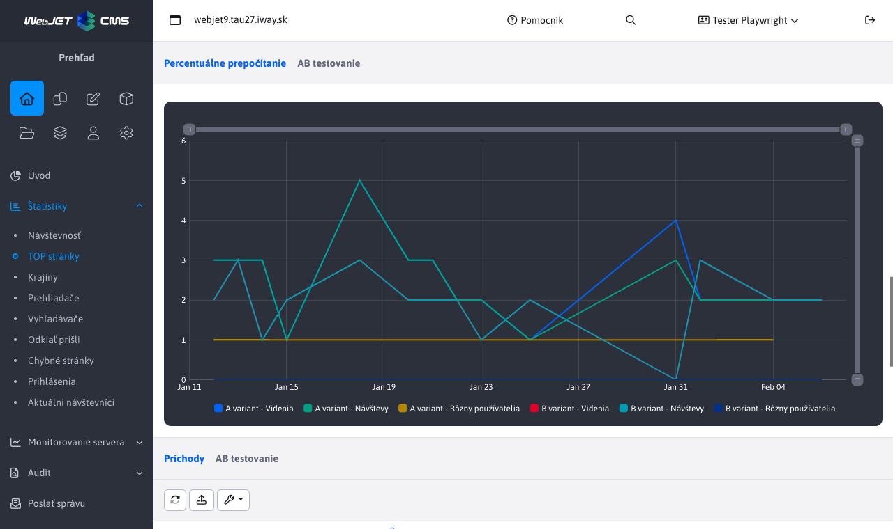
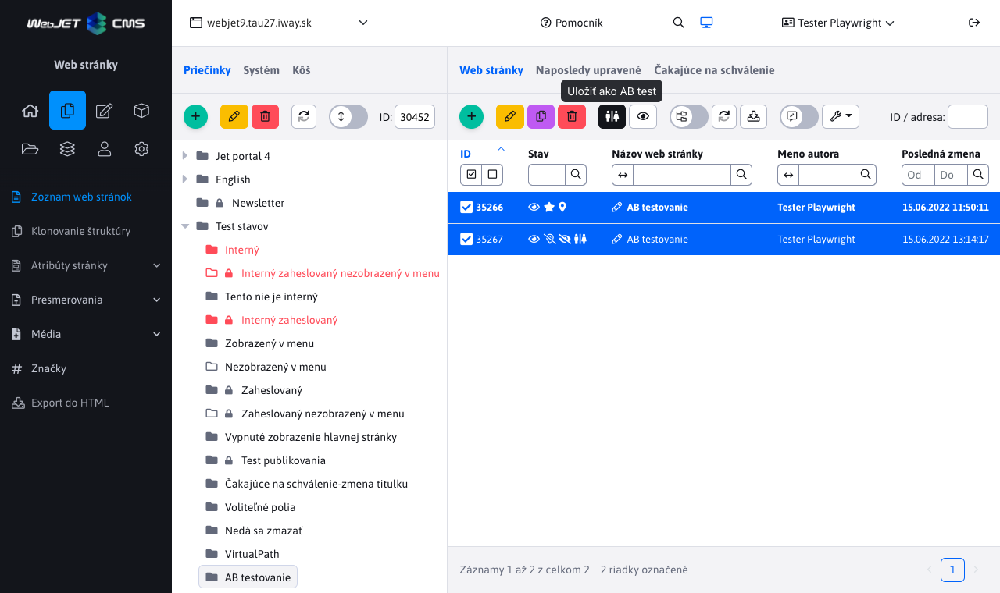

# Obchodné informácie - rok 2024

Tento súbor obsahuje opisy vlastností WebJET CMS dodaných v roku 2024 z pohľadu predaja. Nové záznamy sa pridávajú na vrch (pod tento úvod), takže najnovšie vlastnosti sú vždy hore.

---

## MultiWeb — správa viacerých webov v jednej inštalácii

WebJET CMS prináša režim **MultiWeb**, ktorý umožňuje prevádzkovať **viacero úplne samostatných webových sídiel v rámci jednej inštalácie**. Každá doména sa navonok správa ako nezávislá inštalácia — má vlastný obsah, vlastných používateľov, vlastné šablóny aj vlastné e-mailové kampane. Návštevníci ani redaktori jednotlivých domén nevedia, že „pod kapotou" beží spoločný systém.

Toto riešenie je ideálne pre organizácie, ktoré potrebujú prevádzkovať **viaceré menšie weby s centrálnou správou**. Typickým príkladom je **webová agentúra**, ktorá vytvára a spravuje stránky pre svojich klientov — každý klient má vlastný web s vlastným obsahom a používateľmi, no agentúra má všetko v jednom systéme. Rovnako výhodné je to pre **štátne organizácie a inštitúcie**, ktoré potrebujú prevádzkovať weby pre podriadené organizácie, regionálne pobočky alebo projekty. Namiesto desiatky samostatných inštalácií stačí jediná, čo dramaticky znižuje náklady na prevádzku a údržbu.

Kľúčovou výhodou je, že **bezpečnostné aktualizácie a vylepšenia sa aplikujú naraz na všetky domény** jedným krokom. Nie je potrebné aktualizovať každý web samostatne, čo šetrí čas a eliminuje riziko, že niektorý web zostane neaktualizovaný. Správa jednotlivých webov pritom prebieha **plne oddelene** — redaktori jednej domény nemajú prístup k obsahu inej domény, e-mailové kampane sú oddelené podľa domén a používateľské účty sú nezávislé.

**Hlavné benefity:**

- **Nižšie prevádzkové náklady**: Jedna inštalácia namiesto desiatok samostatných systémov znamená výrazne nižšie náklady na hosting, údržbu a administráciu.
- **Centrálne bezpečnostné aktualizácie**: Aktualizácia jedného systému zabezpečí všetky domény naraz — žiadny web nezostane zraniteľný.
- **Úplne oddelená správa obsahu**: Každá doména má vlastných používateľov, šablóny, e-mailové kampane aj mediálne súbory — redaktori jednej domény nevidia obsah inej.
- **Jednoduchá škálovateľnosť**: Pridanie novej domény nevyžaduje novú inštaláciu — stačí ju zriadiť v existujúcom systéme.
- **Riadiaca doména s plnou kontrolou**: Správca má z jedného miesta prístup ku konfigurácii, prekladovým kľúčom, automatizovaným úlohám a ďalším globálnym nastaveniam.
- **Možnosť prispôsobenia**: Každá doména môže mať vlastný vizuálny štýl, šablóny a nastavenia, takže weby nemusia vyzerať rovnako.

Podrobná dokumentácia: [MultiWeb — inštalácia a konfigurácia](../../install/multiweb/README.md)

## AB testovanie web stránok — optimalizujte konverzie na základe dát

WebJET CMS ponúka **vynovenú aplikáciu pre AB testovanie**, ktorá umožňuje jednoducho porovnať dve verzie web stránky a zistiť, ktorá dosahuje lepšie výsledky. Princíp je jednoduchý — vytvoríte B verziu stránky jedným kliknutím, upravíte v nej napríklad nadpis, obrázok alebo rozloženie prvkov, a systém automaticky zobrazuje obidve verzie návštevníkom v nastavenom pomere. Návštevník pritom stále vidí rovnakú URL adresu — o teste nevie. Na základe reálnych dát od návštevníkov potom viete rozhodnúť, ktorá verzia stránky funguje lepšie.

Aplikácia podporuje aj takzvané **split testy** — komplexnejšie testovanie, pri ktorom návštevník po celú dobu návštevy vidí konzistentnú verziu webu. Ak sa mu pri prvom prístupe vygeneruje B verzia, všetky ďalšie stránky s B verziou sa mu tiež zobrazia v B variante. Toto je kľúčové pre testovanie rozsiahlejších zmien, napríklad iného rozloženia celého webu alebo odlišného navigačného toku.

Správa AB testov je **plne integrovaná do administrácie WebJET CMS**. Redaktor má k dispozícii prehľadný zoznam všetkých prebiehajúcich testov, štatistiky s **automatickým pomerovým prepočtom** (ak pomer A/B nie je 50:50, systém prepočíta hodnoty tak, aby boli porovnateľné), a konfiguráciu testovacích parametrov — vrátane pomeru zobrazenia verzií, platnosti cookies a ďalších nastavení. Všetko je dostupné priamo z rozhrania systému bez nutnosti externých nástrojov.

**Hlavné benefity:**

- **Rozhodnutia na základe dát**: Namiesto odhadov viete presne zmerať, ktorá verzia stránky prináša viac konverzií — či už ide o vyplnenie formulára, kliknutie na tlačidlo alebo dokončenie nákupu.
- **Jednoduché vytvorenie testu**: B verzia stránky sa vytvorí jedným kliknutím priamo v editore — nie je potrebné kopírovať obsah ručne ani používať externé nástroje.
- **Automatické zobrazovanie verzií**: WebJET sám zabezpečí striedanie A a B verzie v nastavenom pomere, návštevník vidí rovnakú URL adresu a o teste nevie.
- **Split testy pre komplexné zmeny**: Pri testovaní väčších zmien (napríklad celkový redizajn) návštevník vidí konzistentnú verziu naprieč celým webom.
- **Prehľadné štatistiky s prepočtom**: Aj pri nerovnomernom pomere A/B systém automaticky prepočíta hodnoty, aby bolo porovnanie korektné a férové.
- **Flexibilná konfigurácia**: Nastavenie pomeru verzií, platnosti testovacej cookie, možnosť aktivácie len pre prihlásených používateľov a ďalšie parametre priamo v administrácii.

Podrobná dokumentácia: [AB testovanie web stránok](../../redactor/apps/abtesting/README.md)
