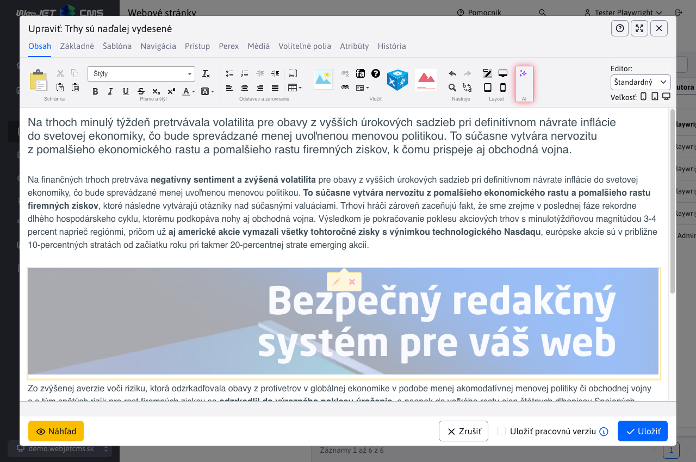
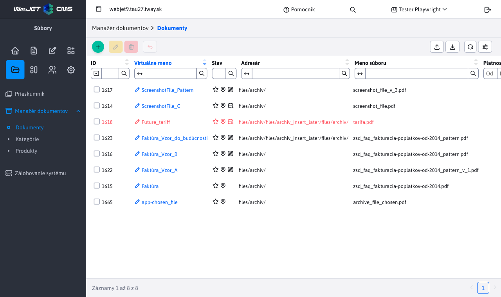
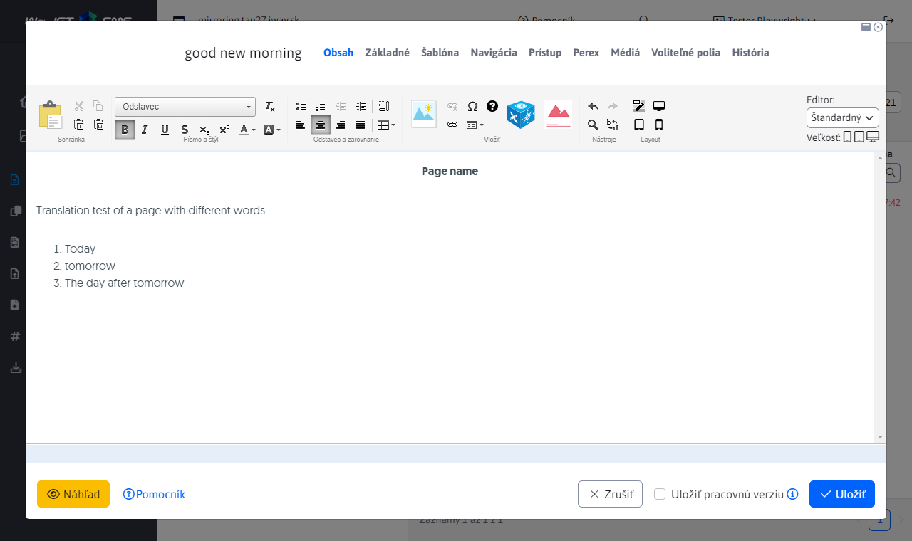
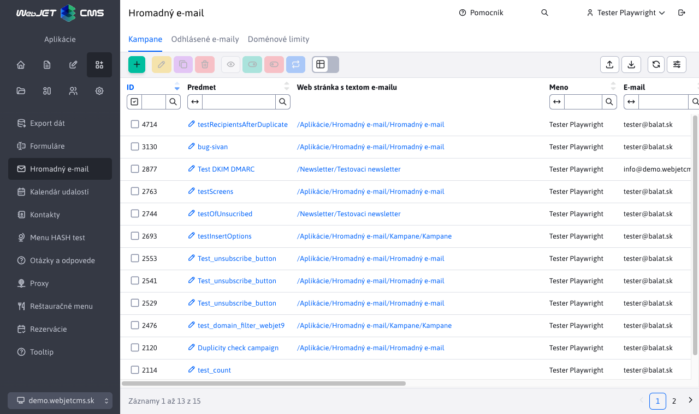
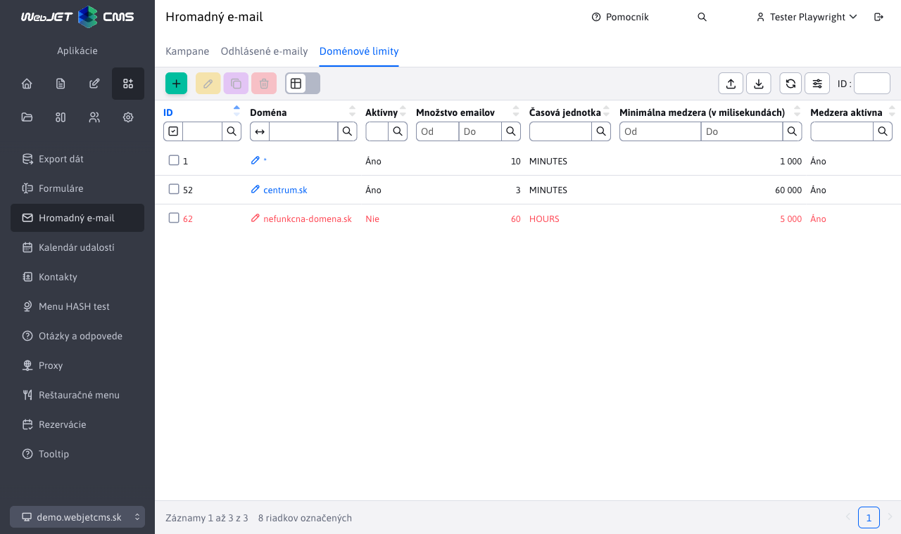
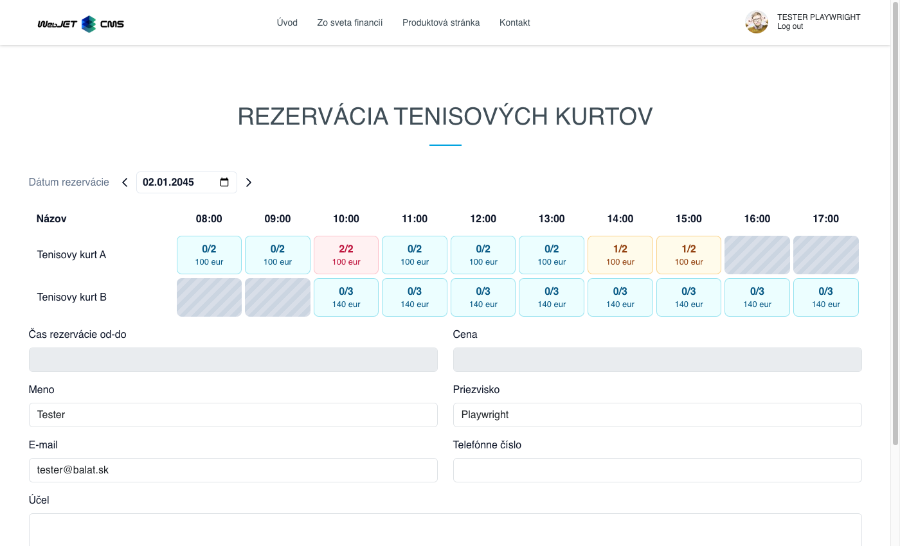
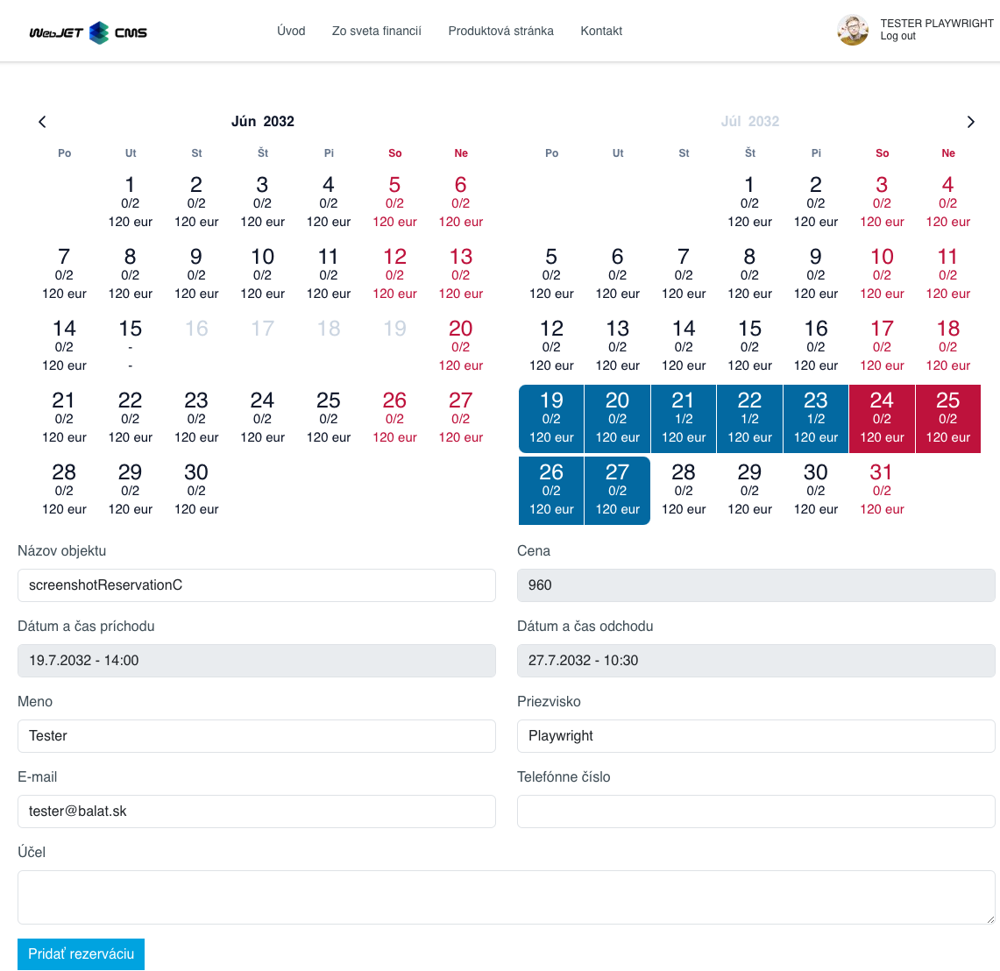
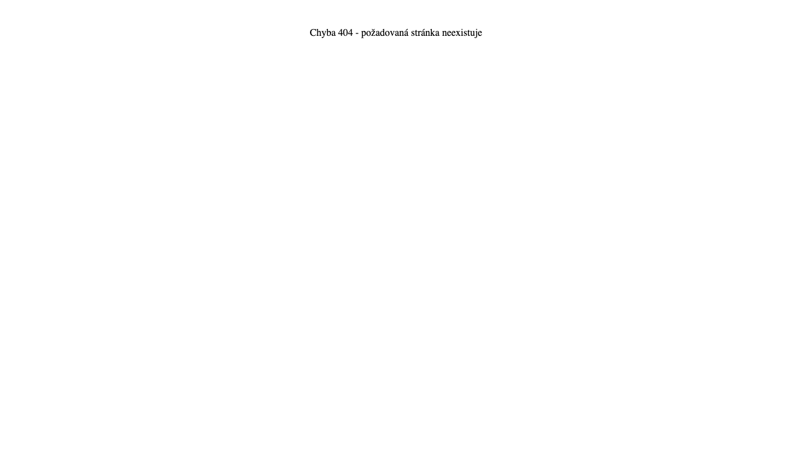

# Informácie pre obchodníka - rok 2025

Tento súbor obsahuje opisy vlastností WebJET CMS dodaných v roku 2025 z pohľadu predaja. Nové záznamy sa pridávajú na vrch (pod tento úvod), takže najnovšie vlastnosti sú vždy hore.

---

## AI asistenti

WebJET CMS prináša **kompletnú integráciu umelej inteligencie** priamo do redakčného systému. Redaktori a administrátori tak získavajú inteligentných pomocníkov, ktorí im pomáhajú s tvorbou a úpravou obsahu — od textu cez obrázky až po kompletné webové stránky. Na rozdiel od väčšiny CMS systémov, kde je AI len doplnková funkcia tretích strán, vo WebJET CMS je **AI natívne integrovaná do každého editačného okna** — textových polí, obrázkov, editora stránok aj nástroja PageBuilder.

Systém podporuje **viacerých poskytovateľov AI služieb** (OpenAI, Google Gemini, OpenRouter a dokonca AI priamo v prehliadači), čo zákazníkovi dáva slobodu výberu podľa ceny, kvality a dostupnosti. Administrátor môže pre rôzne úlohy nastaviť rôznych poskytovateľov — napríklad lacnejší model pre opravu gramatiky a výkonnejší pre generovanie obsahu. Vďaka podpore **OpenRouter** má zákazník prístup k stovkám AI modelov cez jedno rozhranie, vrátane mnohých bezplatných možností na testovanie.

Unikátnou vlastnosťou je **AI v prehliadači** — využitie modelov priamo na zariadení používateľa bez potreby externého API, čo znamená **nulové náklady za volania** a **maximálnu ochranu údajov**, pretože dáta nikdy neopustia počítač. Táto technológia je ideálna pre organizácie s prísnymi požiadavkami na ochranu osobných údajov.

**AI asistenti sú plne konfigurovateľní** — administrátor môže vytvárať vlastných asistentov s presnými inštrukciami pre konkrétne polia a entity. Každý asistent sa dá priradiť ku konkrétnemu poľu v systéme, takže redaktor vždy vidí len relevantných asistentov. Systém umožňuje definovať inštrukcie, vybrať model, nastaviť streamovanie odpovede a požadovať vstup od používateľa — všetko bez potreby programovania.

V nástroji **PageBuilder** funguje aj **režim chat**, kde AI dokáže generovať kompletné bloky webovej stránky, upravovať existujúce sekcie alebo navrhovať celú štruktúru stránky na základe požiadavky redaktora. Redaktor môže postupne zadávať požiadavky a doladiť výsledok bez manuálneho kódovania.

Súčasťou riešenia je aj **podrobná štatistika využívania** AI asistentov — grafy najpoužívanejších asistentov, spotreba tokenov v čase, identifikácia používateľov s najvyššou spotrebou. To umožňuje organizácii **kontrolovať náklady**, optimalizovať inštrukcie a vyhodnotiť návratnosť investície do AI nástrojov.

**Hlavné benefity:**

- **Natívna integrácia v celom systéme**: AI asistenti sú dostupní v každom textovom poli, obrázkovom poli, webovom editore aj PageBuilderi — redaktor nemusí prepínať medzi nástrojmi.
- **Flexibilita poskytovateľov**: Podpora OpenAI, Gemini, OpenRouter a AI v prehliadači — zákazník si vyberá podľa ceny, kvality a požiadaviek na ochranu údajov.
- **Nulové náklady s AI v prehliadači**: Lokálne spracovanie bez API volaní znamená žiadne poplatky za bežné úlohy ako sumarizácia, preklad alebo úprava textu.
- **Plná konfigurovateľnosť bez programovania**: Administrátor vytvára vlastných asistentov, definuje inštrukcie a priraďuje ich k poliam — žiadne zásahy do kódu.
- **Generovanie a úprava obrázkov**: AI vie vytvoriť ilustračné obrázky z textového popisu, odstrániť pozadie alebo upraviť existujúce fotografie priamo v CMS.
- **Chat režim pre PageBuilder**: Kompletné generovanie a úprava štruktúry webových stránok vrátane blokov, textov a rozloženia cez konverzáciu s AI.
- **Kontrola nákladov**: Podrobné štatistiky spotreby tokenov podľa asistentov, používateľov a dní umožňujú optimalizáciu a predvídateľné rozpočtovanie.
- **Bezpečnosť a súkromie**: Možnosť šifrovania API kľúčov, lokálne AI v prehliadači a podrobné oprávnenia zabezpečujú súlad s bezpečnostnými politikami organizácie.
- **Funkcia vrátenia zmien**: Každý výsledok AI je možné jedným kliknutím vrátiť späť, čo odstraňuje obavy z nesprávnych úprav.

Podrobná dokumentácia: [AI asistenti](../../redactor/ai/README.md)

## Manažér dokumentov

WebJET CMS ponúka **Manažér dokumentov** — komplexnú aplikáciu na **správu dokumentov a ich verzií** na jednom mieste. Organizácia môže centrálne spravovať všetky dôležité dokumenty (zmluvy, formuláre, smernice, technické listy), **automaticky sledovať ich verzie** a zabezpečiť, že návštevníci webu alebo interní používatelia majú vždy prístup k aktuálnej verzii. Systém zároveň uchováva celú históriu zmien, takže je možné kedykoľvek sa vrátiť k predchádzajúcej verzii dokumentu.

Kľúčovou vlastnosťou je **plánovanie publikovania dokumentov do budúcnosti**. Ak organizácia potrebuje zverejniť nový cenník, smernicu alebo formulár k presnému dátumu (napríklad k 1. januáru nového roka), stačí dokument nahrať vopred a nastaviť dátum automatického zverejnenia. Systém v stanovený čas **sám vymení starú verziu za novú** a voliteľne odošle notifikáciu zodpovedným osobám. To eliminuje riziko ľudskej chyby a zabezpečuje **súlad s legislatívnymi termínmi**.

Dokumenty je možné organizovať pomocou **produktov, kategórií a kódov produktov**, čo umožňuje prehľadné filtrovanie aj pri stovkách dokumentov. Systém automaticky **kontroluje duplicitu obsahu** — ak sa niekto pokúsi nahrať dokument, ktorý už v manažéri existuje, systém na to upozorní. Na webovej stránke sa dokumenty zobrazujú pomocou **konfigurovateľnej aplikácie**, kde si redaktor nastaví, ktoré dokumenty a v akom poradí sa majú zobraziť, vrátane možnosti **zobrazenia historických verzií a vzorových dokumentov**.

**Hlavné benefity:**

- **Centrálna správa dokumentov**: Všetky dokumenty organizácie sú na jednom mieste s prehľadnou históriou verzií, kategorizáciou a fulltextovým vyhľadávaním.
- **Automatické publikovanie k dátumu**: Nové verzie dokumentov sa zverejnia automaticky v nastavený čas — ideálne pre cenníky, smernice alebo regulované dokumenty s pevným termínom účinnosti.
- **Správa verzií a rollback**: Kompletná história zmien s možnosťou okamžitého návratu k predchádzajúcej verzii jedným kliknutím, bez potreby IT oddelenia.
- **Ochrana pred duplicitou**: Systém kontroluje obsah nahrávaných súborov a upozorní na existujúce duplicity, čím predchádza chaosu a nekonzistencii.
- **Vzorové dokumenty**: Ku každému hlavnému dokumentu (napr. formuláru) je možné priradiť vzorovo vyplnený dokument, čo zlepšuje používateľský zážitok návštevníkov.
- **Export a import**: Hromadný export dokumentov do ZIP súboru a spätný import umožňujú jednoduché zálohovanie, migráciu medzi prostrediami alebo zdieľanie medzi tímami.
- **Podrobné oprávnenia**: Prístup k jednotlivým funkciám (správa, editácia, export, import, rollback) je riadený samostatnými oprávneniami, čo umožňuje bezpečnú delegáciu úloh.

Podrobná dokumentácia: [Manažér dokumentov](../../redactor/files/file-archive/README.md)

## Automatické zrkadlenie a preklad web stránok

WebJET CMS ponúka **automatické zrkadlenie štruktúry web stránok** medzi jazykovými mutáciami — funkciu, ktorá výrazne zjednodušuje **správu viacjazyčných webov**. Keď redaktor vytvorí novú stránku alebo priečinok v jednej jazykovej verzii, systém **automaticky vytvorí ekvivalent vo všetkých ostatných jazykových mutáciách** a vzájomne ich prepojí. Rovnako sa automaticky zrkadlí zmazanie, zmena poradia či presun stránok. Odpadá tak manuálne duplikovanie štruktúry, čo pri weboch s desiatkami alebo stovkami stránok šetrí **hodiny práce redaktorov**.

Súčasťou riešenia je **integrovaný automatický preklad obsahu** — pri vytvorení novej stránky systém automaticky preloží názov, URL adresu aj celý obsah do cieľového jazyka. Systém inteligentne rozlišuje, či bola preložená stránka už manuálne upravená redaktorom — ak áno, **automatický preklad ju neprepíše**, čím sa zachová práca korektora. Ak stránka ešte nebola korigovaná, pri zmene originálu sa preklad automaticky aktualizuje.

Pre návštevníkov webu je k dispozícii **prepínač jazykových verzií**, ktorý sa jednoducho vloží do hlavičky stránky. Návštevník kliknutím na jazykovú verziu (SK, EN, DE...) prejde priamo na **ekvivalent aktuálne zobrazenej stránky** v zvolenom jazyku — nie na úvodnú stránku, ale presne na tú istú sekciu v inom jazyku. Prepínač podporuje textové odkazy aj vlajky a automaticky generuje aj `hreflang` atribúty pre **optimalizáciu vo vyhľadávačoch (SEO)**.

**Hlavné benefity:**

- **Úspora času redaktorov**: Vytvorenie stránky v jednom jazyku automaticky vytvorí ekvivalent vo všetkých ostatných mutáciách — nie je potrebné manuálne duplikovanie štruktúry.
- **Automatický preklad obsahu**: Nové stránky sú okamžite preložené vrátane názvu, URL adresy a celého obsahu, čo dramaticky zrýchľuje nasadenie viacjazyčného webu.
- **Inteligentná detekcia zmien**: Systém rozpozná, či bola stránka už korigovaná človekom, a neprepíše manuálne úpravy — redaktor nikdy nestratí svoju prácu.
- **Konzistentná štruktúra naprieč jazykmi**: Štruktúra webu sa nemôže časom rozísť — zmeny poradia, presun a mazanie sa automaticky synchronizujú.
- **Prepínač jazykov pre návštevníkov**: Návštevník sa jedným kliknutím dostane na presný ekvivalent stránky v inom jazyku, čo zlepšuje používateľský zážitok.
- **SEO optimalizácia**: Automatické generovanie hreflang atribútov zlepšuje pozíciu vo vyhľadávačoch pre viacjazyčné weby.
- **Flexibilná konfigurácia**: Možnosť nastaviť, ktoré adresáre sa zrkadlia, podporovaných je viac domén a ľubovoľný počet jazykových mutácií.
- **Zníženie chybovosti**: Automatizácia eliminuje ľudské chyby pri manuálnom kopírovaní štruktúry a zabezpečuje konzistenciu.

Podrobná dokumentácia: [Zrkadlenie štruktúry](../../redactor/apps/docmirroring/README.md)

## Hromadný e-mail s rešpektovaním doménových limitov

WebJET CMS obsahuje **vlastný vstavaný systém na odosielanie hromadných emailov** (newsletterov), vďaka ktorému zákazník nie je závislý na externých službách tretích strán ako Mailchimp, SendGrid alebo iné platené platformy. Celý proces — od správy príjemcov cez tvorbu obsahu až po odosielanie a sledovanie štatistík — prebieha **priamo v administrácii WebJET CMS**. To znamená nižšie náklady, plnú kontrolu nad dátami a žiadne obmedzenia zo strany externého poskytovateľa na počet odoslaných emailov alebo príjemcov.

Kľúčovou vlastnosťou je **inteligentné rešpektovanie doménových limitov**. Emailové servery veľkých poskytovateľov (Gmail, Outlook, Zoznam a ďalšie) pri vysokom počte emailov z jednej IP adresy tieto správy blokujú alebo presúvajú do priečinka spam. WebJET CMS umožňuje administrátorovi **nastaviť maximálny počet emailov za časovú jednotku** pre každú doménu zvlášť a tiež **minimálnu medzeru medzi jednotlivými emailami**. Systém tak emaily odosiela postupne a kontrolovane, čím sa výrazne zvyšuje **doručiteľnosť správ** do schránok príjemcov.

Správa príjemcov je flexibilná — emaily je možné **pridávať zo skupín používateľov** evidovaných vo WebJET CMS, **importovať z Excel (xlsx) súborov** alebo zadávať manuálne. Systém automaticky kontroluje duplicity, neplatné formáty emailov a odhlásených príjemcov, takže administrátor má istotu, že kampaň sa odošle len na platné a oprávnené adresy. Každý email je **personalizovaný** — do správy je možné vložiť meno, priezvisko, firmu a ďalšie údaje príjemcu. Súčasťou riešenia je aj automatická správa odhlásení v súlade s požiadavkami emailových klientov (`List-Unsubscribe` hlavička) a **štatistiky otvorení a kliknutí**.

**Hlavné benefity:**

- **Nezávislosť od externých služieb**: Žiadne mesačné poplatky za tretie strany, žiadne obmedzenia na počet emailov — všetko beží na vašej vlastnej infraštruktúre.
- **Vyššia doručiteľnosť vďaka doménovým limitom**: Inteligentné postupné odosielanie zabraňuje blokovaniu emailov mail servermi a znižuje riziko označenia za spam.
- **Plná kontrola nad dátami**: Zoznamy príjemcov, obsah emailov a štatistiky ostávajú vo vašom systéme — žiadne zdieľanie údajov s externými platformami.
- **Flexibilná správa príjemcov**: Import z Excelu, pridanie zo skupín používateľov alebo manuálne zadanie — vrátane automatickej ochrany proti duplicitám a neplatným adresám.
- **Personalizácia obsahu**: Každý email môže obsahovať meno, firmu, mesto a ďalšie údaje konkrétneho príjemcu pre vyššiu mieru otvorenia.
- **Súlad s legislatívou a dobrými praktikami**: Automatická správa odhlásení, podpora DKIM/SPF a `List-Unsubscribe` hlavičky zabezpečujú dodržiavanie požiadaviek emailových klientov a GDPR.
- **Plánovanie a štatistiky**: Možnosť nastaviť dátum začiatku odosielania a sledovať kto email otvoril a na čo klikol.

Podrobná dokumentácia: [Hromadný e-mail - Kampane](../../redactor/apps/dmail/campaings/README.md), [Doménové limity](../../redactor/apps/dmail/domain-limits/README.md)

## Rezervačný systém

WebJET CMS obsahuje **kompletný rezervačný systém**, ktorý umožňuje organizáciám ponúkať online rezerváciu rôznych objektov a služieb — od zasadacích miestností a firemných vozidiel, cez športoviská a wellness, až po ubytovacie kapacity a konzultačné hodiny. Systém pokrýva **dva základné režimy rezervácie**: hodinový (na konkrétne časové intervaly v rámci dňa) a celodenný (na jeden alebo viac kalendárnych dní). Oba režimy sú plne konfigurovateľné a prispôsobiteľné potrebám organizácie bez potreby programovania.

**Hodinová rezervácia** je ideálna pre služby s kratším trvaním — napríklad rezervácia tenisového kurtu na hodinu, zasadacej miestnosti na schôdzku alebo firemného vozidla na popoludnie. Administrátor nastavuje **dostupné časové intervaly pre každý deň v týždni samostatne**, maximálny počet súbežných rezervácií a cenu za hodinu. Návštevník vidí prehľadnú tabuľku s dostupnosťou, kde jedným kliknutím vyberie požadovaný súvislý časový rozsah. **Celodenná rezervácia** využíva interaktívny kalendár s vizuálnym zobrazením dostupnosti a cien na každý deň, čo je ideálne pre ubytovanie, prenájom zariadení na celé dni alebo plánovanie dovoleniek v zdieľaných objektoch.

Systém ponúka **automatické schvaľovanie alebo workflow so schvaľovateľom** — organizácia si pre každý objekt nastaví, či sa rezervácie potvrdzujú okamžite, alebo vyžadujú manuálne schválenie zodpovednou osobou. Po vytvorení aj schválení/zamietnutí rezervácie systém **automaticky odosiela e-mailové notifikácie**, čím odpadá potreba manuálnej komunikácie. Pre prihlásených používateľov sa formulár **automaticky predvypĺňa**, čo zrýchľuje proces rezervácie. Systém podporuje aj **zľavy podľa skupín používateľov** — napríklad zamestnanci môžu mať zvýhodnenú cenu alebo službu úplne zadarmo, zatiaľ čo externí návštevníci platia plnú sumu.

**Hlavné benefity:**

- **Univerzálne použitie**: Jeden systém pre rôzne typy rezervácií — zasadačky, vozidlá, športoviská, wellness, ubytovacie zariadenia, konzultačné hodiny a ďalšie služby.
- **Dva režimy v jednom riešení**: Hodinová aj celodenná rezervácia s plnou konfiguráciou dostupnosti, kapacity a cien pre každý deň v týždni.
- **Automatické notifikácie a schvaľovanie**: E-mailové potvrdenia pri vytvorení, schválení aj zamietnutí rezervácie eliminujú manuálnu komunikáciu a znižujú administratívnu záťaž.
- **Zľavy a cenová politika**: Flexibilné nastavenie cien s automatickým uplatňovaním percentuálnych zliav podľa skupín používateľov — ideálne pre rozlíšenie interných zamestnancov a externých klientov.
- **Ochrana pred kolíziami**: Systém v reálnom čase kontroluje dostupnosť a kapacitu, takže nemôže dôjsť k dvojitej rezervácii nad nastavený limit.
- **Konfigurácia bez programovania**: Administrátor nastavuje objekty, časové intervaly, kapacity, ceny aj schvaľovací proces cez prehľadné rozhranie bez zásahu do kódu.
- **Integrácia do webovej stránky**: Aplikácia sa vkladá priamo do ľubovoľnej stránky webu cez editor — návštevníci rezervujú bez opustenia firemného webu.

Podrobná dokumentácia: [Rezervácia času](../../redactor/apps/reservation/time-book-app/README.md) | [Rezervácia dní](../../redactor/apps/reservation/day-book-app/README.md)

## Elektronický obchod — vynovená administrácia, platobné brány a doručenie

WebJET CMS prináša **kompletne vynovenú aplikáciu Elektronický obchod**, ktorá poskytuje všetko potrebné na prevádzku internetového obchodu priamo v redakčnom systéme. Administrátori získavajú **prehľadnú správu produktov, objednávok, spôsobov platby a doručenia** v modernom rozhraní bez potreby externých nástrojov. Produkty sa organizujú do **stromovej štruktúry kategórií**, kde je možné jednoducho vytvárať nové kategórie, priraďovať produktom obrázky, značky na filtrovanie a atribúty (výrobca, parametre, špecifikácie). Správa objednávok zahŕňa kompletný životný cyklus — od vytvorenia cez sledovanie stavu platby až po notifikáciu zákazníka o zmenách.

Kľúčovou novinkou je **integrácia platobnej brány GoPay**, ktorá umožňuje zákazníkom platiť online kartou, bankovým prevodom alebo inými elektronickými spôsobmi platby. Platobná brána sa konfiguruje priamo v administrácii — stačí zadať prístupové údaje a aktivovať požadované platobné metódy. Systém **automaticky spracováva platby**, sleduje ich stavy (úspešná, neúspešná, čakajúca) a podporuje aj **refundácie** — vrátenie celej sumy alebo jej časti priamo cez administráciu. Pre každú objednávku je dostupná kompletná **história všetkých platobných transakcií**, čo zjednodušuje účtovníctvo a riešenie reklamácií.

**Konfigurácia spôsobov doručenia** umožňuje nastaviť rôzne možnosti doručenia podľa krajiny, vrátane ceny bez DPH, sadzby DPH a poradia zobrazenia. Každý spôsob doručenia môže mať **špecifické parametre** podľa typu dopravcu. Systém podporuje viacero krajín súčasne, čo je dôležité pre zákazníkov pôsobiacich na viacerých trhoch. Celý modul je **rozšíriteľný** — programátor môže pridávať nové platobné metódy aj spôsoby doručenia podľa požiadaviek zákazníka.

**Hlavné benefity:**

- **Kompletná správa e-shopu v CMS**: Produkty, objednávky, platby a doručenie na jednom mieste — nie je potrebný samostatný e-shopový systém ani externé nástroje.
- **Integrácia platobnej brány GoPay**: Online platby kartou a bankovým prevodom s automatickým spracovaním transakcií, sledovaním stavov a podporou refundácií.
- **Flexibilné spôsoby platby**: Konfigurácia viacerých platobných metód (GoPay, prevod, dobierka) s individuálnym nastavením pre každú metódu priamo v administrácii.
- **Spôsoby doručenia podľa krajiny**: Nastavenie rôznych spôsobov doručenia s cenami a DPH pre každú podporovanú krajinu — ideálne pre medzinárodný predaj.
- **Automatické sledovanie platieb a stavov objednávok**: Systém automaticky prepočítava zaplatené sumy a mení stav objednávky (nová, čiastočne zaplatená, zaplatená), čo eliminuje manuálnu prácu.
- **Refundácie jedným kliknutím**: Plná alebo čiastočná refundácia platby priamo z administrácie, vrátane spracovania cez platobnú bránu.
- **Notifikácie zákazníkov**: Automatické emailové notifikácie o zmenách stavu objednávky s konfigurovateľným textom a prehľadom objednávky.
- **Rozšíriteľnosť**: Možnosť programátorsky pridávať nové platobné metódy a spôsoby doručenia podľa individuálnych požiadaviek zákazníka.

Podrobná dokumentácia: [Elektronický obchod](../../redactor/apps/eshop/product-list/README.md)
