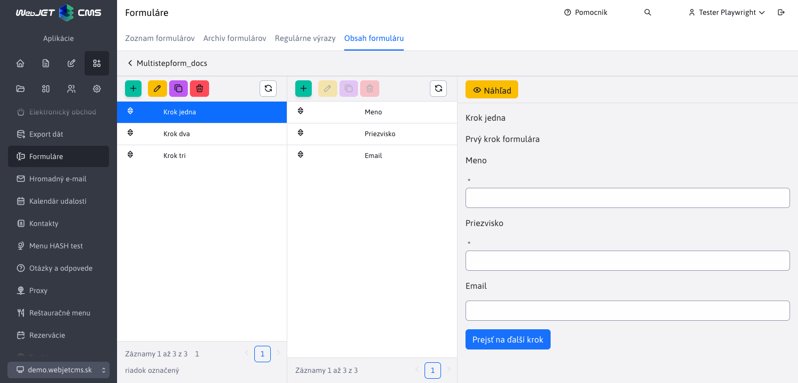
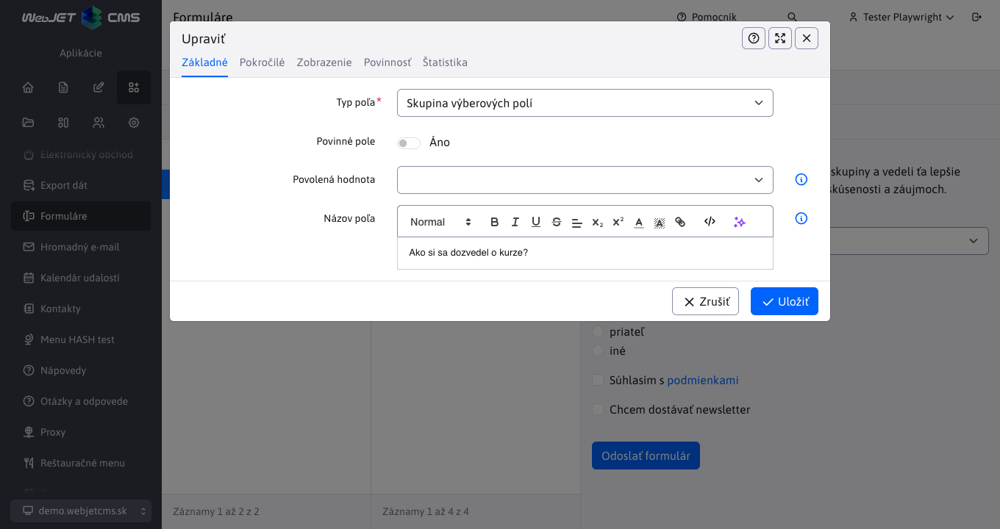

# Informácie o predaji - rok 2026

Tento súbor obsahuje opisy vlastností WebJET CMS dodaných v roku 2026 z pohľadu predaja. Nové záznamy sa pridávajú na vrch (pod tento úvod), takže najnovšie vlastnosti sú vždy hore.

## Viackrokové formuláre

WebJET CMS prináša viackrokové formuláre, ktoré **rozdeľujú dlhé formuláre na menšie a pre používateľa zrozumiteľnejšie časti**. Namiesto jedného preplneného formulára dostane návštevník **jasne vedený proces po jednotlivých krokoch**, čo znižuje pocit zahltenia a pomáha zvýšiť počet úspešne dokončených odoslaní. Táto funkcionalita je vhodná napríklad pre registrácie, dopytové formuláre, náborové formuláre, prihlášky či interné zberové procesy.

Pre zákazníka je dôležité aj to, že formulár nemusí zostať iba v základnom nastavení. Jednotlivé kroky je možné pomenovať, doplniť o úvodné texty a prispôsobiť texty tlačidiel podľa konkrétnej kampane alebo procesu. Riešenie tak spája **lepší používateľský zážitok** s vysokou mierou prispôsobenia bez potreby pripravovať každý formulár nanovo od začiatku.

**Hlavné benefity:**

- **Vyššia úspešnosť odoslania**: Rozdelenie formulára do krokov znižuje bariéru pri vypĺňaní a pomáha návštevníkov doviesť až k odoslaniu.
- **Lepší používateľský zážitok**: Formulár pôsobí prehľadne, menej stresujúco a lepšie sa používa aj pri väčšom množstve údajov.
- **Vhodné pre rôzne scenáre**: Riešenie sa dá využiť pre obchod, marketing, HR aj zákaznícke služby bez zmeny základného princípu.
- **Jednoduché prispôsobenie komunikácie**: Texty krokov a tlačidiel možno upraviť podľa konkrétneho cieľa kampane alebo firemného štýlu.

Podrobná dokumentácia: [Viackrokové formuláre](../../redactor/apps/multistep-form/README.md)

### Flexibilný editor formulárov bez závislosti od programátora

Súčasťou riešenia je editor, v ktorom môže administrátor **formulár priebežne upravovať podľa aktuálnych potrieb**. Kroky aj jednotlivé položky sa dajú pridávať, duplikovať, presúvať, meniť ich poradie a priebežne kontrolovať v náhľade. To výrazne skracuje čas potrebný na prípravu nových formulárov a umožňuje rýchlo reagovať na nové obchodné alebo prevádzkové požiadavky.

Veľkou výhodou je aj vysoká miera variability. Pri jednotlivých poliach je možné nastaviť **povinnosť vyplnenia, validačné pravidlá, predvyplnené hodnoty**, pomocné texty či informačné bubliny. Formuláre je navyše možné **personalizovať údajmi** o prihlásenom **používateľovi** a prispôsobiť aj špecifickým scenárom zobrazenia. Pre zákazníka to znamená nižšiu závislosť od dodávateľa a väčšiu schopnosť upravovať procesy vlastnými silami.

**Hlavné benefity:**

- **Rýchle nasadenie zmien**: Marketing alebo administrátor vie upraviť formulár bez zdĺhavého vývoja a čakania na technický zásah.
- **Presnejší zber dát**: Povinné polia, pravidlá validácie a pomocné texty znižujú chybovosť a zvyšujú kvalitu získaných údajov.
- **Personalizácia pre vyšší komfort**: Predvyplnenie údajov o prihlásenom používateľovi zrýchľuje vyplnenie a znižuje počet opustených formulárov.
- **Rozšíriteľnosť do budúcna**: Typy polí a dostupné nastavenia sa dajú prispôsobiť podľa potrieb konkrétneho projektu alebo segmentu.

Podrobná dokumentácia: [Editor viackrokových formulárov](../../redactor/apps/multistep-form/README.md)

### Štatistiky formulárov pre rýchle rozhodovanie

WebJET CMS dopĺňa viackrokové formuláre o **prehľadnú štatistickú sekciu**, ktorá ukazuje nielen počet odoslaných odpovedí, ale aj **priemerný čas vypĺňania**, počet dní od vytvorenia formulára a čas poslednej odpovede. Zákazník tak získa **okamžitý obraz o tom, či formulár funguje**, či je pre používateľov zrozumiteľný a či sa na ňom oplatí ďalej pracovať.

Ešte väčšiu hodnotu prinášajú **grafy odpovedí pri jednotlivých otázkach**. Organizácia si môže sama určiť, ktoré polia chce sledovať, aký typ grafu sa použije, koľko odpovedí sa zobrazí a či sa majú spojiť menej časté alebo nevyplnené odpovede. V praxi to znamená, že marketing, obchod alebo HR tím dostanú **vizuálne a rýchlo čitateľné podklady** bez potreby exportovať dáta do externých nástrojov. Riešenie zároveň ostáva flexibilné, pretože nastavenie štatistík je možné meniť priamo pri položkách formulára.

**Hlavné benefity:**

- **Okamžitý prehľad o výkonnosti formulára**: Základné metriky pomáhajú rýchlo vyhodnotiť, či formulár plní svoj cieľ.
- **Lepšie rozhodovanie bez ďalších nástrojov**: Grafy odpovedí umožňujú robiť operatívne rozhodnutia priamo v administrácii systému.
- **Vyššia kvalita interpretácie dát**: Možnosť zoskupovať odpovede, zobraziť nezodpovedané položky alebo filtrovať top hodnoty spresňuje pohľad na správanie používateľov.
- **Prispôsobenie podľa potrieb**: Typ grafu, farebnú schému aj spôsob zobrazovania možno nastaviť podľa toho, čo potrebuje konkrétny tím sledovať.

Podrobná dokumentácia: [Štatistiky viackrokových formulárov](../../redactor/apps/multistep-form/stat.md)
