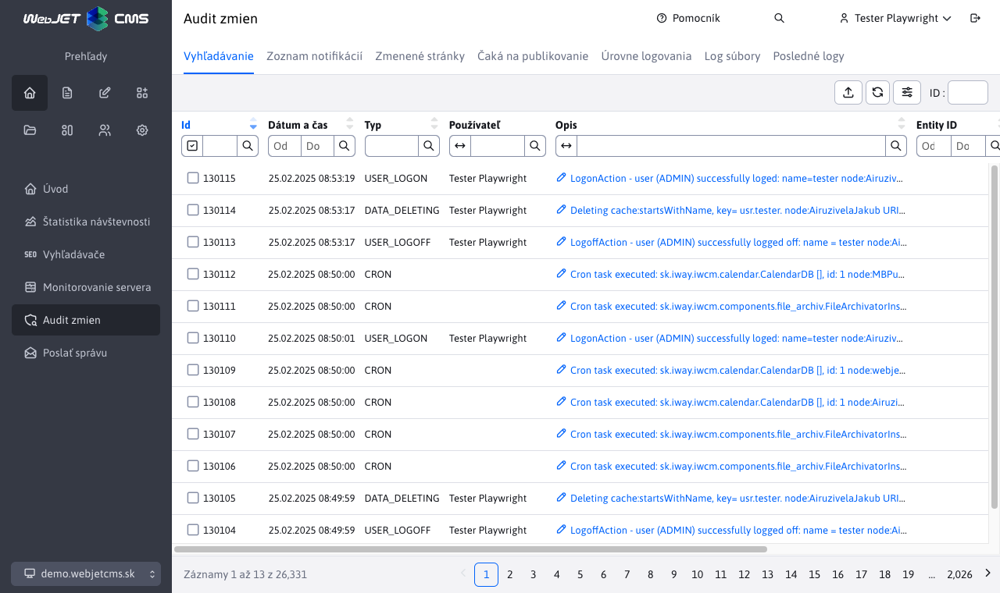

# Audit

Aplikácia Audit je nástroj pre sledovanie zmien v systéme. Sekcia Audit -> Vyhľadávanie umožňuje zobraziť a filtrovať jednotlivé zaznamenané hodnoty.
Filtrovanie je možné podľa typu auditných záznamov, času, používateľa atď.



# Typy auditných záznamov

Každý auditný záznam automaticky zaznamená dátum a čas, ID prihláseného používateľa, IP adresu a ak je povolený reverzný DNS server aj meno počítača. Do textu auditného záznamu sa automaticky vkladá meno uzla clustra, URI adresa, doména a hodnota http hlavičky User-Agent.

- ```ADMINLOG_NOTIFY``` - zmena v zozname notifikácií v aplikácii Audit.
- ```BANNER``` - operácie v aplikácii Bannerový systém
- ```BASKET``` - operácie v aplikácii Elektronický obchod
- ```CALENDAR``` - operácie v aplikácii Kalendár udalostí
- ```CONF_DELETE``` - zmazanie konfiguračnej premennej, zaznamená jej meno
- ```CONF_UPDATE``` - zmena alebo pridanie konfiguračnej premennej (v sekcii Nastavenia), zaznamená meno, aktuálnu hodnotu a novú hodnotu premennej
- ```COOKIE_ACCEPTED``` - akceptovanie cookie na web stránke
- ```COOKIE_REJECTED``` - zamietnutie použitia cookies na web stránke
- ```CRON``` - zaznamená beh úloh na pozadí, ak je zaškrtnutá možnosť Auditovať. Ukladá aj chyby pri vykonávaní úloh (ak nastanú), v takom prípade zaznamená ```Stack Trace```.
- ```DATA_DELETING``` - zaznamenáva vykonanie mazania dát v Nastavenia-Mazanie dát. Zaznamená kľúč ktorý sa v cache zmazal, alebo ```ALL``` pre zmazanie všetkého. Pri mazaní cache obrázkov zaznamená cestu k adresáru. Pri mazaní persistent cache zaznamená ID záznamu.
- ```DMAIL``` - aplikácia Hromadný email
- ```DMAIL_AUTOSENDER``` - používa sa v špeciálnej situácii automatického odosielania hromadného emailu
- ```DMAIL_BLACKLIST``` - zmena v Hromadný email->Odhlásené e-maily
- ```DMAIL_DOMAINLIMITS``` - zmena v Hromadný email->Doménové limity
- ```EXPORT_WEBJET``` - nepoužíva sa
- ```EXPORT``` - operácie v aplikácii Export dát (pridanie, zmena, zmazanie exportu dát)
- ```FILE_CREATE``` - vytvorenie súboru alebo adresáru, zaznamená cestu
- ```FILE_DELETE``` - zmazanie súboru alebo adresáru, zaznamená cestu
- ```FILE_EDIT``` - premenovanie, alebo editácia súboru, zaznamená cestu
- ```FILE_SAVE``` - uloženie súboru, napr. pri jeho kopírovaní / presúvaní a podobne. Zaznamená cestu k súboru
- ```FILE_UPLOAD``` - nahratie súboru do WebJETu, či už cez klasické nahratie, alebo Drag & Drop. Typicky zaznamenáva cestu k nahratému súboru.
- ```FORMMAIL``` - odoslanie formuláru. Zaznamená úspešné odoslanie s hlásením ```FormMail formName:``` meno formuláru, zoznam príjemcov a ```referer```. Pri neúspechu zaznamená dôvod ne odoslania s hlásením ```ERROR: formName:``` meno formuláru, ```fail:``` dôvod ne odoslania. Zaznamenáva aj detekciu spamu hlásením ```detectSpam TRUE:``` dôvod detekcie ako spam.
- ```FORM_ARCHIVE``` - archivácia formuláru, zaznamená meno formuláru
- ```FORM_DELETE``` - zmazanie formuláru, zaznamená meno formuláru a prípadne ID ak sa jedná o zmazanie jedného záznamu
- ```FORM_EXPORT``` - export formuláru cez záložku Exportovať, aktuálne sa nezaznamenáva univerzálny export cez tlačítka pod tabuľkou. Podľa tohto záznamu sa určuje dátum posledného exportu pre možnosť exportu od posledného exportu.
- ```FORM_REGEXP``` - zmena v Formuláre->Regulárne výrazy
- ```FORM_VIEW``` - nepoužíva sa
- ```FORUM_SAVE``` - zaznamená detekciu vulgarizmu v diskusnom fóre
- ```FORUM``` - operácie v aplikácii Diskusia
- ```GALLERY``` - zmeny v aplikácii Galéria - vytvorenie adresára, pridanie/zmazanie fotky
- ```GDPR_FORMS_DELETE``` - aplikácia GDPR, mazanie starých formulárov
- ```GDPR_USERS_DELETE``` - aplikácia GDPR, mazanie starých používateľov
- ```GDPR_BASKET_INVOICES_DELETE``` - aplikácia GDPR, mazanie  starých objednávok z elektronického obchodu
- ```GDPR_EMAILS_DELETE``` - aplikácia GDPR, mazanie starých emailov
- ```GDPR_REGEXP``` - aplikácia GDPR, správa regulárnych výrazov
- ```GDPR_DELETE``` - aplikácia GDPR, nastavenie mazania dát
- ```GDPR_COOKIES``` - aplikácia GDPR, správa cookies
- ```GROUP``` - vytvorenie / uloženie / zmazanie adresára v sekcii Web stránky
- ```HELPDESK``` - nepoužíva sa
- ```HELP_LAST_SEEN``` - používa sa na evidenciu dátumu zobrazenia sekcie Čo je nové v pomocníkovi. Pri prihlasovaní sa v tejto sekcii hľadá najnovší súbor a porovnáva sa voči zaznamenanému dátumu v Audite. Ak existuje novší súbor, zobrazí sa po prihlásení vyskakovacie okno pomocníka so sekciou Čo je nové.
- ```IMPORTXLS``` - importu Excel súboru, používa sa v zákazníckych implementáciách. Zaznamenáva cestu k importovanému súboru a jeho veľkosť
- ```IMPORT_WEBJET``` - nepoužíva sa
- ```INIT``` - inicializácia WebJETu (štart), zaznamenáva cestu k adresáru v ktorom bol WebJET na aplikačnom serveri spustený a číslo verzie WebJETu
- ```INQUIRY``` - operácie v aplikácii Anketa
- ```INQUIRY``` - pridanie otázky v aplikácii Anketa, zaznamená text otázky
- ```INSERT_SCRIPT``` - zmena v aplikácii Skripty
- ```INVENTORY``` - operácie v aplikácii Majetok
- ```JSPERROR``` - chyba pri vykonávaní JSP súboru pri zobrazení web stránky, zaznamená ```Stack Trace``` chyby
- ```MEDIA``` - operácia s Médiami (karta Média vo web stránke).
- ```MEDIA_GROUP``` - aplikácia správa skupín médií.
- ```PAGE_DELETE``` - zmazanie, presun do koša, alebo požiadanie o zmazanie stránky, zaznamená ID stránky
- ```PAGE_UPDATE``` - zaznamenáva zmeny v stránke mimo štandardného uloženia v editore - hromadné operácie v zozname stránok
- ```PAYMENT_GATEWAY``` - volanie platobnej brány v aplikácii Elektronický obchod
- ```PEREX_GROUP_CREATE``` - vytvorenie perex skupiny, zaznamená jej meno
- ```PEREX_GROUP_DELETE``` - zmazanie perex skupiny, zaznamená jej meno a ID
- ```PEREX_GROUP_UPDATE``` - zmena perex skupiny, zaznamená jej meno
- ```PERSISTENT_CACHE``` - zmena v Mazanie dát->Persistent cache objekty
- ```PROP_DELETE``` - zmazanie prekladového textu, zaznamená jazyk a kľúč
- ```PROP_UPDATE``` - editácia prekladového textu (v sekcii Nastavenia), zaznamená jazyk, kľúč a hodnotu
- ```PROXY``` - operácie v aplikácii proxy
- ```QA``` - operácie v aplikácii Otázky a odpovede
- ```REDIRECT_CREATE``` - vytvorenie nového presmerovania (url alebo domény)
- ```REDIRECT_DELETE``` - zmazanie presmerovania (url alebo doména), zaznamená zdroj a pre doménu aj cieľ presmerovania
- ```REDIRECT_UPDATE``` - zmena presmerovania (url alebo domény), zaznamená zdrojovú a cieľovú adresu
- ```RUNTIME_ERROR``` - zaznamená chýbajúcu šablónu pre zobrazenie stránky
- ```SAVEDOC``` - uloženie web stránky v Editore, zaznamenáva aj žiadosti o schválenie. Zaznamenáva titulok stránky, ID stránky a ID v histórii
- ```SENDMAIL``` - odoslanie emailu (mimo formulárov), zaznamená email odosielateľa, príjemcu a predmet emailu
- ```SE_SITEMAP``` - generovanie súboru ```/sitemap.xml```, zaznamená ID adresára pre ktorý sa mapa stránky generuje a obsah hlavičky User-Agent
- ```SQLERROR``` - databázová chyba, zaznamená SQL chybu, zdroj chyby a ```Stack Trace```
- ```TEMPLATE_DELETE``` - zmazanie šablóny, zaznamená meno zmazanej šablóny
- ```TEMPLATE_INSERT``` - vytvorenie novej šablóny, zaznamená jej meno
- ```TEMPLATE_UPDATE``` - zmena v šablóne, zaznamená zoznam zmenených polí
- ```TEMPLATE_GROUP``` - zmena v skupine šablón
- ```TIP``` - operácie v aplikácii Tip dňa
- ```TOOLTIP``` - zmena v aplikácii Tooltip
- ```UPDATEDB``` - vykonanie zmeny v databáze cez admin konzolu
- ```USER_AUTHORIZE``` - autorizácia používateľa (schválenie prístupu do zaheslovanej sekcie). Zaznamenáva ID zmazaného používateľa, ak je známe aj jeho ```login``` a meno.
- ```USER_CHANGE_PASSWORD``` - audituje zmenu hesla používateľa. Na základe dátumu sa počíta interval zmeny hesla (ak je nastavený)
- ```USER_DELETE``` - zmazanie používateľa. Zaznamenáva ID zmazaného používateľa, ak je známe aj jeho ```login``` a meno.
- ```USER_EDIT``` - zaznamená udalosť otvorenia editácie používateľa, nejedná sa ešte o jeho uloženie. Zaznamená ID používateľa, ```login``` a meno.
- ```USER_GROUP_DELETE``` - zmazanie skupiny používateľov, zaznamená meno skupiny a jej ID
- ```USER_GROUP_INSERT``` - vytvorenie novej skupiny používateľov, zaznamená meno novej skupiny a jej typ
- ```USER_GROUP_UPDATE``` - uloženie skupiny používateľov, zaznamená meno skupiny a zoznam zmien
- ```USER_INSERT``` - vytvorenie nového používateľa (alebo nová registrácia v zaheslovanej sekcii). Zaznamená ID používateľa, ```login``` a meno.
- ```USER_LOGOFF``` - odhlásenie používateľa kliknutím na ikonu odhlásenia, zaznamená prihlasovacie meno a informáciu o tom, či sa jedná o administrátora alebo registrovaného návštevníka
- ```USER_LOGON``` - prihlásenie používateľa, zaznamená prihlasovacie meno a informáciu o tom, či sa jedná o administrátora alebo registrovaného návštevníka. Zaznamená aj udalosť zadania neplatného hesla, ak používateľ nie je autorizovaný alebo prihlasovacie meno je neznáme
- ```USER_PERM_GROUP``` - operácie so skupinami práv, zaznamená meno skupiny a pri zmene zoznam zmien
- ```USER_SAVE``` - zaznamenáva zmeny v používateľovi v zaheslovanej sekcii (ak obsahuje formulár pre zmenu údajov)
- ```USER_UPDATE``` - uloženie existujúceho používateľa. Zaznamenáva aktuálne nastavenie práv a zmeny v zadaných údajoch
- ```WEB_SERVICES``` - volanie zákazníckych ```WebServices``` (použitie záleži od implementácie pre konkrétneho zákazníka)
- ```XSRF``` - XSRF útok na server (nepovolený referer header), zaznamená hodnotu doménového mena z ```referer``` hlavičky
- ```XSS``` - XSS útok na server alebo priame (nepovolené) volanie JSP súboru. Zaznamená URL adresu alebo výraz kvôli ktorému sa útok vyhodnotil (napr. nepovolený token v URL, nepovolené HTTP metóda). Zaznamenáva aj ukradnutie cookie (zmena IP adresy session).

# Špeciálny formát auditu

V prípade potreby je možné do WebJETu doplniť kód, ktorý audit záznamy bude ukladať do špeciálneho súboru, alebo posielať na určenú službu. Je potrebné nastaviť konf. premennú ```adminlogCustomLogger``` na Java triedu, ktorá implementuje triedu ```sk.iway.iwcm.AdminlogCustomLogger```. Pri každom zápise sa volá metóda ```addLog(logType, requestBean, descriptionParam, timestamp)```

