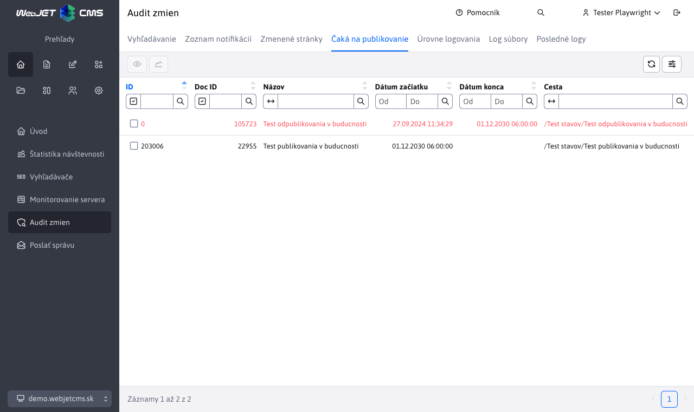

# Čaká na publikovanie

V menu položke Čaká na publikovanie je zoznam stránok, ktoré majú v budúcnosti naplánované publikovanie. Obsahuje informácie o tom o akú web stránku (na akej adrese/ceste) a kedy sa bude publikovať. Bližšie informácie o web stránkach nájdete tu [Zoznam web stránok](../../redactor/webpages/README.md).

Cieľom je prehľadne zobraziť zoznam stránok, ktoré v budúcnosti budú automaticky zmenené. Zobrazené sú všetky stránky bez ohľadu na práva používateľa na stromovú štruktúru stránok a zvolenú doménu.

Červenou farbou sú zobrazené web stránky, ktoré čakajú na vypnutie zobrazovania - majú nastavenú možnosť Odverejniť stránku po tomto dátume. Takéto stránky po nastavenom dátume nebudú verejne zobraziteľné.

V zozname sa nezobrazujú stránky v koši, pre tie sa publikovanie nevykonáva.

