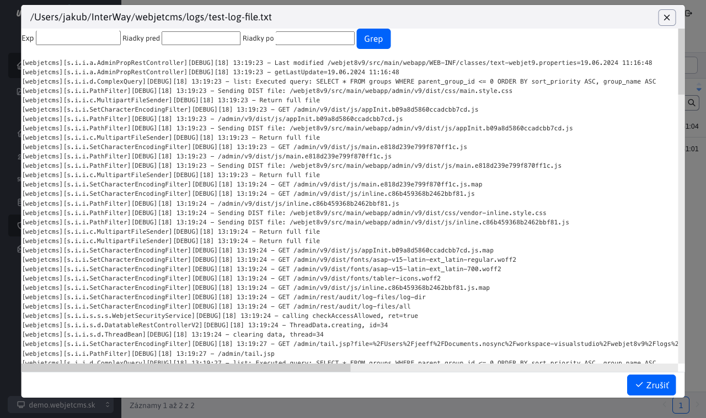

# Log súbory

Aplikácia poskytuje prehľad všetkých log súborov. Úpravy nad tabuľkou nie sú povolené. Tabuľka slúži iba na prehľad. V ľavej hornej časti stránky, môžete vidieť cestu, kde sú tieto súbory uložené.

Pri kliknutí na názov súboru sa zobrazí okno s obsahom súboru. Hlavička obsahuje polia pre možnosť filtrovania v súbore pomocou regulárnych výrazov (alebo priamo iba vyhľadaným výrazom).

